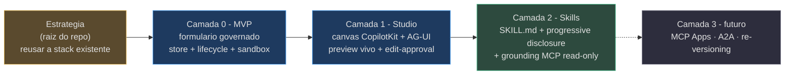
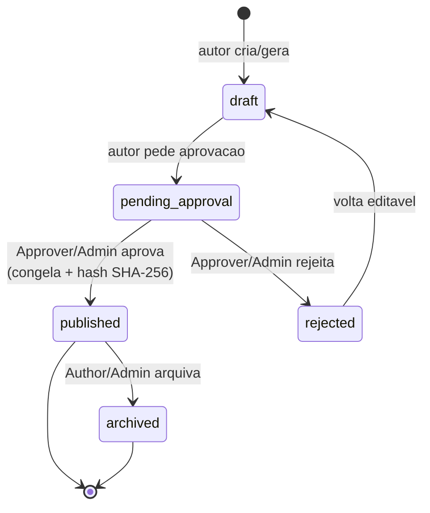
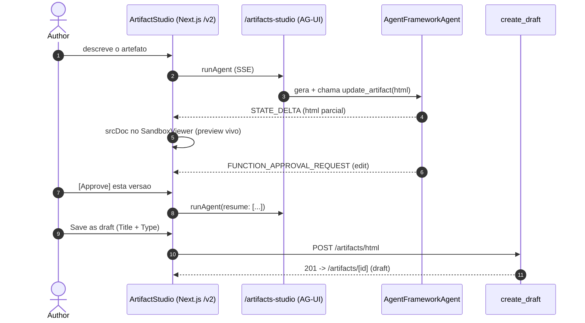
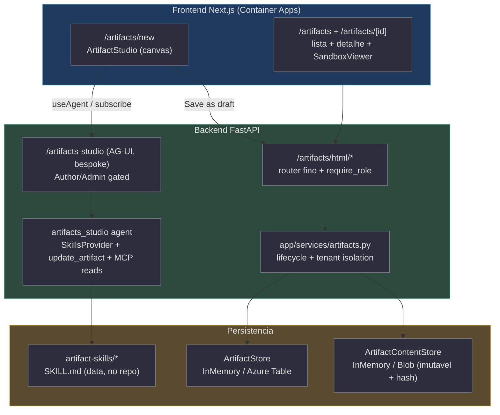

# HTML Artifacts — estratégia, specs e planos

Esta é a **novidade da v0.4.0** deste conjunto: um bloco de documentação inteiramente
dedicado à feature **HTML Artifacts** — transformar HTML gerado por IA (relatórios,
apresentações, dashboards, walkthroughs) em um **tipo de artefato governado** dentro do
próprio produto, em vez de montar uma segunda plataforma de hosting. O bloco tem duas
naturezas: um **documento de estratégia** de nível de plataforma (que vive na **raiz do
repo**, fora de `docs/`) e um **trio de specs/plans** datados de 2026-07-06 sob
`docs/superpowers/` que concretizam a estratégia em três camadas evolutivas.

> **Nota de rastreabilidade (fonte).** A estratégia mora em
> `foundry-assured-html-artifacts-strategy.md` **na raiz do repositório**, não em `docs/` —
> por isso o `docs/README.md` não a indexa e ela é resolvida contra a **raiz do repo** (o
> comportamento `--fidelity-root` de um bundle cross-cutting; ver
> [Estudos de caso e dogfood](./page-8.md)). Este bundle a cita como
> `(foundry-assured-html-artifacts-strategy.md:LINHA)`.

## O bloco em uma tabela

| Documento | Tipo | Estado | O que cobre | Fonte |
| --- | --- | --- | --- | --- |
| **foundry-assured-html-artifacts-strategy.md** | strategy | pesquisa → decisão | Compara as opções Microsoft e recomenda reusar a stack existente | (foundry-assured-html-artifacts-strategy.md:1-9) |
| **2026-07-06-html-artifacts-mvp.md** | plan | shipped | O MVP governado: store swappable, lifecycle approve-to-publish, viewer sandbox | (docs/superpowers/plans/2026-07-06-html-artifacts-mvp.md:5-7) |
| **2026-07-06-artifacts-canvas-design.md** | design | shipped | O **Studio**: canvas conversacional CopilotKit + AG-UI com preview vivo | (docs/superpowers/specs/2026-07-06-artifacts-canvas-design.md:9-23) |
| **2026-07-06-artifacts-canvas.md** | plan | shipped | O plano de implementação do Studio (chunks backend/frontend/E2E) | (docs/superpowers/plans/2026-07-06-artifacts-canvas.md:1-13) |
| **2026-07-06-skills-driven-generation-design.md** | design | draft | Geração dirigida por `SKILL.md` + grounding read-only via MCP | (docs/superpowers/specs/2026-07-06-skills-driven-generation-design.md:9-26) |
| **2026-07-06-skills-driven-generation.md** | plan | draft | O plano da camada skill-driven (skill lib, 4-arg tool, MCP reads) | (docs/superpowers/plans/2026-07-06-skills-driven-generation.md:1-13) |

## A evolução em três camadas

A feature não nasceu pronta: ela **evoluiu** de um formulário governado para um canvas
conversacional e depois para um gerador dirigido por skills. Cada camada é uma spec + um
plano, e cada uma preserva o que a anterior garantiu (a governança nunca é descartada).

<!-- Sources: foundry-assured-html-artifacts-strategy.md:411-415, docs/superpowers/plans/2026-07-06-html-artifacts-mvp.md:5-7, docs/superpowers/specs/2026-07-06-artifacts-canvas-design.md:12-23, docs/superpowers/specs/2026-07-06-skills-driven-generation-design.md:18-26, docs/superpowers/specs/2026-07-06-skills-driven-generation-design.md:238-240 -->

## A estratégia — por que reusar a stack

A pergunta que abriu a estratégia: dado que o repo já tem infra Azure via Bicep/`azd`,
frontend Next.js, backend Python/FastAPI, agentes, Entra e deploy em Container Apps, qual a
melhor forma de exibir HTMLs gerados por IA?
(foundry-assured-html-artifacts-strategy.md:3-9). O documento **pesquisou as peças
Microsoft** e concluiu que nenhuma é, sozinha, um "HTML Deck Manager gerado por IA"
(foundry-assured-html-artifacts-strategy.md:13-15):

| Opção Microsoft | Encaixa em | Limitação-chave | Fonte |
| --- | --- | --- | --- |
| **Sway** | apresentações/relatórios narrativos simples | é um editor de produto final, não armazena/versiona HTML de LLM | (foundry-assured-html-artifacts-strategy.md:17-35) |
| **SharePoint Pages** | intranet, publicação governada | ruim para HTML/JS arbitrário; customização séria exige SPFx | (foundry-assured-html-artifacts-strategy.md:40-60) |
| **Azure Static Web Apps** | microsites versionados por Git | seria um **segundo frontend/hosting** paralelo | (foundry-assured-html-artifacts-strategy.md:64-83) |
| **Power Pages** | portais empresariais low-code + Dataverse | pesado demais; outra plataforma paralela | (foundry-assured-html-artifacts-strategy.md:87-106) |
| **Blob Static Website** | HTML público barato | serve **anônimo**, sem AuthN/AuthZ próprio | (foundry-assured-html-artifacts-strategy.md:110-127) |

A recomendação final é explícita: **não criar uma segunda plataforma de frontend agora** —
manter a exibição no próprio Next.js em Container Apps, armazenar os HTMLs em Blob Storage e
servi-los por rotas autenticadas do backend/frontend, com RBAC, versionamento, aprovação e
iframe sandbox (foundry-assured-html-artifacts-strategy.md:411-415). A justificativa é que o
repo já tem **praticamente tudo** que a feature precisa — frontend, backend, agentes
Foundry/AG-UI, Entra, app roles, Storage, Container Apps, Bicep, `azd`, deploy automatizado
e o modelo de domínios configuráveis (foundry-assured-html-artifacts-strategy.md:743-763).

A estratégia também reaproveita os **App Roles do Entra já existentes** (Admin/Author/
Approver/Reader) mapeando-os direto para a feature — Author cria, Approver aprova, Reader
vê, Admin governa (foundry-assured-html-artifacts-strategy.md:256-274,
foundry-assured-html-artifacts-strategy.md:651-661) — e propõe uma organização por tenant no
Blob (`html-artifacts/{tenantId}/{artifactId}/vN/index.html`) com versões imutáveis
(foundry-assured-html-artifacts-strategy.md:664-690).

## Camada 0 — o MVP governado

O plano de MVP transformou a estratégia numa feature concreta. A tese arquitetural: os
**metadados** vivem num `ArtifactStore` swappable (InMemory/Table, espelhando o `TenantStore`),
o **conteúdo HTML imutável** vive no Blob (`ArtifactContentStore`, InMemory/Blob), e um router
fino `/artifacts` delega ao serviço `app/services/artifacts.py`
(docs/superpowers/plans/2026-07-06-html-artifacts-mvp.md:7). A página é **bespoke** (como
`/tickets`), **não** um domínio do registry, e renderiza via `<iframe srcdoc>` com
`sandbox="allow-scripts"` — origem opaca, sem `allow-same-origin`
(docs/superpowers/plans/2026-07-06-html-artifacts-mvp.md:7).

> **Decisão de segurança travada.** O **sandbox é o controle de isolamento primário**
> (`srcdoc` + `sandbox="allow-scripts"` **sem** `allow-same-origin` → origem opaca, sem
> acesso a cookies/`sessionStorage`/DOM do app). A validação é defesa-em-profundidade, **não**
> o controle primário — deliberadamente **não** se remove `<script>` (o sandbox o contém)
> (docs/superpowers/plans/2026-07-06-html-artifacts-mvp.md:12).

As três **decisões travadas** que fecharam o MVP:

| Decisão | Escolha | Rejeitado | Fonte |
| --- | --- | --- | --- |
| **Viewer** | `<iframe srcdoc>` + `sandbox="allow-scripts"` (HTML self-contained) | `<iframe src>` autenticado (bearer não viaja na navegação do iframe) | (docs/superpowers/plans/2026-07-06-html-artifacts-mvp.md:26) |
| **Metadados** | Azure Table via Protocol `ArtifactStore` (auditável, queryável) | `manifest.json` no Blob (race conditions, não-queryável) | (docs/superpowers/plans/2026-07-06-html-artifacts-mvp.md:27) |
| **Geração** | endpoint direto `POST /artifacts/html/generate` (governável, HITL) | domínio chat-generator aberto (superfície de prompt-injection) | (docs/superpowers/plans/2026-07-06-html-artifacts-mvp.md:28) |

O `ArtifactRecord` (frozen dataclass) carrega `id`, `tenant_id`, `title`, `type`
(presentation/report/walkthrough), `status`, `version`, `blob_path` e `content_hash`
SHA-256 — mapeado no Table como `PartitionKey=tenant_id`, `RowKey=id`
(docs/superpowers/plans/2026-07-06-html-artifacts-mvp.md:66-85). A imutabilidade é
enforçada pelo lifecycle: o conteúdo só é mutável enquanto `draft`; ao publicar ele é
congelado e ganha hash + `approved_by/at`
(docs/superpowers/plans/2026-07-06-html-artifacts-mvp.md:87-92).

<!-- Sources: docs/superpowers/plans/2026-07-06-html-artifacts-mvp.md:75-92 -->

A postura de segurança do MVP fecha em: **sem storage anônimo** (`allowBlobPublicAccess:
false`), **managed identity apenas** (`DefaultAzureCredential`, zero chaves), **RBAC por App
Role**, **imutabilidade + integridade** (hash na publicação), **isolamento de tenant no
backend** (nunca confiando só no path) e **infra-as-code** (container Blob + Table no Bicep)
(docs/superpowers/plans/2026-07-06-html-artifacts-mvp.md:11-18).

## Camada 1 — o Studio (canvas conversacional)

O MVP criava com um **formulário** simples que fazia POST de um prompt para um endpoint
não-streaming e não mostrava nada até o LLM terminar. O feedback: faltavam validações e o
HTML deveria **renderizar ao vivo** enquanto é gerado, usando CopilotKit — a stack que já
rodamos (docs/superpowers/specs/2026-07-06-artifacts-canvas-design.md:13-18). O objetivo do
Studio: substituir o formulário por um **canvas** (chat à esquerda, preview HTML sandboxed
ao vivo à direita) onde o usuário descreve e refina iterativamente, vê construir em tempo
real, confirma cada edição in-loop e salva como **draft** que entra no lifecycle existente
(docs/superpowers/specs/2026-07-06-artifacts-canvas-design.md:20-23).

O ponto crítico de design: **não é um mecanismo de geração novo** — usa a feature nativa de
**shared-state / predictive-state do AG-UI** do Microsoft Agent Framework, da qual a stack já
depende (docs/superpowers/specs/2026-07-06-artifacts-canvas-design.md:24-26). O agente expõe
um `state_schema` e uma `@tool` que escreve o objeto **completo**; um `predict_state_config`
mapeia o argumento da tool para o campo de estado, e o framework streama eventos `STATE_DELTA`
(JSON-Patch) conforme o LLM gera os argumentos — UI otimista e viva; `require_confirmation=True`
emite um `FUNCTION_APPROVAL_REQUEST` antes de aplicar
(docs/superpowers/specs/2026-07-06-artifacts-canvas-design.md:35-39).

<!-- Sources: docs/superpowers/specs/2026-07-06-artifacts-canvas-design.md:81-95, docs/superpowers/specs/2026-07-06-artifacts-canvas-design.md:101-139, docs/superpowers/specs/2026-07-06-artifacts-canvas-design.md:169-197 -->

Uma sutileza que a spec insiste em **não confundir**: há **duas aprovações distintas** — a
*confirmação de edição no canvas* (`require_confirmation=True`, aceita/rejeita cada edição
HTML in-loop, qualquer Author) e a *aprovação de publicação do lifecycle* (promove um draft
salvo a `published`, imutável + hasheado, exige **Approver/Admin**). A primeira melhora a
autoria; a segunda, a governança, permanece inalterada
(docs/superpowers/specs/2026-07-06-artifacts-canvas-design.md:71-77).

O plano do Studio é fiel à **regra #1 do CLAUDE.md** (não inventar assinaturas de SDK): ele
verifica as APIs contra os pacotes **instalados** — `AgentFrameworkAgent.__init__(agent, name,
description, state_schema, predict_state_config, require_confirmation, ...)` em
`agent-framework-ag-ui==1.0.0rc5`, e o padrão frontend real do repo (`useAgent`/`agent.subscribe`/
`runAgent({resume})` do `@copilotkit/react-core/v2`, **não** `useCoAgent`/`useCopilotAction`)
(docs/superpowers/plans/2026-07-06-artifacts-canvas.md:9-13,
docs/superpowers/specs/2026-07-06-artifacts-canvas-design.md:40-52). O Studio é montado como
endpoint **bespoke** `/artifacts-studio` (não um domínio `/d/[domain]`), reusando o par
`require_role("Author","Admin")` já declarado em `app/api/artifacts.py`
(docs/superpowers/specs/2026-07-06-artifacts-canvas-design.md:143-152).

## Camada 2 — geração dirigida por skills (+ grounding MCP)

O Studio (shipped) gerava HTML de um **prompt fixo**; o usuário ainda digitava o Title e
escolhia o Type à mão. Duas limitações: o *estilo/tipo* de HTML estava embutido num prompt
(adicionar um tipo novo exigia editar código), e o agente só produzia o HTML, não os
metadados (docs/superpowers/specs/2026-07-06-skills-driven-generation-design.md:12-17). O
objetivo desta camada: tornar o agente **skill-driven** — adicionar um tipo/estilo de
artefato = soltar uma **pasta `SKILL.md`** (o formato aberto Anthropic Agent Skills,
suportado nativamente pelo Microsoft Agent Framework), o agente produz o **artefato inteiro**
(`title` + `type` + `html`), e opcionalmente **aterra em dados reais via MCP read-only**
(docs/superpowers/specs/2026-07-06-skills-driven-generation-design.md:18-26).

A base é verificada contra o pacote **instalado** `agent-framework==1.9.0`: `SkillsProvider`,
`FileSkill`, `SkillsProvider.from_paths(...)`, e `Agent.__init__` aceitando
`context_providers=[...]` **e** `tools=[...]` juntos
(docs/superpowers/specs/2026-07-06-skills-driven-generation-design.md:29-34). A **progressive
disclosure** é nativa: o provider anuncia cada skill (~100 tokens) no system prompt e
auto-registra `load_skill`/`read_skill_resource`, puxando o `SKILL.md` completo só quando
relevante (docs/superpowers/specs/2026-07-06-skills-driven-generation-design.md:35-40).

| Skill (`artifact-skills/`) | Categoria | Origem | Fonte |
| --- | --- | --- | --- |
| **slides/** | presentation | vendorizado + trimado de `frontend-slides` (MIT, sem scripts) | (docs/superpowers/specs/2026-07-06-skills-driven-generation-design.md:107-109) |
| **report/** | report | first-party (executive one-pager) | (docs/superpowers/specs/2026-07-06-skills-driven-generation-design.md:110) |
| **dashboard/** | dashboard | first-party (KPI tiles + SVG inline, sem libs externas) | (docs/superpowers/specs/2026-07-06-skills-driven-generation-design.md:111) |
| **walkthrough/** | walkthrough | first-party (passos numerados + callouts) | (docs/superpowers/specs/2026-07-06-skills-driven-generation-design.md:112) |

O estado do agente cresce de um para quatro campos — `state_schema = { html, title, type,
skill }` — com o `html` ainda streamando em preview vivo e `title`/`type`/`skill` populando
os campos (editáveis) do formulário
(docs/superpowers/specs/2026-07-06-skills-driven-generation-design.md:126-131). O
`update_artifact` vira 4-arg, mantendo `approval_mode="always_require"`; `ALLOWED_TYPES` ganha
`dashboard`; e `ArtifactRecord` ganha `skill: str | None`
(docs/superpowers/specs/2026-07-06-skills-driven-generation-design.md:96-101,
docs/superpowers/specs/2026-07-06-skills-driven-generation-design.md:163-167).

> **Nota honesta sobre "ao vivo" (verificada contra o adapter instalado).** O caminho
> predictive de campo único `html` **não** é char-by-char de verdade — o
> `_predictive_state.py::_emit_partial_deltas` usa um regex JSON-escaping-unaware que congela
> o parcial no **primeiro** `"` literal do valor, depois salta para o documento completo quando
> o JSON inteiro faz parse. Então o preview mostra a cabeça do doc se formando e então salta
> para o HTML final. Ir a 4 campos **não piora** isso (é pré-existente) — o E2E trata
> "cabeça-parcial → salto-para-completo" como baseline esperado, não regressão
> (docs/superpowers/specs/2026-07-06-skills-driven-generation-design.md:141-146).

O **grounding MCP** reusa os blocos do domínio `platform`: um novo `build_artifact_mcp_reads()`
espelha `build_mcp_tools()` mas usa **só os `reads`** de cada server como `allowed_tools`
(dropando `writes`), com o mesmo filtro por role/OBO/tenant. Importante: ele **precisa** de um
`if not settings.mcp_enabled: return []` explícito no topo (o gate `mcp_enabled` não é checado
dentro de `build_mcp_tools()`), retornando `[]` quando `MCP_ENABLED` está off (default). Só o
server `learn` é live out-of-the-box; ADO/GitHub/Azure acendem quando configurados — o
grounding **degrada graciosamente** (docs/superpowers/specs/2026-07-06-skills-driven-generation-design.md:148-161).
A postura de segurança: skills são **instruções ao modelo**, não código executável (**sem
`script_runner`** → zero shell), MCP é **read-only** e role/OBO-gated, e o sandbox do preview é
inalterado (docs/superpowers/specs/2026-07-06-skills-driven-generation-design.md:180-186).

## Arquitetura consolidada (as três camadas juntas)

<!-- Sources: docs/superpowers/plans/2026-07-06-html-artifacts-mvp.md:34-60, docs/superpowers/specs/2026-07-06-artifacts-canvas-design.md:81-95, docs/superpowers/specs/2026-07-06-skills-driven-generation-design.md:74-85, docs/superpowers/plans/2026-07-06-skills-driven-generation.md:30-38 -->

## O que fica de fora (por camada)

Cada spec é disciplinada sobre o **não-escopo**, o que é parte da tese "não vira um produto
separado":

- **MVP:** sem URLs de render assinadas one-time, sem origem/subdomínio de render separado, sem
  assets externos (HTML self-contained), sem export PDF/zip, sem domínio chat-generator, sem
  diff/version-compare, sem distribuição Teams/SharePoint
  (docs/superpowers/plans/2026-07-06-html-artifacts-mvp.md:20).
- **Studio:** não substitui o `POST /artifacts/html/generate` one-shot (fica, usado pelo E2E),
  não muda o lifecycle/governança, sem persistência de conversa além das threads AG-UI, sem
  assets externos, sem diff/version-compare
  (docs/superpowers/specs/2026-07-06-artifacts-canvas-design.md:60-67).
- **Skills:** sem scripts de skill / shell (`run_skill_script` fica visível mas retorna
  "script not found" sem `script_runner`), sem MCP **write** tools (só reads; escrita fica no
  domínio `platform` com HITL próprio), sem MCP Apps / A2A (camada 3), sem upload de skills
  per-tenant, sem re-versioning
  (docs/superpowers/specs/2026-07-06-skills-driven-generation-design.md:60-71,
  docs/superpowers/specs/2026-07-06-skills-driven-generation-design.md:238-240).

## Como isto se liga ao mecanismo de assurance

A feature HTML Artifacts reencontra o mesmo padrão de *access follows the source* que o resto
do produto: o `PRESENTATIONS-PORTAL-PLAN.md` (**PARKED**) já havia proposto virar o mecanismo
de assurance sobre artefatos HTML — decks com read groups, acesso decidido por identidade no
sign-in (ver [Estudos de caso e dogfood](./page-8.md)). A onda de 2026-07-06 é a materialização
**governada e in-product** dessa ideia: em vez de um portal separado, um tipo de artefato dentro
do `foundry-assured`, com o lifecycle approve-to-publish, RBAC por App Role e o sandbox como
fronteira de isolamento. É o mesmo "uma máquina, muitos artefatos" que sustenta os quatro
domínios (ver [Customização e expansão de domínio](./page-7.md)).

## Related Pages

| Página | Relação |
|------|-------------|
| [Visão geral do conjunto](./page-1.md) | Onde o bloco HTML Artifacts se encaixa no índice |
| [Estudos de caso e dogfood](./page-8.md) | O `PRESENTATIONS-PORTAL-PLAN` PARKED que antecipou a ideia |
| [Customização e expansão de domínio](./page-7.md) | O padrão "uma máquina, muitos artefatos/domínios" |
| [O mecanismo de assurance](./page-2.md) | O lifecycle governado + RBAC que a feature reusa |
| [Sub-projetos e D-packaging](./page-5.md) | A stack SaaS/OBO que os agentes do Studio herdam |
