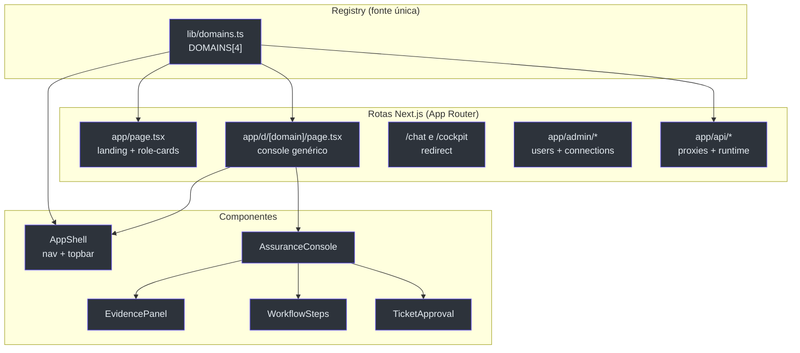

# Visão Geral — Frontend Multi-tenant de 4 Domínios

## Por que este frontend existe

O frontend é a face do **Foundry Assured** — um concierge de suporte de engenharia que tria, fundamenta, resolve e escala com aprovação humana. Mas o diferencial de arquitetura não é o chat: é que **a mesma superfície serve qualquer domínio**. A tese do produto é que o "mecanismo de garantia" (citação obrigatória, acesso por documento, avaliação contínua) é *domain-swappable*, então a UI também é. Adicionar um domínio = **uma entrada** em `lib/domains.ts` (+ um agente no backend), sem nova página, sem nova rota.

Isso é declarado explicitamente no topo do registry: _"Adding a domain = one entry here (+ a backend agent)"_ [apps/frontend/lib/domains.ts:1-6](https://github.com/ruinosus/foundry-assured/blob/3333d60d0e9c02b64a532f2c9bad94692cf50075/apps/frontend/lib/domains.ts#L1-L6).

> **Fato (lido no código):** o registry é a fonte única de verdade. Ele dirige o mapa de agentes (`api/copilotkit`), a navegação lateral, a rota genérica `/d/[domain]`, os cards do landing e os prompts iniciais por domínio [apps/frontend/lib/domains.ts:3-6](https://github.com/ruinosus/foundry-assured/blob/3333d60d0e9c02b64a532f2c9bad94692cf50075/apps/frontend/lib/domains.ts#L3-L6).

## O que mudou desde a v0.2.0

A regeneração v0.3.0 reflete duas mudanças factuais na linha *grounded live-OBO*. Resumo:

| Mudança | Antes (v0.2.0) | Agora (v0.3.0) | Fonte |
|---|---|---|---|
| Twins hospedados grounded | cockpit + selfwiki tinham twins hospedados | **removidos** — grounded roda live via OBO, sem twin | [apps/frontend/lib/domains.ts:59-60](https://github.com/ruinosus/foundry-assured/blob/3333d60d0e9c02b64a532f2c9bad94692cf50075/apps/frontend/lib/domains.ts#L59-L60) |
| `hostedAgentId` no registry | 3 domínios com twin | **só** `helpdesk` e `platform` declaram `hostedAgentId` | [apps/frontend/lib/domains.ts:45](https://github.com/ruinosus/foundry-assured/blob/3333d60d0e9c02b64a532f2c9bad94692cf50075/apps/frontend/lib/domains.ts#L45) |
| Toggle Live/Hosted | podia aparecer em domínios grounded | só renderiza p/ domínios com `hostedAgentId` (helpdesk, platform) | [apps/frontend/components/console/AssuranceConsole.tsx:69](https://github.com/ruinosus/foundry-assured/blob/3333d60d0e9c02b64a532f2c9bad94692cf50075/apps/frontend/components/console/AssuranceConsole.tsx#L69) |
| Twins no runtime | 3 twins hospedados | só `helpdesk-hosted` + `platform-hosted` | [apps/frontend/app/api/copilotkit/[[...slug]]/route.ts:89-93](https://github.com/ruinosus/foundry-assured/blob/3333d60d0e9c02b64a532f2c9bad94692cf50075/apps/frontend/app/api/copilotkit/[[...slug]]/route.ts#L89-L93) |
| EvidencePanel | heurística de texto (regex) | **citações estruturadas** do evento CUSTOM `sources` (+ snippet inline no clique) | [apps/frontend/components/console/EvidencePanel.tsx:8-13](https://github.com/ruinosus/foundry-assured/blob/3333d60d0e9c02b64a532f2c9bad94692cf50075/apps/frontend/components/console/EvidencePanel.tsx#L8-L13) |

O comentário no registry é explícito para os dois domínios grounded: _"Grounded runs live via OBO — no hosted twin needed."_ [apps/frontend/lib/domains.ts:60](https://github.com/ruinosus/foundry-assured/blob/3333d60d0e9c02b64a532f2c9bad94692cf50075/apps/frontend/lib/domains.ts#L60), [apps/frontend/lib/domains.ts:75](https://github.com/ruinosus/foundry-assured/blob/3333d60d0e9c02b64a532f2c9bad94692cf50075/apps/frontend/lib/domains.ts#L75).

## Os 4 domínios

Cada domínio é um objeto `Domain` no array `DOMAINS`. Os campos `id`, `kind`, `endpoint` e o opcional `hostedAgentId` são o que efetivamente muda o comportamento da UI.

| id | icon | kind | endpoint | hostedAgentId | Fonte |
|---|---|---|---|---|---|
| `helpdesk` | 💬 | `workflow` | `/helpdesk` | `helpdesk-hosted` | [apps/frontend/lib/domains.ts:29-46](https://github.com/ruinosus/foundry-assured/blob/3333d60d0e9c02b64a532f2c9bad94692cf50075/apps/frontend/lib/domains.ts#L29-L46) |
| `cockpit` | 🛰️ | `grounded` | `/cockpit` | — | [apps/frontend/lib/domains.ts:47-61](https://github.com/ruinosus/foundry-assured/blob/3333d60d0e9c02b64a532f2c9bad94692cf50075/apps/frontend/lib/domains.ts#L47-L61) |
| `selfwiki` | 📖 | `grounded` | `/selfwiki` | — | [apps/frontend/lib/domains.ts:62-76](https://github.com/ruinosus/foundry-assured/blob/3333d60d0e9c02b64a532f2c9bad94692cf50075/apps/frontend/lib/domains.ts#L62-L76) |
| `platform` | 🛠️ | `tool` | `/platform` | `platform-hosted` | [apps/frontend/lib/domains.ts:77-91](https://github.com/ruinosus/foundry-assured/blob/3333d60d0e9c02b64a532f2c9bad94692cf50075/apps/frontend/lib/domains.ts#L77-L91) |

O significado de cada `kind` está documentado inline: `workflow` = triage→retrieve→resolve→escalate com passos + HITL; `grounded` = Q&A puro com citações; `tool` = dirigido por ferramentas (servidores MCP da Microsoft) com HITL em ações de escrita [apps/frontend/lib/domains.ts:15-17](https://github.com/ruinosus/foundry-assured/blob/3333d60d0e9c02b64a532f2c9bad94692cf50075/apps/frontend/lib/domains.ts#L15-L17).

> **Fato (lido no código):** os dois domínios com `hostedAgentId` (helpdesk, platform) são exatamente os dois que carregam interrupts HITL — a única razão de o twin hospedado ainda existir. Os grounded pararam de precisar de twin quando passaram a rodar live via OBO.

## Mapa do componente (estrutura)

<!-- Sources: apps/frontend/lib/domains.ts:28-95, apps/frontend/app/d/[domain]/page.tsx:16-24, apps/frontend/components/shell/AppShell.tsx:18-37, apps/frontend/components/console/AssuranceConsole.tsx:39-96 -->

## Como o registry "irriga" a UI

A página de landing mapeia `DOMAINS` para role-cards e linka cada um para `/d/<id>` [apps/frontend/app/page.tsx:49-63](https://github.com/ruinosus/foundry-assured/blob/3333d60d0e9c02b64a532f2c9bad94692cf50075/apps/frontend/app/page.tsx#L49-L63). A nav lateral deriva os itens de "AI agents" do mesmo array [apps/frontend/components/shell/AppShell.tsx:18](https://github.com/ruinosus/foundry-assured/blob/3333d60d0e9c02b64a532f2c9bad94692cf50075/apps/frontend/components/shell/AppShell.tsx#L18). A rota `/d/[domain]` resolve o id pelo path e o entrega ao console [apps/frontend/app/d/[domain]/page.tsx:16-23](https://github.com/ruinosus/foundry-assured/blob/3333d60d0e9c02b64a532f2c9bad94692cf50075/apps/frontend/app/d/[domain]/page.tsx#L16-L23). As rotas antigas `/chat` e `/cockpit` viram `redirect()` para `/d/helpdesk` e `/d/cockpit` [apps/frontend/app/chat/page.tsx:5-7](https://github.com/ruinosus/foundry-assured/blob/3333d60d0e9c02b64a532f2c9bad94692cf50075/apps/frontend/app/chat/page.tsx#L5-L7).

## As três garantias (a "assinatura" do produto)

O EvidencePanel e o landing repetem as mesmas três garantias do mecanismo — **construída com fidelidade**, **acesso que segue a fonte**, **continuamente avaliada** [apps/frontend/app/page.tsx:9-25](https://github.com/ruinosus/foundry-assured/blob/3333d60d0e9c02b64a532f2c9bad94692cf50075/apps/frontend/app/page.tsx#L9-L25). Elas não são prosa de marketing: o gate de fidelidade exige ≥80% de citações que resolvem para arquivos reais — o mesmo gate que esta própria wiki passa [apps/frontend/components/console/EvidencePanel.tsx:53-69](https://github.com/ruinosus/foundry-assured/blob/3333d60d0e9c02b64a532f2c9bad94692cf50075/apps/frontend/components/console/EvidencePanel.tsx#L53-L69).

## Related Pages

| Página | Relação |
|------|-------------|
| [Arquitetura e Stack](page-2.md) | Camadas, Next.js 15, CopilotKit v2 |
| [Registry e Runtime](page-3.md) | Detalhe de `lib/domains.ts` e do runtime CopilotKit |
| [Assurance Console](page-4.md) | O console genérico + o EvidencePanel v2 |
| [Admin e Multi-tenancy](page-6.md) | A UI de tenant/onboarding da linha SaaS |
