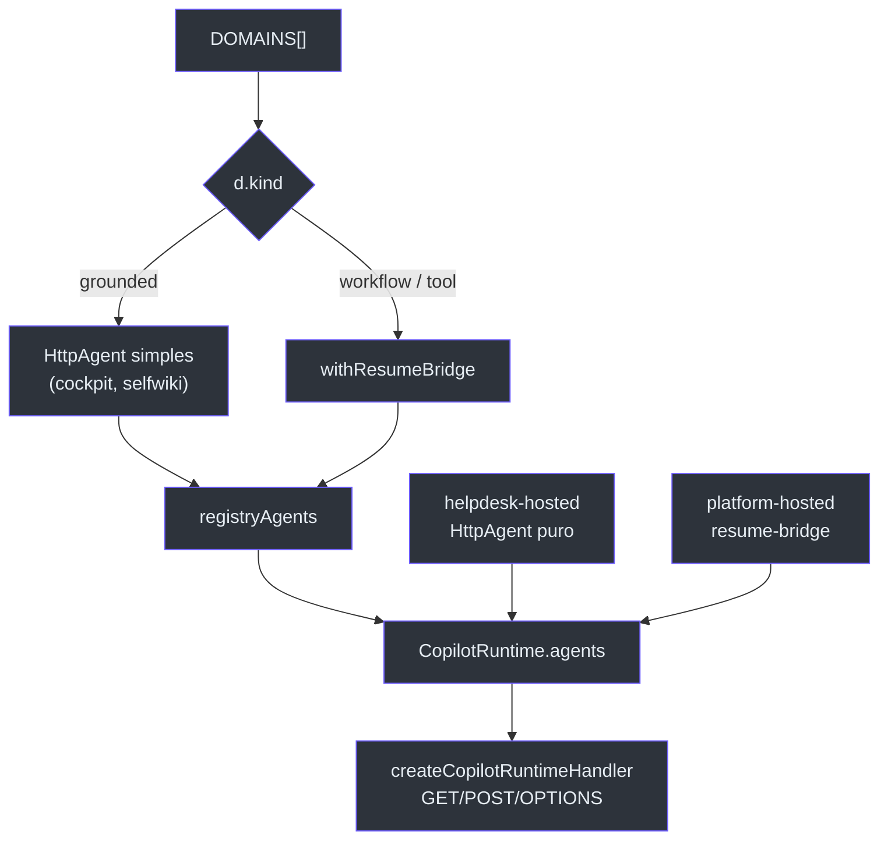
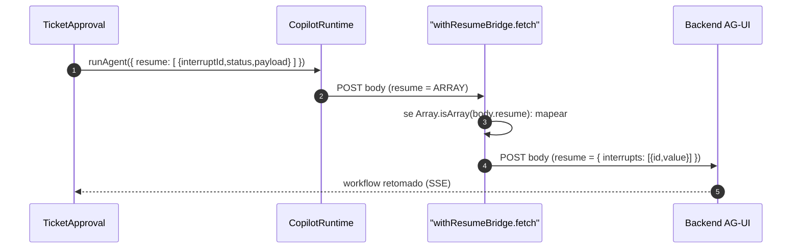

# O Registry de Domínios e o Runtime CopilotKit

## A ideia central (first principles)

O insight de arquitetura do frontend cabe em uma frase: **um array é o sistema de configuração**. Cada `Domain` em `DOMAINS` é simultaneamente: um agente no runtime, um item de nav, um role-card, um conjunto de prompts e — se tiver `hostedAgentId` — um toggle Live/Hosted. A consequência prática é que *não há wiring por-domínio espalhado*; tudo deriva do registry [apps/frontend/lib/domains.ts:1-6](https://github.com/ruinosus/foundry-assured/blob/3333d60d0e9c02b64a532f2c9bad94692cf50075/apps/frontend/lib/domains.ts#L1-L6).

## A forma de um Domain

```ts
// Pseudocódigo da interface (lido em lib/domains.ts)
interface Domain {
  id: string;            // == agentId backend + segmento do path AG-UI
  icon: string;
  label: string;
  kind: "workflow" | "grounded" | "tool";
  blurb: string;
  suggested: string[];   // chips de prompt inicial
  endpoint: string;      // path AG-UI default
  hostedAgentId?: string; // habilita o toggle live/hosted (só helpdesk e platform)
}
```

Campos e seus papéis [apps/frontend/lib/domains.ts:8-26](https://github.com/ruinosus/foundry-assured/blob/3333d60d0e9c02b64a532f2c9bad94692cf50075/apps/frontend/lib/domains.ts#L8-L26):

| Campo | Dirige | Onde é consumido |
|---|---|---|
| `id` | agentId no runtime + `agentId` do `CopilotChat` | [route.ts:72](https://github.com/ruinosus/foundry-assured/blob/3333d60d0e9c02b64a532f2c9bad94692cf50075/apps/frontend/app/api/copilotkit/[[...slug]]/route.ts#L72), [AssuranceConsole.tsx:37](https://github.com/ruinosus/foundry-assured/blob/3333d60d0e9c02b64a532f2c9bad94692cf50075/apps/frontend/components/console/AssuranceConsole.tsx#L37) |
| `kind` | tipo de agente no runtime + UI condicional | [route.ts:74-77](https://github.com/ruinosus/foundry-assured/blob/3333d60d0e9c02b64a532f2c9bad94692cf50075/apps/frontend/app/api/copilotkit/[[...slug]]/route.ts#L74-L77) |
| `endpoint` | URL AG-UI default | [route.ts:64-65](https://github.com/ruinosus/foundry-assured/blob/3333d60d0e9c02b64a532f2c9bad94692cf50075/apps/frontend/app/api/copilotkit/[[...slug]]/route.ts#L64-L65) |
| `hostedAgentId` | renderiza o toggle Live/Hosted | [AssuranceConsole.tsx:69](https://github.com/ruinosus/foundry-assured/blob/3333d60d0e9c02b64a532f2c9bad94692cf50075/apps/frontend/components/console/AssuranceConsole.tsx#L69) |
| `suggested` | chips de SuggestedPrompts | [SuggestedPrompts.tsx:44-48](https://github.com/ruinosus/foundry-assured/blob/3333d60d0e9c02b64a532f2c9bad94692cf50075/apps/frontend/components/console/SuggestedPrompts.tsx#L44-L48) |

## O runtime CopilotKit — montando o mapa de agentes

A rota é um **catch-all** `[[...slug]]` de propósito: o cliente v2 chama sub-paths (`/api/copilotkit/agent/<id>/run`, sync), e um `route.ts` exato só casaria `/api/copilotkit` e daria 404 nas chamadas de agent-run [apps/frontend/app/api/copilotkit/[[...slug]]/route.ts:1-5](https://github.com/ruinosus/foundry-assured/blob/3333d60d0e9c02b64a532f2c9bad94692cf50075/apps/frontend/app/api/copilotkit/[[...slug]]/route.ts#L1-L5).

O mapa `registryAgents` é construído a partir de `DOMAINS` com uma única regra: domínios `grounded` recebem um `HttpAgent` simples (request→response); domínios que carregam interrupções (`workflow` + `tool`) recebem o **resume-bridge** [apps/frontend/app/api/copilotkit/[[...slug]]/route.ts:71-78](https://github.com/ruinosus/foundry-assured/blob/3333d60d0e9c02b64a532f2c9bad94692cf50075/apps/frontend/app/api/copilotkit/[[...slug]]/route.ts#L71-L78):

```ts
// route.ts (lido)
const registryAgents = Object.fromEntries(
  DOMAINS.map((d) => [
    d.id,
    d.kind === "grounded"
      ? new HttpAgent({ url: urlFor(d) })
      : withResumeBridge(d.id === "helpdesk" ? AGUI_URL : urlFor(d)),
  ]),
);
```

A URL de cada domínio deriva de uma **única base** `BACKEND_URL` (`${BACKEND}${d.endpoint}`), com override opcional por env var `<ID>_AGUI_URL` (ex.: `COCKPIT_AGUI_URL`, `PLATFORM_AGUI_URL`) — no container deployado `BACKEND_URL` vem da `containerapps.bicep`; local cai para `http://localhost:8000` [apps/frontend/app/api/copilotkit/[[...slug]]/route.ts:17-22](https://github.com/ruinosus/foundry-assured/blob/3333d60d0e9c02b64a532f2c9bad94692cf50075/apps/frontend/app/api/copilotkit/[[...slug]]/route.ts#L17-L22), [apps/frontend/app/api/copilotkit/[[...slug]]/route.ts:64-65](https://github.com/ruinosus/foundry-assured/blob/3333d60d0e9c02b64a532f2c9bad94692cf50075/apps/frontend/app/api/copilotkit/[[...slug]]/route.ts#L64-L65).

## O que mudou: só dois twins hospedados

**Mudança da v0.3.0:** os grounded pararam de ter twin hospedado. Aos agentes do registry somam-se **apenas dois** twins: `helpdesk-hosted` (um `HttpAgent` puro, sem interrupts) e `platform-hosted` (com resume-bridge, porque carrega o write-approval) [apps/frontend/app/api/copilotkit/[[...slug]]/route.ts:60-62](https://github.com/ruinosus/foundry-assured/blob/3333d60d0e9c02b64a532f2c9bad94692cf50075/apps/frontend/app/api/copilotkit/[[...slug]]/route.ts#L60-L62), [apps/frontend/app/api/copilotkit/[[...slug]]/route.ts:89-93](https://github.com/ruinosus/foundry-assured/blob/3333d60d0e9c02b64a532f2c9bad94692cf50075/apps/frontend/app/api/copilotkit/[[...slug]]/route.ts#L89-L93). O comentário no runtime é explícito: _"helpdesk + platform keep their hosted twins; grounded domains (cockpit, selfwiki) run live via OBO"_ [apps/frontend/app/api/copilotkit/[[...slug]]/route.ts:87](https://github.com/ruinosus/foundry-assured/blob/3333d60d0e9c02b64a532f2c9bad94692cf50075/apps/frontend/app/api/copilotkit/[[...slug]]/route.ts#L87).


<!-- Sources: apps/frontend/app/api/copilotkit/[[...slug]]/route.ts:60-103 -->

## Por que o resume-bridge existe

Há um descasamento de formato entre as duas pontas: o runtime CopilotKit valida `resume` como um **array** (forma do cliente AG-UI, `[{ interruptId, status, payload }]`), mas o backend agent-framework espera um **dict** (`{ interrupts: [{ id, value }] }`) [apps/frontend/app/api/copilotkit/[[...slug]]/route.ts:7-11](https://github.com/ruinosus/foundry-assured/blob/3333d60d0e9c02b64a532f2c9bad94692cf50075/apps/frontend/app/api/copilotkit/[[...slug]]/route.ts#L7-L11).

`withResumeBridge` sobrescreve o `fetch` do `HttpAgent` para traduzir o corpo logo antes de bater no backend [apps/frontend/app/api/copilotkit/[[...slug]]/route.ts:35-58](https://github.com/ruinosus/foundry-assured/blob/3333d60d0e9c02b64a532f2c9bad94692cf50075/apps/frontend/app/api/copilotkit/[[...slug]]/route.ts#L35-L58):


<!-- Sources: apps/frontend/app/api/copilotkit/[[...slug]]/route.ts:35-58, apps/frontend/components/chat/TicketApproval.tsx:100-104 -->

> **Fato (lido no código):** o `helpdesk-hosted` usa `HttpAgent` puro porque o caminho hospedado é request→response sem interrupts — o comentário no código afirma isso [apps/frontend/app/api/copilotkit/[[...slug]]/route.ts:23-25](https://github.com/ruinosus/foundry-assured/blob/3333d60d0e9c02b64a532f2c9bad94692cf50075/apps/frontend/app/api/copilotkit/[[...slug]]/route.ts#L23-L25), enquanto `platform-hosted` precisa do bridge por carregar o write-approval sobre Invocations [apps/frontend/app/api/copilotkit/[[...slug]]/route.ts:27-31](https://github.com/ruinosus/foundry-assured/blob/3333d60d0e9c02b64a532f2c9bad94692cf50075/apps/frontend/app/api/copilotkit/[[...slug]]/route.ts#L27-L31).

## Multi-route handler (não o legado single-route)

O runtime usa `createCopilotRuntimeHandler` com `basePath: "/api/copilotkit"` — o **multi-route** que serve as sub-paths do cliente v2 (POST `/agent/:id/run`, GET `/info`, …). O legado `copilotRuntimeNextJSAppRouterEndpoint` é single-route e responde 400 "Missing method field" à sub-path de agent-run, o que silenciosamente reseta o chat [apps/frontend/app/api/copilotkit/[[...slug]]/route.ts:80-99](https://github.com/ruinosus/foundry-assured/blob/3333d60d0e9c02b64a532f2c9bad94692cf50075/apps/frontend/app/api/copilotkit/[[...slug]]/route.ts#L80-L99).

## Adicionar um 5º domínio (receita)

1. Adicione uma entrada em `DOMAINS` (`id`, `kind`, `endpoint`, etc.) [apps/frontend/lib/domains.ts:28](https://github.com/ruinosus/foundry-assured/blob/3333d60d0e9c02b64a532f2c9bad94692cf50075/apps/frontend/lib/domains.ts#L28).
2. Suba o agente correspondente no backend no path `endpoint`.
3. Pronto — nav, landing, `/d/<id>`, runtime e prompts pegam de graça (`getDomain` resolve o id) [apps/frontend/lib/domains.ts:94-95](https://github.com/ruinosus/foundry-assured/blob/3333d60d0e9c02b64a532f2c9bad94692cf50075/apps/frontend/lib/domains.ts#L94-L95). Se for grounded, roda live via OBO — nenhum twin necessário.

## Related Pages

| Página | Relação |
|------|-------------|
| [Visão Geral](page-1.md) | Tabela dos 4 domínios |
| [Assurance Console](page-4.md) | Onde o toggle Live/Hosted é renderizado |
| [Human-in-the-loop](page-5.md) | O `runAgent({ resume })` que o bridge traduz |
| [Arquitetura e Stack](page-2.md) | A ponte AG-UI no contexto geral |
