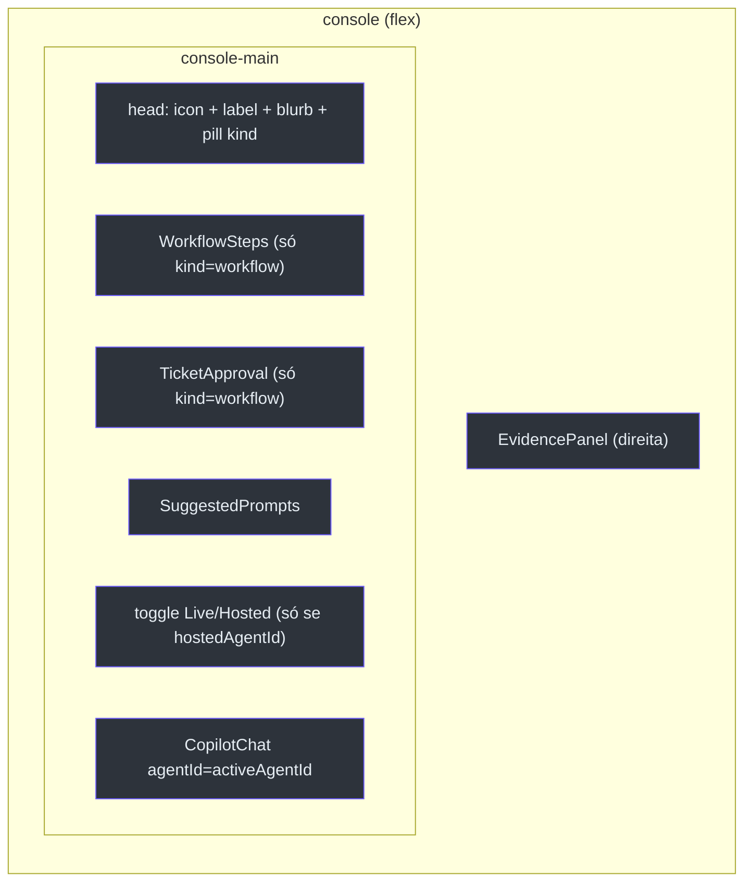
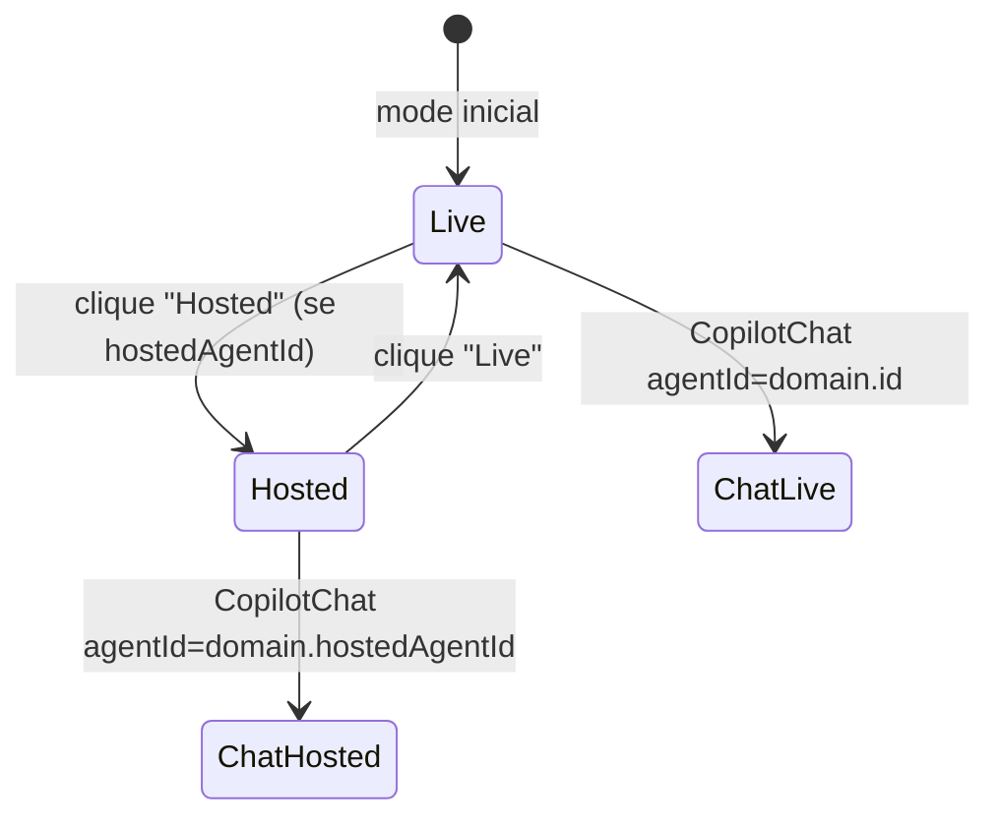
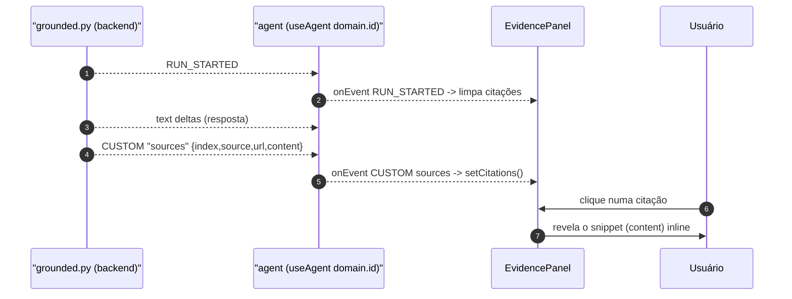

# Assurance Console, Toggle Live/Hosted e EvidencePanel

## Por que um único console

O `AssuranceConsole` é a superfície config-driven para **qualquer** agente de domínio. Em vez de uma página de chat por domínio, há um console que muda de comportamento conforme o `Domain` recebido — a sidebar do `AppShell` é o switcher de domínio [apps/frontend/components/console/AssuranceConsole.tsx:3-9](https://github.com/ruinosus/foundry-assured/blob/3333d60d0e9c02b64a532f2c9bad94692cf50075/apps/frontend/components/console/AssuranceConsole.tsx#L3-L9).


<!-- Sources: apps/frontend/components/console/AssuranceConsole.tsx:39-96 -->

## A estrutura de duas colunas

Dentro do shell (flush), o console tem duas panes: o chat (centro) e o `EvidencePanel` (direita) — a assinatura de citações/assurance [apps/frontend/components/console/AssuranceConsole.tsx:45-96](https://github.com/ruinosus/foundry-assured/blob/3333d60d0e9c02b64a532f2c9bad94692cf50075/apps/frontend/components/console/AssuranceConsole.tsx#L45-L96).

A UI condicional por `kind` é direta: domínios `workflow` adicionalmente renderizam `<WorkflowSteps />` e `<TicketApproval />`; os demais não [apps/frontend/components/console/AssuranceConsole.tsx:60-65](https://github.com/ruinosus/foundry-assured/blob/3333d60d0e9c02b64a532f2c9bad94692cf50075/apps/frontend/components/console/AssuranceConsole.tsx#L60-L65). O pill do cabeçalho mostra "workflow + HITL" ou "grounded Q&A" conforme o kind [apps/frontend/components/console/AssuranceConsole.tsx:55-57](https://github.com/ruinosus/foundry-assured/blob/3333d60d0e9c02b64a532f2c9bad94692cf50075/apps/frontend/components/console/AssuranceConsole.tsx#L55-L57).

## O toggle Live/Hosted (registry-driven) — a realidade atual

O toggle é **dirigido pelo registry**: ele só renderiza quando o domínio declara `hostedAgentId`, sob `{domain.hostedAgentId && (...)}` [apps/frontend/components/console/AssuranceConsole.tsx:69-88](https://github.com/ruinosus/foundry-assured/blob/3333d60d0e9c02b64a532f2c9bad94692cf50075/apps/frontend/components/console/AssuranceConsole.tsx#L69-L88).

> **Fato (lido no código) — mudança da v0.3.0:** como os twins grounded foram removidos do registry, **na prática o toggle só aparece em dois domínios**: `helpdesk` e `platform` (os únicos com `hostedAgentId`). Cockpit e selfwiki nunca renderizam o toggle — rodam sempre live via OBO [apps/frontend/lib/domains.ts:60](https://github.com/ruinosus/foundry-assured/blob/3333d60d0e9c02b64a532f2c9bad94692cf50075/apps/frontend/lib/domains.ts#L60), [apps/frontend/lib/domains.ts:75](https://github.com/ruinosus/foundry-assured/blob/3333d60d0e9c02b64a532f2c9bad94692cf50075/apps/frontend/lib/domains.ts#L75). O mecanismo do toggle continua genérico (registry-driven), então se um grounded voltar a ganhar um twin, herda o toggle de graça.

O `activeAgentId` resolve assim [apps/frontend/components/console/AssuranceConsole.tsx:35-37](https://github.com/ruinosus/foundry-assured/blob/3333d60d0e9c02b64a532f2c9bad94692cf50075/apps/frontend/components/console/AssuranceConsole.tsx#L35-L37):

```ts
const [mode, setMode] = useState<"live" | "hosted">("live");
const activeAgentId =
  mode === "hosted" && domain.hostedAgentId ? domain.hostedAgentId : domain.id;
```


<!-- Sources: apps/frontend/components/console/AssuranceConsole.tsx:35-37, apps/frontend/components/console/AssuranceConsole.tsx:69-91 -->

A legenda alterna entre "AG-UI · live tool steps + write-approval" e "Foundry Agent Service · managed hosted agent"; o `<CopilotChat>` recebe `agentId={activeAgentId}` [apps/frontend/components/console/AssuranceConsole.tsx:82-91](https://github.com/ruinosus/foundry-assured/blob/3333d60d0e9c02b64a532f2c9bad94692cf50075/apps/frontend/components/console/AssuranceConsole.tsx#L82-L91).

### Comparação com o HelpdeskApp legado

Há um segundo lar para o toggle: `HelpdeskApp.tsx`, usado fora do console genérico. Ali o toggle é hardcoded (Live workflow / Hosted agent) e fixa `agentId="helpdesk"` / `"helpdesk-hosted"` [apps/frontend/components/chat/HelpdeskApp.tsx:54-87](https://github.com/ruinosus/foundry-assured/blob/3333d60d0e9c02b64a532f2c9bad94692cf50075/apps/frontend/components/chat/HelpdeskApp.tsx#L54-L87). Em demo mode esconde o toggle e mostra um pill "Demo · replayed fixture" [apps/frontend/components/chat/HelpdeskApp.tsx:48-53](https://github.com/ruinosus/foundry-assured/blob/3333d60d0e9c02b64a532f2c9bad94692cf50075/apps/frontend/components/chat/HelpdeskApp.tsx#L48-L53).

| Aspecto | AssuranceConsole | HelpdeskApp |
|---|---|---|
| Origem do toggle | `domain.hostedAgentId` (registry) | hardcoded |
| AgentId | `domain.id` / `domain.hostedAgentId` | `"helpdesk"` / `"helpdesk-hosted"` |
| Fonte | [AssuranceConsole.tsx:69-91](https://github.com/ruinosus/foundry-assured/blob/3333d60d0e9c02b64a532f2c9bad94692cf50075/apps/frontend/components/console/AssuranceConsole.tsx#L69-L91) | [HelpdeskApp.tsx:54-87](https://github.com/ruinosus/foundry-assured/blob/3333d60d0e9c02b64a532f2c9bad94692cf50075/apps/frontend/components/chat/HelpdeskApp.tsx#L54-L87) |

## Autenticação dentro do console

`AssuranceConsole` espelha `HelpdeskApp`: quando Entra está configurado, gateia em sign-in e encaminha o access token (o backend faz o OBO); senão renderiza direto [apps/frontend/components/console/AssuranceConsole.tsx:11-13](https://github.com/ruinosus/foundry-assured/blob/3333d60d0e9c02b64a532f2c9bad94692cf50075/apps/frontend/components/console/AssuranceConsole.tsx#L11-L13). O `AuthedConsole` adquire o token silenciosamente e o **renova a cada 4 min** para não deixar o chat OBO 401-ar no meio da sessão [apps/frontend/components/console/AssuranceConsole.tsx:116-133](https://github.com/ruinosus/foundry-assured/blob/3333d60d0e9c02b64a532f2c9bad94692cf50075/apps/frontend/components/console/AssuranceConsole.tsx#L116-L133). Se o domínio não existe, mostra "Domínio não encontrado" [apps/frontend/components/console/AssuranceConsole.tsx:149-157](https://github.com/ruinosus/foundry-assured/blob/3333d60d0e9c02b64a532f2c9bad94692cf50075/apps/frontend/components/console/AssuranceConsole.tsx#L149-L157).

## EvidencePanel v2 — citações estruturadas (a grande mudança)

O `EvidencePanel` é a primitiva on-thesis: em RAG enterprise, *a citação é o objeto interessante, não o resumo — a confiança passa pelo link* [apps/frontend/components/console/EvidencePanel.tsx:3-6](https://github.com/ruinosus/foundry-assured/blob/3333d60d0e9c02b64a532f2c9bad94692cf50075/apps/frontend/components/console/EvidencePanel.tsx#L3-L6).

> **Mudança da v0.3.0:** a v0.2.0 derivava as fontes só do **texto** da resposta (regex). Agora o painel lê **citações estruturadas** do stream AG-UI: o backend (`app/services/grounded.py`) roda a Responses API com a KB como tool MCP inline e emite as anotações `url_citation` como um evento CUSTOM `sources` (`{index, source, url, content}`). O painel se inscreve nele via `agent.subscribe` (mesmo padrão `onEvent`/CUSTOM do `TicketApproval`) [apps/frontend/components/console/EvidencePanel.tsx:8-13](https://github.com/ruinosus/foundry-assured/blob/3333d60d0e9c02b64a532f2c9bad94692cf50075/apps/frontend/components/console/EvidencePanel.tsx#L8-L13), [apps/backend/app/services/grounded.py:126-140](https://github.com/ruinosus/foundry-assured/blob/3333d60d0e9c02b64a532f2c9bad94692cf50075/apps/backend/app/services/grounded.py#L126-L140).

O contrato dos dois lados:

| Campo do `sources` | Significado | Fonte (frontend) | Fonte (backend) |
|---|---|---|---|
| `index` | número da citação | [EvidencePanel.tsx:20-25](https://github.com/ruinosus/foundry-assured/blob/3333d60d0e9c02b64a532f2c9bad94692cf50075/apps/frontend/components/console/EvidencePanel.tsx#L20-L25) | [grounded.py:127](https://github.com/ruinosus/foundry-assured/blob/3333d60d0e9c02b64a532f2c9bad94692cf50075/apps/backend/app/services/grounded.py#L127) |
| `source` | nome do documento | [EvidencePanel.tsx:22](https://github.com/ruinosus/foundry-assured/blob/3333d60d0e9c02b64a532f2c9bad94692cf50075/apps/frontend/components/console/EvidencePanel.tsx#L22) | [grounded.py:127](https://github.com/ruinosus/foundry-assured/blob/3333d60d0e9c02b64a532f2c9bad94692cf50075/apps/backend/app/services/grounded.py#L127) |
| `url` | blob privado (não abre direto) | [EvidencePanel.tsx:23](https://github.com/ruinosus/foundry-assured/blob/3333d60d0e9c02b64a532f2c9bad94692cf50075/apps/frontend/components/console/EvidencePanel.tsx#L23) | [grounded.py:127](https://github.com/ruinosus/foundry-assured/blob/3333d60d0e9c02b64a532f2c9bad94692cf50075/apps/backend/app/services/grounded.py#L127) |
| `content` | snippet recuperado, **mostrado inline no clique** (blob é privado) | [EvidencePanel.tsx:24](https://github.com/ruinosus/foundry-assured/blob/3333d60d0e9c02b64a532f2c9bad94692cf50075/apps/frontend/components/console/EvidencePanel.tsx#L24) | [grounded.py:128](https://github.com/ruinosus/foundry-assured/blob/3333d60d0e9c02b64a532f2c9bad94692cf50075/apps/backend/app/services/grounded.py#L128) |


<!-- Sources: apps/frontend/components/console/EvidencePanel.tsx:88-108, apps/backend/app/services/grounded.py:132-141 -->

### Fallback e clique-para-ver

Quando **nenhuma** citação estruturada chega (caminhos mais antigos/hosted), o painel cai para a heurística v1 que deriva fontes do texto da resposta via duas regex (caminhos de arquivo + identificadores de componente `cockpit-*`/`foundry-helpdesk-*`) [apps/frontend/components/console/EvidencePanel.tsx:35-51](https://github.com/ruinosus/foundry-assured/blob/3333d60d0e9c02b64a532f2c9bad94692cf50075/apps/frontend/components/console/EvidencePanel.tsx#L35-L51). As citações estruturadas têm precedência; `count` usa `citations.length || textSources.length` [apps/frontend/components/console/EvidencePanel.tsx:110](https://github.com/ruinosus/foundry-assured/blob/3333d60d0e9c02b64a532f2c9bad94692cf50075/apps/frontend/components/console/EvidencePanel.tsx#L110).

Cada citação é um botão numerado; o clique alterna `openIdx` e revela o `content` inline (ou "documento interno — sem prévia" quando não há snippet) [apps/frontend/components/console/EvidencePanel.tsx:121-149](https://github.com/ruinosus/foundry-assured/blob/3333d60d0e9c02b64a532f2c9bad94692cf50075/apps/frontend/components/console/EvidencePanel.tsx#L121-L149). Abaixo, três **garantias** fixas (Fidelidade, Acesso, Avaliação) são sempre exibidas [apps/frontend/components/console/EvidencePanel.tsx:53-69](https://github.com/ruinosus/foundry-assured/blob/3333d60d0e9c02b64a532f2c9bad94692cf50075/apps/frontend/components/console/EvidencePanel.tsx#L53-L69).

## SuggestedPrompts — antídoto ao "blank box"

Os chips de prompt inicial vêm de `domain.suggested` e enviam ao clicar (`addMessage` + `runAgent`), sumindo assim que a conversa começa [apps/frontend/components/console/SuggestedPrompts.tsx:12-38](https://github.com/ruinosus/foundry-assured/blob/3333d60d0e9c02b64a532f2c9bad94692cf50075/apps/frontend/components/console/SuggestedPrompts.tsx#L12-L38).

## Related Pages

| Página | Relação |
|------|-------------|
| [Registry e Runtime](page-3.md) | De onde vêm `domain.id` e `domain.hostedAgentId` |
| [Human-in-the-loop](page-5.md) | `WorkflowSteps` e `TicketApproval` renderizados aqui |
| [Visão Geral](page-1.md) | As três garantias do EvidencePanel |
| [Autenticação Entra](page-7.md) | O fluxo OBO que o console encaminha |
