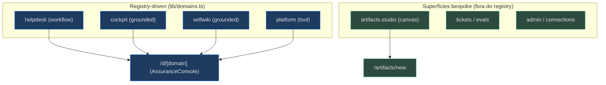
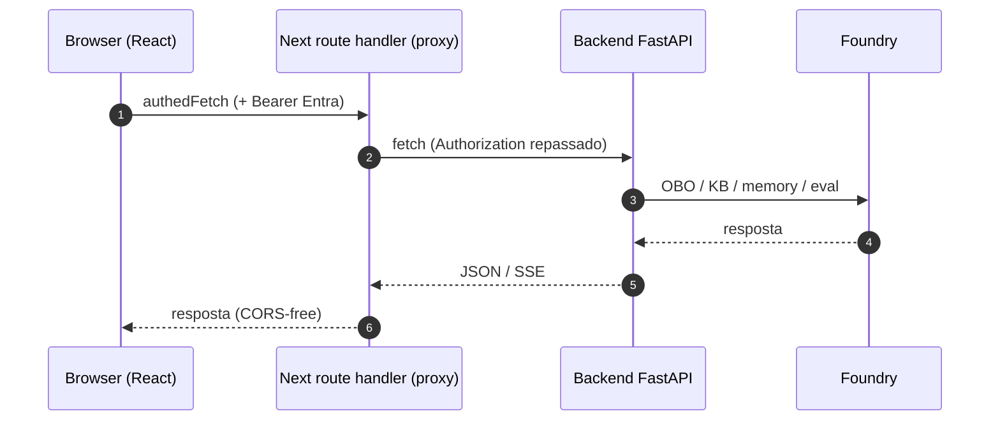

# Visão Geral — Frontend de 4 Domínios + Artifacts Studio

## O que é este app

O `apps/frontend` é a superfície web do showcase **Foundry Assured** — um Next.js 16 (App Router) que conversa com o backend Python via **AG-UI sobre SSE** através da runtime do **CopilotKit v2**. A tese do produto é que a arquitetura de assurance é *domain-swappable*, então o frontend também é: um **registry único** (`lib/domains.ts`) dirige o mapa de agentes, a navegação, a rota genérica de console e os prompts iniciais [apps/frontend/lib/domains.ts:1-8](apps/frontend/lib/domains.ts). A identidade visual inteira (título do browser, brand, login) sai de quatro strings em `lib/branding.ts` [apps/frontend/lib/branding.ts:6-15](apps/frontend/lib/branding.ts).

A **novidade da v0.4.0** é uma quinta superfície que não é um domínio de chat: os **HTML Artifacts** — relatórios/apresentações/walkthroughs em HTML **gerados por IA**, renderizados num iframe *sandboxed*, versionados e atrás de um lifecycle **aprovar-para-publicar**, mais o **Artifacts Studio**, um canvas conversacional com preview HTML ao vivo [apps/frontend/components/artifacts/ArtifactsView.tsx:3-5](apps/frontend/components/artifacts/ArtifactsView.tsx), [apps/frontend/components/artifacts/ArtifactStudio.tsx:3-9](apps/frontend/components/artifacts/ArtifactStudio.tsx).

| Superfície | Rota(s) | O que faz | Fonte |
|---|---|---|---|
| **Assurance Console** | `/d/[domain]` | Chat config-driven p/ qualquer domínio + EvidencePanel | [app/d/[domain]/page.tsx:16-24](apps/frontend/app/d/[domain]/page.tsx) |
| **Overview (landing)** | `/` | Story + role-cards dos domínios + garantias | [app/page.tsx:27-80](apps/frontend/app/page.tsx) |
| **Artifacts** | `/artifacts`, `/artifacts/new`, `/artifacts/[id]` | Lista, Studio (novo) e detalhe/preview | [app/artifacts/page.tsx:4-10](apps/frontend/app/artifacts/page.tsx) |
| **Tickets / Evals** | `/tickets`, `/evals` | Páginas de workspace bespoke | [components/shell/AppShell.tsx:19-24](apps/frontend/components/shell/AppShell.tsx) |
| **Admin** | `/admin/users`, `/admin/connections` | Gestão de usuários + tenant (Admin-gated) | [components/shell/AppShell.tsx:26-29](apps/frontend/components/shell/AppShell.tsx) |

## Os quatro domínios de agente

O registry declara **quatro domínios**, cada um com um `kind` que decide como o console se comporta: `workflow` (triage→retrieve→resolve→escalate com passos + HITL), `grounded` (Q&A puro fundamentado) e `tool` (tool-driven sobre MCP servers Microsoft, com HITL nas escritas) [apps/frontend/lib/domains.ts:8-26](apps/frontend/lib/domains.ts).

| Domínio | `id` | `kind` | Hosted twin | Fonte |
|---|---|---|---|---|
| Helpdesk concierge | `helpdesk` | `workflow` | `helpdesk-hosted` | [lib/domains.ts:29-46](apps/frontend/lib/domains.ts) |
| Cockpit expert | `cockpit` | `grounded` | — (live via OBO) | [lib/domains.ts:47-61](apps/frontend/lib/domains.ts) |
| Project wiki | `selfwiki` | `grounded` | — (live via OBO) | [lib/domains.ts:62-76](apps/frontend/lib/domains.ts) |
| Platform ops | `platform` | `tool` | `platform-hosted` | [lib/domains.ts:77-91](apps/frontend/lib/domains.ts) |

O **Artifacts Studio** é servido por um agente `artifacts-studio` **fora** do registry — é um canvas bespoke, não um domínio `/d/[domain]`, então não aparece em `lib/domains.ts` [apps/frontend/app/api/copilotkit/[[...slug]]/route.ts:33-36](apps/frontend/app/api/copilotkit/[[...slug]]/route.ts).

<!-- Sources: apps/frontend/lib/domains.ts:28-92, apps/frontend/app/d/[domain]/page.tsx:16-24, apps/frontend/app/api/copilotkit/[[...slug]]/route.ts:33-36 -->

## As três camadas

O frontend é a ponta de uma arquitetura de três camadas: **Frontend (Next.js)** → **Backend (Python/AG-UI)** → **Foundry**. O browser nunca fala com o backend direto: cada superfície passa por um **route handler** do Next (proxy) que anexa o bearer token Entra do usuário e encaminha para o FastAPI — que faz o OBO downstream [apps/frontend/app/api/me/route.ts:1-2](apps/frontend/app/api/me/route.ts), [apps/frontend/app/api/health/route.ts:1-2](apps/frontend/app/api/health/route.ts).

<!-- Sources: apps/frontend/lib/auth/api.ts:11-26, apps/frontend/app/api/me/route.ts:8-19, apps/frontend/app/api/copilotkit/[[...slug]]/route.ts:13-22 -->

## As três garantias (o motivo do EvidencePanel)

A landing e o `EvidencePanel` repetem as **três garantias** que o mecanismo de assurance impõe — a assinatura do produto: **Fidelidade** (a KB é gerada do código real, ≥80% das citações resolvem), **Acesso** (recuperação aparada por documento, segue a fonte), **Avaliação** (toda resposta cita ou declina) [apps/frontend/app/page.tsx:9-25](apps/frontend/app/page.tsx), [apps/frontend/components/console/EvidencePanel.tsx:53-69](apps/frontend/components/console/EvidencePanel.tsx).

## Como ler esta wiki

| Se você quer entender… | Vá para |
|---|---|
| A stack e o layout de pastas | [Arquitetura e Stack](page-2.md) |
| Como um domínio vira um agente rodável | [Registry e Runtime](page-3.md) |
| O console genérico + citações | [Assurance Console e EvidencePanel](page-4.md) |
| Aprovação humana no chat | [Human-in-the-loop](page-5.md) |
| **A nova UI de Artifacts + Studio** | [HTML Artifacts UI e o Studio Canvas](page-6.md) |
| Admin / multi-tenancy | [Admin e Multi-tenancy](page-7.md) |
| MSAL + os proxies | [Autenticação Entra e Proxies](page-8.md) |
| Rodar local / demo / deploy | [Execução Local, Demo e Deploy](page-9.md) |

## Related Pages

| Página | Relação |
|---|---|
| [Arquitetura e Stack](page-2.md) | Detalha a stack e o fluxo de camadas resumido aqui |
| [Registry e Runtime](page-3.md) | Onde os quatro domínios + o artifacts-studio viram agentes |
| [HTML Artifacts UI e o Studio Canvas](page-6.md) | A nova superfície da v0.4.0 |
