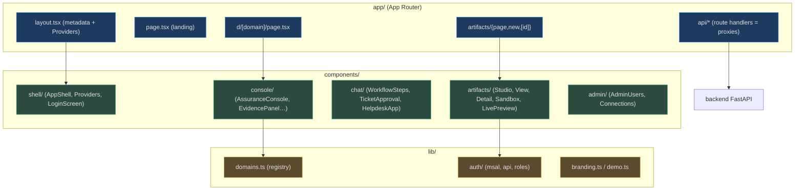
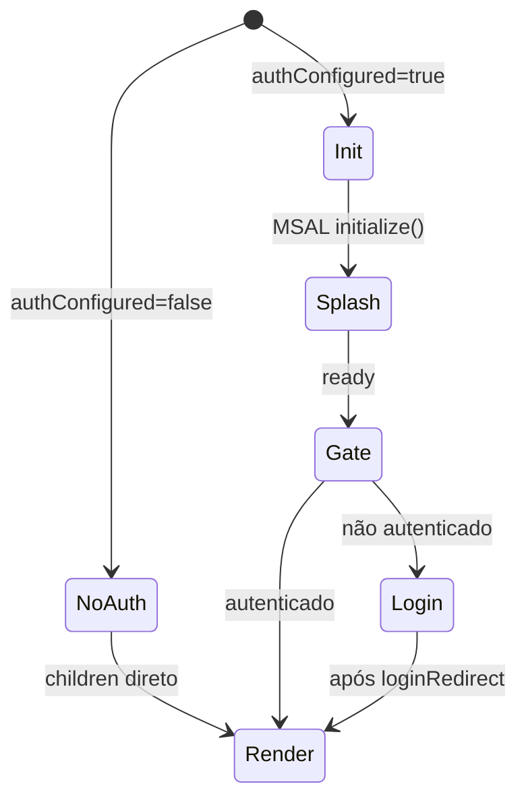

# Arquitetura e Stack (Next.js 16 + CopilotKit v2 + MSAL)

## A stack, versão por versão

O `package.json` fixa as versões que definem os padrões do código: **Next.js 16**, **React 19**, o cliente **CopilotKit 1.62** (react-core/react-ui/runtime) e o **MSAL 5** (browser + react) [apps/frontend/package.json:14-24](apps/frontend/package.json). O AG-UI client (`@ag-ui/client`) é o transporte de baixo nível que a runtime do CopilotKit usa para falar com o backend [apps/frontend/package.json:15](apps/frontend/package.json).

| Dependência | Versão | Papel | Fonte |
|---|---|---|---|
| `next` | `^16.2.10` | App Router, route handlers (proxies), build standalone | [package.json:21](apps/frontend/package.json) |
| `react` / `react-dom` | `^19.0.0` | UI | [package.json:22-23](apps/frontend/package.json) |
| `@copilotkit/react-core` | `^1.62.1` | Provider + `useAgent`/`CopilotChat` (import de `/v2`) | [package.json:18](apps/frontend/package.json) |
| `@copilotkit/runtime` | `^1.62.1` | `CopilotRuntime` + handler multi-route | [package.json:20](apps/frontend/package.json) |
| `@ag-ui/client` | `^0.0.57` | `HttpAgent` (transporte AG-UI p/ o backend) | [package.json:15](apps/frontend/package.json) |
| `@azure/msal-browser` / `msal-react` | `^5` | Sign-in Entra + aquisição de token | [package.json:16-17](apps/frontend/package.json) |
| `@copilotkit/aimock` | `^1.35.0` (dev) | Servidor mock p/ demo mode | [package.json:26](apps/frontend/package.json) |

> **Nota de convenção (v2):** todo import de CopilotKit usa o subcaminho **`/v2`** (ex.: `@copilotkit/react-core/v2`, `@copilotkit/runtime/v2`). Misturar `/v2` com `/v2/headless` cria uma cópia separada do contexto e quebra com *"useCopilotKit must be used within CopilotKitProvider"* — daí `WorkflowSteps` importar `useAgent` do mesmo entry que o provider [apps/frontend/components/chat/WorkflowSteps.tsx:12-15](apps/frontend/components/chat/WorkflowSteps.tsx).

## O layout de pastas

<!-- Sources: apps/frontend/app/layout.tsx:1-24, apps/frontend/lib/domains.ts:1-8, apps/frontend/components/shell/AppShell.tsx:1-14 -->

## Root layout e providers

O `layout.tsx` importa o CSS do CopilotKit v2 + os globais, seta o `<title>`/`<meta>` a partir do `branding`, e envolve tudo em `<Providers>` [apps/frontend/app/layout.tsx:1-24](apps/frontend/app/layout.tsx). Os `Providers` hoisteiam o MSAL para o app inteiro (o redirect Entra pode cair em qualquer página) e, quando Entra está configurado, montam um **sign-in wall** — não autenticado renderiza só o `LoginScreen`, as rotas nunca montam [apps/frontend/components/shell/Providers.tsx:21-25](apps/frontend/components/shell/Providers.tsx), [apps/frontend/components/shell/Providers.tsx:36-56](apps/frontend/components/shell/Providers.tsx).

Quando Entra **não** está configurado (dev/demo), `Providers` é pass-through e o app roda sem auth — espelhando o fallback `DefaultAzureCredential` do backend [apps/frontend/components/shell/Providers.tsx:47-48](apps/frontend/components/shell/Providers.tsx). O `msalInstance` é `null` durante SSR por design (toca `window`/`crypto`), então o primeiro render é idêntico em servidor e cliente [apps/frontend/lib/auth/msal.ts:34-38](apps/frontend/lib/auth/msal.ts).

<!-- Sources: apps/frontend/components/shell/Providers.tsx:36-56, apps/frontend/lib/auth/msal.ts:15-38 -->

## O AppShell — casca de mercado

O `AppShell` é a casca padrão: sidebar fixa com nav (Workspace + AI agents) e uma topbar com breadcrumbs derivadas do path [apps/frontend/components/shell/AppShell.tsx:3-9](apps/frontend/components/shell/AppShell.tsx). A nav de agentes é **gerada do registry** (`DOMAINS.map`), a de workspace é estática (Overview, Tickets, Evaluations, **Artifacts**), e a de admin só aparece para Admins — o gate real é server-side em cada endpoint [apps/frontend/components/shell/AppShell.tsx:18-29](apps/frontend/components/shell/AppShell.tsx), [apps/frontend/components/shell/AppShell.tsx:110-112](apps/frontend/components/shell/AppShell.tsx).

O título/breadcrumb faz *exact match* e depois cai para o prefixo mais longo, de modo que rotas aninhadas como `/artifacts/<id>` herdam o label da base [apps/frontend/components/shell/AppShell.tsx:104-109](apps/frontend/components/shell/AppShell.tsx). Um `BackendStatus` bate em `/api/health` e mostra a bolinha online/offline [apps/frontend/components/shell/AppShell.tsx:41-59](apps/frontend/components/shell/AppShell.tsx).

## O padrão de proxies (route handlers)

Toda comunicação browser→backend passa por um **route handler** do Next em `app/api/*`, marcado `export const dynamic = "force-dynamic"`, que lê a base `BACKEND_URL` (default `http://localhost:8000`) e repassa o header `Authorization` [apps/frontend/app/api/me/route.ts:5-19](apps/frontend/app/api/me/route.ts). Isso mata CORS e mantém a FQDN do backend fora do browser. O detalhe completo (incl. o passthrough de CSP dos artifacts) está em [Autenticação Entra e Proxies](page-8.md).

| Proxy | Backend alvo | Fonte |
|---|---|---|
| `/api/copilotkit/*` | `/{domain}` (AG-UI SSE) | [api/copilotkit/[[...slug]]/route.ts:93-107](apps/frontend/app/api/copilotkit/[[...slug]]/route.ts) |
| `/api/artifacts/*` | `/artifacts/html/*` | [api/artifacts/[...path]/route.ts:14-39](apps/frontend/app/api/artifacts/[...path]/route.ts) |
| `/api/admin/*`, `/api/tenant/*` | `/admin/*`, `/tenant/*` | [api/admin/[...path]/route.ts:9-33](apps/frontend/app/api/admin/[...path]/route.ts) |
| `/api/me`, `/api/health` | `/me`, `/healthz` | [api/me/route.ts:8-19](apps/frontend/app/api/me/route.ts) |

## Build standalone

O `next.config.ts` emite um bundle server auto-contido (`.next/standalone`) para a imagem de container [apps/frontend/next.config.ts:3-7](apps/frontend/next.config.ts). No container deployado, `BACKEND_URL` é setado para a FQDN do backend (containerapps.bicep) e toda URL de domínio deriva dela — um domínio novo funciona na nuvem sem env var por domínio [apps/frontend/app/api/copilotkit/[[...slug]]/route.ts:17-22](apps/frontend/app/api/copilotkit/[[...slug]]/route.ts).

## Related Pages

| Página | Relação |
|---|---|
| [Visão Geral](page-1.md) | O panorama das superfícies e camadas |
| [Registry e Runtime](page-3.md) | Como a runtime CopilotKit v2 monta os agentes |
| [Autenticação Entra e Proxies](page-8.md) | MSAL + o detalhe de cada proxy |
| [Execução Local, Demo e Deploy](page-9.md) | Env vars, demo mode e o build standalone |
