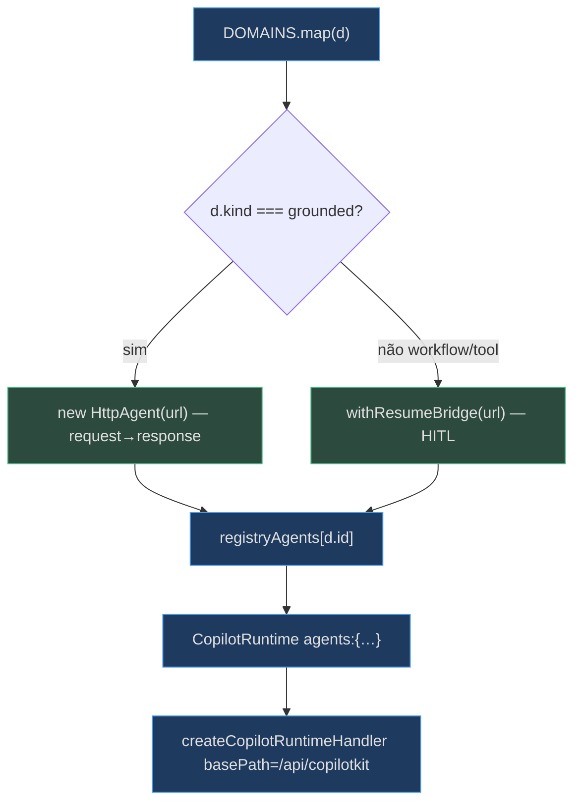
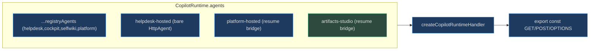

# O Registry de Domínios e o Runtime CopilotKit

## O registry — uma fonte de verdade

`lib/domains.ts` é o **single source of truth** dos domínios: dirige o mapa de agentes (route copilotkit), a nav da sidebar, a rota genérica `/d/[domain]`, os role-cards da landing e os prompts iniciais. **Adicionar domínio = uma entrada aqui (+ um agente no backend)** [apps/frontend/lib/domains.ts:1-8](apps/frontend/lib/domains.ts).

O tipo `Domain` codifica tudo que o console precisa saber: o `id` estável (casa com o agentId do backend + o segmento do endpoint AG-UI), o `kind`, o `endpoint`, os `suggested` prompts e o opcional `hostedAgentId` (que habilita o toggle Live/Hosted) [apps/frontend/lib/domains.ts:10-26](apps/frontend/lib/domains.ts).

| Campo | Significado | Fonte |
|---|---|---|
| `id` | Casa com o agentId do backend + path AG-UI | [lib/domains.ts:12](apps/frontend/lib/domains.ts) |
| `kind` | `workflow` \| `grounded` \| `tool` — decide a UI e o bridge | [lib/domains.ts:8](apps/frontend/lib/domains.ts) |
| `endpoint` | Path AG-UI do backend (default) | [lib/domains.ts:23](apps/frontend/lib/domains.ts) |
| `suggested` | Chips de prompt inicial | [lib/domains.ts:21](apps/frontend/lib/domains.ts) |
| `hostedAgentId` | Twin Foundry hosted → habilita o toggle | [lib/domains.ts:25](apps/frontend/lib/domains.ts) |

## Como um domínio vira um agente rodável

O route handler `app/api/copilotkit/[[...slug]]/route.ts` é a ponte browser→backend. Ele deriva **uma** base `BACKEND` (`BACKEND_URL` ou localhost) e monta um `HttpAgent` do `@ag-ui/client` por domínio, direto do registry — grounded viram `HttpAgent` simples (request→response), interrupt-bearing (workflow + tool) ganham o **resume bridge** [apps/frontend/app/api/copilotkit/[[...slug]]/route.ts:78-85](apps/frontend/app/api/copilotkit/[[...slug]]/route.ts).


<!-- Sources: apps/frontend/app/api/copilotkit/[[...slug]]/route.ts:71-107 -->

O `urlFor` resolve a URL por domínio com override por env `<ID>_AGUI_URL` (ex.: `COCKPIT_AGUI_URL`), caindo para `${BACKEND}${d.endpoint}`; `helpdesk` usa a `AGUI_URL` histórica [apps/frontend/app/api/copilotkit/[[...slug]]/route.ts:71-83](apps/frontend/app/api/copilotkit/[[...slug]]/route.ts).

## O resume bridge — o detalhe que faz o HITL funcionar

A runtime do CopilotKit valida `resume` como um **array** (a forma do cliente AG-UI: `[{ interruptId, status, payload }]`), mas o backend agent-framework espera um **dict** (`{ interrupts: [{ id, value }] }`). O `withResumeBridge` sobrescreve o `fetch` do `HttpAgent` para traduzir o body um instante antes de bater no backend [apps/frontend/app/api/copilotkit/[[...slug]]/route.ts:38-63](apps/frontend/app/api/copilotkit/[[...slug]]/route.ts).

<!-- Source: apps/frontend/app/api/copilotkit/[[...slug]]/route.ts:44-56 -->
```ts
if (Array.isArray(body.resume)) {
  body.resume = {
    interrupts: body.resume.map(
      (r: any) => ({ id: r.interruptId ?? r.id, value: r.payload ?? r.value }),
    ),
  };
}
```

Todo agente que carrega interrupt passa por aqui: os do registry (workflow/tool), o `platform-hosted` (write-approval sobre Invocations) e — **novo na v0.4.0** — o `artifacts-studio` (a confirmação de edição `require_confirmation`) [apps/frontend/app/api/copilotkit/[[...slug]]/route.ts:65-69](apps/frontend/app/api/copilotkit/[[...slug]]/route.ts).

## O agente bespoke `artifacts-studio`

Além dos agentes do registry, a runtime registra três agentes fixos: os twins hosted `helpdesk-hosted` e `platform-hosted`, e o **`artifacts-studio`** [apps/frontend/app/api/copilotkit/[[...slug]]/route.ts:93-102](apps/frontend/app/api/copilotkit/[[...slug]]/route.ts). O studio é um canvas bespoke (não um `/d/[domain]`), então **não está em `lib/domains.ts`**; sua URL vem de `ARTIFACTS_STUDIO_AGUI_URL` (default `${BACKEND}/artifacts-studio`) e ele é embrulhado no resume bridge porque carrega o interrupt de edição [apps/frontend/app/api/copilotkit/[[...slug]]/route.ts:33-36](apps/frontend/app/api/copilotkit/[[...slug]]/route.ts), [apps/frontend/app/api/copilotkit/[[...slug]]/route.ts:68-69](apps/frontend/app/api/copilotkit/[[...slug]]/route.ts).


<!-- Sources: apps/frontend/app/api/copilotkit/[[...slug]]/route.ts:93-111, apps/frontend/app/api/copilotkit/[[...slug]]/route.ts:33-36 -->

## Por que o handler multi-route

A runtime v2 (react-core/react-ui 1.61.x+) dirige runs sobre sub-paths (`POST /agent/:id/run`, `GET /info`, …). O `createCopilotRuntimeHandler` faz *multi-route* por default, servindo exatamente esses; o legado `copilotRuntimeNextJSAppRouterEndpoint` é single-route e 400-a o sub-path com *"Missing method field"*, resetando o chat silenciosamente [apps/frontend/app/api/copilotkit/[[...slug]]/route.ts:87-107](apps/frontend/app/api/copilotkit/[[...slug]]/route.ts). É por isso que a rota é um catch-all `[[...slug]]` e usa `basePath` para casar os segmentos [apps/frontend/app/api/copilotkit/[[...slug]]/route.ts:3-5](apps/frontend/app/api/copilotkit/[[...slug]]/route.ts).

## Related Pages

| Página | Relação |
|---|---|
| [Assurance Console e EvidencePanel](page-4.md) | Consome `domain.id`/`hostedAgentId` do registry |
| [Human-in-the-loop](page-5.md) | Usa o resume bridge para retomar o workflow |
| [HTML Artifacts UI e o Studio Canvas](page-6.md) | O agente `artifacts-studio` registrado aqui |
| [Execução Local, Demo e Deploy](page-9.md) | Os overrides `<ID>_AGUI_URL` / `BACKEND_URL` |
