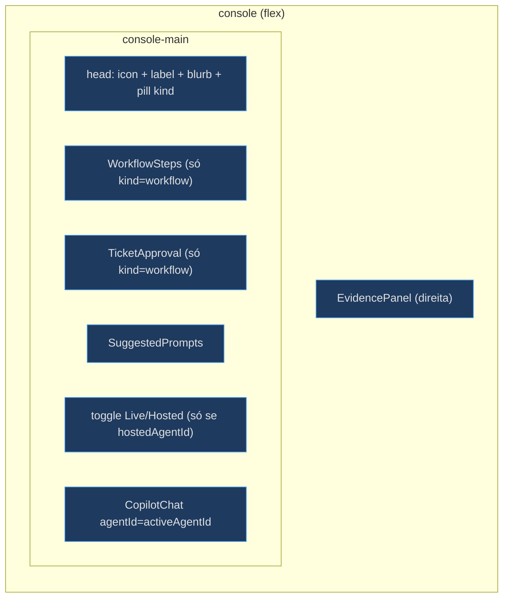
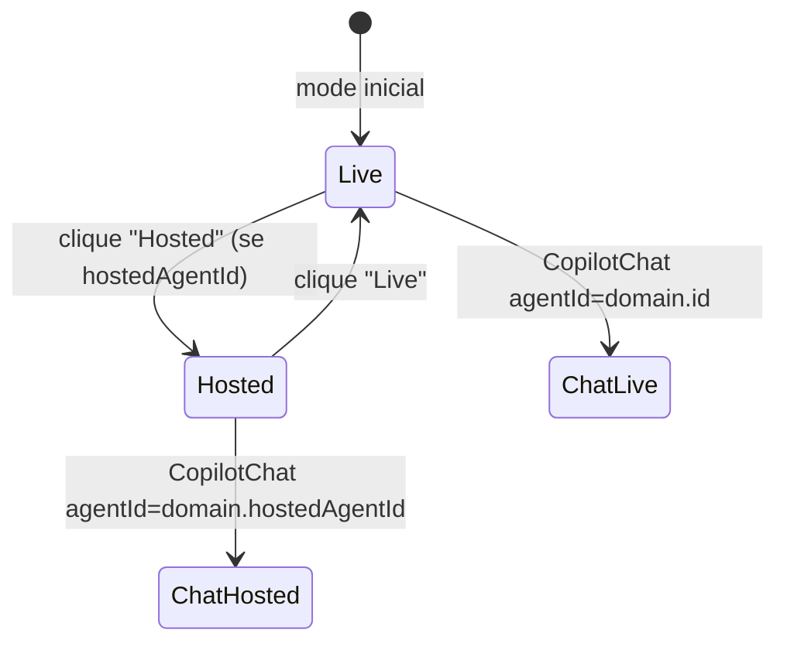
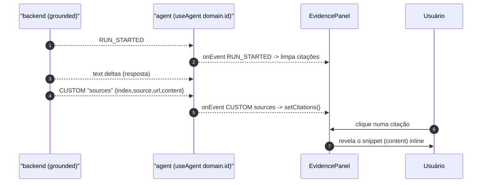

# Assurance Console, Toggle Live/Hosted e EvidencePanel

## Um único console para todo domínio

O `AssuranceConsole` é a superfície config-driven para **qualquer** agente de domínio — em vez de uma página de chat por domínio, um console que muda de comportamento conforme o `Domain` recebido. A sidebar do `AppShell` é o switcher; a rota `/d/[domain]` resolve o id contra `lib/domains.ts` dentro do console [apps/frontend/components/console/AssuranceConsole.tsx:3-13](apps/frontend/components/console/AssuranceConsole.tsx), [apps/frontend/components/console/AssuranceConsole.tsx:151-162](apps/frontend/components/console/AssuranceConsole.tsx).

<!-- Sources: apps/frontend/components/console/AssuranceConsole.tsx:40-98 -->

## Estrutura de duas colunas + UI condicional por `kind`

Dentro do shell (flush), o console tem duas panes: o chat (centro) e o `EvidencePanel` (direita) [apps/frontend/components/console/AssuranceConsole.tsx:46-98](apps/frontend/components/console/AssuranceConsole.tsx). A UI condicional por `kind` é direta: domínios `workflow` adicionalmente renderizam `<WorkflowSteps />` e `<TicketApproval />`; os demais não [apps/frontend/components/console/AssuranceConsole.tsx:61-66](apps/frontend/components/console/AssuranceConsole.tsx). O pill do cabeçalho mostra "workflow + HITL" ou "grounded Q&A" conforme o kind [apps/frontend/components/console/AssuranceConsole.tsx:56-58](apps/frontend/components/console/AssuranceConsole.tsx).

O chat também monta um `<MermaidZoom />` — um helper que intercepta diagramas Mermaid renderizados pelo streamdown do CopilotKit v2 e os torna clicáveis para zoom [apps/frontend/components/console/AssuranceConsole.tsx:91-94](apps/frontend/components/console/AssuranceConsole.tsx).

## O toggle Live/Hosted — registry-driven

O toggle só renderiza quando o domínio declara `hostedAgentId`, sob `{domain.hostedAgentId && (...)}` [apps/frontend/components/console/AssuranceConsole.tsx:70-89](apps/frontend/components/console/AssuranceConsole.tsx). Na prática, isso significa que **apenas `helpdesk` e `platform`** mostram o toggle (os únicos com `hostedAgentId`); cockpit e selfwiki rodam sempre live via OBO [apps/frontend/lib/domains.ts:60](apps/frontend/lib/domains.ts), [apps/frontend/lib/domains.ts:75](apps/frontend/lib/domains.ts).

O `activeAgentId` alterna entre `domain.id` (live) e `domain.hostedAgentId` (hosted) [apps/frontend/components/console/AssuranceConsole.tsx:36-38](apps/frontend/components/console/AssuranceConsole.tsx):

<!-- Sources: apps/frontend/components/console/AssuranceConsole.tsx:36-38, apps/frontend/components/console/AssuranceConsole.tsx:70-92 -->

A legenda alterna entre "AG-UI · live tool steps + write-approval" e "Foundry Agent Service · managed hosted agent"; o `<CopilotChat>` recebe `agentId={activeAgentId}` [apps/frontend/components/console/AssuranceConsole.tsx:83-92](apps/frontend/components/console/AssuranceConsole.tsx).

## Autenticação dentro do console

`AssuranceConsole` gateia em sign-in quando Entra está configurado, e encaminha o access token (o backend faz o OBO); senão renderiza direto (dev/demo) [apps/frontend/components/console/AssuranceConsole.tsx:151-161](apps/frontend/components/console/AssuranceConsole.tsx). O `AuthedConsole` adquire o token silenciosamente e o **renova a cada 4 min** para o chat OBO não 401-ar no meio da sessão [apps/frontend/components/console/AssuranceConsole.tsx:118-135](apps/frontend/components/console/AssuranceConsole.tsx). Domínio inexistente → "Domínio não encontrado" [apps/frontend/components/console/AssuranceConsole.tsx:152-159](apps/frontend/components/console/AssuranceConsole.tsx).

## EvidencePanel — citações estruturadas

O `EvidencePanel` é a primitiva on-thesis: *a citação é o objeto interessante, não o resumo — a confiança passa pelo link* [apps/frontend/components/console/EvidencePanel.tsx:3-6](apps/frontend/components/console/EvidencePanel.tsx). Ele lê **citações estruturadas** do stream AG-UI: o backend emite as anotações `url_citation` como um evento CUSTOM `sources` (`{index, source, url, content}`), e o painel se inscreve via `agent.subscribe` (mesmo padrão `onEvent`/CUSTOM do `TicketApproval`) [apps/frontend/components/console/EvidencePanel.tsx:8-13](apps/frontend/components/console/EvidencePanel.tsx), [apps/frontend/components/console/EvidencePanel.tsx:88-108](apps/frontend/components/console/EvidencePanel.tsx).

| Campo do `sources` | Significado | Fonte |
|---|---|---|
| `index` | número da citação | [EvidencePanel.tsx:20-21](apps/frontend/components/console/EvidencePanel.tsx) |
| `source` | nome do documento | [EvidencePanel.tsx:22](apps/frontend/components/console/EvidencePanel.tsx) |
| `url` | blob privado (não abre direto) | [EvidencePanel.tsx:23](apps/frontend/components/console/EvidencePanel.tsx) |
| `content` | snippet recuperado, mostrado inline no clique | [EvidencePanel.tsx:24](apps/frontend/components/console/EvidencePanel.tsx) |

<!-- Sources: apps/frontend/components/console/EvidencePanel.tsx:88-108, apps/frontend/components/console/EvidencePanel.tsx:117-150 -->

### Fallback e garantias fixas

Quando **nenhuma** citação estruturada chega (caminhos hosted/antigos), o painel cai para a heurística que deriva fontes do texto via duas regex (caminhos de arquivo + identificadores `cockpit-*`/`foundry-helpdesk-*`); as estruturadas têm precedência (`count = citations.length || textSources.length`) [apps/frontend/components/console/EvidencePanel.tsx:35-51](apps/frontend/components/console/EvidencePanel.tsx), [apps/frontend/components/console/EvidencePanel.tsx:110](apps/frontend/components/console/EvidencePanel.tsx). Abaixo das fontes, as três **garantias** (Fidelidade, Acesso, Avaliação) são sempre exibidas [apps/frontend/components/console/EvidencePanel.tsx:53-69](apps/frontend/components/console/EvidencePanel.tsx).

## SuggestedPrompts — antídoto ao "blank box"

Os chips de prompt inicial vêm de `domain.suggested` e são renderizados pelo `SuggestedPrompts` (montado no console) [apps/frontend/components/console/AssuranceConsole.tsx:68](apps/frontend/components/console/AssuranceConsole.tsx). O mesmo mecanismo `addMessage + runAgent` é o que o Studio reusa para o botão Regenerate (ver [Artifacts UI](page-6.md)).

## Related Pages

| Página | Relação |
|---|---|
| [Registry e Runtime](page-3.md) | De onde vêm `domain.id` e `domain.hostedAgentId` |
| [Human-in-the-loop](page-5.md) | `WorkflowSteps` e `TicketApproval` renderizados aqui |
| [HTML Artifacts UI e o Studio Canvas](page-6.md) | O mesmo padrão `agent.subscribe` do EvidencePanel |
| [Visão Geral](page-1.md) | As três garantias do EvidencePanel |
