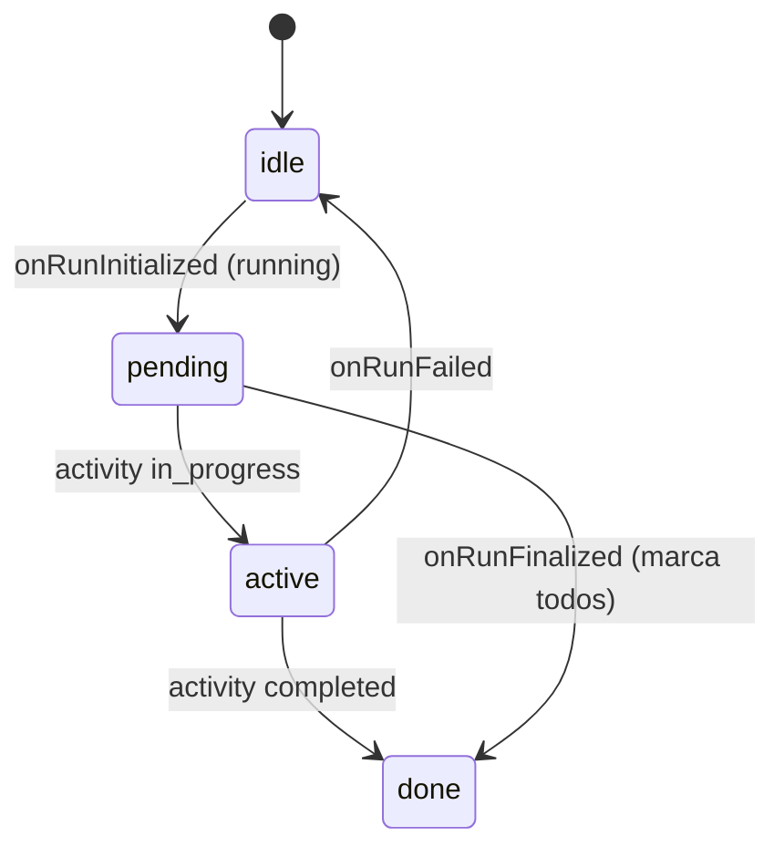
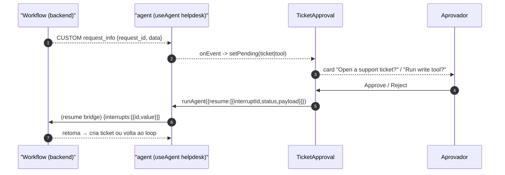

# Human-in-the-loop — WorkflowSteps e TicketApproval

Dois componentes montados só para domínios `kind=workflow` fazem o HITL do frontend: `WorkflowSteps` (progresso ao vivo) e `TicketApproval` (o card de aprovação). Ambos assinam o mesmo event stream do agente `helpdesk` [apps/frontend/components/console/AssuranceConsole.tsx:61-66](apps/frontend/components/console/AssuranceConsole.tsx).

## Por que tapar o event stream diretamente

O `useInterrupt` do CopilotKit não captura o interrupt do workflow agent-framework: o adapter emite `RUN_FINISHED` com um campo `interrupt` singular + um evento CUSTOM `request_info`, e a detecção de interrupt do v2 não casa com isso. Então os dois componentes assinam `agent.subscribe(...)` (o mesmo `subscribe` que o EvidencePanel usa) e dirigem a aprovação por conta própria [apps/frontend/components/chat/TicketApproval.tsx:3-21](apps/frontend/components/chat/TicketApproval.tsx).

## WorkflowSteps — progresso ao vivo

`WorkflowSteps` usa `useAgent({ agentId: "helpdesk" })` e assina o stream: `onRunInitialized` limpa o estado e marca running, `onActivitySnapshotEvent` atualiza o status por executor (`executor_id` → `status`), e `onRunFinalized` vira todo passo pra done — corrigindo o passo terminal "resolve" que fica azul (sua conclusão sai como a resposta streamada, não como uma activity completed limpa) [apps/frontend/components/chat/WorkflowSteps.tsx:33-60](apps/frontend/components/chat/WorkflowSteps.tsx).

Os três passos fixos são `triage → retrieve → resolve` [apps/frontend/components/chat/WorkflowSteps.tsx:18-22](apps/frontend/components/chat/WorkflowSteps.tsx). O mapeamento status→estado visual: `completed`→done (✓ verde), `in_progress`→active (azul), senão pending/idle [apps/frontend/components/chat/WorkflowSteps.tsx:64-69](apps/frontend/components/chat/WorkflowSteps.tsx).

<!-- Sources: apps/frontend/components/chat/WorkflowSteps.tsx:38-69 -->

## TicketApproval — o card de aprovação

`TicketApproval` assina o mesmo stream e captura o evento CUSTOM `request_info` → `{ request_id, data }`. Ele **discrimina por forma do payload**: se o `data` carrega um nome de tool (`tool_name`/`name`/…), é a native MCP write-tool approval do platform (`kind: "tool"`); senão é o `create_ticket` do helpdesk (`kind: "ticket"`, com `summary`) [apps/frontend/components/chat/TicketApproval.tsx:59-90](apps/frontend/components/chat/TicketApproval.tsx).

| Forma | Origem | Payload | Fonte |
|---|---|---|---|
| `ticket` | Helpdesk `create_ticket` HITL | `{ data: { summary } }` | [TicketApproval.tsx:82-84](apps/frontend/components/chat/TicketApproval.tsx) |
| `tool` | Platform native MCP write-tool | tool name + args | [TicketApproval.tsx:75-81](apps/frontend/components/chat/TicketApproval.tsx) |

Ao aprovar/rejeitar, o componente retoma o workflow pausado com `agent.runAgent({ resume: [{ interruptId, status: "resolved", payload: approved }] })` — a **forma array** que o runtime valida; o route handler reescreve para a forma dict do backend antes de encaminhar (o resume bridge, ver [Registry e Runtime](page-3.md)) [apps/frontend/components/chat/TicketApproval.tsx:94-108](apps/frontend/components/chat/TicketApproval.tsx).

<!-- Sources: apps/frontend/components/chat/TicketApproval.tsx:59-108, apps/frontend/app/api/copilotkit/[[...slug]]/route.ts:44-56 -->

## Regra inegociável reforçada no frontend

A tool `create_ticket` só dispara após aprovação humana explícita — e a UI nunca dispara a tool sozinha: ela só **retoma** um workflow que o backend já pausou. O card só aparece se um `request_info` com `request_id` chegar; sem id, o evento é descartado [apps/frontend/components/chat/TicketApproval.tsx:64-68](apps/frontend/components/chat/TicketApproval.tsx). O botão Reject retoma com `payload: false`, devolvendo ao loop [apps/frontend/components/chat/TicketApproval.tsx:134-140](apps/frontend/components/chat/TicketApproval.tsx).

> **Paralelo com o Studio (v0.4.0):** o Artifacts Studio reusa exatamente este padrão de tap (`onEvent` + `runAgent({resume})`) para a aprovação de edição do artifact — mas com um payload não-booleano (`{ accepted, steps }`). Ver [HTML Artifacts UI e o Studio Canvas](page-6.md).

## Related Pages

| Página | Relação |
|---|---|
| [Assurance Console e EvidencePanel](page-4.md) | Onde `WorkflowSteps`/`TicketApproval` são montados |
| [Registry e Runtime](page-3.md) | O resume bridge que traduz o `resume` |
| [HTML Artifacts UI e o Studio Canvas](page-6.md) | O mesmo padrão de aprovação, para edições de artifact |
