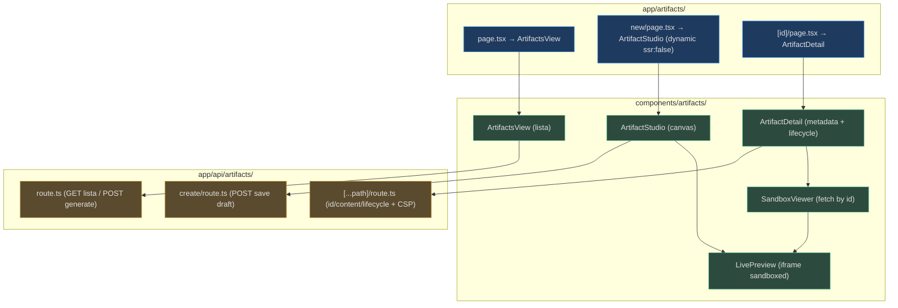
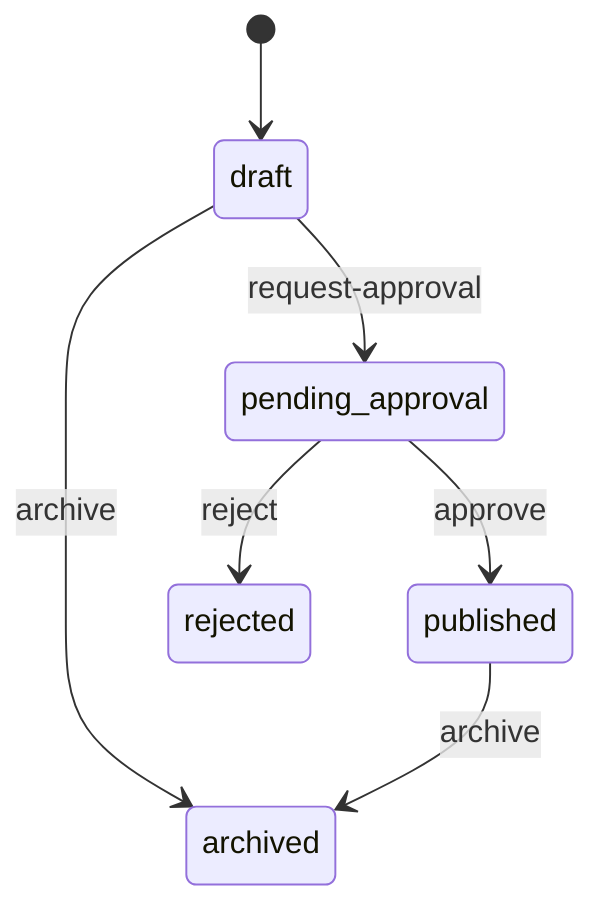
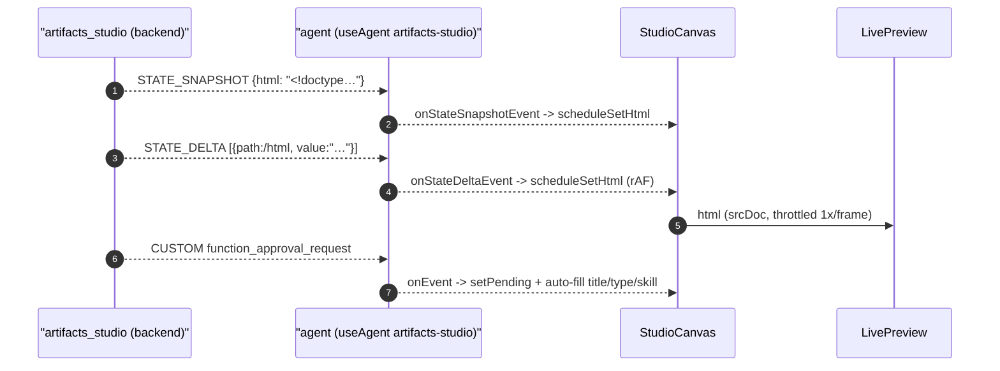
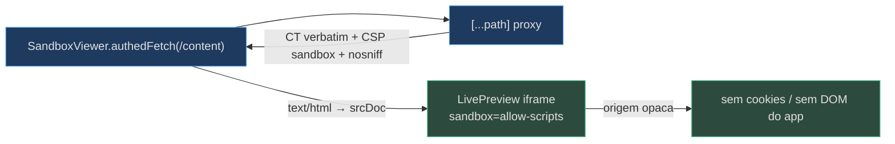

# HTML Artifacts UI e o Studio Canvas

Esta é a superfície **nova da v0.4.0**: HTML gerado por IA (relatórios, apresentações, walkthroughs) renderizado num iframe sandboxed, versionado e atrás de um lifecycle aprovar-para-publicar, mais o **Studio** — um canvas conversacional com preview ao vivo. Cinco componentes em `components/artifacts/` + três páginas em `app/artifacts/` + três proxies em `app/api/artifacts/`.

## O mapa da feature


<!-- Sources: apps/frontend/app/artifacts/page.tsx:1-10, apps/frontend/app/artifacts/new/page.tsx:1-19, apps/frontend/components/artifacts/ArtifactStudio.tsx:38-44 -->

## LivePreview — a primitiva de segurança

`LivePreview` é o iframe reutilizável, compartilhado pelo `SandboxViewer` (detalhe) e pelo `StudioCanvas` (stream ao vivo). O **invariante de segurança**: `sandbox="allow-scripts"` **sem** `allow-same-origin`, dando ao conteúdo uma origem opaca — ele não lê cookies, sessionStorage, DOM nem chama APIs same-origin do app. O comentário no arquivo é explícito: **não** adicionar `allow-same-origin` (combinado com `allow-scripts` derrota o sandbox) [apps/frontend/components/artifacts/LivePreview.tsx:3-18](apps/frontend/components/artifacts/LivePreview.tsx).

O HTML entra via `srcDoc` — o iframe nunca faz uma request autenticada por conta própria; o HTML é buscado por fora com o bearer token e injetado [apps/frontend/components/artifacts/SandboxViewer.tsx:3-6](apps/frontend/components/artifacts/SandboxViewer.tsx).

## ArtifactsView — a lista

`ArtifactsView` busca `/api/artifacts` (`no-store`), lista título/tipo/skill/status/updated e oferece "＋ New artifact" (link para `/artifacts/new`) + Refresh [apps/frontend/components/artifacts/ArtifactsView.tsx:29-68](apps/frontend/components/artifacts/ArtifactsView.tsx). O status vira um pill colorido via o mapa `STATUS` (`draft`/`pending_approval`→neutral, `published`→ok, `rejected`→bad) [apps/frontend/components/artifacts/ArtifactsView.tsx:21-27](apps/frontend/components/artifacts/ArtifactsView.tsx), [apps/frontend/components/artifacts/ArtifactsView.tsx:95-108](apps/frontend/components/artifacts/ArtifactsView.tsx).

## ArtifactDetail — lifecycle governado

`ArtifactDetail` mostra metadata (status, versão, `contentHash` truncado, skill) + as ações de lifecycle e o `SandboxViewer` [apps/frontend/components/artifacts/ArtifactDetail.tsx:78-124](apps/frontend/components/artifacts/ArtifactDetail.tsx). Cada ação chama o proxy `POST /api/artifacts/{id}/{action}` e recarrega — o backend é o **ponto de enforcement real** (`require_role`), então uma ação não autorizada aparece como erro de load aqui, não escondida client-side [apps/frontend/components/artifacts/ArtifactDetail.tsx:3-7](apps/frontend/components/artifacts/ArtifactDetail.tsx), [apps/frontend/components/artifacts/ArtifactDetail.tsx:57-72](apps/frontend/components/artifacts/ArtifactDetail.tsx).


<!-- Sources: apps/frontend/components/artifacts/ArtifactDetail.tsx:99-120 -->

As ações disponíveis dependem do status atual [apps/frontend/components/artifacts/ArtifactDetail.tsx:100-119](apps/frontend/components/artifacts/ArtifactDetail.tsx):

| Status | Ações | Fonte |
|---|---|---|
| `draft` | Request approval · Archive | [ArtifactDetail.tsx:100-102](apps/frontend/components/artifacts/ArtifactDetail.tsx) |
| `pending_approval` | Approve & publish · Reject | [ArtifactDetail.tsx:105-114](apps/frontend/components/artifacts/ArtifactDetail.tsx) |
| `published` | Archive | [ArtifactDetail.tsx:115-119](apps/frontend/components/artifacts/ArtifactDetail.tsx) |

## O ArtifactStudio — o canvas conversacional

O `ArtifactStudio` é o coração da feature: chat à esquerda, preview HTML sandboxed ao vivo à direita. Ele espelha o padrão **v2 REAL** deste repo (NÃO os hooks v1 `useCoAgent`/`useCopilotAction`, que não são exportados de `/v2`): `CopilotKitProvider` + token via `acquireTokenSilent`, `useAgent({agentId})` + `agent.subscribe`, e o tap de interrupt via `agent.runAgent({resume})` [apps/frontend/components/artifacts/ArtifactStudio.tsx:3-9](apps/frontend/components/artifacts/ArtifactStudio.tsx), [apps/frontend/components/artifacts/ArtifactStudio.tsx:96-97](apps/frontend/components/artifacts/ArtifactStudio.tsx).

A página `/artifacts/new` importa o Studio com `dynamic(..., { ssr: false })` — MSAL + CopilotKit v2 não rodam em SSR, mesma razão do `AssuranceConsole` [apps/frontend/app/artifacts/new/page.tsx:3-11](apps/frontend/app/artifacts/new/page.tsx).

### Streaming HTML preditivo ao vivo

O estado do backend é um **campo string FLAT** `html` (não aninhado). O `predict_state_config` do agente mapeia esse `html` para o argumento `html` da tool `update_artifact`. O Studio consome dois eventos [apps/frontend/components/artifacts/ArtifactStudio.tsx:10-17](apps/frontend/components/artifacts/ArtifactStudio.tsx):

- **STATE_SNAPSHOT** → `event.snapshot.html` é o documento completo [apps/frontend/components/artifacts/ArtifactStudio.tsx:57-61](apps/frontend/components/artifacts/ArtifactStudio.tsx).
- **STATE_DELTA** → `event.delta` é um array JSON-Patch; como o argumento é uma string flat, a única op que aparece tem `path: "/html"` com um valor string — tomamos esse valor como a nova string completa (sem precisar de um engine JSON-Patch genérico) [apps/frontend/components/artifacts/ArtifactStudio.tsx:63-74](apps/frontend/components/artifacts/ArtifactStudio.tsx).

O `setHtml` é **throttled com `requestAnimationFrame`** para não re-renderizar a cada token streamado: `scheduleSetHtml` guarda o valor mais recente num ref e agenda um único flush por frame [apps/frontend/components/artifacts/ArtifactStudio.tsx:116-127](apps/frontend/components/artifacts/ArtifactStudio.tsx).


<!-- Sources: apps/frontend/components/artifacts/ArtifactStudio.tsx:129-182, apps/frontend/components/artifacts/LivePreview.tsx:10-18 -->

### O card de aprovação de edição in-loop

`update_artifact` roda com `require_confirmation=True` (`approval_mode="always_require"`), então um evento CUSTOM `function_approval_request` dispara em **toda** turn. O `onEvent` do Studio o captura (e defensivamente também o `request_info` que o `TicketApproval` tapa) e resolve o id via `v.id ?? v.request_id ?? fc.call_id` [apps/frontend/components/artifacts/ArtifactStudio.tsx:142-159](apps/frontend/components/artifacts/ArtifactStudio.tsx). A resolução usa o **mesmo `runAgent({resume})`** do TicketApproval, mas o payload **não é um booleano**: o backend parseia um corpo `{ accepted, steps }` [apps/frontend/components/artifacts/ArtifactStudio.tsx:191-214](apps/frontend/components/artifacts/ArtifactStudio.tsx).

<!-- Source: apps/frontend/components/artifacts/ArtifactStudio.tsx:197-210 -->
```ts
await agent.runAgent({
  resume: [{
    interruptId: id,
    status: approved ? "resolved" : "cancelled",
    payload: { accepted: approved, steps: [] },
  }],
});
```

### Title/Type/Skill auto-preenchidos (option c)

Detalhe fino: uma chave de `state_schema` **sem** entrada no `predict_state_config` fica `{}` — nunca é auto-populada. Então `title`/`type`/`skill` **não** vêm do agent state (só `html` vem, via SNAPSHOT/DELTA). Eles chegam já parseados no **mesmo evento `function_approval_request`**, em `value.function_call.arguments = { html, title, type, skill }`. O `onEvent` os lê dali, defendendo contra `arguments` entregue como string JSON crua [apps/frontend/components/artifacts/ArtifactStudio.tsx:29-36](apps/frontend/components/artifacts/ArtifactStudio.tsx), [apps/frontend/components/artifacts/ArtifactStudio.tsx:161-177](apps/frontend/components/artifacts/ArtifactStudio.tsx).

O **Type select manual sumiu** (o agente produz o type dentro de `update_artifact`); o Type vira um display read-only "(set by the agent)" [apps/frontend/components/artifacts/ArtifactStudio.tsx:46-50](apps/frontend/components/artifacts/ArtifactStudio.tsx), [apps/frontend/components/artifacts/ArtifactStudio.tsx:319-324](apps/frontend/components/artifacts/ArtifactStudio.tsx). Um ref `userEditedTitle` impede que turns do agente sobrescrevam um título editado à mão (já que a aprovação dispara em toda turn); um Regenerate explícito limpa o guard [apps/frontend/components/artifacts/ArtifactStudio.tsx:110-114](apps/frontend/components/artifacts/ArtifactStudio.tsx), [apps/frontend/components/artifacts/ArtifactStudio.tsx:172](apps/frontend/components/artifacts/ArtifactStudio.tsx).

### O skill selector + Regenerate

O seletor de **skill** (`auto`/`slides`/`report`/`dashboard`/`walkthrough`) + o botão Regenerate pinam um skill e re-geram: o `regenerate` envia uma turn de chat dizendo qual skill usar, via o **mesmo `addMessage + runAgent`** que o `SuggestedPrompts` usa — não uma API chutada — e é desabilitado enquanto um run/approval está em voo, para não correr contra o card pendente [apps/frontend/components/artifacts/ArtifactStudio.tsx:50](apps/frontend/components/artifacts/ArtifactStudio.tsx), [apps/frontend/components/artifacts/ArtifactStudio.tsx:244-270](apps/frontend/components/artifacts/ArtifactStudio.tsx). O skill efetivamente usado (`usedSkill`, lido dos args da aprovação) é mostrado como "Generated with: …" [apps/frontend/components/artifacts/ArtifactStudio.tsx:355-359](apps/frontend/components/artifacts/ArtifactStudio.tsx).

### Save as draft

O "Save as draft" só habilita com title válido (1–200 chars), type e html presentes; ele POSTa `/api/artifacts/create` com `{ title, type, html, skill }` e navega para `/artifacts/{id}` [apps/frontend/components/artifacts/ArtifactStudio.tsx:216-242](apps/frontend/components/artifacts/ArtifactStudio.tsx), [apps/frontend/components/artifacts/ArtifactStudio.tsx:272-273](apps/frontend/components/artifacts/ArtifactStudio.tsx).

## Os três proxies de artifacts

| Proxy | Método → Backend | Detalhe | Fonte |
|---|---|---|---|
| `/api/artifacts` | GET `→/artifacts/html`, POST `→/generate` | Lista + one-shot generate | [api/artifacts/route.ts:9-45](apps/frontend/app/api/artifacts/route.ts) |
| `/api/artifacts/create` | POST `→/artifacts/html` | Save-from-html do Studio | [api/artifacts/create/route.ts:10-26](apps/frontend/app/api/artifacts/create/route.ts) |
| `/api/artifacts/[...path]` | GET/POST `→/artifacts/html/{path}` | id, content, lifecycle | [api/artifacts/[...path]/route.ts:14-51](apps/frontend/app/api/artifacts/[...path]/route.ts) |

O catch-all `[...path]` é o **único proxy do app** que passa o `Content-Type` de upstream verbatim (em vez de forçar `application/json`): `/{id}/content` retorna `text/html` com um header `Content-Security-Policy: sandbox` do backend, e isso precisa chegar ao browser intacto para o `SandboxViewer` injetar como `srcDoc`. Os headers de defesa-em-profundidade (CSP sandbox + `X-Content-Type-Options: nosniff`) são explicitamente repassados — nunca todo `r.headers` (isso vazaria hop-by-hop headers como content-encoding/length que não batem mais com o body re-emitido) [apps/frontend/app/api/artifacts/[...path]/route.ts:5-8](apps/frontend/app/api/artifacts/[...path]/route.ts), [apps/frontend/app/api/artifacts/[...path]/route.ts:24-35](apps/frontend/app/api/artifacts/[...path]/route.ts).


<!-- Sources: apps/frontend/app/api/artifacts/[...path]/route.ts:24-35, apps/frontend/components/artifacts/SandboxViewer.tsx:16-38, apps/frontend/components/artifacts/LivePreview.tsx:10-18 -->

## Registro na runtime

O agente `artifacts-studio` é registrado no route handler do CopilotKit com o resume bridge (a confirmação de edição é um interrupt), a partir de `ARTIFACTS_STUDIO_AGUI_URL` (default `${BACKEND}/artifacts-studio`) [apps/frontend/app/api/copilotkit/[[...slug]]/route.ts:33-36](apps/frontend/app/api/copilotkit/[[...slug]]/route.ts), [apps/frontend/app/api/copilotkit/[[...slug]]/route.ts:68-100](apps/frontend/app/api/copilotkit/[[...slug]]/route.ts). Ele também aparece na nav de workspace como "Artifacts" (`📦`) [apps/frontend/components/shell/AppShell.tsx:19-24](apps/frontend/components/shell/AppShell.tsx).

## Related Pages

| Página | Relação |
|---|---|
| [Human-in-the-loop](page-5.md) | O padrão `runAgent({resume})` que o Studio reusa |
| [Registry e Runtime](page-3.md) | O registro do agente `artifacts-studio` |
| [Autenticação Entra e Proxies](page-8.md) | O padrão geral de proxy + o passthrough de CSP |
| [Assurance Console e EvidencePanel](page-4.md) | O mesmo `agent.subscribe` e `addMessage+runAgent` |
