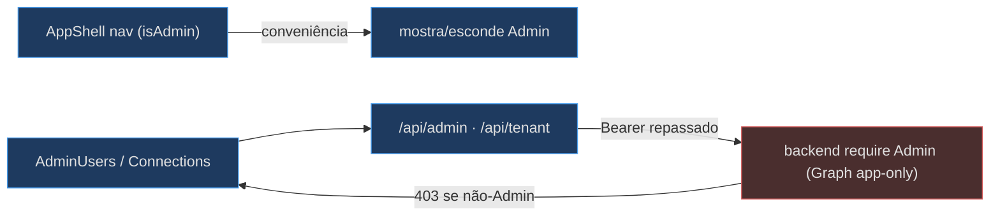
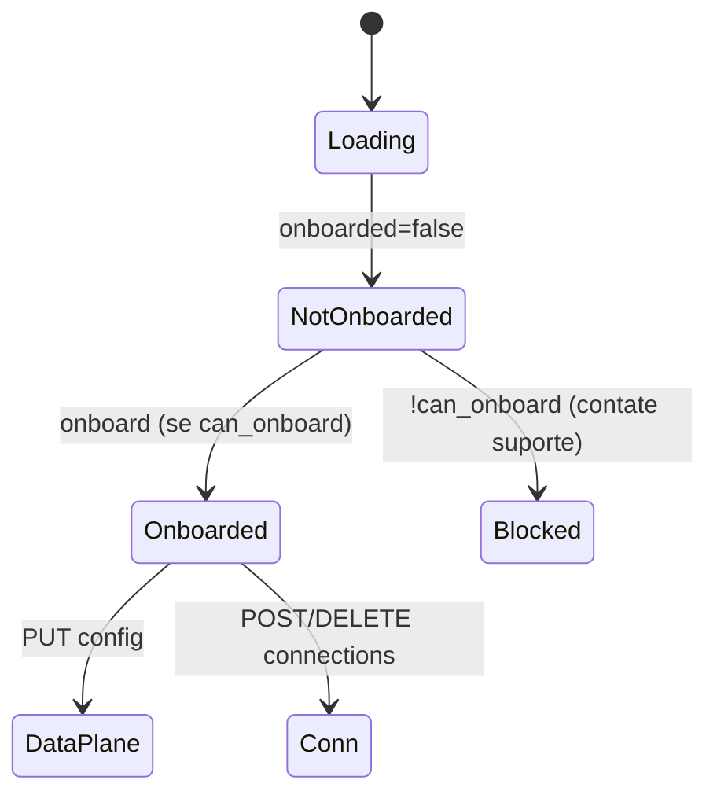

# Admin e Multi-tenancy — Users e Connections

Duas páginas bespoke, Admin-gated, expõem a governança multi-tenant do SaaS: `AdminUsers` (`/admin/users`) e `Connections` (`/admin/connections`). Ambas são camadas de conveniência — cada chamada é **re-gated server-side pelo papel Admin**; a UI só aparece na nav para Admins [apps/frontend/components/shell/AppShell.tsx:110-112](apps/frontend/components/shell/AppShell.tsx).

## O gate de UI (conveniência) vs o gate real (backend)

O `useMyRoles` busca `/api/me` (o claim `roles` vive no access token, não no id token do SPA) e o `isAdmin` decide se a nav mostra Admin/Connections [apps/frontend/lib/auth/roles.ts:10-25](apps/frontend/lib/auth/roles.ts). Mas o gate real é server-side: os proxies `/api/admin/*` e `/api/tenant/*` só encaminham o bearer token; o backend (que tem as creds app-only do Graph) decide [apps/frontend/app/api/admin/[...path]/route.ts:1-3](apps/frontend/app/api/admin/[...path]/route.ts).

<!-- Sources: apps/frontend/lib/auth/roles.ts:10-25, apps/frontend/components/shell/AppShell.tsx:110-112, apps/frontend/app/api/admin/[...path]/route.ts:9-33 -->

## AdminUsers — usuários + app-roles via Graph

`AdminUsers` faz o ciclo de vida (invite/create/remove) + atribuição de app-role, tudo via `/api/admin/*` [apps/frontend/components/admin/AdminUsers.tsx:3-5](apps/frontend/components/admin/AdminUsers.tsx). No load, carrega em paralelo `users`, `role-assignments` e `roles` (os app-roles que o app declara) [apps/frontend/components/admin/AdminUsers.tsx:40-54](apps/frontend/components/admin/AdminUsers.tsx). O helper `call` desembrulha erros do backend (`detail`/`error`) para uma mensagem legível [apps/frontend/components/admin/AdminUsers.tsx:25-30](apps/frontend/components/admin/AdminUsers.tsx).

| Ação | Chamada | Fonte |
|---|---|---|
| Atribuir role | `POST role-assignments {principal_id, role}` | [AdminUsers.tsx:126-129](apps/frontend/components/admin/AdminUsers.tsx) |
| Revogar role | `DELETE role-assignments/{id}` | [AdminUsers.tsx:110-114](apps/frontend/components/admin/AdminUsers.tsx) |
| Convidar guest | `POST users/invite {email}` | [AdminUsers.tsx:167-170](apps/frontend/components/admin/AdminUsers.tsx) |
| Criar membro | `POST users {display_name, upn, password}` | [AdminUsers.tsx:180-183](apps/frontend/components/admin/AdminUsers.tsx) |
| Remover usuário | `DELETE users/{id}` | [AdminUsers.tsx:150-154](apps/frontend/components/admin/AdminUsers.tsx) |

Os app-roles são propriedade do app; a empresa mapeia seus grupos sobre eles — o subtítulo lista os roles carregados dinamicamente [apps/frontend/components/admin/AdminUsers.tsx:86-91](apps/frontend/components/admin/AdminUsers.tsx).

## Connections — onboarding de tenant + data-plane

`Connections` faz onboarding do tenant, configura o data-plane e cadastra as connections de origem, via `/api/tenant/*` [apps/frontend/components/admin/Connections.tsx:3-6](apps/frontend/components/admin/Connections.tsx). Regra de ouro reforçada na UI: **nenhum segredo é digitado aqui** — a connection referencia uma Foundry connection ou um segredo de Key Vault por id/ref, nunca o valor [apps/frontend/components/admin/Connections.tsx:5-6](apps/frontend/components/admin/Connections.tsx), [apps/frontend/components/admin/Connections.tsx:304-307](apps/frontend/components/admin/Connections.tsx).

O fluxo é um state machine simples dirigido pela resposta `/tenant` (`onboarded`, `can_onboard`, `record`) [apps/frontend/components/admin/Connections.tsx:39-43](apps/frontend/components/admin/Connections.tsx), [apps/frontend/components/admin/Connections.tsx:75-88](apps/frontend/components/admin/Connections.tsx):

<!-- Sources: apps/frontend/components/admin/Connections.tsx:138-159, apps/frontend/components/admin/Connections.tsx:162-198 -->

### O modelo de connection

Uma `Connection` tem `kind` (`github`/`azdo`/`azure`/`entra`/`learn`/`m365`), `label`, uma referência (`foundry_connection_id` **ou** `keyvault_ref`) e os papéis mínimos de read/write (`min_role_read`/`min_role_write` sobre `Reader`/`Author`/`Approver`/`Admin`) [apps/frontend/components/admin/Connections.tsx:11-30](apps/frontend/components/admin/Connections.tsx). O form add/edit envia esses campos (com a referência opcional) via `POST connections` [apps/frontend/components/admin/Connections.tsx:288-302](apps/frontend/components/admin/Connections.tsx).

O data-plane form edita o endpoint/modelo Foundry + o endpoint/KB do Azure Search, salvos via `PUT config` [apps/frontend/components/admin/Connections.tsx:162-197](apps/frontend/components/admin/Connections.tsx).

## O proxy de tenant

O `/api/tenant/[...path]` é um catch-all que suporta GET/POST/PUT/DELETE, repassando o bearer e preservando a query string [apps/frontend/app/api/tenant/[...path]/route.ts:9-19](apps/frontend/app/api/tenant/[...path]/route.ts), [apps/frontend/app/api/tenant/[...path]/route.ts:35-47](apps/frontend/app/api/tenant/[...path]/route.ts). O `/api/admin/[...path]` é o gêmeo para o Graph, com GET/POST/DELETE [apps/frontend/app/api/admin/[...path]/route.ts:35-44](apps/frontend/app/api/admin/[...path]/route.ts).

## Related Pages

| Página | Relação |
|---|---|
| [Autenticação Entra e Proxies](page-8.md) | O `/api/me` que alimenta `useMyRoles` |
| [Registry e Runtime](page-3.md) | O mesmo padrão de proxy catch-all |
| [Visão Geral](page-1.md) | O panorama multi-tenant do SaaS |
