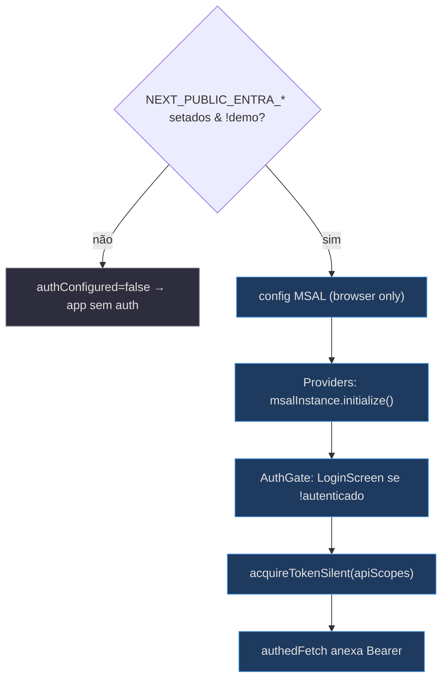
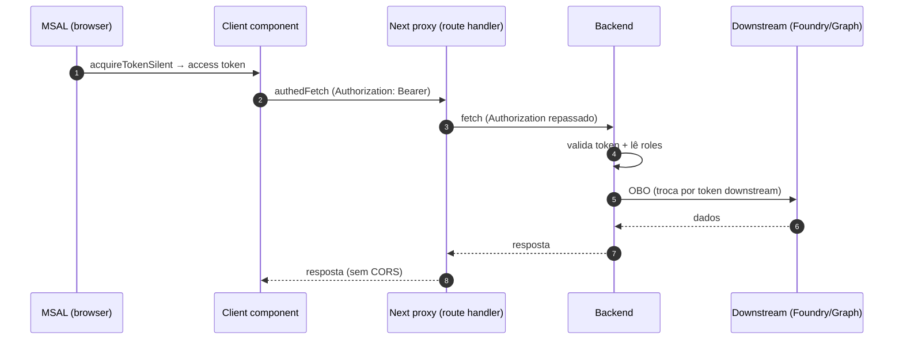

# Autenticação Entra (MSAL) e os Proxies de API

## MSAL — opt-in por env

A config MSAL lê três vars `NEXT_PUBLIC_ENTRA_*`; quando ausentes, o app roda **sem auth** (espelhando o fallback `DefaultAzureCredential` do backend) [apps/frontend/lib/auth/msal.ts:2-4](apps/frontend/lib/auth/msal.ts). O `authConfigured` é o interruptor mestre: `!demoMode && Boolean(tenantId && spaClientId && apiClientId)` — demo mode é sempre no-auth [apps/frontend/lib/auth/msal.ts:14-15](apps/frontend/lib/auth/msal.ts). O escopo consentido é `api://<apiClientId>/access_as_user` (o OBO é feito server-side) [apps/frontend/lib/auth/msal.ts:17-18](apps/frontend/lib/auth/msal.ts).

O `PublicClientApplication` é construído **só no browser** (toca `window`/`crypto`); no servidor fica `null` por design e o `<Providers>` renderiza um loader até o cliente inicializar o MSAL [apps/frontend/lib/auth/msal.ts:34-38](apps/frontend/lib/auth/msal.ts), [apps/frontend/components/shell/Providers.tsx:47-50](apps/frontend/components/shell/Providers.tsx).

<!-- Sources: apps/frontend/lib/auth/msal.ts:9-38, apps/frontend/components/shell/Providers.tsx:36-56 -->

## authedFetch e a renovação de token

O `authedFetch` é o wrapper de fetch que anexa o access token quando auth está configurado, usando o singleton `msalInstance` diretamente (sem hook React), então funciona de qualquer client component fora da árvore de provider. Sem token silencioso (expirado/interação requerida), ele manda unauthenticated e deixa o caller lidar com o 401 — sem forçar redirect ali [apps/frontend/lib/auth/api.ts:3-26](apps/frontend/lib/auth/api.ts).

Os componentes com chat OBO de longa duração (`AssuranceConsole`, `ArtifactStudio`, `HelpdeskApp`) renovam o token **a cada 4 min** via `setInterval`, bem antes da expiração de ~1h, para o chat OBO não 401-ar no meio da sessão [apps/frontend/components/console/AssuranceConsole.tsx:128-135](apps/frontend/components/console/AssuranceConsole.tsx), [apps/frontend/components/artifacts/ArtifactStudio.tsx:426-443](apps/frontend/components/artifacts/ArtifactStudio.tsx).

## O fluxo OBO end-to-end

<!-- Sources: apps/frontend/lib/auth/api.ts:11-26, apps/frontend/app/api/me/route.ts:8-19, apps/frontend/components/console/AssuranceConsole.tsx:41-45 -->

## O padrão uniforme de proxy

Todo proxy segue a mesma forma: `export const dynamic = "force-dynamic"`, base `BACKEND = process.env.BACKEND_URL ?? "http://localhost:8000"`, repasse do header `Authorization`, e um fallback 502 "backend unreachable" [apps/frontend/app/api/me/route.ts:5-18](apps/frontend/app/api/me/route.ts), [apps/frontend/app/api/health/route.ts:5-16](apps/frontend/app/api/health/route.ts).

| Proxy | Métodos | Content-Type de resposta | Fonte |
|---|---|---|---|
| `/api/me` | GET | JSON | [api/me/route.ts:8-19](apps/frontend/app/api/me/route.ts) |
| `/api/health` | GET → `/healthz` | JSON `{ok}` | [api/health/route.ts:9-16](apps/frontend/app/api/health/route.ts) |
| `/api/copilotkit/*` | GET/POST/OPTIONS | SSE (multi-route handler) | [api/copilotkit/[[...slug]]/route.ts:104-111](apps/frontend/app/api/copilotkit/[[...slug]]/route.ts) |
| `/api/admin/*` | GET/POST/DELETE | JSON | [api/admin/[...path]/route.ts:36-44](apps/frontend/app/api/admin/[...path]/route.ts) |
| `/api/tenant/*` | GET/POST/PUT/DELETE | JSON | [api/tenant/[...path]/route.ts:36-47](apps/frontend/app/api/tenant/[...path]/route.ts) |
| `/api/artifacts` | GET/POST | JSON | [api/artifacts/route.ts:9-45](apps/frontend/app/api/artifacts/route.ts) |
| `/api/artifacts/[...path]` | GET/POST | **verbatim (text/html + CSP)** | [api/artifacts/[...path]/route.ts:24-35](apps/frontend/app/api/artifacts/[...path]/route.ts) |

## A exceção que confirma a regra: o passthrough de CSP

Todo proxy força `Content-Type: application/json` — **exceto** o `/api/artifacts/[...path]`, que passa o Content-Type de upstream verbatim porque `/{id}/content` retorna `text/html` com um header `Content-Security-Policy: sandbox` do backend, que precisa chegar ao browser intacto para o `SandboxViewer` injetar como `srcDoc` [apps/frontend/app/api/artifacts/[...path]/route.ts:5-8](apps/frontend/app/api/artifacts/[...path]/route.ts). Os headers de segurança (CSP + `X-Content-Type-Options`) são repassados **explicitamente**, nunca via spread de `r.headers` (que vazaria hop-by-hop headers) [apps/frontend/app/api/artifacts/[...path]/route.ts:26-35](apps/frontend/app/api/artifacts/[...path]/route.ts).

## Redirects legados

As páginas antigas `/chat` e `/cockpit` fazem `redirect("/d/helpdesk")` e `redirect("/d/cockpit")` para manter os paths antigos funcionando após a migração ao console unificado [apps/frontend/app/chat/page.tsx:1-7](apps/frontend/app/chat/page.tsx), [apps/frontend/app/cockpit/page.tsx:1-7](apps/frontend/app/cockpit/page.tsx).

## Related Pages

| Página | Relação |
|---|---|
| [Arquitetura e Stack](page-2.md) | O padrão de proxy no contexto da stack |
| [HTML Artifacts UI e o Studio Canvas](page-6.md) | Por que o proxy de artifacts é a exceção |
| [Admin e Multi-tenancy](page-7.md) | Os proxies admin/tenant Admin-gated |
| [Execução Local, Demo e Deploy](page-9.md) | As env vars de auth |
