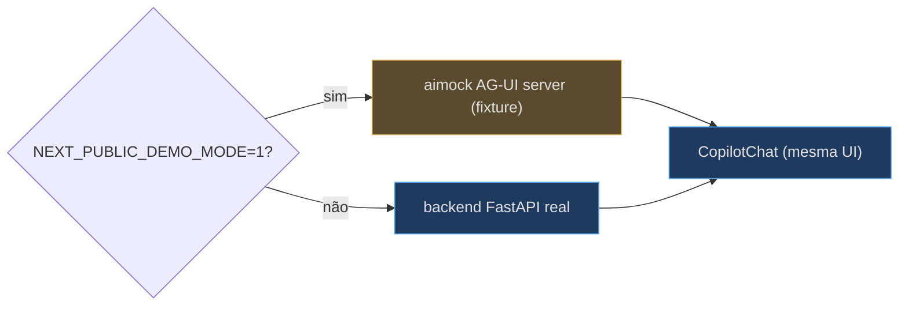
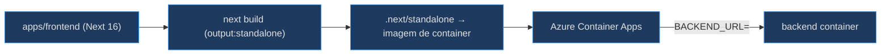

# Execução Local, Demo Mode e Deploy

## Scripts npm

O `package.json` define os scripts de dev/build + os atalhos de demo [apps/frontend/package.json:5-13](apps/frontend/package.json):

| Script | Comando | Uso |
|---|---|---|
| `dev` | `next dev` | dev local (porta 3000) |
| `build` | `next build` | build de produção (emite standalone) |
| `start` | `next start` | serve o build |
| `typecheck` | `tsc --noEmit` | checa tipos |
| `demo` | `bash ../../scripts/demo.sh` | sobe o demo mode |
| `demo:record` | `bash ../../scripts/demo-record.sh` | grava fixtures AG-UI |

O dev local normal precisa só do backend em `http://localhost:8000` — o default do `BACKEND_URL` [apps/frontend/.env.example:6-7](apps/frontend/.env.example).

## Env vars

O `.env.example` documenta a superfície de configuração. A base é `BACKEND_URL`; **todo** endpoint por domínio deriva dela, então na nuvem um domínio novo funciona sem env var por domínio [apps/frontend/.env.example:6-14](apps/frontend/.env.example).

| Var | Default | Papel | Fonte |
|---|---|---|---|
| `BACKEND_URL` | `http://localhost:8000` | Base de todos os endpoints AG-UI + proxies | [.env.example:7](apps/frontend/.env.example) |
| `AGUI_URL` | `${BACKEND}/helpdesk` | Override do endpoint helpdesk | [.env.example:11](apps/frontend/.env.example) |
| `HOSTED_AGUI_URL` | `${BACKEND}/helpdesk-hosted` | Twin hosted do helpdesk | [.env.example:11](apps/frontend/.env.example) |
| `PLATFORM_HOSTED_AGUI_URL` | `${BACKEND}/platform-hosted` | Twin hosted do platform (HITL) | [.env.example:12](apps/frontend/.env.example) |
| `<DOMAIN>_AGUI_URL` | `${BACKEND}${endpoint}` | Override por domínio (ex.: `COCKPIT_AGUI_URL`) | [.env.example:13](apps/frontend/.env.example) |
| `NEXT_PUBLIC_ENTRA_*` | (vazio) | Sign-in Entra (vazio = sem auth) | [.env.example:16-20](apps/frontend/.env.example) |
| `NEXT_PUBLIC_DEMO_MODE` | (vazio) | `1`/`true` → demo mode | [.env.example:22-23](apps/frontend/.env.example) |

> **Drift observado (v0.4.0):** o novo override `ARTIFACTS_STUDIO_AGUI_URL` (consumido em [api/copilotkit/[[...slug]]/route.ts:35-36](apps/frontend/app/api/copilotkit/[[...slug]]/route.ts)) **não** está documentado no `.env.example` — o default `${BACKEND}/artifacts-studio` cobre o caso local, mas quem quiser apontar o Studio para outro host não encontra a var listada [apps/frontend/.env.example:9-14](apps/frontend/.env.example).

## Demo mode — ver sem Azure

Quando `NEXT_PUBLIC_DEMO_MODE=1`, o app fala com um servidor AG-UI aimock que reproduz uma fixture gravada em vez do backend real — o fluxo inteiro (passos, resposta fundamentada, HITL) roda com **zero Azure e sem sign-in** [apps/frontend/lib/demo.ts:1-5](apps/frontend/lib/demo.ts). Como o `authConfigured` inclui `!demoMode`, demo é sempre no-auth mesmo se as vars Entra estiverem presentes [apps/frontend/lib/auth/msal.ts:14-15](apps/frontend/lib/auth/msal.ts). As fixtures ficam em `demo/fixtures/*.json` (streams AG-UI capturados).

<!-- Sources: apps/frontend/lib/demo.ts:1-5, apps/frontend/lib/auth/msal.ts:14-15 -->

## Build e deploy standalone

O `next.config.ts` seta `output: "standalone"`, emitindo um bundle server auto-contido (`.next/standalone`) para a imagem de container [apps/frontend/next.config.ts:3-7](apps/frontend/next.config.ts). No container deployado, `BACKEND_URL` é setado para a FQDN do backend (via containerapps.bicep, referenciado no comentário do route handler) e toda URL de domínio deriva dela [apps/frontend/app/api/copilotkit/[[...slug]]/route.ts:17-22](apps/frontend/app/api/copilotkit/[[...slug]]/route.ts).

<!-- Sources: apps/frontend/next.config.ts:1-8, apps/frontend/app/api/copilotkit/[[...slug]]/route.ts:17-22 -->

## Version lag observado

O `package.json` ainda declara `"version": "0.1.0"` enquanto a wiki é `v0.4.0` — o mesmo lag de versão que a nota do dogfood v0.3.0 já registrava (o `apps/frontend/package.json` não acompanha a versão do bundle) [apps/frontend/package.json:1-3](apps/frontend/package.json).

## Related Pages

| Página | Relação |
|---|---|
| [Arquitetura e Stack](page-2.md) | A stack e o build standalone |
| [Registry e Runtime](page-3.md) | Os overrides `<ID>_AGUI_URL` |
| [Autenticação Entra e Proxies](page-8.md) | As env vars de sign-in |
| [Visão Geral](page-1.md) | O panorama das superfícies |
