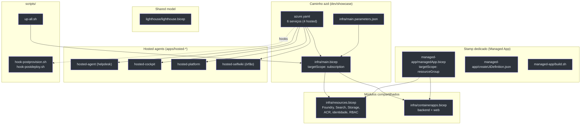

# Visão Geral da Infraestrutura

> **Escopo desta página.** Mapa de alto nível de tudo que vive sob `infra/` mais a declaração de serviços em [`azure.yaml`](https://github.com/ruinosus/foundry-assured/blob/3333d60d0e9c02b64a532f2c9bad94692cf50075/azure.yaml), os hosted agents em `apps/hosted-*` e os `scripts/` de bring-up. Cada afirmação aqui é rastreada para o arquivo+linha que a comprova; quando algo é inferência (e não leitura literal do código), está marcado como **(inferência)**.

## Por que esta infraestrutura existe (primeiros princípios)

O Foundry Assured é um concierge de suporte de engenharia que roda **três planos**: um frontend Next.js, um backend Python multi-agente e o **Foundry na nuvem** (KB, memória, eval, tracing). A IaC tem um trabalho central: **provisionar esses recursos de nuvem de forma keyless (identidade gerenciada / Entra ID) e reproduzível**, sem nenhuma chave de API hardcoded — a regra inegociável #2 do projeto ([resources.bicep:1-10](https://github.com/ruinosus/foundry-assured/blob/3333d60d0e9c02b64a532f2c9bad94692cf50075/infra/resources.bicep#L1-L10)).

O que a v0.2.0 já estabelecia (SaaS / D-packaging) permanece: o **mesmo conjunto de recursos** é entregue de **três formas**, sem duplicar a definição dos recursos:

| Veículo de entrega | Quem opera | Onde os recursos nascem | Arquivo raiz | Source |
|---|---|---|---|---|
| **azd** (dev / showcase) | você mesmo | sua subscription, RG `rg-<env>` | `infra/main.bicep` (subscription-scoped) | [main.bicep:10](https://github.com/ruinosus/foundry-assured/blob/3333d60d0e9c02b64a532f2c9bad94692cf50075/infra/main.bicep#L10) |
| **Stamp dedicado** (enterprise) | publisher (nós) | subscription do **cliente**, RG gerenciado | `infra/managed-app/managedApp.bicep` (resourceGroup-scoped) | [managedApp.bicep:21](https://github.com/ruinosus/foundry-assured/blob/3333d60d0e9c02b64a532f2c9bad94692cf50075/infra/managed-app/managedApp.bicep#L21) |
| **Lighthouse** (shared, data-plane) | publisher cross-tenant | subscription do cliente (delegada) | `infra/lighthouse/lighthouse.bicep` (subscription-scoped) | [lighthouse.bicep:20](https://github.com/ruinosus/foundry-assured/blob/3333d60d0e9c02b64a532f2c9bad94692cf50075/infra/lighthouse/lighthouse.bicep#L20) |

A chave da arquitetura: **os dois primeiros compõem os MESMOS dois módulos** — `resources.bicep` e `containerapps.bicep`. O stamp dedicado é uma *re-parametrização* do caminho azd para a subscription do cliente, não uma cópia das definições (ADR-002, [managedApp.bicep:13-15](https://github.com/ruinosus/foundry-assured/blob/3333d60d0e9c02b64a532f2c9bad94692cf50075/infra/managed-app/managedApp.bicep#L13-L15)).

## O que mudou desde a v0.2.0 (rename + novas capacidades)

**Fato (lido no código):** o produto foi renomeado de `helpdesk` para `assured` em toda a nomenclatura de recursos — `aif-assured-*` (Foundry), `srch-assured-*` (Search), `stassured*` (Storage), `acrassured*` (ACR), `id-assured-app-*` (identidade), `log-assured-*` / `appi-assured-*` (observabilidade), `cae-assured-*` (Container Apps env) e o projeto Foundry passou a se chamar `foundry-assured` ([resources.bicep:55-61](https://github.com/ruinosus/foundry-assured/blob/3333d60d0e9c02b64a532f2c9bad94692cf50075/infra/resources.bicep#L55-L61), [containerapps.bicep:47](https://github.com/ruinosus/foundry-assured/blob/3333d60d0e9c02b64a532f2c9bad94692cf50075/infra/containerapps.bicep#L47), [containerapps.bicep:57](https://github.com/ruinosus/foundry-assured/blob/3333d60d0e9c02b64a532f2c9bad94692cf50075/infra/containerapps.bicep#L57)).

| Mudança | Onde | Source |
|---|---|---|
| Rename `helpdesk`→`assured` na nomenclatura | `resources.bicep`, `containerapps.bicep` | [resources.bicep:55-59](https://github.com/ruinosus/foundry-assured/blob/3333d60d0e9c02b64a532f2c9bad94692cf50075/infra/resources.bicep#L55-L59) |
| Novo param `appUsersGroupId` + grant `appUsersToFoundry` (Foundry User a um grupo, p/ OBO) | `main.bicep` / `resources.bicep` | [resources.bicep:400-408](https://github.com/ruinosus/foundry-assured/blob/3333d60d0e9c02b64a532f2c9bad94692cf50075/infra/resources.bicep#L400-L408) |
| Nova role `Search Index Data Contributor` + `userSearchIndexContributor` (stamping de ACL from scratch) | `resources.bicep` | [resources.bicep:365-373](https://github.com/ruinosus/foundry-assured/blob/3333d60d0e9c02b64a532f2c9bad94692cf50075/infra/resources.bicep#L365-L373) |
| Novos outputs `AZURE_AI_PROJECT_ID`/`AZURE_AI_ACCOUNT_ID`/`AZURE_SEARCH_ID` (deploy + RBAC dos hosted agents) | `main.bicep` / `resources.bicep` | [main.bicep:99-101](https://github.com/ruinosus/foundry-assured/blob/3333d60d0e9c02b64a532f2c9bad94692cf50075/infra/main.bicep#L99-L101) |
| Backend liga `SELFWIKI_SEARCH_KNOWLEDGE_BASE` + `MCP_ENABLED` | `containerapps.bicep` | [containerapps.bicep:132-135](https://github.com/ruinosus/foundry-assured/blob/3333d60d0e9c02b64a532f2c9bad94692cf50075/infra/containerapps.bicep#L132-L135) |
| **4º hosted agent** `selfwiki-expert` (novo dir `apps/hosted-selfwiki`) | `azure.yaml`, `apps/hosted-selfwiki/` | [azure.yaml:26-37](https://github.com/ruinosus/foundry-assured/blob/3333d60d0e9c02b64a532f2c9bad94692cf50075/azure.yaml#L26-L37) |
| Novos `scripts/` de bring-up (`up-all.sh` + hooks azd) | `scripts/` | [up-all.sh:1-27](https://github.com/ruinosus/foundry-assured/blob/3333d60d0e9c02b64a532f2c9bad94692cf50075/scripts/up-all.sh#L1-L27) |

> **⚠ Inconsistência a sinalizar (detalhada na [Hosted Agents](./page-7.md)):** o frontend **largou os grounded hosted twins** (grounded roda live-OBO), mas `azure.yaml` **ainda declara** `selfwiki-expert` (e `cockpit-expert`) como hosted agent — nenhuma rota do backend/UI os consome. São hosted agents **provisionados-mas-órfãos**.

## Mapa dos arquivos

<!-- Sources: infra/main.bicep:55-92, azure.yaml:6-72, scripts/up-all.sh:100-110 -->

## Os seis serviços declarados em `azure.yaml`

O `azure.yaml` é o manifesto que o azd lê para saber **o que buildar e onde implantar**. Ele declara seis serviços — dois Container Apps (`backend`, `web`) e **quatro** hosted agents ([azure.yaml:6-72](https://github.com/ruinosus/foundry-assured/blob/3333d60d0e9c02b64a532f2c9bad94692cf50075/azure.yaml#L6-L72)):

| Serviço | `project` | `host` | Papel | Source |
|---|---|---|---|---|
| `backend` | `apps/backend` | `containerapp` | API FastAPI + workflow AG-UI | [azure.yaml:7-13](https://github.com/ruinosus/foundry-assured/blob/3333d60d0e9c02b64a532f2c9bad94692cf50075/azure.yaml#L7-L13) |
| `cockpit-expert` | `apps/hosted-cockpit` | `azure.ai.agent` | Hosted — Q&A Cockpit **(órfão, ver p.7)** | [azure.yaml:14-25](https://github.com/ruinosus/foundry-assured/blob/3333d60d0e9c02b64a532f2c9bad94692cf50075/azure.yaml#L14-L25) |
| `selfwiki-expert` | `apps/hosted-selfwiki` | `azure.ai.agent` | Hosted — Q&A selfwiki **NOVO / órfão** | [azure.yaml:26-37](https://github.com/ruinosus/foundry-assured/blob/3333d60d0e9c02b64a532f2c9bad94692cf50075/azure.yaml#L26-L37) |
| `helpdesk-concierge` | `apps/hosted-agent` | `azure.ai.agent` | Hosted — workflow helpdesk (vivo em `/helpdesk-hosted`) | [azure.yaml:38-49](https://github.com/ruinosus/foundry-assured/blob/3333d60d0e9c02b64a532f2c9bad94692cf50075/azure.yaml#L38-L49) |
| `platform-concierge` | `apps/hosted-platform` | `azure.ai.agent` | Hosted — tools (Invocations, vivo em `/platform-hosted`) | [azure.yaml:50-61](https://github.com/ruinosus/foundry-assured/blob/3333d60d0e9c02b64a532f2c9bad94692cf50075/azure.yaml#L50-L61) |
| `web` | `apps/frontend` | `containerapp` | Frontend Next.js | [azure.yaml:62-72](https://github.com/ruinosus/foundry-assured/blob/3333d60d0e9c02b64a532f2c9bad94692cf50075/azure.yaml#L62-L72) |

> **Fato (working tree ≠ blob):** os números de linha acima são do **blob commitado** em `3333d60`. A árvore de trabalho tem um **reorder não commitado** de `azure.yaml` — a ordem dos serviços foi trocada para `backend · cockpit-expert · helpdesk-concierge · platform-concierge · selfwiki-expert · web` (o **conjunto** de serviços é idêntico; muda só a ordem). Os hooks `postprovision`/`postdeploy` fecham o arquivo ([azure.yaml:73-81](https://github.com/ruinosus/foundry-assured/blob/3333d60d0e9c02b64a532f2c9bad94692cf50075/azure.yaml#L73-L81)).

**Fato:** os quatro serviços `azure.ai.agent` são **hosted agents** (containers servidos pelo Foundry Agent Service), não Container Apps; só `backend` e `web` viram Container Apps ([containerapps.bicep:95-199](https://github.com/ruinosus/foundry-assured/blob/3333d60d0e9c02b64a532f2c9bad94692cf50075/infra/containerapps.bicep#L95-L199)).

## Postura keyless (a regra que toda a IaC respeita)

Toda autenticação é por identidade gerenciada / Entra ID. A conta Foundry, o projeto e a busca têm `SystemAssigned` identity ([resources.bicep:85](https://github.com/ruinosus/foundry-assured/blob/3333d60d0e9c02b64a532f2c9bad94692cf50075/infra/resources.bicep#L85), [resources.bicep:99](https://github.com/ruinosus/foundry-assured/blob/3333d60d0e9c02b64a532f2c9bad94692cf50075/infra/resources.bicep#L99), [resources.bicep:230](https://github.com/ruinosus/foundry-assured/blob/3333d60d0e9c02b64a532f2c9bad94692cf50075/infra/resources.bicep#L230)); os Container Apps compartilham uma identidade `UserAssigned` ([resources.bicep:262-266](https://github.com/ruinosus/foundry-assured/blob/3333d60d0e9c02b64a532f2c9bad94692cf50075/infra/resources.bicep#L262-L266)). O único segredo aceito é o `entraApiClientSecret` para OBO, e ele entra como `@secure()` + Container App secret, nunca como env literal ([containerapps.bicep:33-34](https://github.com/ruinosus/foundry-assured/blob/3333d60d0e9c02b64a532f2c9bad94692cf50075/infra/containerapps.bicep#L33-L34), [containerapps.bicep:115-117](https://github.com/ruinosus/foundry-assured/blob/3333d60d0e9c02b64a532f2c9bad94692cf50075/infra/containerapps.bicep#L115-L117)).

## Custo (resumo)

O piso always-on é **≈ $79/mês (~$0,11/h)**, **~93% disso é Azure AI Search Basic** ($73,73/mo); o resto é usage-based e **≈ $0 ocioso** (Container Apps escalam a zero) — apurado pela Retail Prices API, documentado em [`docs/COST.md`](https://github.com/ruinosus/foundry-assured/blob/3333d60d0e9c02b64a532f2c9bad94692cf50075/docs/COST.md) ([COST.md:12-17](https://github.com/ruinosus/foundry-assured/blob/3333d60d0e9c02b64a532f2c9bad94692cf50075/docs/COST.md#L12-L17)). Detalhes (e a nota de que o `COST.md` ainda conta **3** hosted agents, não os 4 declarados) em [Custo, Parâmetros e Scripts](./page-9.md).

## Referências

- [`infra/main.bicep`](https://github.com/ruinosus/foundry-assured/blob/3333d60d0e9c02b64a532f2c9bad94692cf50075/infra/main.bicep) — entrypoint azd
- [`azure.yaml`](https://github.com/ruinosus/foundry-assured/blob/3333d60d0e9c02b64a532f2c9bad94692cf50075/azure.yaml) — declaração de serviços
- [`scripts/up-all.sh`](https://github.com/ruinosus/foundry-assured/blob/3333d60d0e9c02b64a532f2c9bad94692cf50075/scripts/up-all.sh) — bring-up de uma linha

## Related Pages

| Página | Relação |
|---|---|
| [O Stack azd](./page-2.md) | detalha o entrypoint subscription-scoped e a composição dos módulos |
| [Recursos Compartilhados](./page-3.md) | o `resources.bicep` consumido pelos dois veículos |
| [Hosted Agents](./page-7.md) | os quatro serviços `azure.ai.agent` e o twin selfwiki órfão |
| [Custo, Parâmetros e Scripts](./page-9.md) | `up-all.sh`, hooks azd e a tabela de custo |
