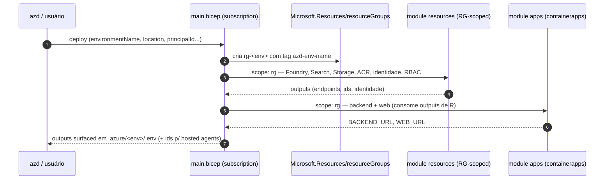
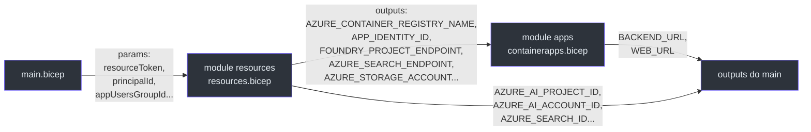

# O Stack azd (`main.bicep`)

> **Escopo.** [`infra/main.bicep`](https://github.com/ruinosus/foundry-assured/blob/3333d60d0e9c02b64a532f2c9bad94692cf50075/infra/main.bicep) + [`infra/main.parameters.json`](https://github.com/ruinosus/foundry-assured/blob/3333d60d0e9c02b64a532f2c9bad94692cf50075/infra/main.parameters.json). Este é o caminho de desenvolvimento/showcase (`azd up`).

## Por que subscription-scoped

Um `azd up` precisa criar **o próprio resource group** antes de tudo — e criar um RG só é possível a partir do escopo de subscription. Por isso `main.bicep` declara `targetScope = 'subscription'` ([main.bicep:10](https://github.com/ruinosus/foundry-assured/blob/3333d60d0e9c02b64a532f2c9bad94692cf50075/infra/main.bicep#L10)) e cria o RG `rg-${environmentName}` ([main.bicep:49-53](https://github.com/ruinosus/foundry-assured/blob/3333d60d0e9c02b64a532f2c9bad94692cf50075/infra/main.bicep#L49-L53)). **Contraste-chave (inferência a partir dos escopos):** o stamp dedicado é `resourceGroup`-scoped justamente porque a plataforma de Managed Application já criou o RG gerenciado para ele — ver [O Stamp Dedicado](./page-5.md).

## Fluxo de provisionamento

<!-- Sources: infra/main.bicep:49-92, infra/main.bicep:94-116 -->

## Os parâmetros de entrada

`main.bicep` declara parâmetros que o azd preenche a partir do ambiente. Os obrigatórios e os opcionais:

| Parâmetro | Default | Origem azd | Papel | Source |
|---|---|---|---|---|
| `environmentName` | — (1-64 chars) | `AZURE_ENV_NAME` | deriva nomes + tag `azd-env-name` | [main.bicep:12-15](https://github.com/ruinosus/foundry-assured/blob/3333d60d0e9c02b64a532f2c9bad94692cf50075/infra/main.bicep#L12-L15) |
| `location` | — | `AZURE_LOCATION` | região primária | [main.bicep:17-18](https://github.com/ruinosus/foundry-assured/blob/3333d60d0e9c02b64a532f2c9bad94692cf50075/infra/main.bicep#L17-L18) |
| `principalId` | `''` | `AZURE_PRINCIPAL_ID` | usuário com acesso data-plane | [main.bicep:20-21](https://github.com/ruinosus/foundry-assured/blob/3333d60d0e9c02b64a532f2c9bad94692cf50075/infra/main.bicep#L20-L21) |
| `appUsersGroupId` **NOVO** | `''` | `APP_USERS_GROUP_ID` (doc) | grupo de app-users → Foundry User (OBO) | [main.bicep:23-24](https://github.com/ruinosus/foundry-assured/blob/3333d60d0e9c02b64a532f2c9bad94692cf50075/infra/main.bicep#L23-L24) |
| `principalType` | `'User'` | `AZURE_PRINCIPAL_TYPE` | `User` local, `ServicePrincipal` em CI | [main.bicep:26-27](https://github.com/ruinosus/foundry-assured/blob/3333d60d0e9c02b64a532f2c9bad94692cf50075/infra/main.bicep#L26-L27) |
| `modelDeploymentName` | `'gpt-5-mini'` | — | nome do deploy do modelo de chat | [main.bicep:29-30](https://github.com/ruinosus/foundry-assured/blob/3333d60d0e9c02b64a532f2c9bad94692cf50075/infra/main.bicep#L29-L30) |
| `searchLocation` | `''` | `AZURE_SEARCH_LOCATION` | override de região do AI Search | [main.bicep:32-33](https://github.com/ruinosus/foundry-assured/blob/3333d60d0e9c02b64a532f2c9bad94692cf50075/infra/main.bicep#L32-L33) |
| `entraTenantId` | `''` | `ENTRA_TENANT_ID` | OBO do backend | [main.bicep:35-36](https://github.com/ruinosus/foundry-assured/blob/3333d60d0e9c02b64a532f2c9bad94692cf50075/infra/main.bicep#L35-L36) |
| `entraApiClientId` | `''` | `ENTRA_API_CLIENT_ID` | client id da API backend (OBO) | [main.bicep:38-39](https://github.com/ruinosus/foundry-assured/blob/3333d60d0e9c02b64a532f2c9bad94692cf50075/infra/main.bicep#L38-L39) |
| `entraApiClientSecret` | `''` `@secure()` | `ENTRA_API_CLIENT_SECRET` | secret OBO (nunca literal) | [main.bicep:41-43](https://github.com/ruinosus/foundry-assured/blob/3333d60d0e9c02b64a532f2c9bad94692cf50075/infra/main.bicep#L41-L43) |

### ⚠ Inconsistência real: `appUsersGroupId` declarado mas não fiado no azd

**Fato (lido no código):** `main.bicep:23` documenta que `appUsersGroupId` é preenchido pelo azd via `APP_USERS_GROUP_ID`, e `main.bicep:64` o repassa ao `module resources` ([main.bicep:64](https://github.com/ruinosus/foundry-assured/blob/3333d60d0e9c02b64a532f2c9bad94692cf50075/infra/main.bicep#L64)). Porém [`main.parameters.json`](https://github.com/ruinosus/foundry-assured/blob/3333d60d0e9c02b64a532f2c9bad94692cf50075/infra/main.parameters.json) **NÃO** mapeia `appUsersGroupId` — só `environmentName`, `location`, `principalId`, `principalType`, `searchLocation` e os três `entra*` ([main.parameters.json:4-13](https://github.com/ruinosus/foundry-assured/blob/3333d60d0e9c02b64a532f2c9bad94692cf50075/infra/main.parameters.json#L4-L13)). Como o azd só passa parâmetros presentes em `main.parameters.json`, num `azd up` padrão `appUsersGroupId` fica no default `''` e o grant `appUsersToFoundry` é **pulado** (`if (!empty(appUsersGroupId))`, [resources.bicep:400](https://github.com/ruinosus/foundry-assured/blob/3333d60d0e9c02b64a532f2c9bad94692cf50075/infra/resources.bicep#L400)) — a menos que o valor seja injetado por outro caminho (`azd env set` + edição do parameters). **Não confirmado** se há wiring alternativo; sinalizado como gap.

### Tokens derivados

- `resourceToken = toLower(uniqueString(subscription().id, environmentName, location))` — sufixo curto que torna nomes globalmente únicos ([main.bicep:45](https://github.com/ruinosus/foundry-assured/blob/3333d60d0e9c02b64a532f2c9bad94692cf50075/infra/main.bicep#L45)).
- `effectiveSearchLocation = empty(searchLocation) ? location : searchLocation` — fallback de região do AI Search ([main.bicep:46](https://github.com/ruinosus/foundry-assured/blob/3333d60d0e9c02b64a532f2c9bad94692cf50075/infra/main.bicep#L46)), passado ao módulo como `searchLocation` ([main.bicep:66](https://github.com/ruinosus/foundry-assured/blob/3333d60d0e9c02b64a532f2c9bad94692cf50075/infra/main.bicep#L66)).

## A composição dos dois módulos

<!-- Sources: infra/main.bicep:55-92, infra/main.bicep:94-116 -->

**Fato — o `module apps` depende de `resources` por dados, não por `dependsOn` explícito.** Os parâmetros de `apps` são todos `resources.outputs.*` ([main.bicep:79-92](https://github.com/ruinosus/foundry-assured/blob/3333d60d0e9c02b64a532f2c9bad94692cf50075/infra/main.bicep#L79-L92)), o que cria a ordenação implícita (ARM resolve a dependência pela referência de output). Os parâmetros OBO (`entraTenantId`, `entraApiClientId`, `entraApiClientSecret`) passam direto do `main` para o `apps` ([main.bicep:88-90](https://github.com/ruinosus/foundry-assured/blob/3333d60d0e9c02b64a532f2c9bad94692cf50075/infra/main.bicep#L88-L90)) — **não** ao `resources`.

## Outputs surfaced para o `.env` (agora com ids ARM)

`main.bicep` re-exporta os outputs dos módulos para que o azd os grave em `.azure/<env>/.env`. **Novidade da v0.3.0:** além dos endpoints, agora exporta **ids ARM** que o azd e os hooks usam para deployar/gatear os hosted agents ([main.bicep:94-116](https://github.com/ruinosus/foundry-assured/blob/3333d60d0e9c02b64a532f2c9bad94692cf50075/infra/main.bicep#L94-L116)):

| Output | Comentário | Source |
|---|---|---|
| `BACKEND_URL`, `WEB_URL` | FQDNs públicos dos Container Apps | [main.bicep:94-95](https://github.com/ruinosus/foundry-assured/blob/3333d60d0e9c02b64a532f2c9bad94692cf50075/infra/main.bicep#L94-L95) |
| `AZURE_AI_PROJECT_ID` **NOVO** | id do projeto — azd resolve o target ao deployar hosted agents | [main.bicep:99](https://github.com/ruinosus/foundry-assured/blob/3333d60d0e9c02b64a532f2c9bad94692cf50075/infra/main.bicep#L99) |
| `AZURE_AI_ACCOUNT_ID`, `AZURE_SEARCH_ID` **NOVO** | scopes que o `hook-postdeploy.sh` usa p/ RBAC dos agents | [main.bicep:100-101](https://github.com/ruinosus/foundry-assured/blob/3333d60d0e9c02b64a532f2c9bad94692cf50075/infra/main.bicep#L100-L101) |
| `FOUNDRY_MODEL`, `FOUNDRY_EMBEDDING_MODEL`, `AZURE_AI_OPENAI_ENDPOINT` | modelos + endpoint OpenAI | [main.bicep:102-105](https://github.com/ruinosus/foundry-assured/blob/3333d60d0e9c02b64a532f2c9bad94692cf50075/infra/main.bicep#L102-L105) |
| `AZURE_SEARCH_ENDPOINT`, `AZURE_SEARCH_KNOWLEDGE_BASE` | endpoint + nome da KB | [main.bicep:107-108](https://github.com/ruinosus/foundry-assured/blob/3333d60d0e9c02b64a532f2c9bad94692cf50075/infra/main.bicep#L107-L108) |
| `AZURE_STORAGE_*` (incl. `RESOURCE_ID`) | conta/container/id do corpus | [main.bicep:110-112](https://github.com/ruinosus/foundry-assured/blob/3333d60d0e9c02b64a532f2c9bad94692cf50075/infra/main.bicep#L110-L112) |
| `AZURE_CONTAINER_REGISTRY_*` | ACR para imagens dos hosted agents | [main.bicep:114-115](https://github.com/ruinosus/foundry-assured/blob/3333d60d0e9c02b64a532f2c9bad94692cf50075/infra/main.bicep#L114-L115) |

**Por que os ids ARM viram output:** o comentário deixa explícito — surfacear `AZURE_AI_PROJECT_ID` como output mantém o valor em lockstep com os nomes account/project, então um rename nunca deixa um valor manual stale ([main.bicep:99](https://github.com/ruinosus/foundry-assured/blob/3333d60d0e9c02b64a532f2c9bad94692cf50075/infra/main.bicep#L99)); e `AZURE_AI_ACCOUNT_ID`/`AZURE_SEARCH_ID` são lidos pelo `hook-postdeploy.sh` para conceder a cada hosted agent as roles de runtime que o Bicep não consegue pré-atribuir (a identidade é criada no deploy) ([resources.bicep:419-423](https://github.com/ruinosus/foundry-assured/blob/3333d60d0e9c02b64a532f2c9bad94692cf50075/infra/resources.bicep#L419-L423)) — ver [Custo, Parâmetros e Scripts](./page-9.md).

## Disciplina de assinaturas de SDK/Bicep

O cabeçalho de `main.bicep` afirma que tipos/apiVersions foram verificados contra o sample oficial `microsoft-foundry/foundry-samples 00-basic` e o quickstart Bicep — coerente com a regra inegociável #1 ("não invente assinaturas") ([main.bicep:6-8](https://github.com/ruinosus/foundry-assured/blob/3333d60d0e9c02b64a532f2c9bad94692cf50075/infra/main.bicep#L6-L8)).

## Related Pages

| Página | Relação |
|---|---|
| [Recursos Compartilhados](./page-3.md) | o `module resources` aqui composto (e o grant `appUsersToFoundry`) |
| [Container Apps](./page-4.md) | o `module apps` aqui composto |
| [Hosted Agents](./page-7.md) | consumidores dos ids ARM re-exportados |
| [Custo, Parâmetros e Scripts](./page-9.md) | tabela completa de parâmetros + os hooks que leem os ids |
