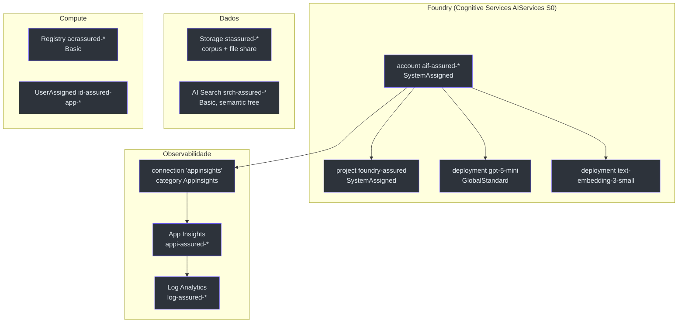
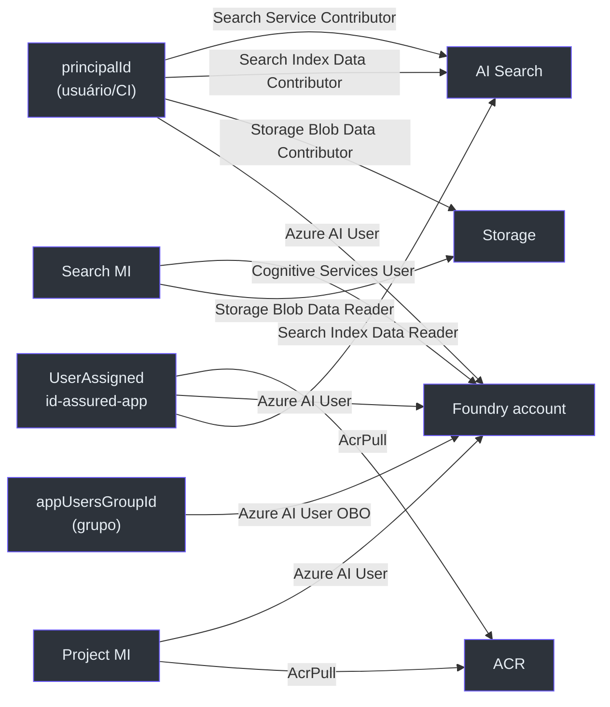

# Recursos Compartilhados (`resources.bicep`)

> **Escopo.** [`infra/resources.bicep`](https://github.com/ruinosus/foundry-assured/blob/3333d60d0e9c02b64a532f2c9bad94692cf50075/infra/resources.bicep) — o módulo RG-scoped que define **todos** os recursos de nuvem (exceto os Container Apps). É composto por `main.bicep` (azd) e por `managedApp.bicep` (stamp dedicado), então tudo aqui vale para os dois veículos.

## Por que um único módulo

A decisão de arquitetura (ADR-002) é que o stamp dedicado seja uma **re-parametrização**, não uma cópia. Isso só funciona se a definição dos recursos viver em **um** lugar — este arquivo. Por isso ele é RG-scoped e não cria nenhum `resourceGroups` (quem cria o RG é o chamador) ([resources.bicep:1-10](https://github.com/ruinosus/foundry-assured/blob/3333d60d0e9c02b64a532f2c9bad94692cf50075/infra/resources.bicep#L1-L10)).

## Rename helpdesk → assured

**Fato (lido no código):** os nomes de recurso agora derivam de `assured`, não `helpdesk` ([resources.bicep:55-61](https://github.com/ruinosus/foundry-assured/blob/3333d60d0e9c02b64a532f2c9bad94692cf50075/infra/resources.bicep#L55-L61)): `accountName = 'aif-assured-${token}'`, `projectName = 'foundry-assured'`, `searchName = 'srch-assured-${token}'`, `registryName = 'acrassured${token}'`, `storageName = 'stassured${token}'`, `dataShareName = 'assured-data'`. O output `AZURE_SEARCH_KNOWLEDGE_BASE` **continua** o literal `helpdesk-kb` ([resources.bicep:433](https://github.com/ruinosus/foundry-assured/blob/3333d60d0e9c02b64a532f2c9bad94692cf50075/infra/resources.bicep#L433)) — a KB primária não foi renomeada.

## Inventário de recursos

<!-- Sources: infra/resources.bicep:79-266 -->

| Recurso | Tipo / apiVersion | Nome (var) | SKU/kind | Source |
|---|---|---|---|---|
| Foundry account | `Microsoft.CognitiveServices/accounts@2025-06-01` | `aif-assured-${token}` | `AIServices` / `S0` | [resources.bicep:79-92](https://github.com/ruinosus/foundry-assured/blob/3333d60d0e9c02b64a532f2c9bad94692cf50075/infra/resources.bicep#L79-L92) |
| Foundry project | `.../accounts/projects@2025-06-01` | `foundry-assured` | SystemAssigned | [resources.bicep:94-101](https://github.com/ruinosus/foundry-assured/blob/3333d60d0e9c02b64a532f2c9bad94692cf50075/infra/resources.bicep#L94-L101) |
| Modelo de chat | `.../accounts/deployments@2025-06-01` | `gpt-5-mini` (param) | `GlobalStandard` cap 100 | [resources.bicep:103-114](https://github.com/ruinosus/foundry-assured/blob/3333d60d0e9c02b64a532f2c9bad94692cf50075/infra/resources.bicep#L103-L114) |
| Embedding | `.../accounts/deployments@2025-06-01` | `text-embedding-3-small` | `GlobalStandard` cap 100 | [resources.bicep:117-129](https://github.com/ruinosus/foundry-assured/blob/3333d60d0e9c02b64a532f2c9bad94692cf50075/infra/resources.bicep#L117-L129) |
| Log Analytics | `Microsoft.OperationalInsights/workspaces@2023-09-01` | `log-assured-${token}` | `PerGB2018`, 30d | [resources.bicep:140-148](https://github.com/ruinosus/foundry-assured/blob/3333d60d0e9c02b64a532f2c9bad94692cf50075/infra/resources.bicep#L140-L148) |
| App Insights | `Microsoft.Insights/components@2020-02-02` | `appi-assured-${token}` | web | [resources.bicep:150-159](https://github.com/ruinosus/foundry-assured/blob/3333d60d0e9c02b64a532f2c9bad94692cf50075/infra/resources.bicep#L150-L159) |
| Connection telemetria | `.../accounts/connections@2025-06-01` | `appinsights` | category `AppInsights` | [resources.bicep:162-178](https://github.com/ruinosus/foundry-assured/blob/3333d60d0e9c02b64a532f2c9bad94692cf50075/infra/resources.bicep#L162-L178) |
| Storage | `Microsoft.Storage/storageAccounts@2023-05-01` | `stassured${token}` | `Standard_LRS` StorageV2 | [resources.bicep:184-195](https://github.com/ruinosus/foundry-assured/blob/3333d60d0e9c02b64a532f2c9bad94692cf50075/infra/resources.bicep#L184-L195) |
| Container corpus | `.../blobServices/containers@2023-05-01` | `corpus` | publicAccess None | [resources.bicep:202-206](https://github.com/ruinosus/foundry-assured/blob/3333d60d0e9c02b64a532f2c9bad94692cf50075/infra/resources.bicep#L202-L206) |
| File share | `.../fileServices/shares@2023-05-01` | `assured-data` | 1 GiB | [resources.bicep:215-219](https://github.com/ruinosus/foundry-assured/blob/3333d60d0e9c02b64a532f2c9bad94692cf50075/infra/resources.bicep#L215-L219) |
| AI Search | `Microsoft.Search/searchServices@2024-06-01-preview` | `srch-assured-${token}` | `basic`, semantic `free` | [resources.bicep:225-240](https://github.com/ruinosus/foundry-assured/blob/3333d60d0e9c02b64a532f2c9bad94692cf50075/infra/resources.bicep#L225-L240) |
| Container Registry | `Microsoft.ContainerRegistry/registries@2023-11-01-preview` | `acrassured${token}` | `Basic` | [resources.bicep:248-257](https://github.com/ruinosus/foundry-assured/blob/3333d60d0e9c02b64a532f2c9bad94692cf50075/infra/resources.bicep#L248-L257) |
| Identidade app | `Microsoft.ManagedIdentity/userAssignedIdentities@2023-01-31` | `id-assured-app-${token}` | — | [resources.bicep:262-266](https://github.com/ruinosus/foundry-assured/blob/3333d60d0e9c02b64a532f2c9bad94692cf50075/infra/resources.bicep#L262-L266) |

### Detalhes que importam

- **Storage plano (não HNS).** O histórico teve um path ADLS Gen2 (HNS) para ACL nativa POSIX, mas foi **revertido** (o retrieval agentic não honra ACL por-usuário via POSIX). O estado atual é `StorageV2` comum, `allowBlobPublicAccess: false`, `allowSharedKeyAccess: true` ([resources.bicep:184-195](https://github.com/ruinosus/foundry-assured/blob/3333d60d0e9c02b64a532f2c9bad94692cf50075/infra/resources.bicep#L184-L195)).
- **Deployments sequenciais.** O embedding tem `dependsOn: [ modelDeployment ]` porque "deployments na mesma conta devem ser criados sequencialmente" ([resources.bicep:116-128](https://github.com/ruinosus/foundry-assured/blob/3333d60d0e9c02b64a532f2c9bad94692cf50075/infra/resources.bicep#L116-L128)).
- **Versão do modelo.** `modelVersion = '2025-08-07'`; o comentário registra que só a família gpt-5.x está GA em eastus2 ([resources.bicep:34-35](https://github.com/ruinosus/foundry-assured/blob/3333d60d0e9c02b64a532f2c9bad94692cf50075/infra/resources.bicep#L34-L35)).
- **Semantic ranker grátis.** `semanticSearch: 'free'` habilita o ranker semântico (agentic retrieval) dentro da cota gratuita ([resources.bicep:235](https://github.com/ruinosus/foundry-assured/blob/3333d60d0e9c02b64a532f2c9bad94692cf50075/infra/resources.bicep#L235)).

## A trama keyless: role assignments

O ponto mais denso do arquivo. **Oito** GUIDs de built-in roles ([resources.bicep:64-71](https://github.com/ruinosus/foundry-assured/blob/3333d60d0e9c02b64a532f2c9bad94692cf50075/infra/resources.bicep#L64-L71)) — um a mais que a v0.2.0: `Search Index Data Contributor`. **Fato:** nenhuma chave é gerada.

<!-- Sources: infra/resources.bicep:268-408 -->

| Atribuição | Principal | Role | Por quê | Source |
|---|---|---|---|---|
| `appToRegistry` | app id | AcrPull | Container App puxa imagem do ACR | [resources.bicep:268-276](https://github.com/ruinosus/foundry-assured/blob/3333d60d0e9c02b64a532f2c9bad94692cf50075/infra/resources.bicep#L268-L276) |
| `appToFoundry` | app id | Azure AI User | backend chama Foundry como ele mesmo | [resources.bicep:278-286](https://github.com/ruinosus/foundry-assured/blob/3333d60d0e9c02b64a532f2c9bad94692cf50075/infra/resources.bicep#L278-L286) |
| `appToSearch` | app id | Search Index Data Reader | backend consulta a KB | [resources.bicep:288-296](https://github.com/ruinosus/foundry-assured/blob/3333d60d0e9c02b64a532f2c9bad94692cf50075/infra/resources.bicep#L288-L296) |
| `searchToFoundry` | Search MI | Cognitive Services User | Search invoca embedding/planejamento | [resources.bicep:303-311](https://github.com/ruinosus/foundry-assured/blob/3333d60d0e9c02b64a532f2c9bad94692cf50075/infra/resources.bicep#L303-L311) |
| `projectToFoundry` | Project MI | Azure AI User | memória invoca chat+embedding server-side | [resources.bicep:316-324](https://github.com/ruinosus/foundry-assured/blob/3333d60d0e9c02b64a532f2c9bad94692cf50075/infra/resources.bicep#L316-L324) |
| `projectToRegistry` | Project MI | AcrPull | hosted agent puxa a imagem | [resources.bicep:328-336](https://github.com/ruinosus/foundry-assured/blob/3333d60d0e9c02b64a532f2c9bad94692cf50075/infra/resources.bicep#L328-L336) |
| `searchToStorage` | Search MI | Storage Blob Data Reader | indexer lê o corpus | [resources.bicep:339-347](https://github.com/ruinosus/foundry-assured/blob/3333d60d0e9c02b64a532f2c9bad94692cf50075/infra/resources.bicep#L339-L347) |
| `userSearchContributor` | principalId | Search Service Contributor | usuário cria KB/sources | [resources.bicep:350-358](https://github.com/ruinosus/foundry-assured/blob/3333d60d0e9c02b64a532f2c9bad94692cf50075/infra/resources.bicep#L350-L358) |
| `userSearchIndexContributor` **NOVO** | principalId | Search Index Data **Contributor** | stamping de ACL + purge de órfãos (write index docs) | [resources.bicep:365-373](https://github.com/ruinosus/foundry-assured/blob/3333d60d0e9c02b64a532f2c9bad94692cf50075/infra/resources.bicep#L365-L373) |
| `userStorageContributor` | principalId | Storage Blob Data Contributor | usuário sobe o corpus | [resources.bicep:376-384](https://github.com/ruinosus/foundry-assured/blob/3333d60d0e9c02b64a532f2c9bad94692cf50075/infra/resources.bicep#L376-L384) |
| `userAiUser` | principalId | Azure AI User | usuário no data-plane Foundry | [resources.bicep:387-395](https://github.com/ruinosus/foundry-assured/blob/3333d60d0e9c02b64a532f2c9bad94692cf50075/infra/resources.bicep#L387-L395) |
| `appUsersToFoundry` **NOVO** | appUsersGroupId (Group) | Azure AI User | app-users rodam inferência AS THEMSELVES (OBO) | [resources.bicep:400-408](https://github.com/ruinosus/foundry-assured/blob/3333d60d0e9c02b64a532f2c9bad94692cf50075/infra/resources.bicep#L400-L408) |

### Por que a nova role Contributor (v0.3.0)

**Fato (lido no código):** `Search Index Data Reader` só consulta; o ingest data-plane **escreve** documentos direto como o caller — o stamping de ACL por documento (`app/knowledge/acl_setup.py`) e a reconciliação de órfãos (`ingest_cockpit.purge_orphans`) precisam de `Search Index Data Contributor`. Sem isso, um `azd up` from-scratch daria 403 no stamping. Contributor é superset de Data Reader, então também cobre retrieval do backend local ([resources.bicep:360-373](https://github.com/ruinosus/foundry-assured/blob/3333d60d0e9c02b64a532f2c9bad94692cf50075/infra/resources.bicep#L360-L373)).

### Por que o grant de grupo `appUsersToFoundry`

A síntese grounded roda o modelo **como o usuário** (OBO), para que respostas sejam atribuíveis e a ACL por-usuário funcione; sem `Foundry User`, o token do usuário 403 na inferência. É group-scoped (um assignment cobre todos os app-users) e condicional a `if (!empty(appUsersGroupId))` — vazio pula (single-user/dev) ([resources.bicep:397-408](https://github.com/ruinosus/foundry-assured/blob/3333d60d0e9c02b64a532f2c9bad94692cf50075/infra/resources.bicep#L397-L408)). **Fail-closed por design:** as quatro atribuições `user*` continuam `if (!empty(principalId))` ([resources.bicep:350](https://github.com/ruinosus/foundry-assured/blob/3333d60d0e9c02b64a532f2c9bad94692cf50075/infra/resources.bicep#L350), [:365](https://github.com/ruinosus/foundry-assured/blob/3333d60d0e9c02b64a532f2c9bad94692cf50075/infra/resources.bicep#L365), [:376](https://github.com/ruinosus/foundry-assured/blob/3333d60d0e9c02b64a532f2c9bad94692cf50075/infra/resources.bicep#L376), [:387](https://github.com/ruinosus/foundry-assured/blob/3333d60d0e9c02b64a532f2c9bad94692cf50075/infra/resources.bicep#L387)) — central para o stamp dedicado, que passa `principalId: ''` (ver [O Stamp Dedicado](./page-5.md)).

## Outputs (agora com ids ARM)

O módulo exporta endpoints, ids ARM, nomes e a identidade compartilhada ([resources.bicep:414-446](https://github.com/ruinosus/foundry-assured/blob/3333d60d0e9c02b64a532f2c9bad94692cf50075/infra/resources.bicep#L414-L446)). Destaques: `FOUNDRY_PROJECT_ENDPOINT` montado como `https://${accountName}.services.ai.azure.com/api/projects/${projectName}` ([resources.bicep:414](https://github.com/ruinosus/foundry-assured/blob/3333d60d0e9c02b64a532f2c9bad94692cf50075/infra/resources.bicep#L414)); **novos** `AZURE_AI_PROJECT_ID = project.id`, `AZURE_AI_ACCOUNT_ID = account.id`, `AZURE_SEARCH_ID = search.id`, `AZURE_AI_OPENAI_ENDPOINT` e `AZURE_STORAGE_RESOURCE_ID = storage.id` ([resources.bicep:418-436](https://github.com/ruinosus/foundry-assured/blob/3333d60d0e9c02b64a532f2c9bad94692cf50075/infra/resources.bicep#L418-L436)).

## Related Pages

| Página | Relação |
|---|---|
| [O Stack azd](./page-2.md) | quem compõe este módulo com `principalId` preenchido |
| [O Stamp Dedicado](./page-5.md) | quem compõe este módulo com `principalId` vazio |
| [Container Apps](./page-4.md) | consome a identidade e os outputs daqui |
| [Identidades Entra, ACL](./page-8.md) | os grupos que alimentam `appUsersGroupId` e a ACL |
