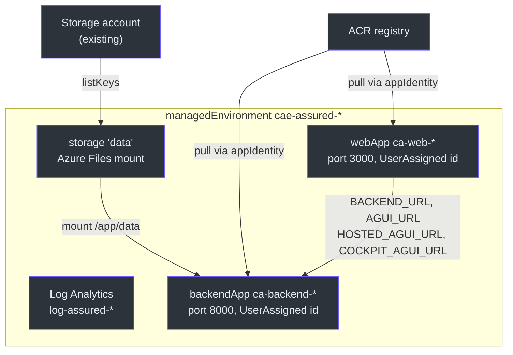
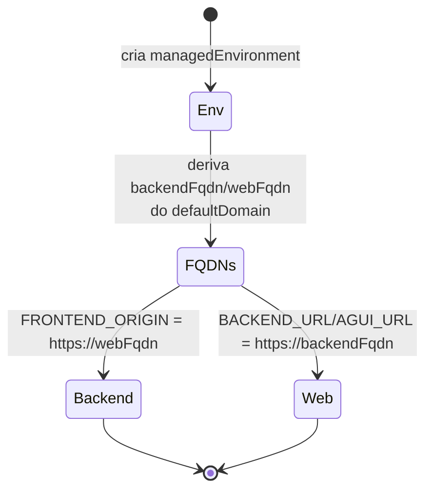

# Container Apps (`containerapps.bicep`)

> **Escopo.** [`infra/containerapps.bicep`](https://github.com/ruinosus/foundry-assured/blob/3333d60d0e9c02b64a532f2c9bad94692cf50075/infra/containerapps.bicep) — o `module apps` composto por `main.bicep` e `managedApp.bicep`. Provisiona o backend FastAPI e o frontend Next.js como Azure Container Apps. Os hosted agents **não** estão aqui (são `azure.ai.agent`, ver [Hosted Agents](./page-7.md)).

## Por que Container Apps (e por que scale-to-zero)

Backend e web precisam de HTTP ingress público, mas o showcase fica ocioso a maior parte do tempo. Container Apps com `minReplicas: 0` dá **idle = $0** (cold start na primeira requisição) — a postura de custo de [`docs/COST.md`](https://github.com/ruinosus/foundry-assured/blob/3333d60d0e9c02b64a532f2c9bad94692cf50075/docs/COST.md). O web escala `min 0 / max 3` ([containerapps.bicep:196](https://github.com/ruinosus/foundry-assured/blob/3333d60d0e9c02b64a532f2c9bad94692cf50075/infra/containerapps.bicep#L196)), o backend `min 0 / max 1` ([containerapps.bicep:150-152](https://github.com/ruinosus/foundry-assured/blob/3333d60d0e9c02b64a532f2c9bad94692cf50075/infra/containerapps.bicep#L150-L152)).

**Fato — backend trava em 1 réplica de propósito.** O comentário explica: o `tickets.jsonl` é append-based, então >1 escritor poderia intercalar/corromper o arquivo ([containerapps.bicep:150-152](https://github.com/ruinosus/foundry-assured/blob/3333d60d0e9c02b64a532f2c9bad94692cf50075/infra/containerapps.bicep#L150-L152)).

## Topologia

<!-- Sources: infra/containerapps.bicep:56-199 -->

## Os recursos

| Recurso | Tipo | Nome | Source |
|---|---|---|---|
| Log Analytics | `Microsoft.OperationalInsights/workspaces@2023-09-01` | `log-assured-${token}` | [containerapps.bicep:46-54](https://github.com/ruinosus/foundry-assured/blob/3333d60d0e9c02b64a532f2c9bad94692cf50075/infra/containerapps.bicep#L46-L54) |
| Managed env | `Microsoft.App/managedEnvironments@2024-03-01` | `cae-assured-${token}` | [containerapps.bicep:56-69](https://github.com/ruinosus/foundry-assured/blob/3333d60d0e9c02b64a532f2c9bad94692cf50075/infra/containerapps.bicep#L56-L69) |
| Storage mount | `.../managedEnvironments/storages@2024-03-01` | `data` (Azure Files RW) | [containerapps.bicep:77-88](https://github.com/ruinosus/foundry-assured/blob/3333d60d0e9c02b64a532f2c9bad94692cf50075/infra/containerapps.bicep#L77-L88) |
| Backend app | `Microsoft.App/containerApps@2024-03-01` | `ca-backend-${token}` | [containerapps.bicep:95-155](https://github.com/ruinosus/foundry-assured/blob/3333d60d0e9c02b64a532f2c9bad94692cf50075/infra/containerapps.bicep#L95-L155) |
| Web app | `Microsoft.App/containerApps@2024-03-01` | `ca-web-${token}` | [containerapps.bicep:157-199](https://github.com/ruinosus/foundry-assured/blob/3333d60d0e9c02b64a532f2c9bad94692cf50075/infra/containerapps.bicep#L157-L199) |

> **Caveat de duplicação (importante para o stamp dedicado).** Este módulo declara um Log Analytics `log-assured-${resourceToken}` ([containerapps.bicep:46-54](https://github.com/ruinosus/foundry-assured/blob/3333d60d0e9c02b64a532f2c9bad94692cf50075/infra/containerapps.bicep#L46-L54)) — **o mesmo nome** que `resources.bicep` também declara ([resources.bicep:140-148](https://github.com/ruinosus/foundry-assured/blob/3333d60d0e9c02b64a532f2c9bad94692cf50075/infra/resources.bicep#L140-L148)). Como dois deployments aninhados separados, isso **converge sob modo Incremental** (idempotente), mas é frágil sob Complete. É por isso que o stamp dedicado fixa Incremental — ver [O Stamp Dedicado](./page-5.md).

## Quebra da referência circular backend ⇄ web

O backend precisa do FQDN do web (para `FRONTEND_ORIGIN`/CORS) e o web precisa do FQDN do backend (para proxiar AG-UI). A solução: **derivar os dois FQDNs do `defaultDomain` do ambiente** (criado primeiro), em vez de ler o FQDN um do outro ([containerapps.bicep:90-93](https://github.com/ruinosus/foundry-assured/blob/3333d60d0e9c02b64a532f2c9bad94692cf50075/infra/containerapps.bicep#L90-L93)).

<!-- Sources: infra/containerapps.bicep:90-93, infra/containerapps.bicep:136, infra/containerapps.bicep:187-192 -->

## Configuração do backend (novas env vars de domínio)

O backend roda como identidade `UserAssigned` ([containerapps.bicep:99-102](https://github.com/ruinosus/foundry-assured/blob/3333d60d0e9c02b64a532f2c9bad94692cf50075/infra/containerapps.bicep#L99-L102)), ingress na porta 8000 ([containerapps.bicep:107-111](https://github.com/ruinosus/foundry-assured/blob/3333d60d0e9c02b64a532f2c9bad94692cf50075/infra/containerapps.bicep#L107-L111)) e estas env vars ([containerapps.bicep:125-141](https://github.com/ruinosus/foundry-assured/blob/3333d60d0e9c02b64a532f2c9bad94692cf50075/infra/containerapps.bicep#L125-L141)):

| Env var | Valor | Source |
|---|---|---|
| `FOUNDRY_PROJECT_ENDPOINT` / `FOUNDRY_MODEL` | params do módulo | [containerapps.bicep:126-127](https://github.com/ruinosus/foundry-assured/blob/3333d60d0e9c02b64a532f2c9bad94692cf50075/infra/containerapps.bicep#L126-L127) |
| `AZURE_SEARCH_ENDPOINT` / `AZURE_SEARCH_KNOWLEDGE_BASE` | params | [containerapps.bicep:128-129](https://github.com/ruinosus/foundry-assured/blob/3333d60d0e9c02b64a532f2c9bad94692cf50075/infra/containerapps.bicep#L128-L129) |
| `SELFWIKI_SEARCH_KNOWLEDGE_BASE` **NOVO** | `selfwiki-kb` (monta `/selfwiki`) | [containerapps.bicep:130-132](https://github.com/ruinosus/foundry-assured/blob/3333d60d0e9c02b64a532f2c9bad94692cf50075/infra/containerapps.bicep#L130-L132) |
| `MCP_ENABLED` **NOVO** | `true` (monta `/platform`, tool-driven) | [containerapps.bicep:133-135](https://github.com/ruinosus/foundry-assured/blob/3333d60d0e9c02b64a532f2c9bad94692cf50075/infra/containerapps.bicep#L133-L135) |
| `FRONTEND_ORIGIN` | `https://${webFqdn}` (CORS) | [containerapps.bicep:136](https://github.com/ruinosus/foundry-assured/blob/3333d60d0e9c02b64a532f2c9bad94692cf50075/infra/containerapps.bicep#L136) |
| `AZURE_CLIENT_ID` | client id da app identity (DefaultAzureCredential) | [containerapps.bicep:137](https://github.com/ruinosus/foundry-assured/blob/3333d60d0e9c02b64a532f2c9bad94692cf50075/infra/containerapps.bicep#L137) |
| `ENTRA_*` (OBO) | tenant/client + `secretRef` ao secret | [containerapps.bicep:138-140](https://github.com/ruinosus/foundry-assured/blob/3333d60d0e9c02b64a532f2c9bad94692cf50075/infra/containerapps.bicep#L138-L140) |

**Por que as duas novas env vars.** `SELFWIKI_SEARCH_KNOWLEDGE_BASE` liga o domínio **selfwiki** (grounded na deep-wiki deste repo) — setando-o o backend monta `/selfwiki`; o comentário lembra de ingerir a `selfwiki-kb` (o `build_selfwiki_agent` tolera KB ausente no boot) ([containerapps.bicep:130-132](https://github.com/ruinosus/foundry-assured/blob/3333d60d0e9c02b64a532f2c9bad94692cf50075/infra/containerapps.bicep#L130-L132)). `MCP_ENABLED=true` liga o domínio **platform** (tool-driven, MCP) — no código o default é `false`, então `/platform` só monta com isso ligado; os servers MS first-party (Learn etc.) não precisam de infra extra ([containerapps.bicep:133-135](https://github.com/ruinosus/foundry-assured/blob/3333d60d0e9c02b64a532f2c9bad94692cf50075/infra/containerapps.bicep#L133-L135)).

**Segredo OBO via Container App secret.** `entraApiClientSecret` é `@secure()` ([containerapps.bicep:33-34](https://github.com/ruinosus/foundry-assured/blob/3333d60d0e9c02b64a532f2c9bad94692cf50075/infra/containerapps.bicep#L33-L34)), virado em secret `entra-api-secret` ([containerapps.bicep:115-117](https://github.com/ruinosus/foundry-assured/blob/3333d60d0e9c02b64a532f2c9bad94692cf50075/infra/containerapps.bicep#L115-L117)) e referenciado por `secretRef`, nunca literal.

### Persistência

O share `data` (Azure Files) é montado em `/app/data`; é onde `tickets.jsonl` persiste ([containerapps.bicep:142-149](https://github.com/ruinosus/foundry-assured/blob/3333d60d0e9c02b64a532f2c9bad94692cf50075/infra/containerapps.bicep#L142-L149)). O acesso ao Files é só por account-key (não há MI para a share key), por isso o módulo a obtém via `listKeys()` ([containerapps.bicep:71-88](https://github.com/ruinosus/foundry-assured/blob/3333d60d0e9c02b64a532f2c9bad94692cf50075/infra/containerapps.bicep#L71-L88)).

## Configuração do web (endpoints AG-UI)

O web roda na porta 3000 ([containerapps.bicep:168-173](https://github.com/ruinosus/foundry-assured/blob/3333d60d0e9c02b64a532f2c9bad94692cf50075/infra/containerapps.bicep#L168-L173)) e recebe os endpoints AG-UI server-side ([containerapps.bicep:184-192](https://github.com/ruinosus/foundry-assured/blob/3333d60d0e9c02b64a532f2c9bad94692cf50075/infra/containerapps.bicep#L184-L192)): `BACKEND_URL`, `AGUI_URL` (`/helpdesk`), `HOSTED_AGUI_URL` (`/helpdesk-hosted`) e `COCKPIT_AGUI_URL` (`/cockpit`). As `NEXT_PUBLIC_*` (browser-side) são baked na imagem no build, via `buildArgs` em [`azure.yaml:69-72`](https://github.com/ruinosus/foundry-assured/blob/3333d60d0e9c02b64a532f2c9bad94692cf50075/azure.yaml#L69-L72).

> **Observação (consistência com o drop dos grounded twins):** o web ainda injeta `HOSTED_AGUI_URL` → `/helpdesk-hosted` ([containerapps.bicep:189](https://github.com/ruinosus/foundry-assured/blob/3333d60d0e9c02b64a532f2c9bad94692cf50075/infra/containerapps.bicep#L189)) — e esse é o único twin hosted grounded que **sobreviveu** (o frontend mantém `helpdesk-hosted`; o backend serve `/helpdesk-hosted`). Não há env var análoga para cockpit/selfwiki hosted — coerente com o drop desses twins (ver [Hosted Agents](./page-7.md)). O `COCKPIT_AGUI_URL` aponta para `/cockpit` (o agente **vivo**, não um twin hosted).

## Imagem placeholder

Ambos os apps nascem com `mcr.microsoft.com/azuredocs/containerapps-helloworld:latest` ([containerapps.bicep:42](https://github.com/ruinosus/foundry-assured/blob/3333d60d0e9c02b64a532f2c9bad94692cf50075/infra/containerapps.bicep#L42)); o azd substitui pela imagem real no `deploy`, casando pela tag `azd-service-name` (`backend`/`web`) ([containerapps.bicep:98](https://github.com/ruinosus/foundry-assured/blob/3333d60d0e9c02b64a532f2c9bad94692cf50075/infra/containerapps.bicep#L98), [:160](https://github.com/ruinosus/foundry-assured/blob/3333d60d0e9c02b64a532f2c9bad94692cf50075/infra/containerapps.bicep#L160)).

## Related Pages

| Página | Relação |
|---|---|
| [Recursos Compartilhados](./page-3.md) | provê a identidade, o ACR e o storage usados aqui |
| [O Stack azd](./page-2.md) | compõe este módulo e re-exporta `BACKEND_URL`/`WEB_URL` |
| [O Stamp Dedicado](./page-5.md) | re-usa este módulo e fixa Incremental por causa do Log Analytics duplicado |
| [Hosted Agents](./page-7.md) | por que só `helpdesk-hosted` tem env var no web |
