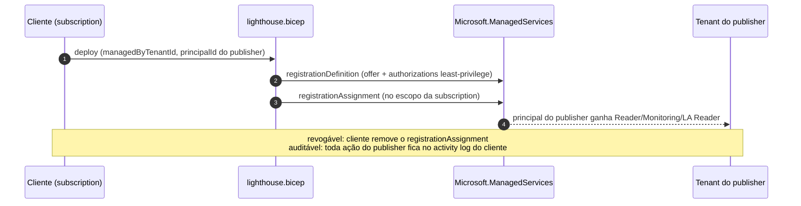
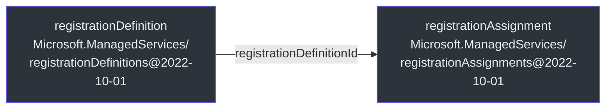

# Azure Lighthouse — Delegação Cross-Tenant

> **Escopo.** [`infra/lighthouse/`](https://github.com/ruinosus/foundry-assured/blob/3333d60d0e9c02b64a532f2c9bad94692cf50075/infra/lighthouse/lighthouse.bicep) — `lighthouse.bicep` + `parameters.json`. É o veículo do **shared model**: o cliente delega escopos específicos ao tenant do publisher para operar recursos de data-plane cross-tenant, sem nunca possuir os dados do cliente.

## Por que Lighthouse (e não outra coisa)

ADR-002 escolhe Lighthouse para o gerenciamento de data-plane no shared model: o cliente delega subscriptions/RGs ao publisher; ele gerencia esses recursos cross-tenant a partir do próprio tenant, e o cliente mantém visibilidade total e pode **revogar a qualquer momento** ([lighthouse.bicep:3-7](https://github.com/ruinosus/foundry-assured/blob/3333d60d0e9c02b64a532f2c9bad94692cf50075/infra/lighthouse/lighthouse.bicep#L3-L7)).

**Fato — quem deploya é o cliente.** O comentário deixa claro: o **cliente** implanta este template na **própria** subscription (subscription scope) — não roda a partir do tenant do publisher ([lighthouse.bicep:9-12](https://github.com/ruinosus/foundry-assured/blob/3333d60d0e9c02b64a532f2c9bad94692cf50075/infra/lighthouse/lighthouse.bicep#L9-L12)). Daí `targetScope = 'subscription'` ([lighthouse.bicep:20](https://github.com/ruinosus/foundry-assured/blob/3333d60d0e9c02b64a532f2c9bad94692cf50075/infra/lighthouse/lighthouse.bicep#L20)).

> **Fato (rename não propagou):** o `lighthouse.bicep` **não** foi renomeado para "assured" — o cabeçalho ainda diz "Foundry Helpdesk", e os defaults de offer trazem `mspOfferName = 'Foundry Helpdesk — managed data-plane operations'` e `principalIdDisplayName = 'Foundry Helpdesk Operations'` ([lighthouse.bicep:26](https://github.com/ruinosus/foundry-assured/blob/3333d60d0e9c02b64a532f2c9bad94692cf50075/infra/lighthouse/lighthouse.bicep#L26), [:35](https://github.com/ruinosus/foundry-assured/blob/3333d60d0e9c02b64a532f2c9bad94692cf50075/infra/lighthouse/lighthouse.bicep#L35)). Inconsistência cosmética de naming, não funcional.

## O modelo de delegação

<!-- Sources: infra/lighthouse/lighthouse.bicep:68-83 -->

## Os parâmetros

| Parâmetro | Default | Papel | Source |
|---|---|---|---|
| `managedByTenantId` | — | tenant do publisher que operará os escopos | [lighthouse.bicep:22-23](https://github.com/ruinosus/foundry-assured/blob/3333d60d0e9c02b64a532f2c9bad94692cf50075/infra/lighthouse/lighthouse.bicep#L22-L23) |
| `mspOfferName` | "Foundry Helpdesk — managed data-plane operations" | nome do offer mostrado ao cliente | [lighthouse.bicep:25-26](https://github.com/ruinosus/foundry-assured/blob/3333d60d0e9c02b64a532f2c9bad94692cf50075/infra/lighthouse/lighthouse.bicep#L25-L26) |
| `mspOfferDescription` | descrição least-privilege/revogável | texto do offer | [lighthouse.bicep:28-29](https://github.com/ruinosus/foundry-assured/blob/3333d60d0e9c02b64a532f2c9bad94692cf50075/infra/lighthouse/lighthouse.bicep#L28-L29) |
| `principalId` | — | objeto (no tenant do publisher) que recebe as roles | [lighthouse.bicep:31-32](https://github.com/ruinosus/foundry-assured/blob/3333d60d0e9c02b64a532f2c9bad94692cf50075/infra/lighthouse/lighthouse.bicep#L31-L32) |
| `principalIdDisplayName` | "Foundry Helpdesk Operations" | nome amigável no activity log do cliente | [lighthouse.bicep:34-35](https://github.com/ruinosus/foundry-assured/blob/3333d60d0e9c02b64a532f2c9bad94692cf50075/infra/lighthouse/lighthouse.bicep#L34-L35) |

Os valores de exemplo (placeholders `00000000-...`) vivem em [`parameters.json`](https://github.com/ruinosus/foundry-assured/blob/3333d60d0e9c02b64a532f2c9bad94692cf50075/infra/lighthouse/parameters.json).

## Least-privilege: três roles, sem Owner/Contributor

A escolha de segurança central — o publisher **opera e observa, não possui** ([lighthouse.bicep:37-42](https://github.com/ruinosus/foundry-assured/blob/3333d60d0e9c02b64a532f2c9bad94692cf50075/infra/lighthouse/lighthouse.bicep#L37-L42)):

| Role | GUID (built-in, estável) | Por quê | Source |
|---|---|---|---|
| **Reader** | `acdd72a7-3385-48ef-bd42-f606fba81ae7` | visibilidade de leitura completa no escopo delegado | [lighthouse.bicep:43](https://github.com/ruinosus/foundry-assured/blob/3333d60d0e9c02b64a532f2c9bad94692cf50075/infra/lighthouse/lighthouse.bicep#L43) |
| **Monitoring Contributor** | `749f88d5-cbae-40b8-bcfc-e573ddc772fa` | ler/operar diagnósticos, métricas, alertas (suporte) | [lighthouse.bicep:44](https://github.com/ruinosus/foundry-assured/blob/3333d60d0e9c02b64a532f2c9bad94692cf50075/infra/lighthouse/lighthouse.bicep#L44) |
| **Log Analytics Reader** | `73c42c96-874c-492b-b04d-ab87d138a893` | ler logs da aplicação no workspace para triagem | [lighthouse.bicep:45](https://github.com/ruinosus/foundry-assured/blob/3333d60d0e9c02b64a532f2c9bad94692cf50075/infra/lighthouse/lighthouse.bicep#L45) |

As três roles são montadas no array `authorizations`, todas para o mesmo `principalId` ([lighthouse.bicep:47-63](https://github.com/ruinosus/foundry-assured/blob/3333d60d0e9c02b64a532f2c9bad94692cf50075/infra/lighthouse/lighthouse.bicep#L47-L63)). **NÃO há Owner nem Contributor** — explicitamente, por ser least-privilege ([lighthouse.bicep:42](https://github.com/ruinosus/foundry-assured/blob/3333d60d0e9c02b64a532f2c9bad94692cf50075/infra/lighthouse/lighthouse.bicep#L42)).

> **Disciplina de assinaturas (regra #1).** O cabeçalho afirma que tipos/GUIDs foram verificados contra a referência Bicep do Lighthouse (`Microsoft.ManagedServices`) e os GUIDs cruzados com `az role definition list`, não inventados ([lighthouse.bicep:14-18](https://github.com/ruinosus/foundry-assured/blob/3333d60d0e9c02b64a532f2c9bad94692cf50075/infra/lighthouse/lighthouse.bicep#L14-L18)).

## Os recursos

<!-- Sources: infra/lighthouse/lighthouse.bicep:68-86 -->

- **`registrationDefinition`** — define o offer (nome, descrição, `managedByTenantId`, `authorizations`); o nome é um GUID determinístico de `(mspOfferName, managedByTenantId, subscriptionId)` para deploys idempotentes ([lighthouse.bicep:66-76](https://github.com/ruinosus/foundry-assured/blob/3333d60d0e9c02b64a532f2c9bad94692cf50075/infra/lighthouse/lighthouse.bicep#L66-L76)).
- **`registrationAssignment`** — aplica a definição no escopo da subscription; nome derivado de `guid(registrationName, subscriptionId)` ([lighthouse.bicep:78-83](https://github.com/ruinosus/foundry-assured/blob/3333d60d0e9c02b64a532f2c9bad94692cf50075/infra/lighthouse/lighthouse.bicep#L78-L83)).

Outputs: os IDs da definição e da assignment ([lighthouse.bicep:85-86](https://github.com/ruinosus/foundry-assured/blob/3333d60d0e9c02b64a532f2c9bad94692cf50075/infra/lighthouse/lighthouse.bicep#L85-L86)).

## Managed App vs Lighthouse — quando cada um

| Dimensão | Managed Application (stamp dedicado) | Lighthouse (shared model) |
|---|---|---|
| O que entrega | control plane dedicado na sub do cliente | gerenciamento cross-tenant do data-plane |
| Quem deploya | a plataforma (a partir do offer do publisher) | o **cliente**, na própria subscription |
| Recursos criados | Foundry, Search, CA... (toda a stack) | só delegação (`registrationDefinition`/`Assignment`) |
| Reversível | desinstalar a managed app | remover o `registrationAssignment` (revogável) |
| Source | [managedApp.bicep](https://github.com/ruinosus/foundry-assured/blob/3333d60d0e9c02b64a532f2c9bad94692cf50075/infra/managed-app/managedApp.bicep) | [lighthouse.bicep](https://github.com/ruinosus/foundry-assured/blob/3333d60d0e9c02b64a532f2c9bad94692cf50075/infra/lighthouse/lighthouse.bicep) |

## Related Pages

| Página | Relação |
|---|---|
| [O Stamp Dedicado](./page-5.md) | o veículo complementar decidido no mesmo ADR-002 |
| [Recursos Compartilhados](./page-3.md) | os recursos que o publisher observa via as roles delegadas |
| [Visão Geral](./page-1.md) | os três veículos de entrega em contexto |
