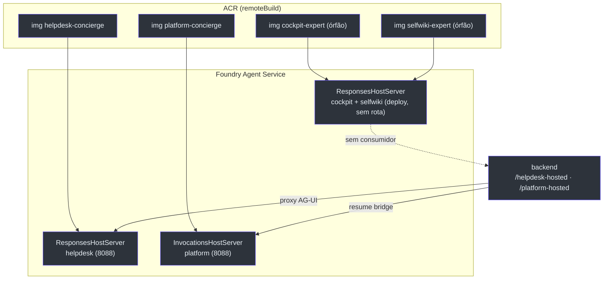

# Hosted Agents (`azure.ai.agent`) e o twin selfwiki órfão

> **Escopo.** Os **quatro** serviços declarados com `host: azure.ai.agent` em [`azure.yaml`](https://github.com/ruinosus/foundry-assured/blob/3333d60d0e9c02b64a532f2c9bad94692cf50075/azure.yaml) e seus diretórios: [`apps/hosted-agent`](https://github.com/ruinosus/foundry-assured/blob/3333d60d0e9c02b64a532f2c9bad94692cf50075/apps/hosted-agent/main.py), [`apps/hosted-cockpit`](https://github.com/ruinosus/foundry-assured/blob/3333d60d0e9c02b64a532f2c9bad94692cf50075/apps/hosted-cockpit/main.py), [`apps/hosted-platform`](https://github.com/ruinosus/foundry-assured/blob/3333d60d0e9c02b64a532f2c9bad94692cf50075/apps/hosted-platform/main.py) e o **novo** [`apps/hosted-selfwiki`](https://github.com/ruinosus/foundry-assured/blob/3333d60d0e9c02b64a532f2c9bad94692cf50075/apps/hosted-selfwiki/main.py). Estes **não** são Container Apps — são containers servidos pelo Foundry Agent Service.

## ⚠ O achado principal desta versão: dois hosted agents órfãos

**Fato (lido no código):** o backend **largou os grounded hosted twins** — grounded (cockpit, selfwiki) agora roda **live-OBO** no caminho nativo. O frontend removeu o `hostedAgentId` das entradas cockpit e selfwiki (commit `721c167`), mas `azure.yaml` **continua declarando** `cockpit-expert` e `selfwiki-expert` como serviços `azure.ai.agent`. Resultado: dois hosted agents **provisionados-mas-sem-consumidor**.

A cadeia de evidências:

| Elo | Estado | Source |
|---|---|---|
| `azure.yaml` declara `cockpit-expert` **e** `selfwiki-expert` | ✅ declarados (azd os builda + deploya) | [azure.yaml:14-37](https://github.com/ruinosus/foundry-assured/blob/3333d60d0e9c02b64a532f2c9bad94692cf50075/azure.yaml#L14-L37) |
| Frontend `domains.ts`: só `helpdesk` e `platform` têm `hostedAgentId` | ❌ cockpit/selfwiki **sem** hostedAgentId | [domains.ts:45](https://github.com/ruinosus/foundry-assured/blob/3333d60d0e9c02b64a532f2c9bad94692cf50075/apps/frontend/lib/domains.ts#L45), [:90](https://github.com/ruinosus/foundry-assured/blob/3333d60d0e9c02b64a532f2c9bad94692cf50075/apps/frontend/lib/domains.ts#L90) |
| Backend `chat.py`: só `/helpdesk-hosted` e `/platform-hosted` | ❌ não há `/cockpit-hosted` nem `/selfwiki-hosted` | [chat.py:12](https://github.com/ruinosus/foundry-assured/blob/3333d60d0e9c02b64a532f2c9bad94692cf50075/apps/backend/app/api/chat.py#L12), [:29](https://github.com/ruinosus/foundry-assured/blob/3333d60d0e9c02b64a532f2c9bad94692cf50075/apps/backend/app/api/chat.py#L29) |
| `tenant.py`: `cockpit_hosted_agent_name`/`selfwiki_hosted_agent_name` definidos | ⚠ campos **definidos-mas-não-usados** | [tenant.py:90-91](https://github.com/ruinosus/foundry-assured/blob/3333d60d0e9c02b64a532f2c9bad94692cf50075/apps/backend/app/core/tenant.py#L90-L91) |
| `hook-postdeploy.sh`: RBAC ainda concedido a `cockpit-expert selfwiki-expert` | ⚠ infra paga (RBAC + deploy) sem consumidor | [hook-postdeploy.sh:15](https://github.com/ruinosus/foundry-assured/blob/3333d60d0e9c02b64a532f2c9bad94692cf50075/scripts/hook-postdeploy.sh#L15) |

**Conclusão (o mecanismo denuncia a si mesmo):** `apps/hosted-selfwiki` (`selfwiki-expert`) — e igualmente `apps/hosted-cockpit` (`cockpit-expert`) — são **código órfão a nível de deployment**: `azd up` os builda, deploya e o `hook-postdeploy.sh` ainda reconcilia o RBAC de runtime deles ([hook-postdeploy.sh:42-58](https://github.com/ruinosus/foundry-assured/blob/3333d60d0e9c02b64a532f2c9bad94692cf50075/scripts/hook-postdeploy.sh#L42-L58)), mas **nenhuma rota do frontend ou do backend os invoca**. Só `helpdesk-concierge` (via `/helpdesk-hosted`) e `platform-concierge` (via `/platform-hosted`) têm consumidor vivo. Higienização pendente: ou remover `selfwiki-expert`/`cockpit-expert` de `azure.yaml` + do `AGENTS` do hook (e apagar os dirs + os campos `*_hosted_agent_name`), ou re-ligar um twin hosted no frontend.

## Os quatro agentes

| Serviço | Dir | Protocolo | Consumidor vivo? | Source |
|---|---|---|---|---|
| `helpdesk-concierge` | `apps/hosted-agent` | **Responses** | ✅ `/helpdesk-hosted` | [hosted-agent/main.py:107](https://github.com/ruinosus/foundry-assured/blob/3333d60d0e9c02b64a532f2c9bad94692cf50075/apps/hosted-agent/main.py#L107) |
| `platform-concierge` | `apps/hosted-platform` | **Invocations** | ✅ `/platform-hosted` | [hosted-platform/main.py:76](https://github.com/ruinosus/foundry-assured/blob/3333d60d0e9c02b64a532f2c9bad94692cf50075/apps/hosted-platform/main.py#L76) |
| `cockpit-expert` | `apps/hosted-cockpit` | **Responses** | ❌ **órfão** | [hosted-cockpit/agent.yaml:1-5](https://github.com/ruinosus/foundry-assured/blob/3333d60d0e9c02b64a532f2c9bad94692cf50075/apps/hosted-cockpit/agent.yaml#L1-L5) |
| `selfwiki-expert` **NOVO** | `apps/hosted-selfwiki` | **Responses** | ❌ **órfão** | [hosted-selfwiki/main.py:86-87](https://github.com/ruinosus/foundry-assured/blob/3333d60d0e9c02b64a532f2c9bad94692cf50075/apps/hosted-selfwiki/main.py#L86-L87) |

<!-- Sources: apps/backend/app/api/chat.py:12-34, apps/frontend/lib/domains.ts:45, scripts/hook-postdeploy.sh:15 -->

## Responses vs Invocations (o porquê do platform)

A distinção-chave. Os agentes "grounded" (helpdesk, cockpit, selfwiki) servem **Responses** porque Q&A puro cabe num modelo single-identity request/response — e por isso **largam** OBO/memória/HITL ([hosted-agent/main.py:9-16](https://github.com/ruinosus/foundry-assured/blob/3333d60d0e9c02b64a532f2c9bad94692cf50075/apps/hosted-agent/main.py#L9-L16), [hosted-selfwiki/main.py:6-8](https://github.com/ruinosus/foundry-assured/blob/3333d60d0e9c02b64a532f2c9bad94692cf50075/apps/hosted-selfwiki/main.py#L6-L8)).

O `platform-concierge` é diferente: mantém **capacidade de tool + a interrupção de write-approval**, o que Responses **não** round-trippa. Por isso serve **Invocations** (raw AG-UI) via `InvocationsHostServer` ([hosted-platform/main.py:5-14](https://github.com/ruinosus/foundry-assured/blob/3333d60d0e9c02b64a532f2c9bad94692cf50075/apps/hosted-platform/main.py#L5-L14), [:76](https://github.com/ruinosus/foundry-assured/blob/3333d60d0e9c02b64a532f2c9bad94692cf50075/apps/hosted-platform/main.py#L76)). É o "FULL-PARITY Invocations twin" do agente vivo de platform — não o stripping single-identity dos grounded ([hosted-platform/main.py:10-14](https://github.com/ruinosus/foundry-assured/blob/3333d60d0e9c02b64a532f2c9bad94692cf50075/apps/hosted-platform/main.py#L10-L14)).

| | Responses | Invocations |
|---|---|---|
| Host server | `ResponsesHostServer` | `InvocationsHostServer` |
| Suporta interrupt/HITL | não | **sim** |
| Agentes | helpdesk, cockpit, selfwiki | platform |
| `protocol` no agent.yaml | `responses` | `invocations` |
| Source | [hosted-agent/agent.yaml:3-5](https://github.com/ruinosus/foundry-assured/blob/3333d60d0e9c02b64a532f2c9bad94692cf50075/apps/hosted-agent/agent.yaml#L3-L5) | [hosted-platform/agent.yaml:3-5](https://github.com/ruinosus/foundry-assured/blob/3333d60d0e9c02b64a532f2c9bad94692cf50075/apps/hosted-platform/agent.yaml#L3-L5) |

## helpdesk-concierge — workflow como agente

O `main.py` reconstrói o pipeline `triage→retrieve→resolve` com `WorkflowBuilder`, cada passo um `AgentExecutor` com `context_mode="last_agent"` ([hosted-agent/main.py:73-105](https://github.com/ruinosus/foundry-assured/blob/3333d60d0e9c02b64a532f2c9bad94692cf50075/apps/hosted-agent/main.py#L73-L105)). Aterrissa na mesma Foundry IQ KB via `AzureAISearchContextProvider(mode="agentic")` ([hosted-agent/main.py:63-68](https://github.com/ruinosus/foundry-assured/blob/3333d60d0e9c02b64a532f2c9bad94692cf50075/apps/hosted-agent/main.py#L63-L68)). O workflow vira agente com `.as_agent()` e é servido por `ResponsesHostServer` ([hosted-agent/main.py:95-108](https://github.com/ruinosus/foundry-assured/blob/3333d60d0e9c02b64a532f2c9bad94692cf50075/apps/hosted-agent/main.py#L95-L108)). Auth é a identidade injetada pela plataforma via `DefaultAzureCredential` ([hosted-agent/main.py:54](https://github.com/ruinosus/foundry-assured/blob/3333d60d0e9c02b64a532f2c9bad94692cf50075/apps/hosted-agent/main.py#L54)).

## selfwiki-expert — o novo twin órfão (o que ELE faria)

Mesmo órfão, o container é funcional e espelha o cockpit: `FoundryChatClient` + `AzureAISearchContextProvider(mode="agentic", retrieval_reasoning_effort="medium")` sobre a `selfwiki-kb`, com instruções que espelham `app/agents/prompts.SELFWIKI_INSTRUCTIONS` (Q&A grounded sobre a deep-wiki deste repo, em pt-BR) ([hosted-selfwiki/main.py:59-87](https://github.com/ruinosus/foundry-assured/blob/3333d60d0e9c02b64a532f2c9bad94692cf50075/apps/hosted-selfwiki/main.py#L59-L87)). O `agent.yaml` fixa `AZURE_SEARCH_KNOWLEDGE_BASE: selfwiki-kb` (literal, criada data-plane pelo selfwiki ingest) ([hosted-selfwiki/agent.yaml:16-18](https://github.com/ruinosus/foundry-assured/blob/3333d60d0e9c02b64a532f2c9bad94692cf50075/apps/hosted-selfwiki/agent.yaml#L16-L18)). O próprio cabeçalho justifica o padrão hosted: "a MI do container PODE invocar hosted agents mas 403 na inferência de modelo raw" ([hosted-selfwiki/main.py:10-12](https://github.com/ruinosus/foundry-assured/blob/3333d60d0e9c02b64a532f2c9bad94692cf50075/apps/hosted-selfwiki/main.py#L10-L12)) — só que essa justificativa é a mesma que o commit `721c167` marcou como "agora falsa" (grounded roda live-OBO), o que é exatamente por que o twin ficou órfão.

## platform-concierge — tools via Toolbox (ADR-011)

As tools **não** são montadas por request (isso é o caminho OBO vivo, `build_mcp_tools()`); para um hosted agent, são configuradas **no Foundry Toolbox em deploy time**, resolvidas por `TOOLBOX_NAME` ([hosted-platform/main.py:16-21](https://github.com/ruinosus/foundry-assured/blob/3333d60d0e9c02b64a532f2c9bad94692cf50075/apps/hosted-platform/main.py#L16-L21), [:54-58](https://github.com/ruinosus/foundry-assured/blob/3333d60d0e9c02b64a532f2c9bad94692cf50075/apps/hosted-platform/main.py#L54-L58)). O passthrough de identidade OAuth é **DADO** no Toolbox/connection (ADR-011 / regra #6). O binding Toolbox↔agente é deploy-time e infra-gated, marcado com `TODO(infra-gated)` ([hosted-platform/main.py:60-63](https://github.com/ruinosus/foundry-assured/blob/3333d60d0e9c02b64a532f2c9bad94692cf50075/apps/hosted-platform/main.py#L60-L63)). **Detalhe:** `TOOLBOX_NAME` é usado por ser um nome **não-reservado** — a plataforma rejeita env vars `FOUNDRY_*`/`AGENT_*` no `agent.yaml` ([hosted-platform/agent.yaml:14-18](https://github.com/ruinosus/foundry-assured/blob/3333d60d0e9c02b64a532f2c9bad94692cf50075/apps/hosted-platform/agent.yaml#L14-L18)).

## Os containers

Os quatro Dockerfiles são quase idênticos: `python:3.12-slim`, copiam o dir para `user_agent/`, instalam `requirements.txt`, expõem 8088 e rodam `python main.py` ([hosted-selfwiki/Dockerfile:4-19](https://github.com/ruinosus/foundry-assured/blob/3333d60d0e9c02b64a532f2c9bad94692cf50075/apps/hosted-selfwiki/Dockerfile#L4-L19)). As deps diferem: os grounded (helpdesk/cockpit/selfwiki) incluem `agent-framework-azure-ai-search` (precisam do KB provider); platform não; todos têm `agent-framework-foundry-hosting` ([hosted-selfwiki/requirements.txt:1-4](https://github.com/ruinosus/foundry-assured/blob/3333d60d0e9c02b64a532f2c9bad94692cf50075/apps/hosted-selfwiki/requirements.txt#L1-L4), [hosted-platform/requirements.txt:1-3](https://github.com/ruinosus/foundry-assured/blob/3333d60d0e9c02b64a532f2c9bad94692cf50075/apps/hosted-platform/requirements.txt#L1-L3)).

## Related Pages

| Página | Relação |
|---|---|
| [Recursos Compartilhados](./page-3.md) | a role `projectToRegistry` que deixa o Foundry puxar estas imagens |
| [Container Apps](./page-4.md) | por que só `helpdesk-hosted` tem env var no web |
| [Custo, Parâmetros e Scripts](./page-9.md) | o `hook-postdeploy.sh` que ainda concede RBAC aos órfãos + `COST.md` conta 3, não 4 |
| [Visão Geral](./page-1.md) | os seis serviços de `azure.yaml` |
