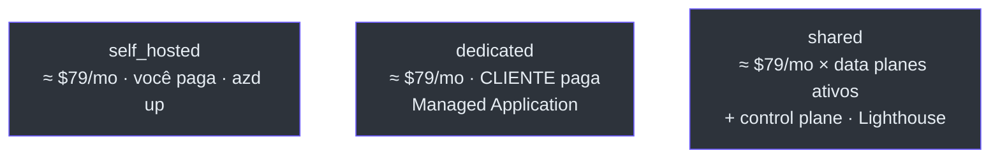
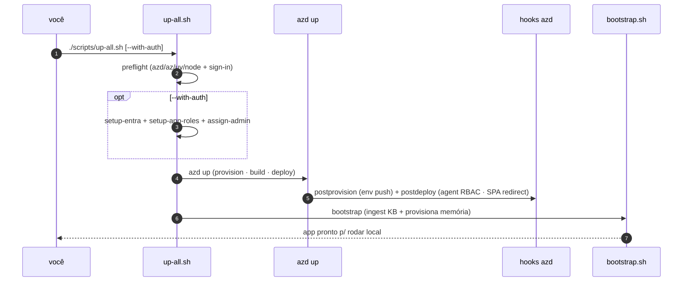
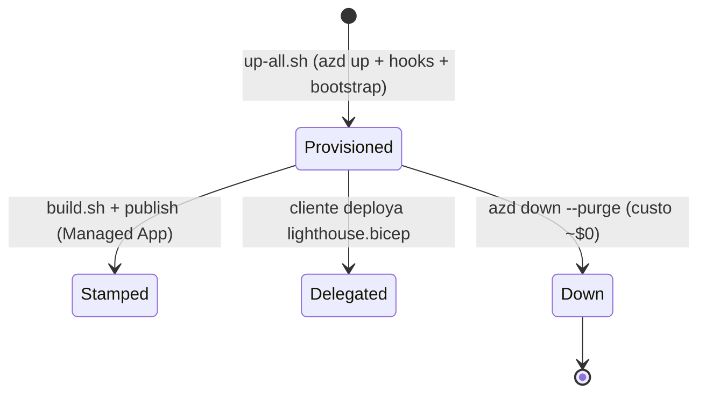

# Custo, Parâmetros e Referência de Scripts

> **Escopo.** Visão operacional transversal: custo (de [`docs/COST.md`](https://github.com/ruinosus/foundry-assured/blob/3333d60d0e9c02b64a532f2c9bad94692cf50075/docs/COST.md)), parâmetros/env vars dos templates e a referência dos `scripts/` de bring-up (novos na evolução v0.3.0).

## Custo — o piso always-on

**Bottom line:** o piso always-on é **≈ $79/mês (~$0,11/h)**, e **~93% disso é Azure AI Search Basic** ($73,73/mo). O resto é usage-based e **≈ $0 ocioso** (Container Apps escalam a zero, Log Analytics no tier grátis, storage é centavos) ([COST.md:12-17](https://github.com/ruinosus/foundry-assured/blob/3333d60d0e9c02b64a532f2c9bad94692cf50075/docs/COST.md#L12-L17)). O AI Search **não tem scale-to-zero**, então o controle de custo é `azd down`, não downsizing.

### ⚠ Inconsistência: `COST.md` conta 3 hosted agents, `azure.yaml` declara 4

**Fato (lido no código):** o `COST.md` (updated 2026-06-30) diz **"3 Foundry hosted agents"** — `helpdesk-concierge`, `cockpit-expert`, `platform-concierge` ([COST.md:60-63](https://github.com/ruinosus/foundry-assured/blob/3333d60d0e9c02b64a532f2c9bad94692cf50075/docs/COST.md#L60-L63)) e a linha de meters lista "hosted agents ×3" ([COST.md:85](https://github.com/ruinosus/foundry-assured/blob/3333d60d0e9c02b64a532f2c9bad94692cf50075/docs/COST.md#L85)). Mas `azure.yaml` declara **quatro** (o `selfwiki-expert` foi adicionado depois) ([azure.yaml:14-61](https://github.com/ruinosus/foundry-assured/blob/3333d60d0e9c02b64a532f2c9bad94692cf50075/azure.yaml#L14-L61)). O impacto de custo é baixo (hosted agents são usage-based, deprovisionam ~15 min após a última chamada — [COST.md:90-92](https://github.com/ruinosus/foundry-assured/blob/3333d60d0e9c02b64a532f2c9bad94692cf50075/docs/COST.md#L90-L92)) e, na prática, dois dos quatro são **órfãos** (ver [Hosted Agents](./page-7.md)), então nunca são invocados — mas a contagem no doc está desatualizada.

### Os meters

| Recurso | SKU | Preço (Retail API) | ~Mensal | Tipo | Source |
|---|---|---|---|---|---|
| **Azure AI Search** | Basic | **$0,101/h** | **≈ $73,73** | 🔴 fixo — o meter a vigiar | [COST.md:76](https://github.com/ruinosus/foundry-assured/blob/3333d60d0e9c02b64a532f2c9bad94692cf50075/docs/COST.md#L76) |
| **Container Registry** | Basic | $0,1666/dia | ≈ $5,07 | 🔴 fixo | [COST.md:77](https://github.com/ruinosus/foundry-assured/blob/3333d60d0e9c02b64a532f2c9bad94692cf50075/docs/COST.md#L77) |
| Foundry | Cognitive Services S0 | $0 platform fee | $0 | 🟢 pay-per-token | [COST.md:78](https://github.com/ruinosus/foundry-assured/blob/3333d60d0e9c02b64a532f2c9bad94692cf50075/docs/COST.md#L78) |
| Container Apps (backend+web) | Consumption, scale-to-zero | usage | ≈ $0 idle | 🟢 usage | [COST.md:79](https://github.com/ruinosus/foundry-assured/blob/3333d60d0e9c02b64a532f2c9bad94692cf50075/docs/COST.md#L79) |
| Log Analytics / App Insights | PerGB2018 | $2,30/GB (5 GB/mo grátis) | ≈ $0 demo | 🟡 usage | [COST.md:80](https://github.com/ruinosus/foundry-assured/blob/3333d60d0e9c02b64a532f2c9bad94692cf50075/docs/COST.md#L80) |
| Hosted agents (×3 no doc; ×4 no yaml) | Agent Service | compute + tokens | variável | 🟢 usage | [COST.md:85](https://github.com/ruinosus/foundry-assured/blob/3333d60d0e9c02b64a532f2c9bad94692cf50075/docs/COST.md#L85) |

### Custo por modo de deployment

<!-- Sources: docs/COST.md:99-103 -->

O mesmo Bicep serve três modos (ADR-007); o custo difere por **quem paga** e **o que é compartilhado** ([COST.md:96-103](https://github.com/ruinosus/foundry-assured/blob/3333d60d0e9c02b64a532f2c9bad94692cf50075/docs/COST.md#L96-L103)).

## Tabela consolidada de parâmetros

| Template | Parâmetro | Default | Source |
|---|---|---|---|
| `main.bicep` | `environmentName`, `location`, `principalId`, `appUsersGroupId`, `principalType`, `modelDeploymentName`, `searchLocation`, `entra*` | ver [page-2](./page-2.md) | [main.bicep:12-43](https://github.com/ruinosus/foundry-assured/blob/3333d60d0e9c02b64a532f2c9bad94692cf50075/infra/main.bicep#L12-L43) |
| `resources.bicep` | `modelVersion` | `2025-08-07` | [resources.bicep:35](https://github.com/ruinosus/foundry-assured/blob/3333d60d0e9c02b64a532f2c9bad94692cf50075/infra/resources.bicep#L35) |
| `resources.bicep` | `modelCapacity` / `embeddingCapacity` | `100` / `100` | [resources.bicep:38](https://github.com/ruinosus/foundry-assured/blob/3333d60d0e9c02b64a532f2c9bad94692cf50075/infra/resources.bicep#L38), [:47](https://github.com/ruinosus/foundry-assured/blob/3333d60d0e9c02b64a532f2c9bad94692cf50075/infra/resources.bicep#L47) |
| `resources.bicep` | `searchSkuName` | `basic` | [resources.bicep:50](https://github.com/ruinosus/foundry-assured/blob/3333d60d0e9c02b64a532f2c9bad94692cf50075/infra/resources.bicep#L50) |
| `managedApp.bicep` | `modelDeploymentName`, `searchLocation`, `entra*` | gpt-5-mini / `''` | [managedApp.bicep:26-40](https://github.com/ruinosus/foundry-assured/blob/3333d60d0e9c02b64a532f2c9bad94692cf50075/infra/managed-app/managedApp.bicep#L26-L40) |
| `lighthouse.bicep` | `managedByTenantId`, `principalId`, `mspOffer*` | ver [page-6](./page-6.md) | [lighthouse.bicep:22-35](https://github.com/ruinosus/foundry-assured/blob/3333d60d0e9c02b64a532f2c9bad94692cf50075/infra/lighthouse/lighthouse.bicep#L22-L35) |

O mapeamento `${VAR}`→parâmetro do azd vive em [`main.parameters.json:4-13`](https://github.com/ruinosus/foundry-assured/blob/3333d60d0e9c02b64a532f2c9bad94692cf50075/infra/main.parameters.json#L4-L13) — que **não** inclui `appUsersGroupId` (gap detalhado em [page-2](./page-2.md)).

## Referência de scripts (`scripts/`)

O grande acréscimo operacional da v0.3.0 é a pasta `scripts/` de bring-up automatizado. O orquestrador é `up-all.sh`; os hooks azd (declarados em [`azure.yaml:73-81`](https://github.com/ruinosus/foundry-assured/blob/3333d60d0e9c02b64a532f2c9bad94692cf50075/azure.yaml#L73-L81)) fazem o pós-provisionamento automático.

| Script | O que faz | Idempotente | Source |
|---|---|---|---|
| `up-all.sh` | one-shot: preflight → (opt) auth → `azd up` → `bootstrap.sh` | sim (cada estágio) | [up-all.sh:1-27](https://github.com/ruinosus/foundry-assured/blob/3333d60d0e9c02b64a532f2c9bad94692cf50075/scripts/up-all.sh#L1-L27) |
| `hook-postprovision.sh` | (hook azd) empurra `NEXT_PUBLIC_*`/`ENTRA_*` p/ o env azd antes do build web | sim | [hook-postprovision.sh:14-17](https://github.com/ruinosus/foundry-assured/blob/3333d60d0e9c02b64a532f2c9bad94692cf50075/scripts/hook-postprovision.sh#L14-L17) |
| `hook-postdeploy.sh` | (hook azd) RBAC de instância dos hosted agents + registra WEB_URL como SPA redirect | sim (no-op se já existe) | [hook-postdeploy.sh:1-11](https://github.com/ruinosus/foundry-assured/blob/3333d60d0e9c02b64a532f2c9bad94692cf50075/scripts/hook-postdeploy.sh#L1-L11) |
| `bootstrap.sh` | escreve `.env` a partir do azd env + ingesta KB + provisiona memória | sim | [bootstrap.sh:1-12](https://github.com/ruinosus/foundry-assured/blob/3333d60d0e9c02b64a532f2c9bad94692cf50075/scripts/bootstrap.sh#L1-L12) |
| `setup-entra.sh` | cria as 2 app regs (API + SPA), scope `access_as_user`, secret, known-client, consent | sim (reusa por display name) | [setup-entra.sh:1-17](https://github.com/ruinosus/foundry-assured/blob/3333d60d0e9c02b64a532f2c9bad94692cf50075/scripts/setup-entra.sh#L1-L17) |
| `setup-app-roles.sh` | declara os 4 app roles (Admin/Author/Approver/Reader) + perms Graph app-only | sim | [setup-app-roles.sh:1-8](https://github.com/ruinosus/foundry-assured/blob/3333d60d0e9c02b64a532f2c9bad94692cf50075/scripts/setup-app-roles.sh#L1-L8) |
| `assign-admin-role.sh` | atribui o app role Admin ao usuário (via Graph), default o signed-in | sim (409=já) | [assign-admin-role.sh:1-9](https://github.com/ruinosus/foundry-assured/blob/3333d60d0e9c02b64a532f2c9bad94692cf50075/scripts/assign-admin-role.sh#L1-L9) |
| `set-deploy-env.sh` | empurra os valores locais p/ o env azd (usado pelo postprovision) | sim | [set-deploy-env.sh:1](https://github.com/ruinosus/foundry-assured/blob/3333d60d0e9c02b64a532f2c9bad94692cf50075/scripts/set-deploy-env.sh#L1) |
| `dev-shared.sh` | roda o backend local em modo `shared` (multi-tenant, tenant store em memória) | n/a | [dev-shared.sh:42-45](https://github.com/ruinosus/foundry-assured/blob/3333d60d0e9c02b64a532f2c9bad94692cf50075/scripts/dev-shared.sh#L42-L45) |

### `up-all.sh` — o bring-up de uma linha

<!-- Sources: scripts/up-all.sh:49-110, scripts/hook-postdeploy.sh:41-59 -->

**Fato (lido no código):** `up-all.sh` faz preflight de ferramentas + sign-in ([up-all.sh:49-66](https://github.com/ruinosus/foundry-assured/blob/3333d60d0e9c02b64a532f2c9bad94692cf50075/scripts/up-all.sh#L49-L66)), opcionalmente cria as app regs + app roles + auto-Admin com `--with-auth` **antes** de provisionar (porque o build web bake dos `NEXT_PUBLIC_*` em build time) ([up-all.sh:68-87](https://github.com/ruinosus/foundry-assured/blob/3333d60d0e9c02b64a532f2c9bad94692cf50075/scripts/up-all.sh#L68-L87)), roda `azd up` ([up-all.sh:100-103](https://github.com/ruinosus/foundry-assured/blob/3333d60d0e9c02b64a532f2c9bad94692cf50075/scripts/up-all.sh#L100-L103)) e por fim `bootstrap.sh` como estágio **explícito e visível** — o ingest da KB é lento e frágil, então NÃO fica num hook silencioso ([up-all.sh:105-110](https://github.com/ruinosus/foundry-assured/blob/3333d60d0e9c02b64a532f2c9bad94692cf50075/scripts/up-all.sh#L105-L110)). Flags: `--provision-only` (só `azd provision`) e `--with-auth` ([up-all.sh:34-43](https://github.com/ruinosus/foundry-assured/blob/3333d60d0e9c02b64a532f2c9bad94692cf50075/scripts/up-all.sh#L34-L43)).

### Os dois hooks azd (o que o Bicep não consegue)

- **`postprovision`** — roda após a infra, **antes** do build/deploy: empurra `NEXT_PUBLIC_*`/`ENTRA_*` do `.env` local para o env azd (o build web bake o sign-in em build time), via `set-deploy-env.sh` ([hook-postprovision.sh:1-17](https://github.com/ruinosus/foundry-assured/blob/3333d60d0e9c02b64a532f2c9bad94692cf50075/scripts/hook-postprovision.sh#L1-L17)).
- **`postdeploy`** — roda após o deploy: concede a **cada hosted agent** as roles de runtime (`Azure AI User` no account + `Search Index Data Reader` no search), porque a plataforma cria uma identidade **fresca** por agente no deploy — o Bicep não consegue pré-atribuir ([hook-postdeploy.sh:1-15](https://github.com/ruinosus/foundry-assured/blob/3333d60d0e9c02b64a532f2c9bad94692cf50075/scripts/hook-postdeploy.sh#L1-L15)). Ele itera `AGENTS="helpdesk-concierge cockpit-expert selfwiki-expert platform-concierge"` — **incluindo os dois órfãos** ([hook-postdeploy.sh:15](https://github.com/ruinosus/foundry-assured/blob/3333d60d0e9c02b64a532f2c9bad94692cf50075/scripts/hook-postdeploy.sh#L15)) — e depois registra o WEB_URL deployado como SPA redirect URI (sem isso, sign-in cloud falha com AADSTS50011) ([hook-postdeploy.sh:61-86](https://github.com/ruinosus/foundry-assured/blob/3333d60d0e9c02b64a532f2c9bad94692cf50075/scripts/hook-postdeploy.sh#L61-L86)). Lê os ids ARM do env azd (`AZURE_AI_ACCOUNT_ID`/`AZURE_SEARCH_ID`, os novos outputs de [page-2](./page-2.md)) com fallback back-compat ([hook-postdeploy.sh:20-29](https://github.com/ruinosus/foundry-assured/blob/3333d60d0e9c02b64a532f2c9bad94692cf50075/scripts/hook-postdeploy.sh#L20-L29)).

### `dev-shared.sh` — exercitar o modo shared local

Roda o backend em `DEPLOYMENT_MODE=shared` com `TENANT_STORE_BACKEND=memory` e `ONBOARDING_ALLOWED_TIDS` — porque o app **deployado** é `self_hosted`, então `/tenant` não está montado; este script liga o gate multi-tenant local sem infra ([dev-shared.sh:1-11](https://github.com/ruinosus/foundry-assured/blob/3333d60d0e9c02b64a532f2c9bad94692cf50075/scripts/dev-shared.sh#L1-L11), [:42-45](https://github.com/ruinosus/foundry-assured/blob/3333d60d0e9c02b64a532f2c9bad94692cf50075/scripts/dev-shared.sh#L42-L45)).

Todos os scripts usam `set -euo pipefail` ([up-all.sh:27](https://github.com/ruinosus/foundry-assured/blob/3333d60d0e9c02b64a532f2c9bad94692cf50075/scripts/up-all.sh#L27), [bootstrap.sh:12](https://github.com/ruinosus/foundry-assured/blob/3333d60d0e9c02b64a532f2c9bad94692cf50075/scripts/bootstrap.sh#L12), [hook-postdeploy.sh:11](https://github.com/ruinosus/foundry-assured/blob/3333d60d0e9c02b64a532f2c9bad94692cf50075/scripts/hook-postdeploy.sh#L11)).

## Comandos de provisionamento (ciclo de vida)

<!-- Sources: scripts/up-all.sh:100-133, infra/managed-app/build.sh:1, infra/lighthouse/lighthouse.bicep:9-12 -->

| Ação | Comando | Source |
|---|---|---|
| Bring-up completo (dev) | `./scripts/up-all.sh [--with-auth]` | [up-all.sh:18-22](https://github.com/ruinosus/foundry-assured/blob/3333d60d0e9c02b64a532f2c9bad94692cf50075/scripts/up-all.sh#L18-L22) |
| Só provisionar | `azd up` (hooks fazem o resto) | [main.bicep:1](https://github.com/ruinosus/foundry-assured/blob/3333d60d0e9c02b64a532f2c9bad94692cf50075/infra/main.bicep#L1) |
| Construir pacote stamp | `./infra/managed-app/build.sh` | [build.sh:1-2](https://github.com/ruinosus/foundry-assured/blob/3333d60d0e9c02b64a532f2c9bad94692cf50075/infra/managed-app/build.sh#L1-L2) |
| Delegar (cliente) | `az deployment sub create` com `lighthouse.bicep` | [lighthouse.bicep:9-12](https://github.com/ruinosus/foundry-assured/blob/3333d60d0e9c02b64a532f2c9bad94692cf50075/infra/lighthouse/lighthouse.bicep#L9-L12) |
| Provisionar grupos ACL | `az deployment tenant create` com `entra.bicep` | [entra.bicep:14-16](https://github.com/ruinosus/foundry-assured/blob/3333d60d0e9c02b64a532f2c9bad94692cf50075/infra/entra/entra.bicep#L14-L16) |
| Derrubar (custo ~$0) | `azd down --purge` | [up-all.sh:131](https://github.com/ruinosus/foundry-assured/blob/3333d60d0e9c02b64a532f2c9bad94692cf50075/scripts/up-all.sh#L131) |

## Related Pages

| Página | Relação |
|---|---|
| [O Stack azd](./page-2.md) | a fonte dos parâmetros e os ids ARM que os hooks leem |
| [O Stamp Dedicado](./page-5.md) | o `build.sh` e o pacote de marketplace |
| [Hosted Agents](./page-7.md) | os órfãos que o `hook-postdeploy.sh` ainda gateia por RBAC |
| [Identidades Entra, ACL](./page-8.md) | os scripts de ACL (distintos de `scripts/setup-entra.sh`) |
