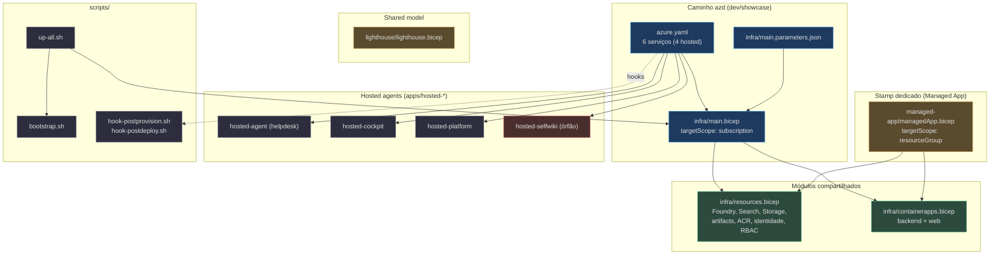
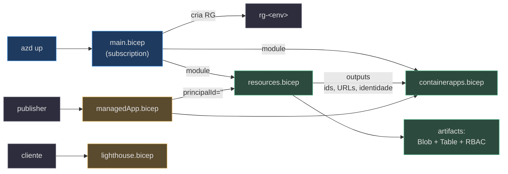

# Visão Geral da Infraestrutura

> **Escopo desta página.** Mapa de alto nível de tudo que vive sob `infra/` mais a declaração de serviços em `azure.yaml`, os hosted agents em `apps/hosted-*` e os `scripts/` de bring-up. Cada afirmação aqui é rastreada para o arquivo+linha que a comprova (citações locais `(path:linha)` relativas à raiz do repo). Quando algo é inferência (e não leitura literal do código), está marcado como **(inferência)**.

## Por que esta infraestrutura existe (primeiros princípios)

O Foundry Assured é um concierge de suporte de engenharia que roda **três planos**: um frontend Next.js, um backend Python multi-agente e o **Foundry na nuvem** (KB, memória, eval, tracing). A IaC tem um trabalho central: **provisionar esses recursos de nuvem de forma keyless (identidade gerenciada / Entra ID) e reproduzível**, sem nenhuma chave de API hardcoded — a regra inegociável #2 do projeto (`infra/resources.bicep:1-10`).

O mesmo conjunto de recursos é entregue de **três formas**, sem duplicar a definição:

| Veículo de entrega | Quem opera | Onde os recursos nascem | Arquivo raiz | Source |
|---|---|---|---|---|
| **azd** (dev / showcase) | você mesmo | sua subscription, RG `rg-<env>` | `infra/main.bicep` (subscription-scoped) | `infra/main.bicep:10` |
| **Stamp dedicado** (enterprise) | publisher (nós) | subscription do **cliente**, RG gerenciado | `infra/managed-app/managedApp.bicep` (resourceGroup-scoped) | `infra/managed-app/managedApp.bicep:21` |
| **Lighthouse** (shared, data-plane) | publisher cross-tenant | subscription do cliente (delegada) | `infra/lighthouse/lighthouse.bicep` (subscription-scoped) | `infra/lighthouse/lighthouse.bicep:20` |

A chave da arquitetura: **os dois primeiros compõem os MESMOS dois módulos** — `resources.bicep` e `containerapps.bicep`. O stamp dedicado é uma *re-parametrização* do caminho azd para a subscription do cliente, não uma cópia das definições (ADR-002, `infra/managed-app/managedApp.bicep:13-15`).

## O que mudou desde a v0.3.0 (feature de Artifacts)

**Fato (lido no código):** a novidade estrutural desta versão é a **feature de Artifacts** — o backend gera HTML (páginas renderizadas por IA) e precisa persistir esse conteúdo de forma privada e imutável, com metadados consultáveis. A IaC ganhou, para isso, um **container Blob privado** `artifacts` (`publicAccess: None`) e uma **Table** `artifacts`, mais **duas role assignments escopadas** que dão à identidade do backend acesso de escrita **só** a esse container/table (menor privilégio), e o encanamento dos env vars/URLs até o Container App do backend e o `scripts/bootstrap.sh`.

| Mudança (v0.4.0) | Onde | Source |
|---|---|---|
| Container Blob privado `artifacts` (`publicAccess: None`) | `resources.bicep` | `infra/resources.bicep:209-216` |
| `tableService` + Table `artifacts` (metadados) | `resources.bicep` | `infra/resources.bicep:218-226` |
| Role `Storage Table Data Contributor` (novo GUID) | `resources.bicep` | `infra/resources.bicep:71` |
| Backend `appIdentity` → Blob/Table Data Contributor **escopado ao artifacts** | `resources.bicep` | `infra/resources.bicep:318-339` |
| Outputs de URL de conta (`ARTIFACT_BLOB_ACCOUNT_URL`/`ARTIFACT_STORE_ACCOUNT_URL`) | `resources.bicep` | `infra/resources.bicep:483-485` |
| Env vars de artifact no backend Container App | `containerapps.bicep` | `infra/containerapps.bicep:163-168` |
| Fio dos params `artifact*` + `acl*` por `main.bicep` | `main.bicep` | `infra/main.bicep:93-101` |
| `bootstrap.sh` grava as URLs de artifact no `.env` local | `scripts/bootstrap.sh` | `scripts/bootstrap.sh:44-45` |

> A feature de Artifacts tem sua própria página dedicada — ver **[Artifacts — Storage Privado + RBAC](./page-4.md)**. Junto veio o fio das classificações de ACL do cockpit (`ACL_*_GROUP`) e do grupo de app-users até o backend, detalhado em [Container Apps](./page-5.md).

## Mapa dos arquivos

<!-- Sources: infra/main.bicep:60-103, azure.yaml:6-72, scripts/up-all.sh:100-110, scripts/bootstrap.sh:55-59 -->

## Os seis serviços declarados em `azure.yaml`

O `azure.yaml` é o manifesto que o azd lê para saber **o que buildar e onde implantar**. Ele declara seis serviços — dois Container Apps (`backend`, `web`) e **quatro** hosted agents (`azure.yaml:6-72`):

| Serviço | `project` | `host` | Papel | Source |
|---|---|---|---|---|
| `backend` | `apps/backend` | `containerapp` | API FastAPI + workflow AG-UI | `azure.yaml:7-13` |
| `cockpit-expert` | `apps/hosted-cockpit` | `azure.ai.agent` | Hosted — Q&A Cockpit **(órfão, ver p.7)** | `azure.yaml:14-25` |
| `selfwiki-expert` | `apps/hosted-selfwiki` | `azure.ai.agent` | Hosted — Q&A selfwiki **(órfão, ver p.7)** | `azure.yaml:26-37` |
| `helpdesk-concierge` | `apps/hosted-agent` | `azure.ai.agent` | Hosted — workflow helpdesk (vivo em `/helpdesk-hosted`) | `azure.yaml:38-49` |
| `platform-concierge` | `apps/hosted-platform` | `azure.ai.agent` | Hosted — tools (Invocations, vivo em `/platform-hosted`) | `azure.yaml:50-61` |
| `web` | `apps/frontend` | `containerapp` | Frontend Next.js | `azure.yaml:62-72` |

**Fato:** os quatro serviços `azure.ai.agent` são **hosted agents** (containers servidos pelo Foundry Agent Service), não Container Apps; só `backend` e `web` viram Container Apps (`infra/containerapps.bicep:109-227`). Os hooks `postprovision`/`postdeploy` fecham o arquivo (`azure.yaml:73-81`).

## Fluxo de composição (quem chama quem)

<!-- Sources: infra/main.bicep:54-103, infra/managed-app/managedApp.bicep:64-97, infra/lighthouse/lighthouse.bicep:68-83, infra/resources.bicep:209-339 -->

## Postura keyless (a regra que toda a IaC respeita)

Toda autenticação é por identidade gerenciada / Entra ID. A conta Foundry, o projeto e a busca têm `SystemAssigned` identity (`infra/resources.bicep:86`, `infra/resources.bicep:100`, `infra/resources.bicep:250`); os Container Apps compartilham uma identidade `UserAssigned` (`infra/resources.bicep:282-286`). O único segredo aceito é o `entraApiClientSecret` para OBO, e ele entra como `@secure()` + Container App secret, nunca como env literal (`infra/containerapps.bicep:33-34`, `infra/containerapps.bicep:129-131`). A feature de Artifacts mantém a postura: o backend fala com Blob e Table **como a `appIdentity`** (nada de chave de conta), com RBAC de dados escopado ao container/table (`infra/resources.bicep:318-339`).

## Custo (resumo)

O piso always-on é **≈ $79/mês (~$0,11/h)**, **~93% disso é Azure AI Search Basic** ($73,73/mo); o resto é usage-based e **≈ $0 ocioso** (Container Apps escalam a zero) — apurado pela Retail Prices API, documentado em `docs/COST.md` (`docs/COST.md:69-73`). O container Blob e a Table de artifacts são "free" (só o storage consumido é cobrado, usage-based). Detalhes em [Hosted Agents, Entra/ACL e Scripts](./page-7.md).

## Referências

- `infra/main.bicep` — entrypoint azd
- `azure.yaml` — declaração de serviços
- `scripts/up-all.sh` — bring-up de uma linha
- `scripts/bootstrap.sh` — data-plane + escrita do `.env` local

## Related Pages

| Página | Relação |
|---|---|
| [O Stack azd](./page-2.md) | detalha o entrypoint subscription-scoped e a composição dos módulos |
| [Recursos Compartilhados](./page-3.md) | o `resources.bicep` consumido pelos dois veículos |
| [Artifacts — Storage Privado + RBAC](./page-4.md) | o Blob privado, a Table e a RBAC de menor privilégio |
| [Container Apps](./page-5.md) | consome a identidade e os outputs (incl. os env de artifact) |
| [Hosted Agents, Entra/ACL e Scripts](./page-7.md) | os hosted agents órfãos, a ACL e o bring-up |
