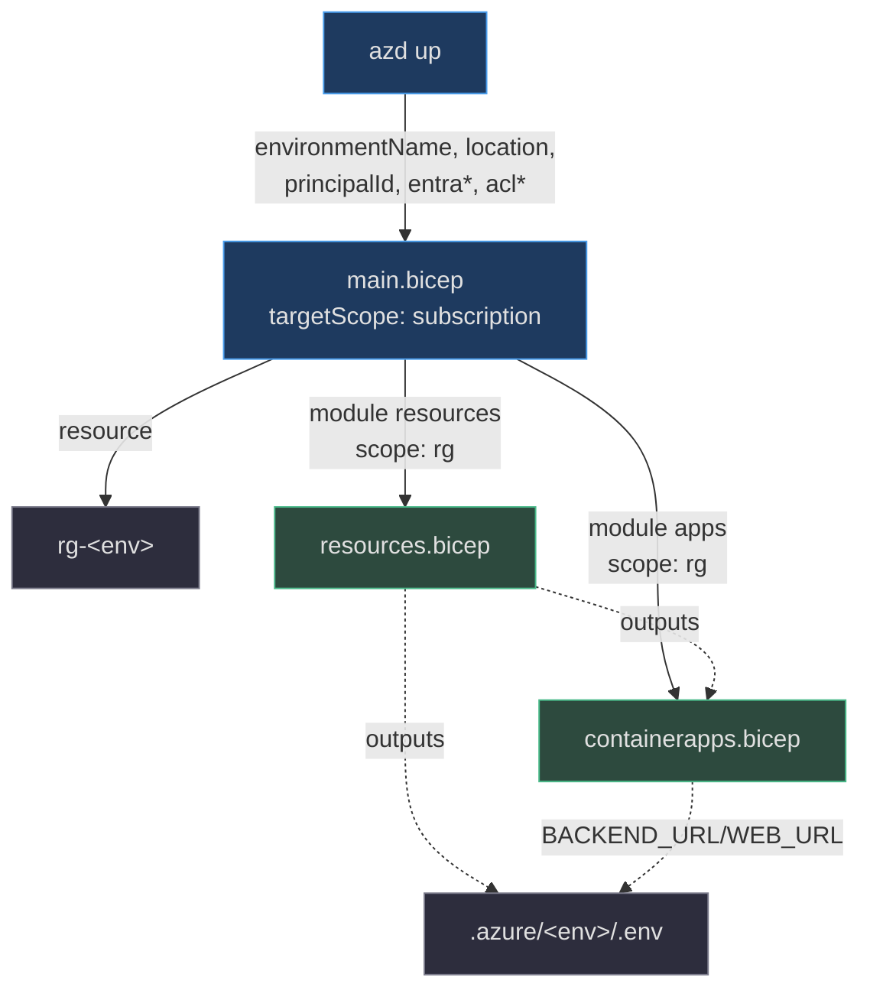

# O Stack azd (`main.bicep` → resources + containerapps)

> **Escopo.** `infra/main.bicep` (o entrypoint que o `azd up` executa) + `infra/main.parameters.json` (o mapa env→param). É o veículo dev/showcase; o stamp dedicado ([página 6](./page-6.md)) reusa os mesmos dois módulos por um entrypoint diferente.

## O contrato subscription-scoped

`main.bicep` declara `targetScope = 'subscription'` (`infra/main.bicep:10`) porque ele mesmo **cria o resource group** — diferente do stamp dedicado, que é implantado *dentro* de um RG gerenciado já existente. O RG nasce como `rg-${environmentName}` na `location` escolhida (`infra/main.bicep:54-58`), e todos os recursos caem dentro dele via os dois `module`s escopados a `rg` (`infra/main.bicep:60-103`).



<!-- Sources: infra/main.bicep:10-103 -->

## Parâmetros: o que o azd injeta

O `main.parameters.json` liga cada parâmetro a uma variável do azd environment (`${...}`) — é assim que valores saem do `.env` do azd e entram no deploy (`infra/main.parameters.json:4-17`). O `resourceToken` é derivado deterministicamente de `subscription().id + environmentName + location` para nomes globalmente únicos e estáveis entre re-deploys (`infra/main.bicep:50`).

| Parâmetro | Var azd | Papel | Source |
|---|---|---|---|
| `environmentName` | `${AZURE_ENV_NAME}` | deriva nomes + tags | `infra/main.parameters.json:5` |
| `location` | `${AZURE_LOCATION}` | região primária | `infra/main.parameters.json:6` |
| `principalId` | `${AZURE_PRINCIPAL_ID}` | usuário/CI que recebe roles data-plane | `infra/main.parameters.json:7` |
| `principalType` | `${AZURE_PRINCIPAL_TYPE}` | `User` local / `ServicePrincipal` em CI | `infra/main.parameters.json:8` |
| `searchLocation` | `${AZURE_SEARCH_LOCATION}` | override de região do AI Search | `infra/main.parameters.json:9` |
| `entraTenantId` | `${ENTRA_TENANT_ID}` | tenant OBO (opcional) | `infra/main.parameters.json:10` |
| `entraApiClientId` | `${ENTRA_API_CLIENT_ID}` | app client id OBO (opcional) | `infra/main.parameters.json:11` |
| `entraApiClientSecret` | `${ENTRA_API_CLIENT_SECRET}` | `@secure()` — segredo OBO | `infra/main.parameters.json:12` |
| `appUsersGroupId` **v0.3+** | `${APP_USERS_GROUP_ID}` | grupo de app-users (Foundry User p/ OBO + audiência selfwiki) | `infra/main.parameters.json:13` |
| `aclPublicGroup` **NOVO** | `${ACL_PUBLIC_GROUP}` | object-id do tier ACL público (cockpit) | `infra/main.parameters.json:14` |
| `aclInternalGroup` **NOVO** | `${ACL_INTERNAL_GROUP}` | object-id do tier ACL interno | `infra/main.parameters.json:15` |
| `aclConfidentialGroup` **NOVO** | `${ACL_CONFIDENTIAL_GROUP}` | object-id do tier ACL confidencial | `infra/main.parameters.json:16` |

> **Fato (v0.4.0):** os três `acl*Group` são **novos** parâmetros; `main.bicep` os declara (`infra/main.bicep:26-29`) e os repassa ao módulo `apps` (`infra/main.bicep:98-101`) para que o backend popule o `acl_group_map` e o retrieval envie o header ACL por-usuário (OBO). Vazios → domínios ACL ficam fail-closed. Ver [Container Apps](./page-5.md).

## Composição do módulo `resources`

O primeiro módulo cria tudo exceto os Container Apps: Foundry, Search, Storage (corpus + **artifacts** + file share), ACR, identidade e RBAC. O `principalId`/`principalType` fluem direto para lá para as atribuições condicionais do caller (`infra/main.bicep:60-73`).

## Composição do módulo `apps` (agora com o fio de artifact + ACL)

O segundo módulo consome os **outputs** do `resources` — nomes, endpoints, a identidade compartilhada e, novo na v0.4.0, as **URLs de conta de artifact** — e os injeta no Container App do backend (`infra/main.bicep:77-103`).

```mermaid
sequenceDiagram
  autonumber
  participant AZD as azd up
  participant M as main.bicep
  participant R as resources.bicep
  participant A as containerapps.bicep
  AZD->>M: environmentName, location, acl*, entra*
  M->>M: cria rg-&lt;env&gt;
  M->>R: module resources (principalId, appUsersGroupId, ...)
  R-->>M: outputs (ids, endpoints, APP_IDENTITY_*,<br>ARTIFACT_BLOB/STORE_ACCOUNT_URL)
  M->>A: module apps (artifactBlobAccountUrl,<br>artifactStoreAccountUrl, acl*, appUsersGroupId, ...)
  A-->>M: BACKEND_URL, WEB_URL
  M-->>AZD: outputs → .azure/&lt;env&gt;/.env
```

<!-- Sources: infra/main.bicep:60-128, infra/resources.bicep:457-493, infra/containerapps.bicep:50-54 -->

**Fato (v0.4.0):** `main.bicep` passa `artifactBlobAccountUrl` e `artifactStoreAccountUrl` (vindos dos outputs de `resources`) para o módulo `apps` (`infra/main.bicep:93-94`), e ainda encaminha `appUsersGroupId` + os três `acl*Group` (`infra/main.bicep:98-101`). Sem esse fio, o backend não saberia o endereço do Blob/Table de artifacts nem os grupos de ACL.

## Outputs (surfaced no `.env` do azd)

`main.bicep` re-exporta os outputs de `resources` para o `.azure/<env>/.env`, de onde o `bootstrap.sh` os lê (`infra/main.bicep:108-131`). Destaques da v0.4.0:

| Output | Valor | Consumidor | Source |
|---|---|---|---|
| `FOUNDRY_PROJECT_ENDPOINT` | endpoint do projeto Foundry | backend / ingest | `infra/main.bicep:109` |
| `AZURE_AI_PROJECT_ID` | `project.id` | azd deploya hosted agents | `infra/main.bicep:110` |
| `AZURE_AI_ACCOUNT_ID` / `AZURE_SEARCH_ID` | ids ARM | hook postdeploy (RBAC dos agents) | `infra/main.bicep:111-112` |
| `ARTIFACT_BLOB_ACCOUNT_URL` **NOVO** | URL Blob da conta | backend (feature artifacts) | `infra/main.bicep:127` |
| `ARTIFACT_STORE_ACCOUNT_URL` **NOVO** | URL Table da conta | backend (feature artifacts) | `infra/main.bicep:128` |
| `BACKEND_URL` / `WEB_URL` | FQDNs públicos | frontend / sanity | `infra/main.bicep:105-106` |

> **Fato:** os dois outputs `ARTIFACT_*` são adicionados na v0.4.0 (`infra/main.bicep:125-128`) e surfaced ao `.env` para que o dev local alcance os stores de Blob (conteúdo) e Table (metadados). O `bootstrap.sh` os grava no `apps/backend/.env` (`scripts/bootstrap.sh:44-45`).

## Related Pages

| Página | Relação |
|---|---|
| [Recursos Compartilhados](./page-3.md) | o que o módulo `resources` cria e exporta |
| [Artifacts — Storage Privado + RBAC](./page-4.md) | os recursos por trás dos outputs `ARTIFACT_*` |
| [Container Apps](./page-5.md) | o módulo `apps` e como consome esses params/outputs |
| [Stamp Dedicado + Lighthouse](./page-6.md) | o entrypoint alternativo que reusa os mesmos módulos |
