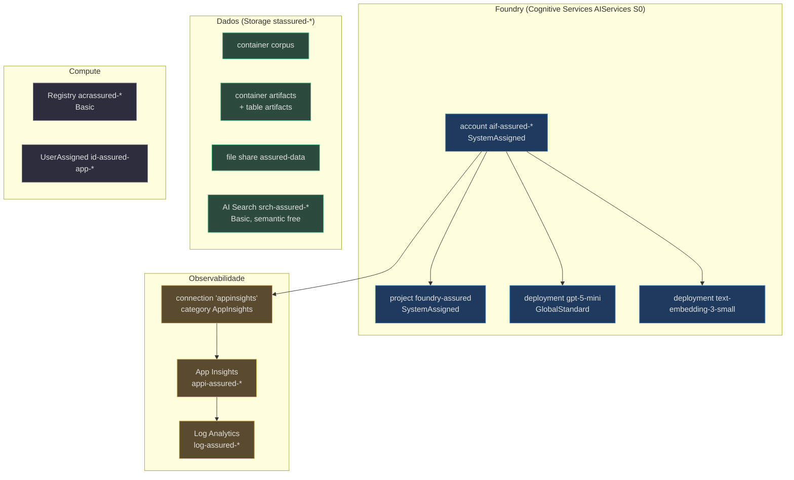
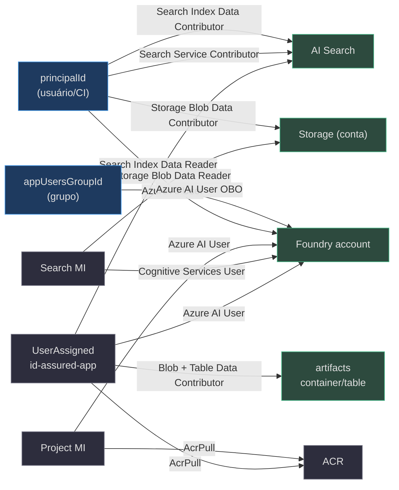

# Recursos Compartilhados (`resources.bicep`)

> **Escopo.** `infra/resources.bicep` — o módulo RG-scoped que define **todos** os recursos de nuvem (exceto os Container Apps). É composto por `main.bicep` (azd) e por `managedApp.bicep` (stamp dedicado), então tudo aqui vale para os dois veículos. Os recursos e RBAC específicos da feature **Artifacts** vivem aqui, mas têm página própria — ver [Artifacts](./page-4.md).

## Por que um único módulo

A decisão de arquitetura (ADR-002) é que o stamp dedicado seja uma **re-parametrização**, não uma cópia. Isso só funciona se a definição dos recursos viver em **um** lugar — este arquivo. Por isso ele é RG-scoped e não cria nenhum `resourceGroups` (quem cria o RG é o chamador) (`infra/resources.bicep:1-10`).

## Nomenclatura `assured`

**Fato (lido no código):** os nomes de recurso derivam de `assured` (`infra/resources.bicep:55-61`): `accountName = 'aif-assured-${token}'`, `projectName = 'foundry-assured'`, `searchName = 'srch-assured-${token}'`, `registryName = 'acrassured${token}'`, `storageName = 'stassured${token}'`, `corpusContainerName = 'corpus'`, `dataShareName = 'assured-data'`. O output `AZURE_SEARCH_KNOWLEDGE_BASE` **continua** o literal `helpdesk-kb` (`infra/resources.bicep:476`) — a KB primária não foi renomeada.

## Inventário de recursos

<!-- Sources: infra/resources.bicep:80-286 -->

| Recurso | Tipo / apiVersion | Nome (var) | SKU/kind | Source |
|---|---|---|---|---|
| Foundry account | `Microsoft.CognitiveServices/accounts@2025-06-01` | `aif-assured-${token}` | `AIServices` / `S0` | `infra/resources.bicep:80-93` |
| Foundry project | `.../accounts/projects@2025-06-01` | `foundry-assured` | SystemAssigned | `infra/resources.bicep:95-102` |
| Modelo de chat | `.../accounts/deployments@2025-06-01` | `gpt-5-mini` (param) | `GlobalStandard` cap 100 | `infra/resources.bicep:104-115` |
| Embedding | `.../accounts/deployments@2025-06-01` | `text-embedding-3-small` | `GlobalStandard` cap 100 | `infra/resources.bicep:118-130` |
| Log Analytics | `Microsoft.OperationalInsights/workspaces@2023-09-01` | `log-assured-${token}` | `PerGB2018`, 30d | `infra/resources.bicep:141-149` |
| App Insights | `Microsoft.Insights/components@2020-02-02` | `appi-assured-${token}` | web | `infra/resources.bicep:151-160` |
| Connection telemetria | `.../accounts/connections@2025-06-01` | `appinsights` | category `AppInsights` | `infra/resources.bicep:163-179` |
| Storage | `Microsoft.Storage/storageAccounts@2023-05-01` | `stassured${token}` | `Standard_LRS` StorageV2 | `infra/resources.bicep:185-196` |
| Container corpus | `.../blobServices/containers@2023-05-01` | `corpus` | publicAccess None | `infra/resources.bicep:203-207` |
| **Container artifacts** | `.../blobServices/containers@2023-05-01` | `artifacts` | publicAccess None | `infra/resources.bicep:210-216` |
| **Table service + table** | `.../tableServices` + `.../tables@2023-05-01` | `artifacts` | — | `infra/resources.bicep:218-226` |
| File share | `.../fileServices/shares@2023-05-01` | `assured-data` | 1 GiB | `infra/resources.bicep:235-239` |
| AI Search | `Microsoft.Search/searchServices@2024-06-01-preview` | `srch-assured-${token}` | `basic`, semantic `free` | `infra/resources.bicep:245-260` |
| Container Registry | `Microsoft.ContainerRegistry/registries@2023-11-01-preview` | `acrassured${token}` | `Basic` | `infra/resources.bicep:268-277` |
| Identidade app | `Microsoft.ManagedIdentity/userAssignedIdentities@2023-01-31` | `id-assured-app-${token}` | — | `infra/resources.bicep:282-286` |

### Detalhes que importam

- **Storage plano (não HNS).** O estado atual é `StorageV2` comum, `allowBlobPublicAccess: false`, `minimumTlsVersion: 'TLS1_2'`, `allowSharedKeyAccess: true` (`infra/resources.bicep:191-195`). O `allowSharedKeyAccess: true` é necessário porque o Azure Files (file share dos tickets) só monta por account-key (`infra/containerapps.bicep:86-102`) — o Blob/Table de artifacts, ao contrário, é acessado keyless por RBAC.
- **Deployments sequenciais.** O embedding tem `dependsOn: [ modelDeployment ]` porque "deployments na mesma conta devem ser criados sequencialmente" (`infra/resources.bicep:129`).
- **Versão do modelo.** `modelVersion = '2025-08-07'`; o comentário registra que só a família gpt-5.x está GA em eastus2 (`infra/resources.bicep:34-35`).
- **Semantic ranker grátis.** `semanticSearch: 'free'` habilita o ranker semântico (agentic retrieval) dentro da cota gratuita (`infra/resources.bicep:255`).

## A trama keyless: role assignments

O ponto mais denso do arquivo. **Nove** GUIDs de built-in roles (`infra/resources.bicep:64-72`) — um a mais que a v0.3.0: `Storage Table Data Contributor` (`infra/resources.bicep:71`), usado pela feature de Artifacts. **Fato:** nenhuma chave é gerada.

<!-- Sources: infra/resources.bicep:64-72, infra/resources.bicep:288-451 -->

| Atribuição | Principal | Role | Escopo | Source |
|---|---|---|---|---|
| `appToRegistry` | app id | AcrPull | ACR | `infra/resources.bicep:288-296` |
| `appToFoundry` | app id | Azure AI User | account | `infra/resources.bicep:298-306` |
| `appToSearch` | app id | Search Index Data Reader | search | `infra/resources.bicep:308-316` |
| `backendBlobContributor` **v0.4** | app id | Storage Blob Data Contributor | **artifactsContainer** | `infra/resources.bicep:321-329` |
| `backendTableContributor` **v0.4** | app id | Storage Table Data Contributor | **artifactsTable** | `infra/resources.bicep:331-339` |
| `searchToFoundry` | Search MI | Cognitive Services User | account | `infra/resources.bicep:346-354` |
| `projectToFoundry` | Project MI | Azure AI User | account | `infra/resources.bicep:359-367` |
| `projectToRegistry` | Project MI | AcrPull | ACR | `infra/resources.bicep:371-379` |
| `searchToStorage` | Search MI | Storage Blob Data Reader | storage | `infra/resources.bicep:382-390` |
| `userSearchContributor` | principalId | Search Service Contributor | search | `infra/resources.bicep:393-401` |
| `userSearchIndexContributor` | principalId | Search Index Data Contributor | search | `infra/resources.bicep:408-416` |
| `userStorageContributor` | principalId | Storage Blob Data Contributor | storage | `infra/resources.bicep:419-427` |
| `userAiUser` | principalId | Azure AI User | account | `infra/resources.bicep:430-438` |
| `appUsersToFoundry` | appUsersGroupId (Group) | Azure AI User | account | `infra/resources.bicep:443-451` |

> As duas atribuições `backend*Contributor` (a RBAC de artifacts) são escopadas ao **container/table**, não à conta inteira — detalhe de menor privilégio explicado em [Artifacts](./page-4.md). As quatro atribuições `user*` continuam condicionais a `if (!empty(principalId))` (`infra/resources.bicep:393`, `infra/resources.bicep:408`, `infra/resources.bicep:419`, `infra/resources.bicep:430`) — central para o stamp dedicado, que passa `principalId: ''` (ver [Stamp Dedicado](./page-6.md)).

## Outputs

O módulo exporta endpoints, ids ARM, nomes, a identidade compartilhada e — na v0.4.0 — as URLs de conta de Blob e Table de artifacts (`infra/resources.bicep:457-493`). Destaques: `FOUNDRY_PROJECT_ENDPOINT` montado como `https://${accountName}.services.ai.azure.com/api/projects/${projectName}` (`infra/resources.bicep:457`); os ids ARM `AZURE_AI_PROJECT_ID`/`AZURE_AI_ACCOUNT_ID`/`AZURE_SEARCH_ID` (`infra/resources.bicep:461-466`); e os **novos** `ARTIFACT_BLOB_ACCOUNT_URL = storage.properties.primaryEndpoints.blob` + `ARTIFACT_STORE_ACCOUNT_URL = storage.properties.primaryEndpoints.table` (`infra/resources.bicep:483-485`).

## Related Pages

| Página | Relação |
|---|---|
| [O Stack azd](./page-2.md) | quem compõe este módulo com `principalId` preenchido |
| [Artifacts — Storage Privado + RBAC](./page-4.md) | os recursos + as duas role assignments de artifacts em detalhe |
| [Container Apps](./page-5.md) | consome a identidade e os outputs daqui |
| [Stamp Dedicado + Lighthouse](./page-6.md) | quem compõe este módulo com `principalId` vazio |
