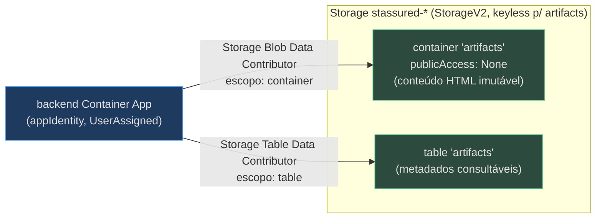
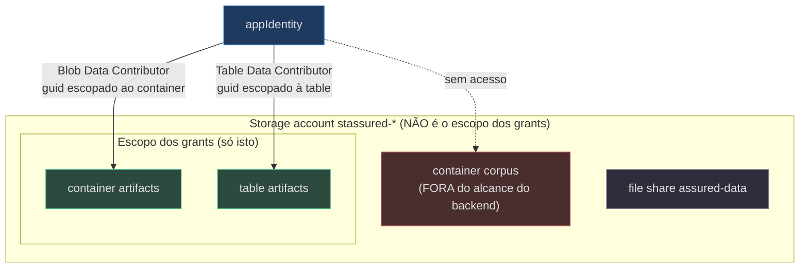

# Artifacts — Storage Privado + RBAC de Menor Privilégio

> **Escopo.** Tudo que a IaC provisiona para a feature de **Artifacts** — as páginas HTML geradas por IA que o backend renderiza e persiste. Toca quatro arquivos: `infra/resources.bicep` (os recursos + a RBAC + os outputs), `infra/main.bicep` (o fio dos outputs), `infra/containerapps.bicep` (os env vars do backend) e `scripts/bootstrap.sh` (o `.env` do dev local). É a principal novidade da v0.4.0.

## Por que existe

Um artifact é conteúdo **imutável** (HTML) que precisa ser (1) armazenado de forma **privada** — nunca servido publicamente do storage — e (2) indexado por **metadados** consultáveis (id, dono, timestamps, título). O padrão escolhido separa as duas responsabilidades: **Blob** para o conteúdo imutável e **Table** para os metadados. O backend liga isso via `ARTIFACT_STORE_BACKEND=table` (`infra/containerapps.bicep:164`).



<!-- Sources: infra/resources.bicep:209-226, infra/resources.bicep:318-339, infra/containerapps.bicep:163-168 -->

## Os recursos: Blob privado + Table

**Fato (lido no código):** o container Blob `artifacts` é irmão do `corpus` sob o mesmo `blobService`, e nasce **explicitamente privado** — `publicAccess: 'None'` — com o comentário "private container for AI-generated HTML (never public)" (`infra/resources.bicep:209-216`). Um `tableService` (`default`) hospeda a Table `artifacts` para os metadados (`infra/resources.bicep:218-226`).

| Recurso | Tipo | Nome | Propriedade-chave | Source |
|---|---|---|---|---|
| Container de conteúdo | `.../blobServices/containers@2023-05-01` | `artifacts` | `publicAccess: 'None'` | `infra/resources.bicep:210-216` |
| Table service | `.../tableServices@2023-05-01` | `default` | — | `infra/resources.bicep:218-221` |
| Table de metadados | `.../tableServices/tables@2023-05-01` | `artifacts` | — | `infra/resources.bicep:223-226` |

O container Blob é privado por design (a herança do `allowBlobPublicAccess: false` da conta já bloquearia acesso anônimo — `infra/resources.bicep:192` — mas o `publicAccess: 'None'` é explícito como defesa em profundidade). O conteúdo é servido **pelo backend**, que lê o Blob como a `appIdentity` e entrega ao usuário autenticado — nunca por URL pública do storage.

## A RBAC de menor privilégio (o ponto central)

**Fato (lido no código):** a `appIdentity` (a UserAssigned compartilhada pelos Container Apps) recebe **dois** grants para artifacts, e ambos são **escopados ao container/table específicos — não à conta inteira**. O comentário no código é explícito: "Least privilege: scoped to the artifacts container/table only — NOT the whole account (which also holds the corpus KB container)" (`infra/resources.bicep:318-320`).



<!-- Sources: infra/resources.bicep:318-339, infra/resources.bicep:203-226 -->

| Atribuição | Role (GUID) | `scope` | Por que escopado | Source |
|---|---|---|---|---|
| `backendBlobContributor` | Storage Blob Data Contributor `ba92f5b4-…` | `artifactsContainer.id` | escrever/ler o HTML só no container de artifacts | `infra/resources.bicep:321-329` |
| `backendTableContributor` | Storage Table Data Contributor `0a9a7e1f-…` | `artifactsTable.id` | r/w dos metadados só na table de artifacts | `infra/resources.bicep:331-339` |

Detalhes que comprovam o menor privilégio:

- O GUID da role Table é declarado como `var roleStorageTableDataContributor = '0a9a7e1f-b9d0-4cc4-a60d-0319b160aaa3'`, com o comentário "backend identity r/w artifact metadata table" (`infra/resources.bicep:71`).
- O `scope` de cada assignment é o **id do recurso filho** (`artifactsContainer.id` / `artifactsTable.id`), não `storage.id`. Isso significa que o backend **não** consegue ler o container `corpus` (a KB) nem outros artefatos da conta — o alcance para no par artifacts.
- O `name` de cada assignment é um `guid(<recurso>.id, appIdentity.id, <role>)` determinístico, garantindo idempotência entre re-deploys (`infra/resources.bicep:322`, `infra/resources.bicep:332`).
- `principalType: 'ServicePrincipal'` porque a identidade da UAMI aparece no Entra como service principal (`infra/resources.bicep:327`, `infra/resources.bicep:337`).

> **Contraste com o corpus.** O caller (deploying user) recebe `Storage Blob Data Contributor` na **conta inteira** para subir o corpus (`infra/resources.bicep:419-427`); o backend, ao contrário, é deliberadamente contido ao artifacts. Escopos diferentes para principals diferentes = menor privilégio por identidade.

## O fio dos endereços: outputs → main → containerapps → backend

Como o backend descobre **onde** estão o Blob e a Table? A IaC encadeia URLs de conta desde os outputs de `resources.bicep` até os env vars do container.

```mermaid
sequenceDiagram
  autonumber
  participant R as resources.bicep
  participant M as main.bicep
  participant C as containerapps.bicep
  participant BE as backend container (env)
  participant BS as bootstrap.sh (.env local)
  R->>R: output ARTIFACT_BLOB_ACCOUNT_URL = storage...primaryEndpoints.blob
  R->>R: output ARTIFACT_STORE_ACCOUNT_URL = storage...primaryEndpoints.table
  R-->>M: outputs
  M->>C: params artifactBlobAccountUrl / artifactStoreAccountUrl
  C->>BE: env ARTIFACT_BLOB_ACCOUNT_URL / ARTIFACT_STORE_ACCOUNT_URL
  M-->>BS: outputs → .azure/&lt;env&gt;/.env
  BS->>BS: upsert ARTIFACT_*_ACCOUNT_URL em apps/backend/.env
```

<!-- Sources: infra/resources.bicep:483-485, infra/main.bicep:93-94, infra/main.bicep:125-128, infra/containerapps.bicep:167-168, scripts/bootstrap.sh:42-48 -->

**Passo a passo (tudo lido no código):**

1. **`resources.bicep`** exporta as URLs a partir das propriedades da conta de storage — `ARTIFACT_BLOB_ACCOUNT_URL = storage.properties.primaryEndpoints.blob` e `ARTIFACT_STORE_ACCOUNT_URL = storage.properties.primaryEndpoints.table` (`infra/resources.bicep:483-485`).
2. **`main.bicep`** repassa esses outputs para o módulo `apps` como `artifactBlobAccountUrl` / `artifactStoreAccountUrl` (`infra/main.bicep:93-94`) e também os re-exporta para o `.env` do azd (`infra/main.bicep:125-128`).
3. **`containerapps.bicep`** recebe os dois params (`infra/containerapps.bicep:50-54`) e os injeta como env vars no container do backend, junto com a config lógica da feature (`infra/containerapps.bicep:163-168`).
4. **`bootstrap.sh`** lê o `.env` do azd e grava `ARTIFACT_BLOB_ACCOUNT_URL` + `ARTIFACT_STORE_ACCOUNT_URL` no `apps/backend/.env` do dev local (`scripts/bootstrap.sh:44-45`).

## Os env vars da feature no backend

O backend recebe cinco variáveis de artifacts — duas de config lógica e três de endereço/seleção:

| Env var | Valor | Papel | Source |
|---|---|---|---|
| `ARTIFACT_STORE_BACKEND` | `table` | seleciona Table como store de metadados | `infra/containerapps.bicep:164` |
| `ARTIFACT_CONTAINER` | `artifacts` | nome do container Blob de conteúdo | `infra/containerapps.bicep:165` |
| `ARTIFACT_TABLE` | `artifacts` | nome da Table de metadados | `infra/containerapps.bicep:166` |
| `ARTIFACT_BLOB_ACCOUNT_URL` | URL Blob da conta | endpoint do Blob (keyless, via appIdentity) | `infra/containerapps.bicep:167` |
| `ARTIFACT_STORE_ACCOUNT_URL` | URL Table da conta | endpoint da Table (keyless, via appIdentity) | `infra/containerapps.bicep:168` |

O comentário no Bicep resume a intenção: "Artifacts feature: metadata in Table, immutable HTML content in Blob" (`infra/containerapps.bicep:163`). Note que **nenhuma** chave de conta aparece aqui — o backend autentica com a `appIdentity` (`AZURE_CLIENT_ID` da UAMI, `infra/containerapps.bicep:151`), e é a RBAC escopada acima que autoriza o acesso.

## Related Pages

| Página | Relação |
|---|---|
| [Recursos Compartilhados](./page-3.md) | o inventário completo do storage e da RBAC |
| [O Stack azd](./page-2.md) | onde os params/outputs de artifact são encadeados |
| [Container Apps](./page-5.md) | o container do backend e o restante do seu env |
| [Visão Geral](./page-1.md) | o resumo do que mudou na v0.4.0 |
