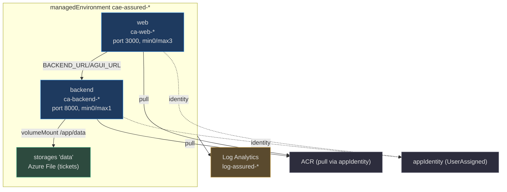
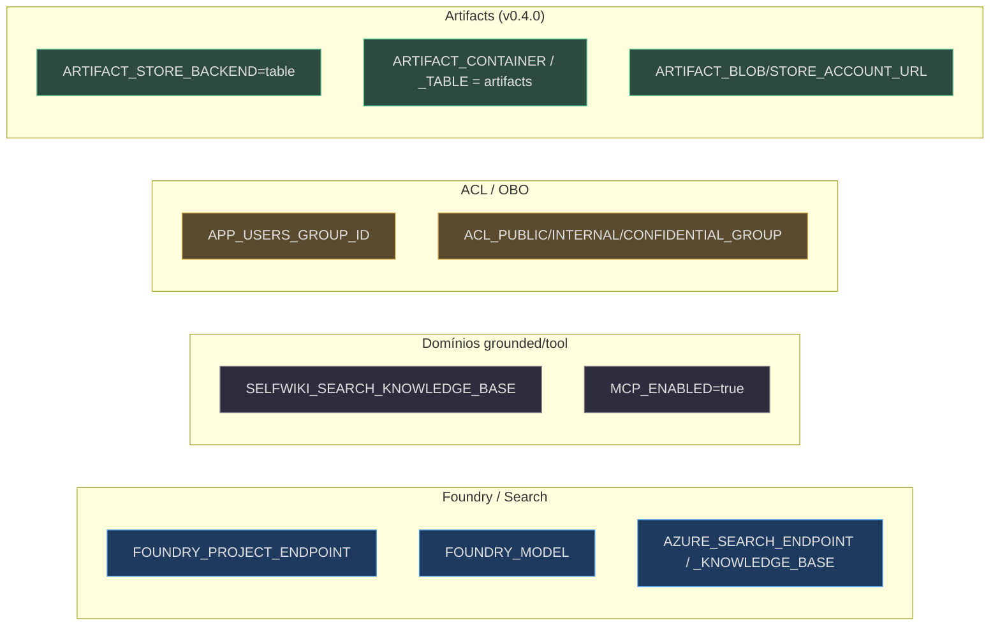

# Container Apps (backend + web)

> **Escopo.** `infra/containerapps.bicep` — o segundo módulo compartilhado, composto tanto pelo `main.bicep` (azd) quanto pelo `managedApp.bicep` (stamp dedicado). Provisiona o Container Apps environment e os dois apps (`backend`, `web`) que formam o plano de controle.

## Anatomia

<!-- Sources: infra/containerapps.bicep:70-102, infra/containerapps.bicep:109-227 -->

## O environment e a persistência

O `managedEnvironment` `cae-assured-*` envia logs para o Log Analytics `log-assured-*` (`infra/containerapps.bicep:70-83`). Para os tickets (`tickets.jsonl`) sobreviverem ao scale-to-zero, o módulo monta um **Azure Files** share: referencia a conta de storage `existing` (`infra/containerapps.bicep:87-89`), cria o `storages/data` com a account-key via `listKeys()` (`infra/containerapps.bicep:91-102`) e o monta em `/app/data` no backend (`infra/containerapps.bicep:170-177`).

> **Por que account-key aqui (e não RBAC).** O Azure Files só monta por chave de conta — não há caminho de managed identity para a share key — por isso o `allowSharedKeyAccess: true` da conta (`infra/resources.bicep:194`). O Blob/Table de **artifacts**, ao contrário, é 100% keyless por RBAC ([ver Artifacts](./page-4.md)); a mesma conta serve os dois modelos.

## O app `backend`

Roda como a `appIdentity` UserAssigned (para ACR pull + chamadas keyless a Foundry/Search/artifacts) (`infra/containerapps.bicep:113-116`), com ingress externo na porta 8000 (`infra/containerapps.bicep:121-125`) e o único segredo — o `entra-api-secret` para OBO — via `secretRef`, nunca como env literal (`infra/containerapps.bicep:129-131`, `infra/containerapps.bicep:154`). Escala `min 0 / max 1` porque o `jsonl` é append-based e >1 writer poderia corromper (`infra/containerapps.bicep:178-180`).

### O bloco de env vars do backend

<!-- Sources: infra/containerapps.bicep:139-169 -->

| Grupo | Env vars | Papel | Source |
|---|---|---|---|
| Foundry/Search | `FOUNDRY_PROJECT_ENDPOINT`, `FOUNDRY_MODEL`, `AZURE_SEARCH_ENDPOINT`, `AZURE_SEARCH_KNOWLEDGE_BASE` | conexão base ao Foundry + KB | `infra/containerapps.bicep:140-143` |
| Domínios | `SELFWIKI_SEARCH_KNOWLEDGE_BASE`, `MCP_ENABLED=true` | monta `/selfwiki` + `/platform` | `infra/containerapps.bicep:146-149` |
| Identidade/OBO | `AZURE_CLIENT_ID`, `ENTRA_TENANT_ID`, `ENTRA_API_CLIENT_ID`, `ENTRA_API_CLIENT_SECRET` (secretRef) | DefaultAzureCredential + OBO | `infra/containerapps.bicep:151-154` |
| ACL/audiência **v0.3+** | `APP_USERS_GROUP_ID`, `ACL_PUBLIC_GROUP`, `ACL_INTERNAL_GROUP`, `ACL_CONFIDENTIAL_GROUP` | popula `acl_group_map`; retrieval envia o header ACL por-usuário | `infra/containerapps.bicep:157-162` |
| **Artifacts v0.4.0** | `ARTIFACT_STORE_BACKEND`, `ARTIFACT_CONTAINER`, `ARTIFACT_TABLE`, `ARTIFACT_BLOB_ACCOUNT_URL`, `ARTIFACT_STORE_ACCOUNT_URL` | persistência de HTML gerado (Blob+Table, keyless) | `infra/containerapps.bicep:163-168` |

**Fato (v0.4.0):** o módulo ganhou dois blocos de params novos — os grupos de ACL/app-users (`infra/containerapps.bicep:36-42`) e as URLs de artifact (`infra/containerapps.bicep:50-54`) — e injeta os env correspondentes. O bloco de artifacts está detalhado em [Artifacts](./page-4.md); os grupos ACL deixam os domínios cockpit/selfwiki fail-closed quando vazios (o retrieval só envia o header OBO se o grupo estiver setado).

## O app `web`

O frontend Next.js roda na mesma UAMI, ingress externo na porta 3000 (`infra/containerapps.bicep:185-205`). Recebe os URLs do backend derivados do FQDN previsível do environment — `BACKEND_URL`, `AGUI_URL` (`/helpdesk`), `HOSTED_AGUI_URL` (`/helpdesk-hosted`) e `COCKPIT_AGUI_URL` (`/cockpit`) (`infra/containerapps.bicep:212-221`). Escala `min 0 / max 3` (`infra/containerapps.bicep:224`).

> **Sem referência circular.** Backend e web derivam seus FQDNs do `env.properties.defaultDomain` (criado primeiro), não um do outro (`infra/containerapps.bicep:106-107`) — por isso o web pode apontar para o backend sem um ciclo de dependência.

O módulo exporta os FQDNs públicos como `BACKEND_URL` / `WEB_URL` (`infra/containerapps.bicep:229-230`).

## Related Pages

| Página | Relação |
|---|---|
| [Recursos Compartilhados](./page-3.md) | a UAMI, a conta de storage e os outputs consumidos aqui |
| [Artifacts — Storage Privado + RBAC](./page-4.md) | o detalhe dos cinco env vars de artifact |
| [O Stack azd](./page-2.md) | o `main.bicep` que passa os params a este módulo |
| [Stamp Dedicado + Lighthouse](./page-6.md) | o outro veículo que compõe este mesmo módulo |
