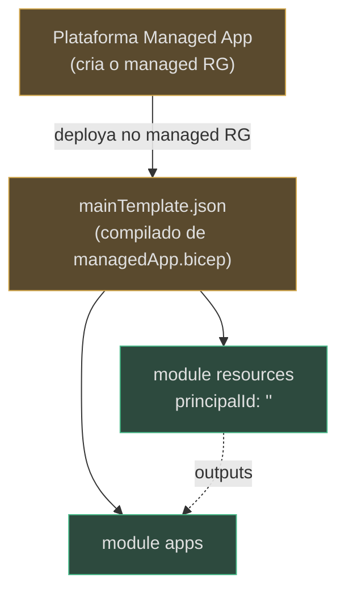

# Stamp Dedicado (Managed Application) + Azure Lighthouse

> **Escopo.** `infra/managed-app/managedApp.bicep` (o stamp dedicado) e `infra/lighthouse/lighthouse.bicep` (a delegação shared-model). Os dois são os veículos de entrega enterprise; o azd ([página 2](./page-2.md)) é o veículo dev/showcase.

## O Stamp Dedicado — Azure Managed Application

**Fato (lido no código):** o stamp dedicado é entregue como uma **Azure Managed Application**. O publisher (nós) opera o control plane; ele implanta dentro de um *managed resource group* na subscription do **cliente**, que o cliente não modifica diretamente (`infra/managed-app/managedApp.bicep:1-19`).

A diferença estrutural para o `main.bicep`: como a plataforma de Managed Apps já cria o managed RG e implanta o `mainTemplate` **dentro** dele, este template é `targetScope = 'resourceGroup'` e **não** declara nenhum `resourceGroups` (`infra/managed-app/managedApp.bicep:21`). É uma re-parametrização, na subscription do cliente, dos **mesmos** módulos `resources.bicep` + `containerapps.bicep` (ADR-002) (`infra/managed-app/managedApp.bicep:9-15`).



<!-- Sources: infra/managed-app/managedApp.bicep:21-97 -->

### `principalId: ''` — fail-closed por design

**Fato:** o stamp passa `principalId: ''` para o módulo `resources` intencionalmente — no modelo managed-app o publisher opera o stamp, então nenhum grant data-plane de deploying-user é criado (as atribuições `user*` condicionais em `resources.bicep` são puladas quando `principalId` é vazio) (`infra/managed-app/managedApp.bicep:60-73`). É o outro lado do `if (!empty(principalId))` visto em [Recursos Compartilhados](./page-3.md).

### Caveat de deployment mode (Incremental, não Complete)

O código carrega um aviso importante: **ambos** os módulos compostos declaram um Log Analytics `log-assured-${token}` de mesmo nome. Como duas nested deployments isso **compila limpo** e **converge** sob ARM **Incremental** (idempotente), mas é frágil sob **Complete**. Updates deste template **devem** usar Incremental (`infra/managed-app/managedApp.bicep:48-57`).

### Gap de drift: o managedApp não passa os params de artifact (v0.4.0)

> **⚠ Inconsistência a sinalizar (a IaC encontrando uma falha em si mesma).** A v0.4.0 tornou `artifactBlobAccountUrl` e `artifactStoreAccountUrl` **parâmetros obrigatórios** de `containerapps.bicep` — declarados **sem** default (`infra/containerapps.bicep:50-54`). Mas o módulo `apps` do `managedApp.bicep` **não** os passa: sua composição encaminha apenas `storageAccountName`, `fileShareName` e os `entra*` (`infra/managed-app/managedApp.bicep:78-97`). Como esses dois params não têm valor default, o `mainTemplate` do stamp dedicado **não compila/valida** com o `containerapps.bicep` atual até que o `managedApp.bicep` seja atualizado para encaminhar as URLs de artifact (análogo ao que `main.bicep` já faz em `infra/main.bicep:93-94`). Os params de ACL/app-users, por terem default `= ''` (`infra/containerapps.bicep:36-42`), **não** sofrem desse gap — só os de artifact. **(inferência de compilação, com base na ausência de default + ausência de passagem no managedApp.)**

## Azure Lighthouse — delegação cross-tenant

**Fato (lido no código):** no shared model o cliente delega escopos específicos ao **nosso** managing tenant para operarmos os recursos data-plane cross-tenant — sem nunca possuir os dados do cliente. A delegação é **revogável** e **auditável** (`infra/lighthouse/lighthouse.bicep:1-18`). O cliente implanta o template na **própria** subscription (`targetScope = 'subscription'`, `infra/lighthouse/lighthouse.bicep:20`).

```mermaid
sequenceDiagram
  autonumber
  participant CUST as Cliente (subscription)
  participant LH as lighthouse.bicep
  participant MS as Microsoft.ManagedServices
  participant PUB as Managing tenant (publisher)
  CUST->>LH: deploy (managedByTenantId, principalId)
  LH->>MS: registrationDefinition (authorizations least-privilege)
  LH->>MS: registrationAssignment (subscription scope)
  MS-->>PUB: acesso delegado (Reader + Monitoring + Log Analytics Reader)
  Note over CUST,PUB: revogável a qualquer momento; toda ação atribuída no activity log do cliente
```

<!-- Sources: infra/lighthouse/lighthouse.bicep:20-83 -->

### O conjunto least-privilege (sem Owner, sem Contributor amplo)

**Fato:** três built-in roles, comentadas como o mínimo para operar+observar o stamp Container Apps (`infra/lighthouse/lighthouse.bicep:37-45`):

| Role | GUID | Para quê | Source |
|---|---|---|---|
| Reader | `acdd72a7-…` | visibilidade de leitura no escopo delegado | `infra/lighthouse/lighthouse.bicep:43` |
| Monitoring Contributor | `749f88d5-…` | ler/operar diagnósticos, métricas, alertas | `infra/lighthouse/lighthouse.bicep:44` |
| Log Analytics Reader | `73c42c96-…` | ler logs para triage | `infra/lighthouse/lighthouse.bicep:45` |

As três viram `authorizations` para o `principalId` do managing tenant (`infra/lighthouse/lighthouse.bicep:47-63`); a `registrationDefinition` registra o managing tenant (`infra/lighthouse/lighthouse.bicep:68-76`) e a `registrationAssignment` aplica no escopo da subscription (`infra/lighthouse/lighthouse.bicep:78-83`). Nomes de registro são `guid(...)` determinísticos → idempotentes (`infra/lighthouse/lighthouse.bicep:66`, `infra/lighthouse/lighthouse.bicep:79`).

> **Custo zero.** A delegação Lighthouse (`Microsoft.ManagedServices`) não tem custo de recurso; o wrapper de Managed Application também não carrega taxa Azure além dos recursos do `mainTemplate.json` (`docs/COST.md:22-24`).

## Related Pages

| Página | Relação |
|---|---|
| [Recursos Compartilhados](./page-3.md) | o módulo que o stamp compõe com `principalId: ''` |
| [Container Apps](./page-5.md) | o módulo `apps` e os params obrigatórios de artifact |
| [O Stack azd](./page-2.md) | o veículo dev que passa todos os params corretamente |
| [Hosted Agents, Entra/ACL e Scripts](./page-7.md) | o restante do ciclo de bring-up e custo |
