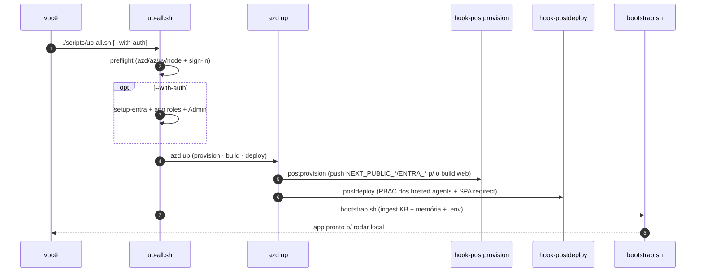

# Hosted Agents, Identidades Entra/ACL e Scripts de Bring-up

> **Escopo.** Os itens fora dos módulos Bicep principais: os hosted agents declarados em `azure.yaml`, as identidades Entra para ACL (`infra/entra/`) e os `scripts/` de bring-up (`up-all.sh`, `bootstrap.sh`, os hooks azd). Junto, é a cola operacional entre o `azd up` e um app rodando.

## Hosted agents (`azure.ai.agent`) e os twins órfãos

`azure.yaml` declara quatro serviços `azure.ai.agent` — hosted agents servidos pelo Foundry Agent Service, não Container Apps (`azure.yaml:14-61`):

| Serviço | `project` | Estado | Rota que o consome | Source |
|---|---|---|---|---|
| `helpdesk-concierge` | `apps/hosted-agent` | **vivo** | `/helpdesk-hosted` | `azure.yaml:38-49` |
| `platform-concierge` | `apps/hosted-platform` | **vivo** | `/platform-hosted` | `azure.yaml:50-61` |
| `cockpit-expert` | `apps/hosted-cockpit` | **órfão** | nenhuma (grounded roda live-OBO) | `azure.yaml:14-25` |
| `selfwiki-expert` | `apps/hosted-selfwiki` | **órfão** | nenhuma | `azure.yaml:26-37` |

> **⚠ Inconsistência mantida (dogfood).** Os grounded twins hosted `cockpit-expert` e `selfwiki-expert` continuam **declarados** em `azure.yaml` — azd os builda/deploya e o hook postdeploy lhes concede RBAC (`scripts/hook-postdeploy.sh:15`) — mas **nada os invoca** (o grounded roda live-OBO no backend). São hosted agents provisionados-mas-órfãos. Além disso `docs/COST.md` ainda conta **3** hosted agents, não os 4 declarados (`docs/COST.md:61`, `docs/COST.md:85`).

## Identidades Entra para ACL classificada

`infra/entra/entra.bicep` cria três grupos de segurança cloud-only, um por tier de classificação — o padrão enterprise de menor privilégio (grupo por sensibilidade, não por artefato) (`infra/entra/entra.bicep:1-8`). É `targetScope = 'tenant'` e usa a extensão Microsoft Graph Bicep (`infra/entra/entra.bicep:23-25`).

| Grupo | `uniqueName` | Tier | Source |
|---|---|---|---|
| `SEC-cockpit-kb-public` | `sec-cockpit-kb-public` | público (todos) | `infra/entra/entra.bicep:27-34` |
| `SEC-cockpit-kb-internal` | `sec-cockpit-kb-internal` | interno | `infra/entra/entra.bicep:36-43` |
| `SEC-cockpit-kb-confidential` | `sec-cockpit-kb-confidential` | confidencial | `infra/entra/entra.bicep:45-52` |

Os outputs são os object-IDs dos grupos (`infra/entra/entra.bicep:54-56`) — que alimentam os params `aclPublicGroup`/`aclInternalGroup`/`aclConfidentialGroup` do stack ([página 2](./page-2.md)) e, via `containerapps.bicep`, os env `ACL_*_GROUP` do backend ([página 5](./page-5.md)).

> **Fato (rename v0.4.0):** o helper `create-acl-identities.sh` e o comentário do `entra.bicep` foram atualizados de `COCKPIT_ACL_*` para `ACL_*` — o script agora emite `ACL_PUBLIC_GROUP` / `ACL_INTERNAL_GROUP` / `ACL_CONFIDENTIAL_GROUP` para colar no `.env` (`infra/entra/create-acl-identities.sh:58-62`, `infra/entra/entra.bicep:18-19`). Isso casa com os nomes de env que o `containerapps.bicep` consome (`infra/containerapps.bicep:160-162`).

## Scripts de bring-up

<!-- Sources: scripts/up-all.sh:49-110, scripts/hook-postprovision.sh:14-17, scripts/hook-postdeploy.sh:41-58, scripts/bootstrap.sh:41-59 -->

### `up-all.sh` — o orquestrador de uma linha

Encadeia preflight → (opcional) auth → `azd up` → bootstrap, idempotente em cada estágio (`scripts/up-all.sh:1-27`). O preflight exige `azd/az/uv/node` e sign-in em azd+az (`scripts/up-all.sh:49-66`); a auth opcional (`--with-auth`) roda **antes** do provision porque a imagem web bakes `NEXT_PUBLIC_*` no build (`scripts/up-all.sh:68-87`); então `azd up` (`scripts/up-all.sh:100-103`) e por fim `bootstrap.sh` como estágio explícito e visível — não um hook silencioso (`scripts/up-all.sh:105-110`).

### Os hooks azd (`azure.yaml`)

| Hook | Quando | O que faz | Source |
|---|---|---|---|
| `postprovision` | após provision, antes do build | empurra `NEXT_PUBLIC_*/ENTRA_*` para o env azd (web bake) | `scripts/hook-postprovision.sh:14-17` |
| `postdeploy` | após deploy | concede RBAC de runtime a cada hosted agent (o fix do 403) + registra o web URL como SPA redirect | `scripts/hook-postdeploy.sh:41-86` |

**Por que o postdeploy existe (e não Bicep):** o Foundry minta uma managed identity **fresca** para cada hosted agent no deploy, então ela não pode ser pré-atribuída em Bicep (`scripts/hook-postdeploy.sh:1-7`). O hook reconcilia `Azure AI User` (na account) + `Search Index Data Reader` (na search) para os quatro agents (`scripts/hook-postdeploy.sh:13-15`, `scripts/hook-postdeploy.sh:42-58`), lendo os ids ARM dos outputs `AZURE_AI_ACCOUNT_ID`/`AZURE_SEARCH_ID` ([página 3](./page-3.md)). Depois adiciona o web URL (só conhecido pós-deploy) como SPA redirect URI, evitando o `AADSTS50011` (`scripts/hook-postdeploy.sh:61-86`).

### `bootstrap.sh` — o data-plane + o `.env` local

O que o Bicep deliberadamente não faz: escreve os `.env` locais a partir dos outputs do azd, ingere a KB e provisiona a memória (`scripts/bootstrap.sh:1-11`). O loop de escrita do `.env` agora inclui as **URLs de artifact** (`ARTIFACT_BLOB_ACCOUNT_URL` + `ARTIFACT_STORE_ACCOUNT_URL`), ao lado de Foundry/Search/Storage (`scripts/bootstrap.sh:42-48`); depois roda o ingest da KB (`scripts/bootstrap.sh:55-56`) e provisiona o memory store (`scripts/bootstrap.sh:58-59`).

## Custo (recapitulação)

O piso always-on é **≈ $79/mês**, ~93% Azure AI Search Basic ($73,73/mo) (`docs/COST.md:69-73`); Container Apps escalam a zero (idle ≈ $0), e o Blob/Table de artifacts é usage-based (só o consumido é cobrado). Os hosted agents faturam token+compute só enquanto invocados (`docs/COST.md:85`).

## Related Pages

| Página | Relação |
|---|---|
| [O Stack azd](./page-2.md) | os params ACL que os grupos Entra alimentam |
| [Recursos Compartilhados](./page-3.md) | os outputs de ARM id que o hook postdeploy lê |
| [Container Apps](./page-5.md) | os env `ACL_*_GROUP` + artifact que o bootstrap grava |
| [Visão Geral](./page-1.md) | o mapa completo dos arquivos e veículos |
