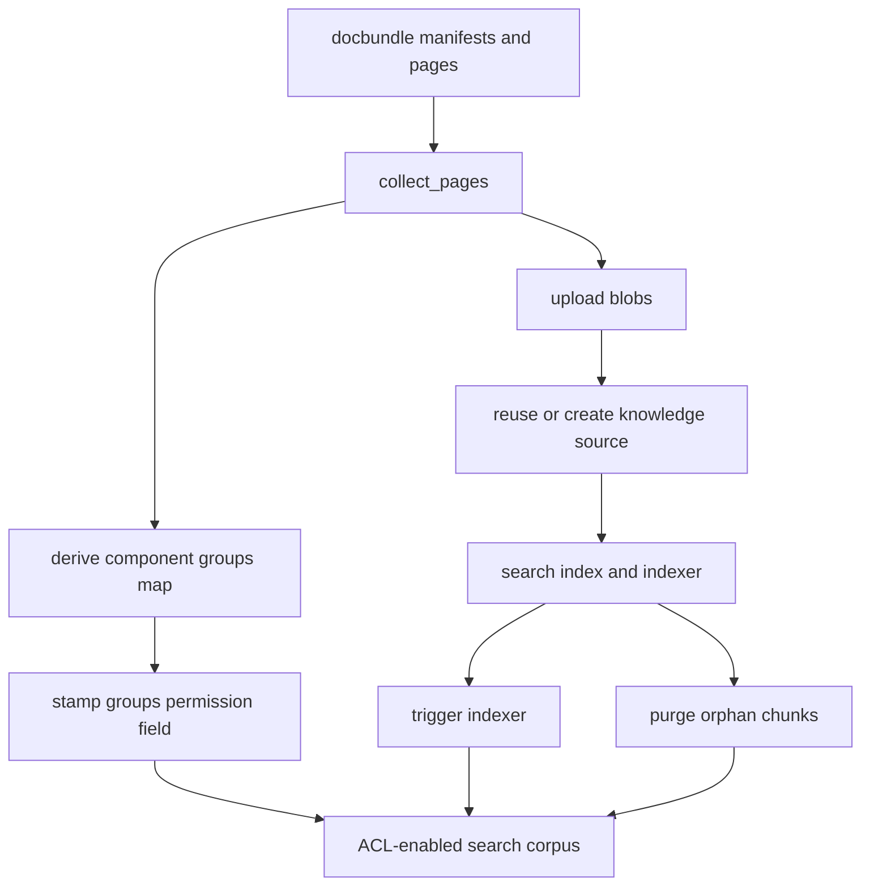

# Knowledge ingestion and ACL stamping

The knowledge module owns more than retrieval. It also owns how corpora become queryable Foundry/Search assets. The simplest path is `internal/ingest.py`, which uploads Markdown runbooks, creates a blob knowledge source, creates a knowledge base, and waits for ingestion status ([apps/backend/app/modules/knowledge/internal/ingest.py](https://github.com/ruinosus/foundry-assured/blob/08e078d7f2b6febbc5135f0b7928b5a204c667e3/apps/backend/app/modules/knowledge/internal/ingest.py#L1-L20), [apps/backend/app/modules/knowledge/internal/ingest.py](https://github.com/ruinosus/foundry-assured/blob/08e078d7f2b6febbc5135f0b7928b5a204c667e3/apps/backend/app/modules/knowledge/internal/ingest.py#L235-L272)). The richer docbundle path in `ingest_docbundles.py` ingests generated wiki bundles for cockpit and selfwiki into separate corpora and Search-backed knowledge assets ([apps/backend/app/modules/knowledge/internal/ingest_docbundles.py](https://github.com/ruinosus/foundry-assured/blob/08e078d7f2b6febbc5135f0b7928b5a204c667e3/apps/backend/app/modules/knowledge/internal/ingest_docbundles.py#L1-L18), [apps/backend/app/modules/knowledge/internal/ingest_docbundles.py](https://github.com/ruinosus/foundry-assured/blob/08e078d7f2b6febbc5135f0b7928b5a204c667e3/apps/backend/app/modules/knowledge/internal/ingest_docbundles.py#L58-L66)).

## Helpdesk runbook ingestion

`ingest.py` encodes a three-step process:

1. upload corpus Markdown to blob storage,
2. create or update an Azure Blob knowledge source configured for embedding,
3. create or update a knowledge base configured for answer synthesis ([apps/backend/app/modules/knowledge/internal/ingest.py](https://github.com/ruinosus/foundry-assured/blob/08e078d7f2b6febbc5135f0b7928b5a204c667e3/apps/backend/app/modules/knowledge/internal/ingest.py#L8-L20)).

`upload_corpus()` is deliberately direct: it enumerates `corpus/*.md`, uploads each file to the configured storage container, and fails if the corpus directory is empty ([apps/backend/app/modules/knowledge/internal/ingest.py](https://github.com/ruinosus/foundry-assured/blob/08e078d7f2b6febbc5135f0b7928b5a204c667e3/apps/backend/app/modules/knowledge/internal/ingest.py#L109-L127)). `create_knowledge_source()` uses a `ResourceId=...` storage connection string so Search reaches blobs via managed identity, not keys, and binds embedding model information into `KnowledgeSourceIngestionParameters` ([apps/backend/app/modules/knowledge/internal/ingest.py](https://github.com/ruinosus/foundry-assured/blob/08e078d7f2b6febbc5135f0b7928b5a204c667e3/apps/backend/app/modules/knowledge/internal/ingest.py#L147-L175)). `create_knowledge_base()` then creates the Foundry-facing KB with answer-synthesis mode and a strict answer instruction about citing sources and declining when missing ([apps/backend/app/modules/knowledge/internal/ingest.py](https://github.com/ruinosus/foundry-assured/blob/08e078d7f2b6febbc5135f0b7928b5a204c667e3/apps/backend/app/modules/knowledge/internal/ingest.py#L178-L206)).

A subtle but important invariant here is timeout discipline. `_with_timeout()` wraps blocking SDK calls in a thread with a wall-clock limit and hard-exits on timeouts so a hung preview API call does not leave the ingestion command misleadingly stuck forever ([apps/backend/app/modules/knowledge/internal/ingest.py](https://github.com/ruinosus/foundry-assured/blob/08e078d7f2b6febbc5135f0b7928b5a204c667e3/apps/backend/app/modules/knowledge/internal/ingest.py#L73-L97)).

## Docbundle ingestion for cockpit and selfwiki

`ingest_docbundles.py` serves a different data shape: component/version bundles already rendered into Markdown pages plus `manifest.json` metadata. It is parameterized so the same pipeline can serve different generated corpora, but defaults to the cockpit domain and its searchIndex-backed KB naming ([apps/backend/app/modules/knowledge/internal/ingest_docbundles.py](https://github.com/ruinosus/foundry-assured/blob/08e078d7f2b6febbc5135f0b7928b5a204c667e3/apps/backend/app/modules/knowledge/internal/ingest_docbundles.py#L58-L66)).

`collect_pages()` is the core bundle-to-page transform. It walks manifests, skips legacy unversioned bundles, reads per-bundle `groups` declarations when present, rewrites generic H1s to component-and-version-qualified titles, and emits blob names of the form `<key>__<page-id>.md` ([apps/backend/app/modules/knowledge/internal/ingest_docbundles.py](https://github.com/ruinosus/foundry-assured/blob/08e078d7f2b6febbc5135f0b7928b5a204c667e3/apps/backend/app/modules/knowledge/internal/ingest_docbundles.py#L168-L218)). This title rewrite is why grounded citations show meaningful source filenames rather than generic “Repository Overview” pages.

The comments around `groups` are load-bearing: `null` or absent means the bundle declares no access policy and ingest may fall back to external maps or defaults, while an explicit `[]` means “nobody may read this” and must remain fail-closed ([apps/backend/app/modules/knowledge/internal/ingest_docbundles.py](https://github.com/ruinosus/foundry-assured/blob/08e078d7f2b6febbc5135f0b7928b5a204c667e3/apps/backend/app/modules/knowledge/internal/ingest_docbundles.py#L194-L201)). This exact semantic is also recorded in the vendored schema contract ([apps/backend/app/modules/knowledge/internal/docbundle_schema.py](https://github.com/ruinosus/foundry-assured/blob/08e078d7f2b6febbc5135f0b7928b5a204c667e3/apps/backend/app/modules/knowledge/internal/docbundle_schema.py#L17-L25)).

## ACL stamping and index shape

The critical ingestion-side security feature is ACL metadata stamped into the Search index. `cockpit_acl_stamp_test.py` documents the expected post-stamp schema: a `groups` field with `permissionFilter="groupIds"`, `filterable=true`, and `permissionFilterOption=enabled` on the index ([apps/backend/tests/knowledge/cockpit_acl_stamp_test.py](https://github.com/ruinosus/foundry-assured/blob/08e078d7f2b6febbc5135f0b7928b5a204c667e3/apps/backend/tests/knowledge/cockpit_acl_stamp_test.py#L1-L13), [apps/backend/tests/knowledge/cockpit_acl_stamp_test.py](https://github.com/ruinosus/foundry-assured/blob/08e078d7f2b6febbc5135f0b7928b5a204c667e3/apps/backend/tests/knowledge/cockpit_acl_stamp_test.py#L48-L64)). That schema is what later makes `x-ms-query-source-authorization` meaningful in retrieval.

`ingest_docbundles.py` is careful not to blow that away. `create_knowledge_source()` first checks whether the knowledge source already exists and skips recreation if it does, because recreating it would regenerate index schema without the out-of-band ACL field and Azure would refuse the resulting deletion attempt ([apps/backend/app/modules/knowledge/internal/ingest_docbundles.py](https://github.com/ruinosus/foundry-assured/blob/08e078d7f2b6febbc5135f0b7928b5a204c667e3/apps/backend/app/modules/knowledge/internal/ingest_docbundles.py#L236-L253)). This is one of the easiest ingestion mistakes to make if you treat every run as disposable provisioning.

## Indexer triggering and orphan cleanup

Docbundle ingestion explicitly triggers the Search indexer because relying on its schedule can make a fresh upload appear ingested while Search is still serving an old run. `trigger_indexer()` starts a new run and, by default, does not block to completion because the index is incrementally queryable while embeddings are still being built ([apps/backend/app/modules/knowledge/internal/ingest_docbundles.py](https://github.com/ruinosus/foundry-assured/blob/08e078d7f2b6febbc5135f0b7928b5a204c667e3/apps/backend/app/modules/knowledge/internal/ingest_docbundles.py#L69-L105)).

`purge_orphans()` addresses the complementary problem: the indexer never deletes chunks for blobs that were removed from storage. It enumerates live blobs, lists index documents with `x-ms-enable-elevated-read` so ACL trimming does not hide documents from cleanup, and deletes orphaned documents by `uid` ([apps/backend/app/modules/knowledge/internal/ingest_docbundles.py](https://github.com/ruinosus/foundry-assured/blob/08e078d7f2b6febbc5135f0b7928b5a204c667e3/apps/backend/app/modules/knowledge/internal/ingest_docbundles.py#L111-L165)). This is a strong example of data lifecycle logic that belongs in ingestion, not retrieval.

This diagram shows the docbundle ingestion lifecycle and where ACL metadata enters the system.

## Source-grounded bundle contract

Writers and readers share a vendored schema rather than an implicit convention. `docbundle_schema.py` loads `docbundle.schema.json`, exposes top-level and page-field helpers, and validates every manifest with `jsonschema.Draft202012Validator` before disk write ([apps/backend/app/modules/knowledge/internal/docbundle_schema.py](https://github.com/ruinosus/foundry-assured/blob/08e078d7f2b6febbc5135f0b7928b5a204c667e3/apps/backend/app/modules/knowledge/internal/docbundle_schema.py#L1-L15), [apps/backend/app/modules/knowledge/internal/docbundle_schema.py](https://github.com/ruinosus/foundry-assured/blob/08e078d7f2b6febbc5135f0b7928b5a204c667e3/apps/backend/app/modules/knowledge/internal/docbundle_schema.py#L46-L85)). When you change manifest-writing code, validate against that contract instead of adding local assumptions.

## Focused tests and validation

- `cockpit_acl_stamp_test.py` is the narrowest live proof that ACL metadata exists in the index schema ([apps/backend/tests/knowledge/cockpit_acl_stamp_test.py](https://github.com/ruinosus/foundry-assured/blob/08e078d7f2b6febbc5135f0b7928b5a204c667e3/apps/backend/tests/knowledge/cockpit_acl_stamp_test.py#L40-L71)).
- Ingestion commands themselves are the main validation path because they touch live cloud resources.
- After docbundle ingestion changes, validate both schema correctness and later retrieval behavior from ../backend/knowledge-retrieval.md.
