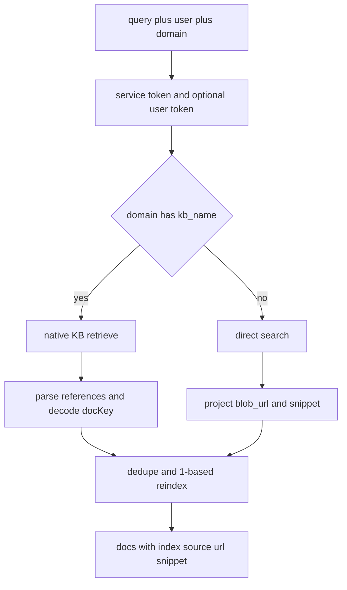

# Knowledge retrieval and ACL enforcement

`modules/knowledge.internal.retrieval` is the backend’s single retrieval seam. The file says so in its header: every grounded domain calls `retrieve()`, which hides two engines and two identity layers behind one interface ([apps/backend/app/modules/knowledge/internal/retrieval.py](https://github.com/ruinosus/foundry-assured/blob/08e078d7f2b6febbc5135f0b7928b5a204c667e3/apps/backend/app/modules/knowledge/internal/retrieval.py#L1-L23)). This module is also where the repository’s most important data-access invariant lives: **ACL trimming happens before the model sees content**.

## Public seam and central projection

`knowledge.public` re-exports `retrieve`, `authorized_components`, `trim_agentic_content`, `decode_dockey`, and `chunk_component`, making clear that retrieval and ACL trimming are intended cross-module APIs rather than accidental internals ([apps/backend/app/modules/knowledge/public.py](https://github.com/ruinosus/foundry-assured/blob/08e078d7f2b6febbc5135f0b7928b5a204c667e3/apps/backend/app/modules/knowledge/public.py#L1-L10), [apps/backend/app/modules/knowledge/public.py](https://github.com/ruinosus/foundry-assured/blob/08e078d7f2b6febbc5135f0b7928b5a204c667e3/apps/backend/app/modules/knowledge/public.py#L20-L26)). `retrieve()` itself returns a normalized list of `{index, source, url, snippet}` and centralizes dedupe and reindexing through `_project()` so both retrieval engines share the same output semantics ([apps/backend/app/modules/knowledge/internal/retrieval.py](https://github.com/ruinosus/foundry-assured/blob/08e078d7f2b6febbc5135f0b7928b5a204c667e3/apps/backend/app/modules/knowledge/internal/retrieval.py#L48-L79), [apps/backend/app/modules/knowledge/internal/retrieval.py](https://github.com/ruinosus/foundry-assured/blob/08e078d7f2b6febbc5135f0b7928b5a204c667e3/apps/backend/app/modules/knowledge/internal/retrieval.py#L278-L295)).

That normalized shape is exactly what grounded synthesis and frontend citations consume, so changing `_project()` changes every grounded answer.

## Two engines behind one seam

`retrieve()` chooses the engine by domain shape:

- if the domain has `kb_name`, it uses `_native_retrieve()` against the Foundry IQ knowledge-base `retrieve` endpoint,
- otherwise it uses `_direct_search_authorized()` against the Search index directly ([apps/backend/app/modules/knowledge/internal/retrieval.py](https://github.com/ruinosus/foundry-assured/blob/08e078d7f2b6febbc5135f0b7928b5a204c667e3/apps/backend/app/modules/knowledge/internal/retrieval.py#L48-L73)).

The native path is the primary engine for searchIndex-backed KBs. It posts to `/knowledgebases/{kb}/retrieve`, sets `knowledgeSourceParams.kind = "searchIndex"`, and includes `includeReferenceSourceData=true` so every reference comes back with source data and snippet information ([apps/backend/app/modules/knowledge/internal/retrieval.py](https://github.com/ruinosus/foundry-assured/blob/08e078d7f2b6febbc5135f0b7928b5a204c667e3/apps/backend/app/modules/knowledge/internal/retrieval.py#L105-L170)). The direct-search path is the fallback for domains without KB-backed retrieve, posting straight to `/indexes/{search_index}/docs/search` and returning raw rows later normalized by `_project()` ([apps/backend/app/modules/knowledge/internal/retrieval.py](https://github.com/ruinosus/foundry-assured/blob/08e078d7f2b6febbc5135f0b7928b5a204c667e3/apps/backend/app/modules/knowledge/internal/retrieval.py#L248-L275)).

## Two identity layers on every query

Retrieval separates service identity from user identity. `retrieve()` always gets a Search-scoped token from `DefaultAzureCredential` for the service credential, then optionally obtains a per-user Search token via `_user_search_token(user)` when the domain has `acl_group_map` ([apps/backend/app/modules/knowledge/internal/retrieval.py](https://github.com/ruinosus/foundry-assured/blob/08e078d7f2b6febbc5135f0b7928b5a204c667e3/apps/backend/app/modules/knowledge/internal/retrieval.py#L60-L68)). `_user_search_token()` itself uses OBO only when auth is enabled and a user exists; otherwise it returns `None` ([apps/backend/app/modules/knowledge/internal/retrieval.py](https://github.com/ruinosus/foundry-assured/blob/08e078d7f2b6febbc5135f0b7928b5a204c667e3/apps/backend/app/modules/knowledge/internal/retrieval.py#L81-L102)).

The resulting rule is precise:

- public or auth-off domains omit the `x-ms-query-source-authorization` header,
- ACL-protected domains send the end-user token in that header,
- if the domain is ACL-protected and no user token exists, the system fails closed and returns no authorized docs rather than leaking content ([apps/backend/app/modules/knowledge/internal/retrieval.py](https://github.com/ruinosus/foundry-assured/blob/08e078d7f2b6febbc5135f0b7928b5a204c667e3/apps/backend/app/modules/knowledge/internal/retrieval.py#L21-L23), [apps/backend/app/modules/knowledge/internal/retrieval.py](https://github.com/ruinosus/foundry-assured/blob/08e078d7f2b6febbc5135f0b7928b5a204c667e3/apps/backend/app/modules/knowledge/internal/retrieval.py#L64-L72)).

## Native reference parsing and docKey decoding

The native path depends on reliable reference parsing. `_parse_native()` iterates `references[]`, decodes `docKey` into blob URLs, derives filenames from those URLs, and attaches per-reference snippets from `sourceData` ([apps/backend/app/modules/knowledge/internal/retrieval.py](https://github.com/ruinosus/foundry-assured/blob/08e078d7f2b6febbc5135f0b7928b5a204c667e3/apps/backend/app/modules/knowledge/internal/retrieval.py#L227-L245)). After either retrieval engine, `_project()` performs centralized dedupe-by-URL with first-result-wins semantics and assigns fresh 1-based `index` values to the surviving rows, which is why grounded citations stay sequential even when upstream retrieval returns duplicates ([apps/backend/app/modules/knowledge/internal/retrieval.py](https://github.com/ruinosus/foundry-assured/blob/08e078d7f2b6febbc5135f0b7928b5a204c667e3/apps/backend/app/modules/knowledge/internal/retrieval.py#L278-L295)).

`_decode_dockey()` is a carefully documented fix for real production keys. It strips the `<12hex>_` prefix and `_pages_<M>` suffix, tries standard base64 decode with 0–3 trailing-character trims to tolerate glued tail bytes, then extracts the first `https://...md` URL it finds; otherwise it returns the raw key as a readable fallback ([apps/backend/app/modules/knowledge/internal/retrieval.py](https://github.com/ruinosus/foundry-assured/blob/08e078d7f2b6febbc5135f0b7928b5a204c667e3/apps/backend/app/modules/knowledge/internal/retrieval.py#L172-L208)). `dockey_decode_test.py` locks that behavior against real captured keys and explicitly proves the old split-and-decode strategy would have failed on several of them ([apps/backend/tests/knowledge/dockey_decode_test.py](https://github.com/ruinosus/foundry-assured/blob/08e078d7f2b6febbc5135f0b7928b5a204c667e3/apps/backend/tests/knowledge/dockey_decode_test.py#L1-L20), [apps/backend/tests/knowledge/dockey_decode_test.py](https://github.com/ruinosus/foundry-assured/blob/08e078d7f2b6febbc5135f0b7928b5a204c667e3/apps/backend/tests/knowledge/dockey_decode_test.py#L56-L108)).

This diagram shows the two retrieval engines converging into one projected result shape.

## Defense in depth: app-side component trimming

The repository still keeps a second ACL layer in `secure_search.py`. The file explains two layers: service-side trimming via `x-ms-query-source-authorization`, and app-side trimming that computes the set of components the caller may read and removes any agentic-retrieved chunk from unauthorized components before the model sees it ([apps/backend/app/modules/knowledge/internal/secure_search.py](https://github.com/ruinosus/foundry-assured/blob/08e078d7f2b6febbc5135f0b7928b5a204c667e3/apps/backend/app/modules/knowledge/internal/secure_search.py#L1-L19)).

`authorized_components()` queries Search with the caller token and paginates `@odata.nextLink`, returning the set of component identifiers the caller may access ([apps/backend/app/modules/knowledge/internal/secure_search.py](https://github.com/ruinosus/foundry-assured/blob/08e078d7f2b6febbc5135f0b7928b5a204c667e3/apps/backend/app/modules/knowledge/internal/secure_search.py#L36-L55)). `trim_agentic_content()` then parses the agentic chunk array, keeps only chunks whose H1-derived component is authorized, and drops unmatched chunks fail-closed ([apps/backend/app/modules/knowledge/internal/secure_search.py](https://github.com/ruinosus/foundry-assured/blob/08e078d7f2b6febbc5135f0b7928b5a204c667e3/apps/backend/app/modules/knowledge/internal/secure_search.py#L58-L88)).

Even if the primary retrieval path improves, do not remove this layer casually; it is the repository’s explicit defense-in-depth answer to service-version differences.

## Retrieval-focused tests

`retrieval_acl_parity_test.py` is the narrowest high-value test for the production seam. It monkeypatches only `_user_search_token` to feed real per-user search tokens into `retrieve()` and then asserts that user A sees a confidential source while user B does not, catching bugs in header attachment, native retrieval, docKey parsing, and projection all at once ([apps/backend/tests/knowledge/retrieval_acl_parity_test.py](https://github.com/ruinosus/foundry-assured/blob/08e078d7f2b6febbc5135f0b7928b5a204c667e3/apps/backend/tests/knowledge/retrieval_acl_parity_test.py#L1-L19), [apps/backend/tests/knowledge/retrieval_acl_parity_test.py](https://github.com/ruinosus/foundry-assured/blob/08e078d7f2b6febbc5135f0b7928b5a204c667e3/apps/backend/tests/knowledge/retrieval_acl_parity_test.py#L107-L142)). `grounded_archetype_roundtrip_test.py` then verifies that the same distinction survives all the way through the `/cockpit` endpoint and into the `sources` event consumed by the UI ([apps/backend/tests/grounded/grounded_archetype_roundtrip_test.py](https://github.com/ruinosus/foundry-assured/blob/08e078d7f2b6febbc5135f0b7928b5a204c667e3/apps/backend/tests/grounded/grounded_archetype_roundtrip_test.py#L1-L18), [apps/backend/tests/grounded/grounded_archetype_roundtrip_test.py](https://github.com/ruinosus/foundry-assured/blob/08e078d7f2b6febbc5135f0b7928b5a204c667e3/apps/backend/tests/grounded/grounded_archetype_roundtrip_test.py#L125-L147)).

## Safe change checklist

When changing retrieval code, confirm all of these:

- Does the output still normalize to `{index, source, url, snippet}`?
- Does ACL-protected retrieval still attach the user header only when intended?
- Does docKey decoding still produce meaningful filenames and URLs?
- Does direct-search fallback preserve fail-closed semantics?
- Do structured citations in grounded responses still match frontend expectations?

Minimal validation:

- Run the docKey decode test for parsing changes.
- Run retrieval ACL parity for auth/header/path changes.
- Exercise one grounded browser flow if source event shape changed.
rsing changes.
- Run retrieval ACL parity for auth/header/path changes.
- Exercise one grounded browser flow if source event shape changed.
