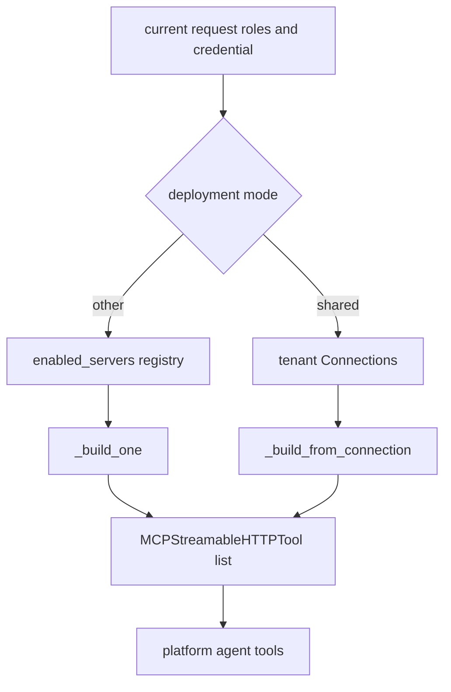

# Platform operations domain

The platform operations module is the one backend domain that answers by calling tools instead of retrieving a corpus. Its runtime entrypoint, `build_platform_agent()`, constructs a `FoundryChatClient` with tenant-scoped project/model config and the current request credential, then wraps that client as an agent with `PLATFORM_INSTRUCTIONS` and `build_mcp_tools()` ([apps/backend/app/modules/platform_ops/internal/platform.py](https://github.com/ruinosus/foundry-assured/blob/08e078d7f2b6febbc5135f0b7928b5a204c667e3/apps/backend/app/modules/platform_ops/internal/platform.py#L31-L44)). The registry mounts `/platform` only when `platform_configured()` says the platform domain is available ([apps/backend/app/modules/platform_ops/internal/platform.py](https://github.com/ruinosus/foundry-assured/blob/08e078d7f2b6febbc5135f0b7928b5a204c667e3/apps/backend/app/modules/platform_ops/internal/platform.py#L25-L29), [apps/backend/app/registry.py](https://github.com/ruinosus/foundry-assured/blob/08e078d7f2b6febbc5135f0b7928b5a204c667e3/apps/backend/app/registry.py#L143-L155)).

## Registry-as-data

The heart of the module is `mcp_registry.py`. Its header explains the design goal: MCP servers are represented as pure data so both the internal `MCPStreamableHTTPTool` path and the hosted Toolbox path can share one catalog, and governance decisions such as read/write classification and minimum roles live in data instead of code branches ([apps/backend/app/modules/platform_ops/internal/mcp_registry.py](https://github.com/ruinosus/foundry-assured/blob/08e078d7f2b6febbc5135f0b7928b5a204c667e3/apps/backend/app/modules/platform_ops/internal/mcp_registry.py#L1-L12)).

Each `McpServer` row records:

- stable server ID,
- label and URL,
- auth mode (`public`, `obo`, `github_pat`, or `oauth_passthrough`),
- optional OBO scope,
- explicit read and write tool names,
- minimum role for read and write access,
- enabled flag ([apps/backend/app/modules/platform_ops/internal/mcp_registry.py](https://github.com/ruinosus/foundry-assured/blob/08e078d7f2b6febbc5135f0b7928b5a204c667e3/apps/backend/app/modules/platform_ops/internal/mcp_registry.py#L24-L35)).

The fail-closed rule is critical: `classify_tool()` treats any unclassified tool as a write, not a read ([apps/backend/app/modules/platform_ops/internal/mcp_registry.py](https://github.com/ruinosus/foundry-assured/blob/08e078d7f2b6febbc5135f0b7928b5a204c667e3/apps/backend/app/modules/platform_ops/internal/mcp_registry.py#L130-L135)). That makes adding tools safe by default.

## Role model and stricter-of-both gating

The registry defines read-role and write-role grant sets, then exposes `visible_tools()` and `visible_tools_for()` to filter tools by caller roles ([apps/backend/app/modules/platform_ops/internal/mcp_registry.py](https://github.com/ruinosus/foundry-assured/blob/08e078d7f2b6febbc5135f0b7928b5a204c667e3/apps/backend/app/modules/platform_ops/internal/mcp_registry.py#L18-L22), [apps/backend/app/modules/platform_ops/internal/mcp_registry.py](https://github.com/ruinosus/foundry-assured/blob/08e078d7f2b6febbc5135f0b7928b5a204c667e3/apps/backend/app/modules/platform_ops/internal/mcp_registry.py#L142-L175)). `visible_tools_for()` applies a stricter-of-both rule: the global server’s minimum role and the tenant connection’s minimum role must both pass. This lets a tenant tighten access but never loosen the repository default.

`rbac_per_tool_test.py` is the narrowest evidence of this contract. It proves readers see only reads, authors see writes, connection-specific tightening can hide reads from readers, and unknown kinds resolve to `None` ([apps/backend/tests/platform_ops/rbac_per_tool_test.py](https://github.com/ruinosus/foundry-assured/blob/08e078d7f2b6febbc5135f0b7928b5a204c667e3/apps/backend/tests/platform_ops/rbac_per_tool_test.py#L1-L4), [apps/backend/tests/platform_ops/rbac_per_tool_test.py](https://github.com/ruinosus/foundry-assured/blob/08e078d7f2b6febbc5135f0b7928b5a204c667e3/apps/backend/tests/platform_ops/rbac_per_tool_test.py#L22-L45)).

## Internal live path: build_mcp_tools()

`mcp_tools.py` builds the internal live tools. The module docstring spells out the policy: each server is filtered to the caller’s visible tools, `allowed_tools` is set so hidden tools cannot be called by the model, write approval is handled by the repository’s own HITL flow rather than native MCP approval, and authentication differs per server ([apps/backend/app/modules/platform_ops/internal/mcp_tools.py](https://github.com/ruinosus/foundry-assured/blob/08e078d7f2b6febbc5135f0b7928b5a204c667e3/apps/backend/app/modules/platform_ops/internal/mcp_tools.py#L1-L18)).

The auth helpers are the key extension seams:

- `_obo_header_provider(scope)` lazily mints a user-scoped OBO bearer on each tool call ([apps/backend/app/modules/platform_ops/internal/mcp_tools.py](https://github.com/ruinosus/foundry-assured/blob/08e078d7f2b6febbc5135f0b7928b5a204c667e3/apps/backend/app/modules/platform_ops/internal/mcp_tools.py#L36-L41));
- `_static_header_provider(value)` injects a fixed bearer such as a GitHub PAT ([apps/backend/app/modules/platform_ops/internal/mcp_tools.py](https://github.com/ruinosus/foundry-assured/blob/08e078d7f2b6febbc5135f0b7928b5a204c667e3/apps/backend/app/modules/platform_ops/internal/mcp_tools.py#L44-L48));
- `_foundry_connection_header_provider(connection_id)` brokers credentials from a Foundry connection rather than reading secrets from local storage ([apps/backend/app/modules/platform_ops/internal/mcp_tools.py](https://github.com/ruinosus/foundry-assured/blob/08e078d7f2b6febbc5135f0b7928b5a204c667e3/apps/backend/app/modules/platform_ops/internal/mcp_tools.py#L51-L68)).

This diagram shows how platform tools are assembled differently in shared versus non-shared modes.

## Shared-mode connection-driven builds

`build_mcp_tools()` is mode-aware. In shared mode, it calls `build_from_connections(_current_tenant_connections(), roles)`; in other modes it iterates `enabled_servers()` and uses the flat registry path ([apps/backend/app/modules/platform_ops/internal/mcp_tools.py](https://github.com/ruinosus/foundry-assured/blob/08e078d7f2b6febbc5135f0b7928b5a204c667e3/apps/backend/app/modules/platform_ops/internal/mcp_tools.py#L223-L240)). The shared path treats tenant `Connection` records as the source of target URLs, role tightening, and Foundry connection references. `connection_tools_build_test.py` proves the no-network version of that path using an in-memory `learn` connection ([apps/backend/tests/platform_ops/connection_tools_build_test.py](https://github.com/ruinosus/foundry-assured/blob/08e078d7f2b6febbc5135f0b7928b5a204c667e3/apps/backend/tests/platform_ops/connection_tools_build_test.py#L1-L5), [apps/backend/tests/platform_ops/connection_tools_build_test.py](https://github.com/ruinosus/foundry-assured/blob/08e078d7f2b6febbc5135f0b7928b5a204c667e3/apps/backend/tests/platform_ops/connection_tools_build_test.py#L24-L40)).

A key operational invariant here is that auth-off local mode should still be usable. `build_mcp_tools()` treats auth-disabled callers as `Admin` for tool visibility so local development does not hide every tool behind an empty role set ([apps/backend/app/modules/platform_ops/internal/mcp_tools.py](https://github.com/ruinosus/foundry-assured/blob/08e078d7f2b6febbc5135f0b7928b5a204c667e3/apps/backend/app/modules/platform_ops/internal/mcp_tools.py#L230-L239)).

## Hosted path versus internal path

The module also exports `build_hosted_from_connections()`, which uses a `get_tool` callback instead of `MCPStreamableHTTPTool`. In hosted mode, Foundry resolves auth through `project_connection_id`, so there is no header provider; the same connection/URL/RBAC logic is shared, but the acquisition mechanism changes ([apps/backend/app/modules/platform_ops/internal/mcp_tools.py](https://github.com/ruinosus/foundry-assured/blob/08e078d7f2b6febbc5135f0b7928b5a204c667e3/apps/backend/app/modules/platform_ops/internal/mcp_tools.py#L184-L210)). This is the bridge to the hosted platform agent documented under ../hosted-agents/platform-invocations.md.

## Configuration and availability

`platform_configured()` varies subtly by mode. In shared mode it mounts when `mcp_enabled` is globally on, because per-tenant access is checked later; in non-shared modes it also requires a Foundry project endpoint in tenant config ([apps/backend/app/modules/platform_ops/internal/platform.py](https://github.com/ruinosus/foundry-assured/blob/08e078d7f2b6febbc5135f0b7928b5a204c667e3/apps/backend/app/modules/platform_ops/internal/platform.py#L25-L29)). This matters when debugging “why is `/platform` absent?” versus “why is it mounted but returning no tools?”

## Focused validation

- `rbac_per_tool_test.py` for server and connection role filtering.
- `connection_tools_build_test.py` for shared-mode connection mapping.
- Backend `/platform` smoke with one read and one write-intent action.
- If hosted behavior changes, also verify the hosted path in ../backend/hosted-bridges-and-evals.md.
