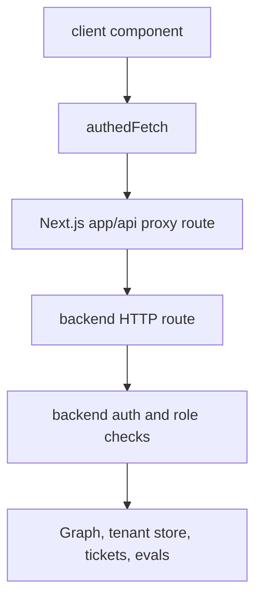

# Frontend API proxies and admin surfaces

The frontend does not call backend URLs directly from most browser components. Instead, it uses Next.js route handlers under `app/api` as a proxy layer for backend health, CopilotKit runtime calls, admin APIs, tenant APIs, profile data, tickets, and evals. This keeps backend URLs and auth header handling centralized and avoids exposing cross-origin details to browser code.

## Health and utility proxy pattern

The smallest example is `/api/health`: it proxies `GET /healthz` to the backend and intentionally returns only `{ ok }`, giving the sidebar status dot a same-origin endpoint without exposing the backend URL in browser code ([apps/frontend/app/api/health/route.ts](https://github.com/ruinosus/foundry-assured/blob/08e078d7f2b6febbc5135f0b7928b5a204c667e3/apps/frontend/app/api/health/route.ts#L1-L15)). This is the general pattern the rest of the proxy family follows.

## CopilotKit runtime proxy

The assurance console always points CopilotKit at `/api/copilotkit`, not directly at the backend AG-UI server ([apps/frontend/components/console/AssuranceConsole.tsx](https://github.com/ruinosus/foundry-assured/blob/08e078d7f2b6febbc5135f0b7928b5a204c667e3/apps/frontend/components/console/AssuranceConsole.tsx#L41-L45)). That means the route handler under `app/api/copilotkit` is the frontend’s runtime choke point for every chat turn, whether the selected agent is live or hosted. Any change to headers, body shape, or route selection in that handler affects all chat domains.

## Auth forwarding from browser helpers

Client admin and tenant components call `authedFetch()`, which acquires the current MSAL token silently when auth is configured and attaches it to same-origin proxy requests ([apps/frontend/lib/auth/api.ts](https://github.com/ruinosus/foundry-assured/blob/08e078d7f2b6febbc5135f0b7928b5a204c667e3/apps/frontend/lib/auth/api.ts#L3-L25)). Because the browser talks to frontend proxy routes, not directly to backend endpoints, those route handlers must preserve `Authorization` headers or the backend’s role and tenant checks will fail even though the user is signed in.

## Tenant admin page behavior

`components/admin/Connections.tsx` is the frontend control plane for tenant onboarding, data-plane configuration, and connection management. Its header captures the contract: all real authority stays in backend `/tenant/*` routes, every operation is re-gated server-side by the `Admin` role, and secrets are never entered here—only references such as Foundry connection IDs or Key Vault refs ([apps/frontend/components/admin/Connections.tsx](https://github.com/ruinosus/foundry-assured/blob/08e078d7f2b6febbc5135f0b7928b5a204c667e3/apps/frontend/components/admin/Connections.tsx#L3-L7)).

The component’s local `call()` helper targets `/api/tenant/...`, not backend URLs directly, and normalizes backend errors into UI-facing exceptions ([apps/frontend/components/admin/Connections.tsx](https://github.com/ruinosus/foundry-assured/blob/08e078d7f2b6febbc5135f0b7928b5a204c667e3/apps/frontend/components/admin/Connections.tsx#L45-L49)). The rest of the component is a thin stateful shell around those proxies: it loads tenant status, triggers onboarding, saves data-plane config, lists connections, edits connection forms, and deletes connections ([apps/frontend/components/admin/Connections.tsx](https://github.com/ruinosus/foundry-assured/blob/08e078d7f2b6febbc5135f0b7928b5a204c667e3/apps/frontend/components/admin/Connections.tsx#L63-L107), [apps/frontend/components/admin/Connections.tsx](https://github.com/ruinosus/foundry-assured/blob/08e078d7f2b6febbc5135f0b7928b5a204c667e3/apps/frontend/components/admin/Connections.tsx#L138-L197), [apps/frontend/components/admin/Connections.tsx](https://github.com/ruinosus/foundry-assured/blob/08e078d7f2b6febbc5135f0b7928b5a204c667e3/apps/frontend/components/admin/Connections.tsx#L201-L280)).

## Admin route gating in UI

The admin page itself checks roles client-side before rendering the management UI. `app/admin/connections/page.tsx` loads `useMyRoles()`, shows a loading state, renders `<Connections />` only for admins, and otherwise shows explanatory copy about needing the `Admin` role and re-authentication so the token includes it ([apps/frontend/app/admin/connections/page.tsx](https://github.com/ruinosus/foundry-assured/blob/08e078d7f2b6febbc5135f0b7928b5a204c667e3/apps/frontend/app/admin/connections/page.tsx#L3-L29)). This is convenience gating only; backend route handlers remain the real authority.

This diagram shows the same-origin proxy chain used by admin and utility UI surfaces.

## UI invariants worth preserving

- The browser should never need to know the backend URL for common operations; route handlers own that wiring.
- Auth headers must survive proxying for any backend route that depends on roles or tenant resolution.
- Tenant/admin UIs should only collect references and metadata, never secrets.
- Client-side role gating is optional UX polish; backend enforcement is mandatory and already documented in ../backend/admin-and-tickets.md.

## Focused validation

- Load an admin page as an admin and as a non-admin.
- Verify one `/api/tenant` write and one `/api/admin` read still carry auth correctly.
- Smoke `/api/health` after any backend URL or route-handler refactor.
