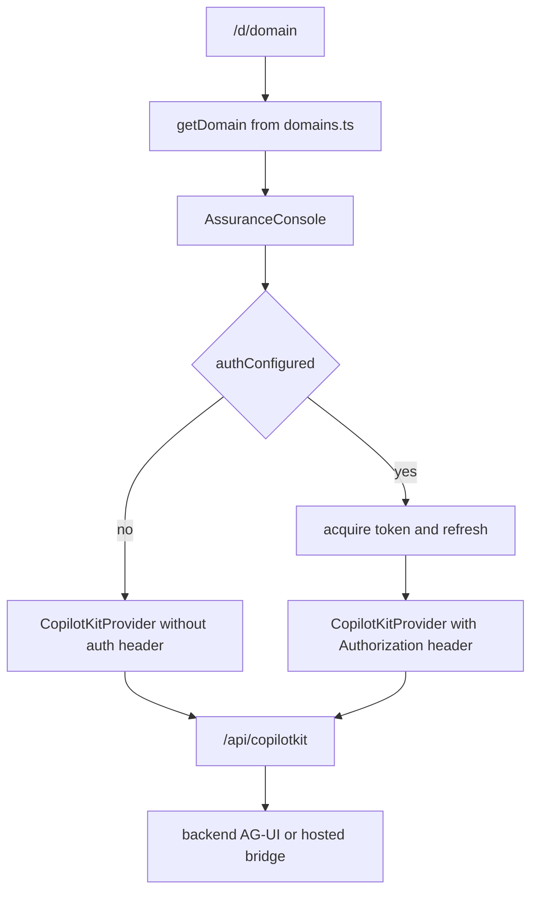

# Frontend app and client runtime

The frontend is a Next.js application that renders one configurable assurance console across multiple domains rather than building a separate UI stack per agent. `apps/frontend/package.json` shows the key runtime dependencies: Next.js, React, CopilotKit, AG-UI client support, and MSAL browser/react packages ([apps/frontend/package.json](https://github.com/ruinosus/foundry-assured/blob/08e078d7f2b6febbc5135f0b7928b5a204c667e3/apps/frontend/package.json#L1-L24)). The app is intentionally client-heavy because MSAL and CopilotKit cannot run meaningfully during SSR for the core chat surface ([apps/frontend/app/d/[domain]/page.tsx](https://github.com/ruinosus/foundry-assured/blob/08e078d7f2b6febbc5135f0b7928b5a204c667e3/apps/frontend/app/d/%5Bdomain%5D/page.tsx#L3-L14)).

## Generic domain route and console

`/d/[domain]` is the canonical user route. The page only reads the route parameter and renders `AssuranceConsole` inside `AppShell`, making the domain registry the true navigation system rather than the file tree ([apps/frontend/app/d/[domain]/page.tsx](https://github.com/ruinosus/foundry-assured/blob/08e078d7f2b6febbc5135f0b7928b5a204c667e3/apps/frontend/app/d/%5Bdomain%5D/page.tsx#L16-L24)). The console resolves the domain from `getDomain(domainId)` and fails gracefully if the domain is unknown ([apps/frontend/components/console/AssuranceConsole.tsx](https://github.com/ruinosus/foundry-assured/blob/08e078d7f2b6febbc5135f0b7928b5a204c667e3/apps/frontend/components/console/AssuranceConsole.tsx#L151-L162)).

The core console behavior comes from domain metadata plus domain kind. Workflow domains render `WorkflowSteps` and `TicketApproval`; any domain with `hostedAgentId` gets a live/hosted toggle; all domains share the same `CopilotChat` and `EvidencePanel` frame ([apps/frontend/components/console/AssuranceConsole.tsx](https://github.com/ruinosus/foundry-assured/blob/08e078d7f2b6febbc5135f0b7928b5a204c667e3/apps/frontend/components/console/AssuranceConsole.tsx#L32-L40), [apps/frontend/components/console/AssuranceConsole.tsx](https://github.com/ruinosus/foundry-assured/blob/08e078d7f2b6febbc5135f0b7928b5a204c667e3/apps/frontend/components/console/AssuranceConsole.tsx#L61-L99)). That means many UI changes are actually registry or domain-kind changes in disguise.

## CopilotKit runtime and token forwarding

`Console` wraps the whole chat experience in `CopilotKitProvider` with `runtimeUrl="/api/copilotkit"` and optionally forwards an `Authorization` header derived from MSAL token acquisition ([apps/frontend/components/console/AssuranceConsole.tsx](https://github.com/ruinosus/foundry-assured/blob/08e078d7f2b6febbc5135f0b7928b5a204c667e3/apps/frontend/components/console/AssuranceConsole.tsx#L41-L45)). `AuthedConsole` acquires tokens silently, refreshes them on a timer to stay ahead of access-token expiry, and redirects for interaction if silent acquisition fails ([apps/frontend/components/console/AssuranceConsole.tsx](https://github.com/ruinosus/foundry-assured/blob/08e078d7f2b6febbc5135f0b7928b5a204c667e3/apps/frontend/components/console/AssuranceConsole.tsx#L113-L149)).

This is the frontend half of the backend OBO story from ../architecture/auth-and-identity.md. If you change token audiences, scopes, or the CopilotKit proxy route, the breakage will usually surface first as empty or 401-ing chat runs.

This diagram shows how the generic console chooses its runtime path.

## Hosted versus live toggles

The live/hosted toggle is data-driven. `AssuranceConsole` computes `activeAgentId` from local mode state and `domain.hostedAgentId`, then passes that agent ID into `CopilotChat` ([apps/frontend/components/console/AssuranceConsole.tsx](https://github.com/ruinosus/foundry-assured/blob/08e078d7f2b6febbc5135f0b7928b5a204c667e3/apps/frontend/components/console/AssuranceConsole.tsx#L32-L39), [apps/frontend/components/console/AssuranceConsole.tsx](https://github.com/ruinosus/foundry-assured/blob/08e078d7f2b6febbc5135f0b7928b5a204c667e3/apps/frontend/components/console/AssuranceConsole.tsx#L70-L94)). This is why the frontend registry’s `hostedAgentId` is part of the runtime contract, not just display metadata ([apps/frontend/lib/domains.ts](https://github.com/ruinosus/foundry-assured/blob/08e078d7f2b6febbc5135f0b7928b5a204c667e3/apps/frontend/lib/domains.ts#L22-L26), [apps/frontend/lib/domains.ts](https://github.com/ruinosus/foundry-assured/blob/08e078d7f2b6febbc5135f0b7928b5a204c667e3/apps/frontend/lib/domains.ts#L41-L45)).

`HelpdeskApp` uses the same pattern for the dedicated `/chat` route and explains the semantics in UI copy: live workflow means AG-UI steps, approval, OBO, and memory; hosted agent means managed Foundry Agent Service with no live steps or approval UI ([apps/frontend/components/chat/HelpdeskApp.tsx](https://github.com/ruinosus/foundry-assured/blob/08e078d7f2b6febbc5135f0b7928b5a204c667e3/apps/frontend/components/chat/HelpdeskApp.tsx#L21-L35), [apps/frontend/components/chat/HelpdeskApp.tsx](https://github.com/ruinosus/foundry-assured/blob/08e078d7f2b6febbc5135f0b7928b5a204c667e3/apps/frontend/components/chat/HelpdeskApp.tsx#L47-L87)).

## EvidencePanel and citation UX

`EvidencePanel` is the repository’s client-side grounding surface. It subscribes to AG-UI events through `useAgent`, clears citations on `RUN_STARTED`, records structured citations from a `CUSTOM` event named `sources`, and falls back to extracting file/component references heuristically from answer text when structured citations are absent ([apps/frontend/components/console/EvidencePanel.tsx](https://github.com/ruinosus/foundry-assured/blob/08e078d7f2b6febbc5135f0b7928b5a204c667e3/apps/frontend/components/console/EvidencePanel.tsx#L8-L13), [apps/frontend/components/console/EvidencePanel.tsx](https://github.com/ruinosus/foundry-assured/blob/08e078d7f2b6febbc5135f0b7928b5a204c667e3/apps/frontend/components/console/EvidencePanel.tsx#L71-L108)).

When citations exist, the panel renders numbered buttons and expands inline `content` snippets on click ([apps/frontend/components/console/EvidencePanel.tsx](https://github.com/ruinosus/foundry-assured/blob/08e078d7f2b6febbc5135f0b7928b5a204c667e3/apps/frontend/components/console/EvidencePanel.tsx#L117-L149)). The browser ACL test depends on that behavior and explicitly treats a non-empty `.citation-content` as proof that content-on-click still works ([e2e/cockpit-acl.spec.ts](https://github.com/ruinosus/foundry-assured/blob/08e078d7f2b6febbc5135f0b7928b5a204c667e3/e2e/cockpit-acl.spec.ts#L129-L145), [e2e/cockpit-acl.spec.ts](https://github.com/ruinosus/foundry-assured/blob/08e078d7f2b6febbc5135f0b7928b5a204c667e3/e2e/cockpit-acl.spec.ts#L168-L177)).

## Demo mode

The frontend has a true mock runtime path, not just sample copy. `lib/demo.ts` defines demo mode as `NEXT_PUBLIC_DEMO_MODE=1`, and `msal.ts` forces auth off in that mode because the mock backend does not validate tokens ([apps/frontend/lib/demo.ts](https://github.com/ruinosus/foundry-assured/blob/08e078d7f2b6febbc5135f0b7928b5a204c667e3/apps/frontend/lib/demo.ts#L1-L5), [apps/frontend/lib/auth/msal.ts](https://github.com/ruinosus/foundry-assured/blob/08e078d7f2b6febbc5135f0b7928b5a204c667e3/apps/frontend/lib/auth/msal.ts#L13-L18)). `HelpdeskApp` reflects this in UI by replacing the engine toggle with a “Demo · replayed fixture” badge when demo mode is enabled ([apps/frontend/components/chat/HelpdeskApp.tsx](https://github.com/ruinosus/foundry-assured/blob/08e078d7f2b6febbc5135f0b7928b5a204c667e3/apps/frontend/components/chat/HelpdeskApp.tsx#L47-L70)).

Do not break demo mode when changing auth initialization or runtime URLs; it is part of the documented developer and demo workflow.

## Focused validation

- Load `/d/helpdesk`, `/d/selfwiki`, and `/d/platform` and verify domain-specific UI pieces still appear.
- Verify a structured-citation answer populates EvidencePanel and reveals inline snippet content on click.
- For auth changes, verify token acquisition and silent refresh behavior.
- For demo changes, run the documented demo path and confirm no sign-in is required.
