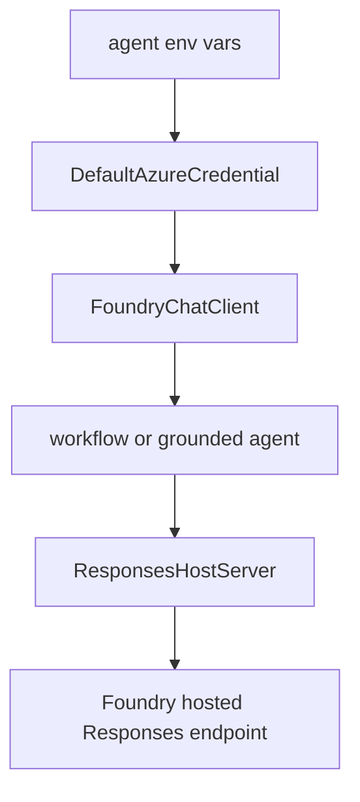

# Responses-hosted agents

Three hosted-agent services in this repository share the same basic pattern: `apps/hosted-agent`, `apps/hosted-cockpit`, and `apps/hosted-selfwiki` each package a self-contained agent and expose the Responses protocol through `ResponsesHostServer` ([apps/hosted-agent/main.py](https://github.com/ruinosus/foundry-assured/blob/08e078d7f2b6febbc5135f0b7928b5a204c667e3/apps/hosted-agent/main.py#L1-L17), [apps/hosted-cockpit/main.py](https://github.com/ruinosus/foundry-assured/blob/08e078d7f2b6febbc5135f0b7928b5a204c667e3/apps/hosted-cockpit/main.py#L1-L12), [apps/hosted-selfwiki/main.py](https://github.com/ruinosus/foundry-assured/blob/08e078d7f2b6febbc5135f0b7928b5a204c667e3/apps/hosted-selfwiki/main.py#L1-L12)). `azure.yaml` registers these services as `azure.ai.agent` deployments with `python main.py` startup commands ([azure.yaml](https://github.com/ruinosus/foundry-assured/blob/08e078d7f2b6febbc5135f0b7928b5a204c667e3/azure.yaml#L14-L38), [azure.yaml](https://github.com/ruinosus/foundry-assured/blob/08e078d7f2b6febbc5135f0b7928b5a204c667e3/azure.yaml#L50-L61)).

## Shared runtime pattern

All three containers follow the same construction recipe:

- load env,
- create `DefaultAzureCredential`,
- build a `FoundryChatClient` over `FOUNDRY_PROJECT_ENDPOINT` and model env,
- optionally attach an `AzureAISearchContextProvider`,
- wrap the resulting agent in `ResponsesHostServer`,
- call `run_async()` ([apps/hosted-agent/main.py](https://github.com/ruinosus/foundry-assured/blob/08e078d7f2b6febbc5135f0b7928b5a204c667e3/apps/hosted-agent/main.py#L53-L109), [apps/hosted-cockpit/main.py](https://github.com/ruinosus/foundry-assured/blob/08e078d7f2b6febbc5135f0b7928b5a204c667e3/apps/hosted-cockpit/main.py#L56-L87), [apps/hosted-selfwiki/main.py](https://github.com/ruinosus/foundry-assured/blob/08e078d7f2b6febbc5135f0b7928b5a204c667e3/apps/hosted-selfwiki/main.py#L59-L87)).

The identity model is always the platform-injected agent identity via `DefaultAzureCredential`; none of these hosted agents run with user OBO semantics ([apps/hosted-agent/main.py](https://github.com/ruinosus/foundry-assured/blob/08e078d7f2b6febbc5135f0b7928b5a204c667e3/apps/hosted-agent/main.py#L9-L16), [apps/hosted-selfwiki/main.py](https://github.com/ruinosus/foundry-assured/blob/08e078d7f2b6febbc5135f0b7928b5a204c667e3/apps/hosted-selfwiki/main.py#L6-L12)).

## Helpdesk hosted agent

The hosted helpdesk service packages a triage→retrieve→resolve workflow as a hosted agent. It builds three step agents, attaches agentic Search context to retrieve, sets `context_mode="last_agent"` for each step, and only exposes the resolve output as the final agent output ([apps/hosted-agent/main.py](https://github.com/ruinosus/foundry-assured/blob/08e078d7f2b6febbc5135f0b7928b5a204c667e3/apps/hosted-agent/main.py#L30-L50), [apps/hosted-agent/main.py](https://github.com/ruinosus/foundry-assured/blob/08e078d7f2b6febbc5135f0b7928b5a204c667e3/apps/hosted-agent/main.py#L70-L105)). The file is explicit about parity gaps: hosted helpdesk drops OBO, per-user memory, and human-in-the-loop escalation because those belong to the signed-in AG-UI workflow experience, not the single-identity request/response hosted model ([apps/hosted-agent/main.py](https://github.com/ruinosus/foundry-assured/blob/08e078d7f2b6febbc5135f0b7928b5a204c667e3/apps/hosted-agent/main.py#L8-L17)).

## Cockpit and selfwiki hosted agents

The hosted cockpit and selfwiki services are simpler grounded agents. Each creates one `AzureAISearchContextProvider`, attaches it to a single agent, and relies on instructions to enforce grounded answering discipline ([apps/hosted-cockpit/main.py](https://github.com/ruinosus/foundry-assured/blob/08e078d7f2b6febbc5135f0b7928b5a204c667e3/apps/hosted-cockpit/main.py#L25-L53), [apps/hosted-cockpit/main.py](https://github.com/ruinosus/foundry-assured/blob/08e078d7f2b6febbc5135f0b7928b5a204c667e3/apps/hosted-cockpit/main.py#L65-L84), [apps/hosted-selfwiki/main.py](https://github.com/ruinosus/foundry-assured/blob/08e078d7f2b6febbc5135f0b7928b5a204c667e3/apps/hosted-selfwiki/main.py#L25-L56), [apps/hosted-selfwiki/main.py](https://github.com/ruinosus/foundry-assured/blob/08e078d7f2b6febbc5135f0b7928b5a204c667e3/apps/hosted-selfwiki/main.py#L68-L84)). Their instructions are mirrored inline from backend prompt assets and the comments call out the need to keep them synchronized.

## Why they are self-contained

These containers do not import the backend module graph. Instead they duplicate the minimum runtime code and prompt text they need. That makes them independently deployable through Foundry Agent Service and keeps their container environments simple, but it also means prompt or workflow changes in the backend can drift from hosted behavior if not reviewed together ([apps/backend/app/modules/agentdefs/public.py](https://github.com/ruinosus/foundry-assured/blob/08e078d7f2b6febbc5135f0b7928b5a204c667e3/apps/backend/app/modules/agentdefs/public.py#L1-L7)).

This diagram shows the common hosted pattern shared by the three Responses-hosted services.

## Operational implications

Because these services rely on deploy-time managed identities, post-deploy RBAC reconciliation is required. `hook-postdeploy.sh` grants each hosted agent’s instance identity Azure AI User and Search Index Data Reader roles after deployment because those identities do not exist at Bicep provision time ([scripts/hook-postdeploy.sh](https://github.com/ruinosus/foundry-assured/blob/08e078d7f2b6febbc5135f0b7928b5a204c667e3/scripts/hook-postdeploy.sh#L2-L10), [scripts/hook-postdeploy.sh](https://github.com/ruinosus/foundry-assured/blob/08e078d7f2b6febbc5135f0b7928b5a204c667e3/scripts/hook-postdeploy.sh#L41-L59)). If a hosted agent deploys but returns 403s, start there.

## Focused validation

- Build validation: `apps/backend/tests/hosted/hosted_build_test.py` and related hosted tests.
- Runtime validation: switch a frontend domain to hosted mode and complete one response.
- Deployment validation: confirm post-deploy hook RBAC assignments exist for the hosted agent identity.
