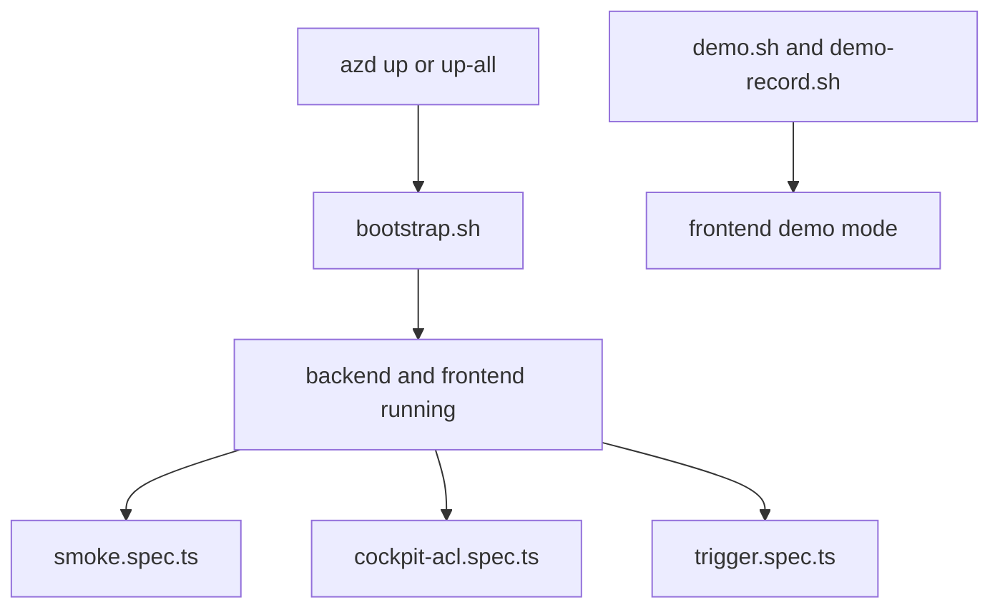

# Operational scripts and end-to-end flows

The repository’s shell scripts are not incidental helpers; together they form the supported operator workflow for local bring-up, cloud deployment, auth setup, prompt publishing, and demos. The e2e Playwright suite is the browser-level evidence that those workflows result in a working product.

## Bootstrap path

`bootstrap.sh` is the explicit post-provision data-plane bootstrap. It reads the current azd environment, writes backend and frontend env files, ingests the helpdesk knowledge base, and provisions the Foundry memory store ([scripts/bootstrap.sh](https://github.com/ruinosus/foundry-assured/blob/08e078d7f2b6febbc5135f0b7928b5a204c667e3/scripts/bootstrap.sh#L1-L12), [scripts/bootstrap.sh](https://github.com/ruinosus/foundry-assured/blob/08e078d7f2b6febbc5135f0b7928b5a204c667e3/scripts/bootstrap.sh#L41-L63)). Its comments document a subtle bug it is defending against: missing env extraction must not silently default memory store names to empty strings and skip provisioning ([scripts/bootstrap.sh](https://github.com/ruinosus/foundry-assured/blob/08e078d7f2b6febbc5135f0b7928b5a204c667e3/scripts/bootstrap.sh#L48-L53)).

## One-shot environment bring-up

`up-all.sh` is the top-level orchestrator. It performs tool/login preflight, optionally creates Entra app registrations and app roles before provisioning, runs `azd up`, then runs `bootstrap.sh` as an explicit third stage ([scripts/up-all.sh](https://github.com/ruinosus/foundry-assured/blob/08e078d7f2b6febbc5135f0b7928b5a204c667e3/scripts/up-all.sh#L7-L26), [scripts/up-all.sh](https://github.com/ruinosus/foundry-assured/blob/08e078d7f2b6febbc5135f0b7928b5a204c667e3/scripts/up-all.sh#L49-L67), [scripts/up-all.sh](https://github.com/ruinosus/foundry-assured/blob/08e078d7f2b6febbc5135f0b7928b5a204c667e3/scripts/up-all.sh#L68-L109)). The script doubles as an architectural runbook because it documents what the azd hooks automated and what still remains manual afterward ([scripts/up-all.sh](https://github.com/ruinosus/foundry-assured/blob/08e078d7f2b6febbc5135f0b7928b5a204c667e3/scripts/up-all.sh#L112-L132)).

## Prompt publishing and runtime updates

`push-prompts.sh` is the production runtime prompt update path. It uploads `apps/backend/agents` to the prompts share, supports a `--mirror` mode to delete removed files, and restarts the backend revision so newly uploaded prompt assets are composed at boot ([scripts/push-prompts.sh](https://github.com/ruinosus/foundry-assured/blob/08e078d7f2b6febbc5135f0b7928b5a204c667e3/scripts/push-prompts.sh#L1-L17), [scripts/push-prompts.sh](https://github.com/ruinosus/foundry-assured/blob/08e078d7f2b6febbc5135f0b7928b5a204c667e3/scripts/push-prompts.sh#L55-L77)). This script operationalizes ADR-014’s “restart, not rebuild” rule.

## Demo and fixture workflows

The frontend package scripts reference repo-level `demo.sh` and `demo-record.sh`, which let contributors replay or re-record AG-UI fixtures instead of running a live Azure backend ([apps/frontend/package.json](https://github.com/ruinosus/foundry-assured/blob/08e078d7f2b6febbc5135f0b7928b5a204c667e3/apps/frontend/package.json#L5-L13)). The README documents this as the no-Azure demo path, and `lib/demo.ts` encodes the frontend runtime switch for it (README.md, [apps/frontend/lib/demo.ts](https://github.com/ruinosus/foundry-assured/blob/08e078d7f2b6febbc5135f0b7928b5a204c667e3/apps/frontend/lib/demo.ts#L1-L5)).

## Browser E2E test families

The Playwright config is explicitly aimed at the deployed cloud app, with one browser worker, long timeouts for scale-to-zero cold start, and artifacts under `e2e/artifacts/` ([e2e/playwright.config.ts](https://github.com/ruinosus/foundry-assured/blob/08e078d7f2b6febbc5135f0b7928b5a204c667e3/e2e/playwright.config.ts#L3-L13), [e2e/playwright.config.ts](https://github.com/ruinosus/foundry-assured/blob/08e078d7f2b6febbc5135f0b7928b5a204c667e3/e2e/playwright.config.ts#L15-L38)). Three high-value specs cover distinct evidence classes:

- `smoke.spec.ts` signs in once, visits each domain route, asks helpdesk a grounded question, and explores hosted and citation paths where available ([e2e/smoke.spec.ts](https://github.com/ruinosus/foundry-assured/blob/08e078d7f2b6febbc5135f0b7928b5a204c667e3/e2e/smoke.spec.ts#L6-L18), [e2e/smoke.spec.ts](https://github.com/ruinosus/foundry-assured/blob/08e078d7f2b6febbc5135f0b7928b5a204c667e3/e2e/smoke.spec.ts#L74-L90), [e2e/smoke.spec.ts](https://github.com/ruinosus/foundry-assured/blob/08e078d7f2b6febbc5135f0b7928b5a204c667e3/e2e/smoke.spec.ts#L123-L209));
- `cockpit-acl.spec.ts` signs in as two users, asks the same grounded cockpit question, asserts that only the cleared user sees the confidential citation, and verifies inline citation snippet rendering ([e2e/cockpit-acl.spec.ts](https://github.com/ruinosus/foundry-assured/blob/08e078d7f2b6febbc5135f0b7928b5a204c667e3/e2e/cockpit-acl.spec.ts#L6-L19), [e2e/cockpit-acl.spec.ts](https://github.com/ruinosus/foundry-assured/blob/08e078d7f2b6febbc5135f0b7928b5a204c667e3/e2e/cockpit-acl.spec.ts#L152-L177));
- `trigger.spec.ts` is a minimal diagnostic trigger that captures `RUN_ERROR` lines from a cockpit run stream for faster failure triage ([e2e/trigger.spec.ts](https://github.com/ruinosus/foundry-assured/blob/08e078d7f2b6febbc5135f0b7928b5a204c667e3/e2e/trigger.spec.ts#L6-L13), [e2e/trigger.spec.ts](https://github.com/ruinosus/foundry-assured/blob/08e078d7f2b6febbc5135f0b7928b5a204c667e3/e2e/trigger.spec.ts#L17-L52)).

This diagram shows the operator workflow from provisioning to browser-level verification.

## Focused validation

- After infra or auth changes, run the authenticated smoke flow first.
- After grounded retrieval or citation changes, run the cockpit ACL spec.
- After prompt publishing or backend runtime changes, verify at least one live and one hosted path from the UI.
