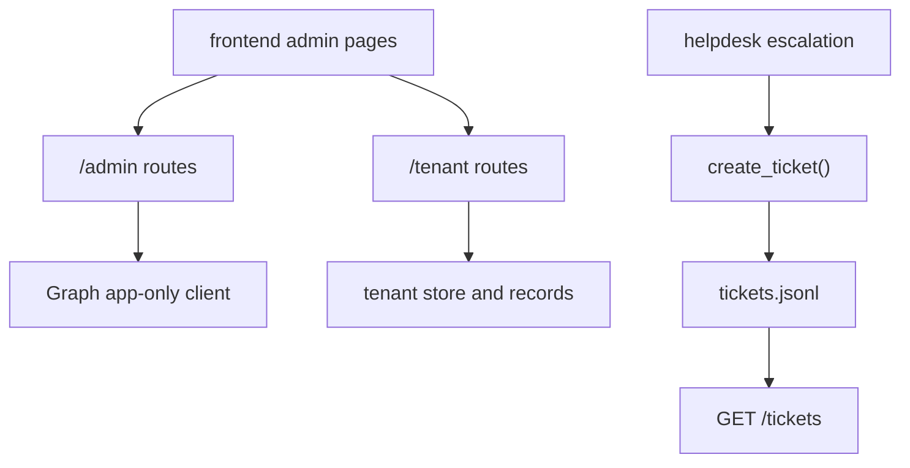

# Admin, tenant management, and tickets

The backend has three operator-facing HTTP surfaces that sit outside the live domain endpoints: admin user and role management, tenant-scoped onboarding and connection management, and ticket persistence/readback. They are separate modules, but they work together as the repository’s control plane.

## Admin Graph API

`modules.admin.api_admin` declares the user lifecycle and app-role API surface under `/admin`. The module header states the rule clearly: every endpoint requires the `Admin` app role and all actual directory work is delegated to Microsoft Graph from the server, never from the browser ([apps/backend/app/modules/admin/api_admin.py](https://github.com/ruinosus/foundry-assured/blob/08e078d7f2b6febbc5135f0b7928b5a204c667e3/apps/backend/app/modules/admin/api_admin.py#L1-L6)). The router binds a reusable `_admin = Depends(require_role("Admin"))` and applies it to roles, users, invitations, deletions, and role-assignment routes ([apps/backend/app/modules/admin/api_admin.py](https://github.com/ruinosus/foundry-assured/blob/08e078d7f2b6febbc5135f0b7928b5a204c667e3/apps/backend/app/modules/admin/api_admin.py#L17-L28), [apps/backend/app/modules/admin/api_admin.py](https://github.com/ruinosus/foundry-assured/blob/08e078d7f2b6febbc5135f0b7928b5a204c667e3/apps/backend/app/modules/admin/api_admin.py#L47-L88)).

The underlying Graph client lives in `modules.admin.internal.graph`. It authenticates with the API app’s own client credentials, not the calling admin’s identity, so an authorized admin can manage users regardless of who they are personally ([apps/backend/app/modules/admin/internal/graph.py](https://github.com/ruinosus/foundry-assured/blob/08e078d7f2b6febbc5135f0b7928b5a204c667e3/apps/backend/app/modules/admin/internal/graph.py#L1-L15), [apps/backend/app/modules/admin/internal/graph.py](https://github.com/ruinosus/foundry-assured/blob/08e078d7f2b6febbc5135f0b7928b5a204c667e3/apps/backend/app/modules/admin/internal/graph.py#L34-L40)). That module also caches the API service principal ID and app-role IDs so role assignment calls can be translated from human role names to Graph IDs ([apps/backend/app/modules/admin/internal/graph.py](https://github.com/ruinosus/foundry-assured/blob/08e078d7f2b6febbc5135f0b7928b5a204c667e3/apps/backend/app/modules/admin/internal/graph.py#L75-L97)).

## Tenant management API

Shared-mode tenant management is surfaced under `/tenant`. The header comment in `tenancy/api.py` explains the two auth modes for this router: `GET /tenant` must tolerate not-yet-onboarded tenants and therefore uses `require_role("Admin")` alone, while config and connection endpoints use both `require_user` and `Admin` because they require an onboarded tenant context ([apps/backend/app/modules/tenancy/api.py](https://github.com/ruinosus/foundry-assured/blob/08e078d7f2b6febbc5135f0b7928b5a204c667e3/apps/backend/app/modules/tenancy/api.py#L1-L7), [apps/backend/app/modules/tenancy/api.py](https://github.com/ruinosus/foundry-assured/blob/08e078d7f2b6febbc5135f0b7928b5a204c667e3/apps/backend/app/modules/tenancy/api.py#L26-L43)).

Important route families:

- `GET /tenant` returns onboarding status or a redacted tenant record ([apps/backend/app/modules/tenancy/api.py](https://github.com/ruinosus/foundry-assured/blob/08e078d7f2b6febbc5135f0b7928b5a204c667e3/apps/backend/app/modules/tenancy/api.py#L72-L80));
- `POST /tenant/onboard` creates an idempotent `TenantRecord` and seeds `enabled_domains` from tier defaults ([apps/backend/app/modules/tenancy/api.py](https://github.com/ruinosus/foundry-assured/blob/08e078d7f2b6febbc5135f0b7928b5a204c667e3/apps/backend/app/modules/tenancy/api.py#L82-L100));
- `PUT /tenant/config` updates mutable `TenantConfig` fields for the caller’s tenant ([apps/backend/app/modules/tenancy/api.py](https://github.com/ruinosus/foundry-assured/blob/08e078d7f2b6febbc5135f0b7928b5a204c667e3/apps/backend/app/modules/tenancy/api.py#L103-L107));
- `/tenant/connections` lists, adds, and deletes connection records ([apps/backend/app/modules/tenancy/api.py](https://github.com/ruinosus/foundry-assured/blob/08e078d7f2b6febbc5135f0b7928b5a204c667e3/apps/backend/app/modules/tenancy/api.py#L110-L129));
- `/tenant/domains` gets and updates per-tenant enabled-domain entitlement ([apps/backend/app/modules/tenancy/api.py](https://github.com/ruinosus/foundry-assured/blob/08e078d7f2b6febbc5135f0b7928b5a204c667e3/apps/backend/app/modules/tenancy/api.py#L132-L151)).

The response redaction path `_redacted()` is part of the security design. It blanks secret-bearing `TenantConfig` fields before returning records from APIs, even though the control-plane model itself aims to avoid storing secrets directly ([apps/backend/app/modules/tenancy/api.py](https://github.com/ruinosus/foundry-assured/blob/08e078d7f2b6febbc5135f0b7928b5a204c667e3/apps/backend/app/modules/tenancy/api.py#L62-L70)).

## Connection validation boundaries

Adding a tenant connection is not an unchecked blob of metadata. `POST /tenant/connections` rejects unknown connection kinds via `validate_kind()` and requires either `foundry_connection_id` or `keyvault_ref` before storing the record ([apps/backend/app/modules/tenancy/api.py](https://github.com/ruinosus/foundry-assured/blob/08e078d7f2b6febbc5135f0b7928b5a204c667e3/apps/backend/app/modules/tenancy/api.py#L115-L123)). `validate_kind()` itself lives in the tenancy store module and raises if the platform server catalog was never injected, so wiring mistakes are surfaced as architecture problems rather than bad data ([apps/backend/app/modules/tenancy/internal/tenant_store.py](https://github.com/ruinosus/foundry-assured/blob/08e078d7f2b6febbc5135f0b7928b5a204c667e3/apps/backend/app/modules/tenancy/internal/tenant_store.py#L47-L66)).

## Ticket persistence

Tickets are a real persisted side effect, not a simulation. `modules.tickets.internal.tickets` defines `create_ticket()` and `list_tickets()` over a JSONL store at `app/data/tickets.jsonl`, and also wraps `create_ticket()` as an agent-framework tool for hosted-agent use ([apps/backend/app/modules/tickets/internal/tickets.py](https://github.com/ruinosus/foundry-assured/blob/08e078d7f2b6febbc5135f0b7928b5a204c667e3/apps/backend/app/modules/tickets/internal/tickets.py#L1-L10), [apps/backend/app/modules/tickets/internal/tickets.py](https://github.com/ruinosus/foundry-assured/blob/08e078d7f2b6febbc5135f0b7928b5a204c667e3/apps/backend/app/modules/tickets/internal/tickets.py#L21-L69)). The HTTP route `GET /tickets` is auth-gated and described as the source for the frontend `/tickets` page ([apps/backend/app/modules/tickets/api.py](https://github.com/ruinosus/foundry-assured/blob/08e078d7f2b6febbc5135f0b7928b5a204c667e3/apps/backend/app/modules/tickets/api.py#L1-L16)).

This is the persistence target the helpdesk escalation executor writes to after approval and role checks. So changing ticket structure is not just a backend data-model change; it affects helpdesk output text, `/tickets`, and hosted-agent tool behavior.

This diagram shows the control-plane and ticket-management surfaces exposed by the backend.

## Focused validation

- Admin changes: verify one user listing call and one role assignment flow against Graph.
- Tenant API changes: verify onboard, add connection, and enabled-domain update in shared mode.
- Ticket changes: run one approved helpdesk escalation and confirm `/tickets` returns the new record.
