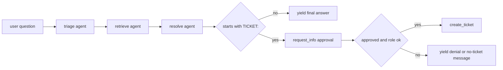

# Helpdesk workflow module

The helpdesk module owns the repository’s canonical multi-agent workflow: triage, retrieve, resolve, then optionally escalate behind human approval. Its public surface is intentionally small: `build_helpdesk_workflow`, `EscalationExecutor`, `build_memory_provider`, and `OrderedAgentFrameworkWorkflow` are the exported parts other modules are allowed to use ([apps/backend/app/modules/helpdesk/public.py](https://github.com/ruinosus/foundry-assured/blob/08e078d7f2b6febbc5135f0b7928b5a204c667e3/apps/backend/app/modules/helpdesk/public.py#L1-L19)). The registry mounts that workflow at `/helpdesk` only when knowledge is configured; otherwise it falls back to a single concierge agent, preserving a working app even without KB provisioning ([apps/backend/app/registry.py](https://github.com/ruinosus/foundry-assured/blob/08e078d7f2b6febbc5135f0b7928b5a204c667e3/apps/backend/app/registry.py#L124-L140)).

## Per-request workflow construction

`build_helpdesk_workflow()` is the core factory. It calls `credential_for_request()` and `memory_scope()` first, then builds memory, triage, retrieve, and resolve agents from those request-scoped values, and finally attaches `EscalationExecutor` as the terminal node ([apps/backend/app/modules/helpdesk/internal/graph.py](https://github.com/ruinosus/foundry-assured/blob/08e078d7f2b6febbc5135f0b7928b5a204c667e3/apps/backend/app/modules/helpdesk/internal/graph.py#L29-L42)). The reason for per-request construction is in the module docstring: the AG-UI workflow factory only receives a `thread_id`, so request identity has to arrive indirectly through auth context and be consumed when the workflow is built ([apps/backend/app/modules/helpdesk/internal/graph.py](https://github.com/ruinosus/foundry-assured/blob/08e078d7f2b6febbc5135f0b7928b5a204c667e3/apps/backend/app/modules/helpdesk/internal/graph.py#L1-L14)).

The factory then creates a linear chain `triage -> retrieve -> resolve -> escalate` through `WorkflowBuilder.add_chain()` ([apps/backend/app/modules/helpdesk/internal/graph.py](https://github.com/ruinosus/foundry-assured/blob/08e078d7f2b6febbc5135f0b7928b5a204c667e3/apps/backend/app/modules/helpdesk/internal/graph.py#L43-L55)). This chain is the domain’s main behavioral invariant: triage never answers directly, retrieve grounds the next step, resolve chooses answer versus ticket sentinel, and escalation is the only place where a side effect can happen.

## Memory and user identity

Helpdesk memory is not global chat history. The workflow factory computes `scope = memory_scope()` from tenancy and feeds it into `build_memory_provider()` together with the current request credential ([apps/backend/app/modules/helpdesk/internal/graph.py](https://github.com/ruinosus/foundry-assured/blob/08e078d7f2b6febbc5135f0b7928b5a204c667e3/apps/backend/app/modules/helpdesk/internal/graph.py#L31-L35)). That means memory ownership is shared between the helpdesk module and the tenancy/auth seams: helpdesk owns when memory is used, but tenancy and auth decide whose memory scope it is.

Because `credential_for_request()` falls back to `DefaultAzureCredential` when auth is off, the same workflow can run locally without Entra, but the semantics change from per-user OBO to app identity ([apps/backend/app/shared/auth.py](https://github.com/ruinosus/foundry-assured/blob/08e078d7f2b6febbc5135f0b7928b5a204c667e3/apps/backend/app/shared/auth.py#L165-L175)). This is why auth-disabled local runs are supported for development but not representative of per-user authorization behavior.

## Escalation and approval invariants

`EscalationExecutor` is the module’s most important safety boundary. The executor only treats resolve output specially when it begins with `TICKET:`; otherwise it yields the resolve text directly as final output ([apps/backend/app/modules/helpdesk/internal/escalation.py](https://github.com/ruinosus/foundry-assured/blob/08e078d7f2b6febbc5135f0b7928b5a204c667e3/apps/backend/app/modules/helpdesk/internal/escalation.py#L34-L35), [apps/backend/app/modules/helpdesk/internal/escalation.py](https://github.com/ruinosus/foundry-assured/blob/08e078d7f2b6febbc5135f0b7928b5a204c667e3/apps/backend/app/modules/helpdesk/internal/escalation.py#L50-L65)). When it does see a ticket sentinel, it pauses the workflow via `ctx.request_info()` and waits for a boolean response ([apps/backend/app/modules/helpdesk/internal/escalation.py](https://github.com/ruinosus/foundry-assured/blob/08e078d7f2b6febbc5135f0b7928b5a204c667e3/apps/backend/app/modules/helpdesk/internal/escalation.py#L55-L61)).

The structural invariant is explicit in the comments: **no ticket without approval**. `create_ticket()` is called only in `on_decision()` after both human approval and a role check for `Approver` or `Admin` ([apps/backend/app/modules/helpdesk/internal/escalation.py](https://github.com/ruinosus/foundry-assured/blob/08e078d7f2b6febbc5135f0b7928b5a204c667e3/apps/backend/app/modules/helpdesk/internal/escalation.py#L66-L89)). Rejecting approval yields a no-ticket response, and approving without the right role yields a denial message and no side effect ([apps/backend/app/modules/helpdesk/internal/escalation.py](https://github.com/ruinosus/foundry-assured/blob/08e078d7f2b6febbc5135f0b7928b5a204c667e3/apps/backend/app/modules/helpdesk/internal/escalation.py#L73-L81), [apps/backend/app/modules/helpdesk/internal/escalation.py](https://github.com/ruinosus/foundry-assured/blob/08e078d7f2b6febbc5135f0b7928b5a204c667e3/apps/backend/app/modules/helpdesk/internal/escalation.py#L90-L93)).

This diagram shows the workflow’s side-effect boundary and why ticket creation is structurally gated.

## Why escalation is a workflow node, not an approval-gated tool

The module comment documents a historical constraint: AG-UI workflow adapter behavior duplicated `TOOL_CALL_START` for approval-gated tool calls, so the workflow’s native `request_info` interrupt is used instead because CopilotKit renders it cleanly via `useInterrupt` ([apps/backend/app/modules/helpdesk/internal/escalation.py](https://github.com/ruinosus/foundry-assured/blob/08e078d7f2b6febbc5135f0b7928b5a204c667e3/apps/backend/app/modules/helpdesk/internal/escalation.py#L9-L16)). This is not just a UI quirk. It means the helpdesk HITL design is partly constrained by AG-UI adapter behavior, so replacing it with tool approval would be a protocol-level change, not a refactor.

## Ordered stream fix

The public API exports `OrderedAgentFrameworkWorkflow`, not just the workflow builder, because stream ordering matters to the chat UI ([apps/backend/app/modules/helpdesk/public.py](https://github.com/ruinosus/foundry-assured/blob/08e078d7f2b6febbc5135f0b7928b5a204c667e3/apps/backend/app/modules/helpdesk/public.py#L9-L18)). The registry uses that wrapper when mounting the live `/helpdesk` endpoint ([apps/backend/app/registry.py](https://github.com/ruinosus/foundry-assured/blob/08e078d7f2b6febbc5135f0b7928b5a204c667e3/apps/backend/app/registry.py#L127-L136)). If you swap the wrapper out, verify workflow-step rendering and approval handling in the frontend, not just backend correctness.

## Relationship to hosted helpdesk

The hosted helpdesk agent is related but not equivalent. `apps/hosted-agent/main.py` packages a triage→retrieve→resolve workflow as a Responses-hosted agent and explicitly drops OBO, per-user memory, and HITL escalation because hosted Responses is single-identity request/response ([apps/hosted-agent/main.py](https://github.com/ruinosus/foundry-assured/blob/08e078d7f2b6febbc5135f0b7928b5a204c667e3/apps/hosted-agent/main.py#L1-L17)). So the backend helpdesk module remains the only full-parity implementation of approval-gated live workflow behavior.

## Focused tests and validation

The repository-wide browser smoke flow is the narrowest integrated proof that helpdesk still mounts, signs in, sends a question, replaces the welcome screen, and starts a workflow run ([e2e/smoke.spec.ts](https://github.com/ruinosus/foundry-assured/blob/08e078d7f2b6febbc5135f0b7928b5a204c667e3/e2e/smoke.spec.ts#L134-L168)). For backend-only behavior, the helpdesk module’s key invariants are best checked by targeted module tests plus the ticket and hosted pages they feed.

Minimal validation after helpdesk changes:

- Run a live `/helpdesk` turn and verify steps stream in order.
- Approve and reject an escalation once each.
- Confirm `GET /tickets` reflects only approved ticket creation from the workflow path.
