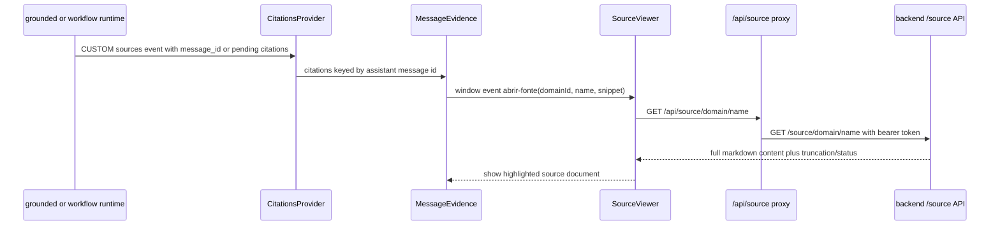

# Assurance Console

`components/console/AssuranceConsole.tsx` is the canonical frontend chat surface. It remains one UI for every domain, with runtime-specific behavior selected from the domain registry, but the evidence model changed substantially in this range: citations are now rendered under the response that produced them, and the side column no longer owns live response evidence. [Source](https://github.com/ruinosus/foundry-assured/blob/8e5fef809b476602ff31f4821f13e5bb18b64830/apps/frontend/components/console/AssuranceConsole.tsx#L3-L15) [Source](https://github.com/ruinosus/foundry-assured/blob/8e5fef809b476602ff31f4821f13e5bb18b64830/apps/frontend/components/console/AssuranceConsole.tsx#L52-L80) [Source](https://github.com/ruinosus/foundry-assured/blob/8e5fef809b476602ff31f4821f13e5bb18b64830/apps/frontend/components/console/AssuranceConsole.tsx#L130-L185)

This page depends on Grounded Domains for where `sources` events come from and on Backend State and Persistence for why reopened conversations can now restore evidence.

## Runtime-sensitive UI behavior

The console still distinguishes runtime kinds explicitly. Domain metadata decides agent identity and runtime selection: `activeAgentId` is either the live domain id or the hosted twin id, so AG-UI routing and hosted/live selection stay metadata-driven rather than page-hardcoded. Approval handling remains split by runtime family:

- `workflow` renders workflow steps plus `TicketApproval`;
- `tool` renders `TicketApproval` without workflow steps;
- `graph` renders `GraphApproval` because LangGraph interrupts use CopilotKit’s interrupt model;
- `grounded` renders no HITL component. [Source](https://github.com/ruinosus/foundry-assured/blob/8e5fef809b476602ff31f4821f13e5bb18b64830/apps/frontend/components/console/AssuranceConsole.tsx#L42-L50) [Source](https://github.com/ruinosus/foundry-assured/blob/8e5fef809b476602ff31f4821f13e5bb18b64830/apps/frontend/components/console/AssuranceConsole.tsx#L121-L128)

That branching is still architectural rather than cosmetic: the comments and components make clear that Agent Framework and LangGraph interrupts are different wire contracts, so one approval renderer cannot safely replace the other. [Source](https://github.com/ruinosus/foundry-assured/blob/8e5fef809b476602ff31f4821f13e5bb18b64830/apps/frontend/components/chat/TicketApproval.tsx#L1-L17) [Source](https://github.com/ruinosus/foundry-assured/blob/8e5fef809b476602ff31f4821f13e5bb18b64830/apps/frontend/components/chat/GraphApproval.tsx#L1-L19)

## Hosted and live toggles

If a domain declares `hostedAgentId`, the console still shows the live/hosted toggle and switches `activeAgentId` accordingly. One subtle invariant remains important: conversation history is keyed by the live domain id, not by hosted-agent id, so toggling runtime does not split a user’s chat history into two unrelated transcripts. [Source](https://github.com/ruinosus/foundry-assured/blob/8e5fef809b476602ff31f4821f13e5bb18b64830/apps/frontend/components/console/AssuranceConsole.tsx#L61-L72) [Source](https://github.com/ruinosus/foundry-assured/blob/8e5fef809b476602ff31f4821f13e5bb18b64830/apps/frontend/components/console/AssuranceConsole.tsx#L101-L118)

That coupling is why conversation replay and evidence replay are shared across live and hosted variants of the same domain.

## Per-message evidence model

The biggest change is that evidence now lives under each assistant response via `makeAssistantMessage(domain.id)`, `CitationsProvider`, and `MessageEvidence.tsx`. `AssuranceConsole` mounts `CitationsProvider` around `CopilotChat`, and `makeAssistantMessage(...)` supplies a custom assistant-message slot that renders a standard CopilotKit assistant message plus a per-message source list beneath it. [Source](https://github.com/ruinosus/foundry-assured/blob/8e5fef809b476602ff31f4821f13e5bb18b64830/apps/frontend/components/console/AssuranceConsole.tsx#L73-L81) [Source](https://github.com/ruinosus/foundry-assured/blob/8e5fef809b476602ff31f4821f13e5bb18b64830/apps/frontend/components/console/AssuranceConsole.tsx#L130-L141) [Source](https://github.com/ruinosus/foundry-assured/blob/8e5fef809b476602ff31f4821f13e5bb18b64830/apps/frontend/components/console/MessageEvidence.tsx#L86-L118) [Source](https://github.com/ruinosus/foundry-assured/blob/8e5fef809b476602ff31f4821f13e5bb18b64830/apps/frontend/components/console/MessageEvidence.tsx#L159-L187)

This fixes the old session-global failure mode: if evidence only lives in one side panel, scrolling up to an older answer leaves that answer detached from its sources. The code comments in both `AssuranceConsole.tsx` and `MessageEvidence.tsx` treat message-local evidence as the product requirement, not as a presentation preference. [Source](https://github.com/ruinosus/foundry-assured/blob/8e5fef809b476602ff31f4821f13e5bb18b64830/apps/frontend/components/console/AssuranceConsole.tsx#L145-L174) [Source](https://github.com/ruinosus/foundry-assured/blob/8e5fef809b476602ff31f4821f13e5bb18b64830/apps/frontend/components/console/MessageEvidence.tsx#L3-L29)

### Citation event binding

`lib/citations.tsx` is the evidence event router. It listens for `CUSTOM name="sources"` events from the active agent subscription and stores citations by message id. Two event shapes are supported:

- direct `{message_id, citations}` payloads, used by grounded domains now that the backend includes response ids; and
- pending citations without a message id, which are attached to the next `TEXT_MESSAGE_START`, preserving older workflow ordering. [Source](https://github.com/ruinosus/foundry-assured/blob/8e5fef809b476602ff31f4821f13e5bb18b64830/apps/frontend/lib/citations.tsx#L34-L65) [Source](https://github.com/ruinosus/foundry-assured/blob/8e5fef809b476602ff31f4821f13e5bb18b64830/apps/frontend/lib/citations.tsx#L67-L126)

The important lifecycle invariant is that pending evidence is cleared at run start, run finish, run error, and subscription teardown. Without those clears, a citation from one run can silently attach to a later message in another run or after a hosted/live toggle. [Source](https://github.com/ruinosus/foundry-assured/blob/8e5fef809b476602ff31f4821f13e5bb18b64830/apps/frontend/lib/citations.tsx#L96-L125)

## Inline citation rendering

`MessageEvidence.tsx` no longer splits markdown on `[n]` markers. Instead it leaves the full message inside one `MarkdownRenderer` and adds `rehypeCitations(citations)` as a rehype plugin. The plugin only rewrites text nodes, skips code and links, and injects lightweight `<data>` nodes that React components turn into source buttons. [Source](https://github.com/ruinosus/foundry-assured/blob/8e5fef809b476602ff31f4821f13e5bb18b64830/apps/frontend/components/console/MessageEvidence.tsx#L92-L118) [Source](https://github.com/ruinosus/foundry-assured/blob/8e5fef809b476602ff31f4821f13e5bb18b64830/apps/frontend/lib/rehype-citations.ts#L1-L33) [Source](https://github.com/ruinosus/foundry-assured/blob/8e5fef809b476602ff31f4821f13e5bb18b64830/apps/frontend/lib/rehype-citations.ts#L45-L110)

That implementation seam matters if you change evidence syntax. A text-level split would break tables, fenced code, Mermaid, and links. The plugin approach preserves markdown structure while still making valid citation markers interactive.

## Source viewer and full-document confirmation

Clicking a citation now opens `SourceViewer`, not just a side-panel snippet. `SourceViewer` listens for a window event emitted by citation buttons, calls `/api/source/{domain}/{name}` through `authedFetch`, renders the full markdown document with `CopilotChatAssistantMessage.MarkdownRenderer`, and highlights the cited snippet when possible. It also distinguishes `401`, `403`, `404`, generic errors, and truncation. [Source](https://github.com/ruinosus/foundry-assured/blob/8e5fef809b476602ff31f4821f13e5bb18b64830/apps/frontend/components/console/MessageEvidence.tsx#L49-L84) [Source](https://github.com/ruinosus/foundry-assured/blob/8e5fef809b476602ff31f4821f13e5bb18b64830/apps/frontend/components/console/SourceViewer.tsx#L26-L59) [Source](https://github.com/ruinosus/foundry-assured/blob/8e5fef809b476602ff31f4821f13e5bb18b64830/apps/frontend/components/console/SourceViewer.tsx#L81-L110) [Source](https://github.com/ruinosus/foundry-assured/blob/8e5fef809b476602ff31f4821f13e5bb18b64830/apps/frontend/components/console/SourceViewer.tsx#L112-L157)

The highlight logic is factored into `lib/source-highlight.ts`. It normalizes whitespace, maps normalized text positions back to real DOM text nodes, and marks the longest matching prefix of the cited snippet. The explicit design choice is best-effort highlighting: failure to find an exact span should not prevent the document from opening. [Source](https://github.com/ruinosus/foundry-assured/blob/8e5fef809b476602ff31f4821f13e5bb18b64830/apps/frontend/lib/source-highlight.ts#L1-L12) [Source](https://github.com/ruinosus/foundry-assured/blob/8e5fef809b476602ff31f4821f13e5bb18b64830/apps/frontend/lib/source-highlight.ts#L29-L57) [Source](https://github.com/ruinosus/foundry-assured/blob/8e5fef809b476602ff31f4821f13e5bb18b64830/apps/frontend/lib/source-highlight.ts#L95-L149)

This UI depends on the backend `/source/*` API described in Knowledge Pipeline. If that endpoint changes status mapping, cache headers, or payload shape, `SourceViewer` is the first consumer to update.

## Conversation replay and historical evidence

Reopening a stored conversation now replays citations as well as text. `lib/thread-history.ts` fetches stored messages by thread id, converts them to AG-UI messages, and emits synthetic history `sources` events via `historyCitationEvents(...)` and `historyConnectEvents(...)`. Those events use the same `message_id` routing contract that live evidence uses. [Source](https://github.com/ruinosus/foundry-assured/blob/8e5fef809b476602ff31f4821f13e5bb18b64830/apps/frontend/lib/thread-history.ts#L33-L57) [Source](https://github.com/ruinosus/foundry-assured/blob/8e5fef809b476602ff31f4821f13e5bb18b64830/apps/frontend/lib/thread-history.ts#L59-L79) [Source](https://github.com/ruinosus/foundry-assured/blob/8e5fef809b476602ff31f4821f13e5bb18b64830/apps/frontend/lib/thread-history.ts#L81-L125)

That frontend replay path only works because the backend now stores `annotations` with assistant messages. The cross-system contract is therefore:

1. backend grounded runtime emits `sources` with `message_id`; [Source](https://github.com/ruinosus/foundry-assured/blob/8e5fef809b476602ff31f4821f13e5bb18b64830/apps/backend/app/modules/grounded/internal/grounded.py#L260-L266)
2. backend persistence stores the same evidence with the assistant message; [Source](https://github.com/ruinosus/foundry-assured/blob/8e5fef809b476602ff31f4821f13e5bb18b64830/apps/backend/app/modules/conversations/internal/listing.py#L113-L123)
3. frontend replay reconstructs both text and evidence using the stored annotations. [Source](https://github.com/ruinosus/foundry-assured/blob/8e5fef809b476602ff31f4821f13e5bb18b64830/apps/frontend/lib/thread-history.ts#L45-L57)

## Auth lifecycle

The console still acquires tokens silently, refreshes them every four minutes, and degrades to direct rendering when auth is not configured. That behavior continues to matter because both chat transport and source-document fetches depend on the user’s bearer token. [Source](https://github.com/ruinosus/foundry-assured/blob/8e5fef809b476602ff31f4821f13e5bb18b64830/apps/frontend/components/console/AssuranceConsole.tsx#L192-L229) [Source](https://github.com/ruinosus/foundry-assured/blob/8e5fef809b476602ff31f4821f13e5bb18b64830/apps/frontend/lib/auth/api.ts#L1-L26)

## Runtime flow

This diagram focuses on the evidence lifecycle that changed in this update.

## When to edit this page

Consult this page when you are changing:

- evidence placement in the console,
- citation event handling or message slot customization,
- source-document viewer behavior,
- conversation replay semantics,
- hosted/live toggles that could affect evidence subscriptions.

Use Frontend API and Proxy Layer when the change is primarily about route handlers rather than console behavior.

## Focused validation

Start with:

- `cd apps/frontend && node scripts/verify-thread-citations.mjs`
- `cd apps/frontend && node scripts/verify-highlight.mjs`

Conditional follow-up checks:

- open `/d/selfwiki` or `/d/techdocs` and verify that `[n]` buttons render inline, open the source viewer, and still work after reloading the conversation;
- open `/d/helpdesk` and confirm pending citation behavior still binds to the correct response if a workflow emits `sources` before text starts;
- run `cd e2e && npm test -- smoke.spec.ts` only when a change crosses broader console navigation or auth flow boundaries.
