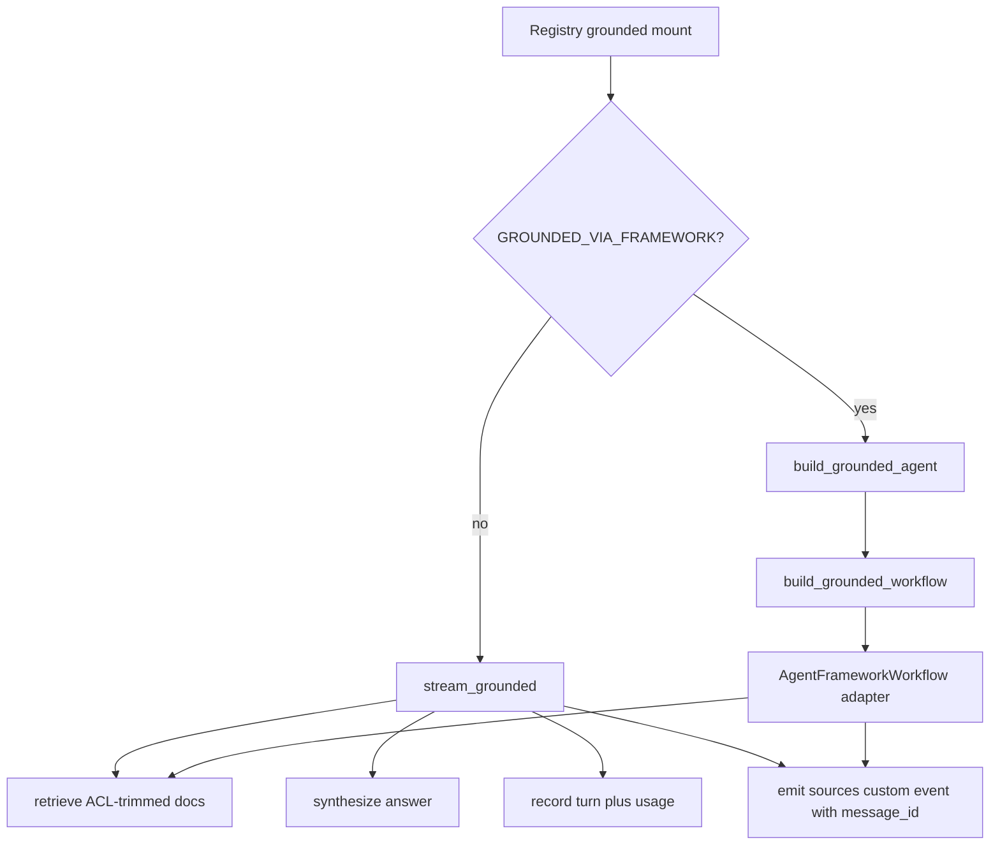

# Grounded domains

The backend’s grounded domains are `techdocs` and `selfwiki`. In the registry they are `kind: "grounded"` domains that resolve per-request tenant config and stream cited Q&A through the common grounded archetype, while still allowing the runtime implementation to switch between a hand-written SSE path and a framework-hosted published-agent path. [Source](https://github.com/ruinosus/foundry-assured/blob/8e5fef809b476602ff31f4821f13e5bb18b64830/apps/backend/app/registry.py#L73-L75) [Source](https://github.com/ruinosus/foundry-assured/blob/8e5fef809b476602ff31f4821f13e5bb18b64830/apps/backend/app/registry.py#L96-L132) [Source](https://github.com/ruinosus/foundry-assured/blob/8e5fef809b476602ff31f4821f13e5bb18b64830/apps/backend/app/registry.py#L137-L160) [Source](https://github.com/ruinosus/foundry-assured/blob/8e5fef809b476602ff31f4821f13e5bb18b64830/apps/backend/app/modules/grounded/internal/framework_agent.py#L39-L49)

This page is the canonical home for grounded runtime behavior. It depends on the Knowledge Pipeline for retrieval and document confirmation, and it persists its user-visible evidence through Backend State and Persistence.

## Shared archetype

`app/modules/grounded/public.py` still exposes the public surface for grounded behavior: `stream_grounded`, synthesis helpers, knowledge configuration checks, and `PerRequestAgent`. Its module contract remains the same: grounded answers are repository-assured only when they carry source citations, even if the transport mechanism changes underneath. [Source](https://github.com/ruinosus/foundry-assured/blob/8e5fef809b476602ff31f4821f13e5bb18b64830/apps/backend/app/modules/grounded/public.py#L1-L17) [Source](https://github.com/ruinosus/foundry-assured/blob/8e5fef809b476602ff31f4821f13e5bb18b64830/apps/backend/app/modules/grounded/public.py#L19-L36)

Two runtime implementations now sit behind that surface:

- the long-standing hand-written `stream_grounded(...)` SSE path, and
- the new framework path that builds a `FoundryAgent`, wraps it in a one-node workflow, and serves it through the AG-UI adapter when `GROUNDED_VIA_FRAMEWORK` is enabled. [Source](https://github.com/ruinosus/foundry-assured/blob/8e5fef809b476602ff31f4821f13e5bb18b64830/apps/backend/app/modules/grounded/internal/grounded.py#L111-L151) [Source](https://github.com/ruinosus/foundry-assured/blob/8e5fef809b476602ff31f4821f13e5bb18b64830/apps/backend/app/modules/grounded/internal/framework_agent.py#L118-L176)

That split is deliberate rather than transitional clutter. The framework path is off by default because only a real service conversation can prove its OBO plus ACL behavior safely; the offline test only asserts the assembly contract. [Source](https://github.com/ruinosus/foundry-assured/blob/8e5fef809b476602ff31f4821f13e5bb18b64830/apps/backend/app/modules/grounded/internal/framework_agent.py#L39-L47) [Source](https://github.com/ruinosus/foundry-assured/blob/8e5fef809b476602ff31f4821f13e5bb18b64830/apps/backend/tests/grounded/framework_agent_test.py#L45-L58)

## Per-domain configuration

The registry’s `DomainSpec` still enforces that a grounded domain must define either a knowledge base name or a search index. `_domains()` then fills those fields from tenant config, plus instructions and ACL group maps. `selfwiki` keeps its app-users ACL map when `APP_USERS_GROUP_ID` is present, while `techdocs` reads KB/index/ACL values from tenant configuration. [Source](https://github.com/ruinosus/foundry-assured/blob/8e5fef809b476602ff31f4821f13e5bb18b64830/apps/backend/app/registry.py#L33-L59) [Source](https://github.com/ruinosus/foundry-assured/blob/8e5fef809b476602ff31f4821f13e5bb18b64830/apps/backend/app/registry.py#L96-L132)

Instruction ownership is still declarative. `_domains()` imports `TECHDOCS_INSTRUCTIONS` and `SELFWIKI_INSTRUCTIONS` from `app.modules.agentdefs.public`, so prompt changes usually start in `apps/backend/agents/` assets rather than in registry code. [Source](https://github.com/ruinosus/foundry-assured/blob/8e5fef809b476602ff31f4821f13e5bb18b64830/apps/backend/app/registry.py#L96-L99) [Source](https://github.com/ruinosus/foundry-assured/blob/8e5fef809b476602ff31f4821f13e5bb18b64830/apps/backend/app/modules/agentdefs/internal/definitions.py#L24-L35) [Source](https://github.com/ruinosus/foundry-assured/blob/8e5fef809b476602ff31f4821f13e5bb18b64830/apps/backend/app/modules/agentdefs/internal/definitions.py#L140-L155)

## Manual SSE path

The default path remains `stream_grounded(body, domain, user, language)`. It captures the user identity, retrieves ACL-trimmed documents, synthesizes an answer from those documents only, streams AG-UI text events, records the turn, records usage, and emits a `sources` custom event with a `message_id` plus canonical citation objects. [Source](https://github.com/ruinosus/foundry-assured/blob/8e5fef809b476602ff31f4821f13e5bb18b64830/apps/backend/app/modules/grounded/internal/grounded.py#L111-L149) [Source](https://github.com/ruinosus/foundry-assured/blob/8e5fef809b476602ff31f4821f13e5bb18b64830/apps/backend/app/modules/grounded/internal/grounded.py#L156-L189) [Source](https://github.com/ruinosus/foundry-assured/blob/8e5fef809b476602ff31f4821f13e5bb18b64830/apps/backend/app/modules/grounded/internal/grounded.py#L216-L267)

Three details changed materially in this range:

1. the code now prefers the published agent by `agent_name` when available, falling back to the anonymous OpenAI client only if the published resource is missing; [Source](https://github.com/ruinosus/foundry-assured/blob/8e5fef809b476602ff31f4821f13e5bb18b64830/apps/backend/app/modules/grounded/internal/grounded.py#L159-L184)
2. the emitted citations now use the framework vocabulary (`type`, `title`, `url`, `snippet`, `index`) rather than the earlier local naming; [Source](https://github.com/ruinosus/foundry-assured/blob/8e5fef809b476602ff31f4821f13e5bb18b64830/apps/backend/app/modules/grounded/internal/grounded.py#L199-L227)
3. the `sources` event is explicitly tied to the response `message_id`, which is what the frontend now uses to keep evidence attached to the right historical response. [Source](https://github.com/ruinosus/foundry-assured/blob/8e5fef809b476602ff31f4821f13e5bb18b64830/apps/backend/app/modules/grounded/internal/grounded.py#L247-L266) [Source](https://github.com/ruinosus/foundry-assured/blob/8e5fef809b476602ff31f4821f13e5bb18b64830/apps/backend/tests/grounded/sources_message_id_test.py#L1-L22) [Source](https://github.com/ruinosus/foundry-assured/blob/8e5fef809b476602ff31f4821f13e5bb18b64830/apps/backend/tests/grounded/sources_message_id_test.py#L82-L110)

The persistence side of that event shape lives in Backend State and Persistence, because stored conversations now keep the same evidence payload in `annotations`.

## Framework path behind the flag

The new path lives in `framework_agent.py`. `build_grounded_agent(...)` constructs a `FoundryAgent` addressed by domain id, injects a `GroundedRetrieval` context provider plus history provider, and attaches agent-level usage middleware. `build_grounded_workflow(...)` wraps that agent in a single-node workflow and appends `SourcesExecutor` so the AG-UI workflow adapter can emit the same `sources` event through a public workflow event mechanism. [Source](https://github.com/ruinosus/foundry-assured/blob/8e5fef809b476602ff31f4821f13e5bb18b64830/apps/backend/app/modules/grounded/internal/framework_agent.py#L49-L96) [Source](https://github.com/ruinosus/foundry-assured/blob/8e5fef809b476602ff31f4821f13e5bb18b64830/apps/backend/app/modules/grounded/internal/framework_agent.py#L118-L144)

That design exists for two reasons the source comments make explicit:

- `FoundryChatClient` cannot target `agent_name`, so it would talk to a model deployment instead of the published agent resource; [Source](https://github.com/ruinosus/foundry-assured/blob/8e5fef809b476602ff31f4821f13e5bb18b64830/apps/backend/app/modules/grounded/internal/framework_agent.py#L14-L18) [Source](https://github.com/ruinosus/foundry-assured/blob/8e5fef809b476602ff31f4821f13e5bb18b64830/apps/backend/tests/grounded/framework_agent_test.py#L60-L78)
- the workflow runtime, not the plain agent runtime, is the public AG-UI path that can surface custom `sources` events without monkeypatching adapters. [Source](https://github.com/ruinosus/foundry-assured/blob/8e5fef809b476602ff31f4821f13e5bb18b64830/apps/backend/app/modules/grounded/internal/framework_agent.py#L118-L144)

The most important change invariant here is: **do not switch the default path until real-service ACL and OBO behavior are accepted**. The source and test both treat the flag as a safety boundary rather than a feature toggle for convenience. [Source](https://github.com/ruinosus/foundry-assured/blob/8e5fef809b476602ff31f4821f13e5bb18b64830/apps/backend/app/modules/grounded/internal/framework_agent.py#L23-L27) [Source](https://github.com/ruinosus/foundry-assured/blob/8e5fef809b476602ff31f4821f13e5bb18b64830/apps/backend/tests/grounded/framework_agent_test.py#L1-L20)

## Retrieval and ACL path

Grounded domains still depend on the knowledge module’s retrieval path and ACL guarantees. The production retrieval seam must preserve per-user trimming through token acquisition, native/direct search calls, doc projection, dedupe, and numbering. The ACL parity test continues to prove the externally visible contract: a confidential source appears for an entitled user and disappears for a public-only user. [Source](https://github.com/ruinosus/foundry-assured/blob/8e5fef809b476602ff31f4821f13e5bb18b64830/apps/backend/app/modules/knowledge/internal/retrieval.py#L48-L73) [Source](https://github.com/ruinosus/foundry-assured/blob/8e5fef809b476602ff31f4821f13e5bb18b64830/apps/backend/app/modules/knowledge/internal/retrieval.py#L81-L102) [Source](https://github.com/ruinosus/foundry-assured/blob/8e5fef809b476602ff31f4821f13e5bb18b64830/apps/backend/app/modules/knowledge/internal/retrieval.py#L157-L163) [Source](https://github.com/ruinosus/foundry-assured/blob/8e5fef809b476602ff31f4821f13e5bb18b64830/apps/backend/app/modules/knowledge/internal/retrieval.py#L248-L295) [Source](https://github.com/ruinosus/foundry-assured/blob/8e5fef809b476602ff31f4821f13e5bb18b64830/apps/backend/tests/knowledge/retrieval_acl_parity_test.py#L104-L142)

That invariant applies to both runtime implementations. The framework path does not introduce a second retrieval policy; it wraps the existing `retrieve()` behavior in `GroundedRetrieval`, specifically to keep ACL logic single-sourced. [Source](https://github.com/ruinosus/foundry-assured/blob/8e5fef809b476602ff31f4821f13e5bb18b64830/apps/backend/app/modules/grounded/internal/framework_agent.py#L63-L76)

## Runtime flow

This diagram shows the current dual-path runtime, grounded in the inspected code.

The architectural point is not “two codepaths forever”; it is “one grounding contract, two interchangeable transports while the safer default remains the verified one.”

## Selfwiki vs TechDocs

The two grounded domains still differ mainly by corpus and audience. `selfwiki` is grounded in this repository’s generated wiki/docbundle content and is typically private to app users. `techdocs` points at a tenant-configured external documentation corpus. The frontend domain registry mirrors that split and continues to decide whether each domain is visible and how it is labeled. [Source](https://github.com/ruinosus/foundry-assured/blob/8e5fef809b476602ff31f4821f13e5bb18b64830/apps/frontend/lib/domains.ts#L47-L79) [Source](https://github.com/ruinosus/foundry-assured/blob/8e5fef809b476602ff31f4821f13e5bb18b64830/apps/frontend/lib/domains.ts#L80-L94)

## When to edit this page

Consult this page when you are:

- changing how grounded domains are mounted or switched between runtime implementations;
- adding a new grounded domain or changing declarative instructions;
- touching evidence event shape, citation numbering, or response persistence;
- changing ACL-sensitive retrieval behavior that grounded answers depend on.

Prefer narrower pages for adjacent concerns:

- Knowledge Pipeline for `/source` and document-confirmation behavior,
- Backend State and Persistence for stored conversations and annotations,
- Assurance Console for per-message evidence rendering.

## Focused tests and validation

Start with:

- `cd apps/backend && uv run pytest tests/grounded/framework_agent_test.py`
- `cd apps/backend && uv run pytest tests/grounded/sources_message_id_test.py`
- `cd apps/backend && uv run pytest tests/knowledge/retrieval_acl_parity_test.py`

Conditional, more expensive follow-up checks:

- `cd apps/backend && uv run pytest eval/access_control_test.py` when changing real ACL or OBO behavior,
- a real conversation against a configured grounded domain when changing `GROUNDED_VIA_FRAMEWORK`, because the code itself documents that offline tests cannot prove the safe rollout condition. [Source](https://github.com/ruinosus/foundry-assured/blob/8e5fef809b476602ff31f4821f13e5bb18b64830/apps/backend/tests/grounded/framework_agent_test.py#L3-L20)
