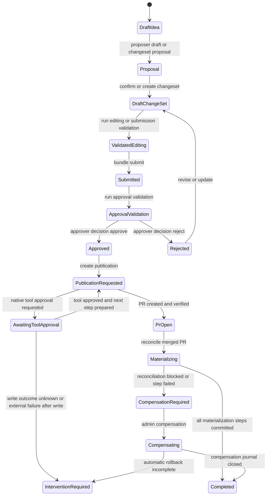

# Authoring, proposer, OKF changesets, and publication saga

This workflow is intentionally split into three owned boundaries:

- **proposer** drafts and reviews candidate OKF content, but does not publish or delete platform resources; that boundary is both stated in the HTTP module and enforced by an AST gate. [proposer/api.py](https://github.com/ruinosus/foundry-assured/blob/18595cf77fa56dad04a5e646bc5dae9bcae7f6fa/apps/backend/app/modules/proposer/api.py#L1-L9) [proposer_read_only_test.py](https://github.com/ruinosus/foundry-assured/blob/18595cf77fa56dad04a5e646bc5dae9bcae7f6fa/apps/backend/tests/architecture/proposer_read_only_test.py#L28-L47) [proposer_read_only_test.py](https://github.com/ruinosus/foundry-assured/blob/18595cf77fa56dad04a5e646bc5dae9bcae7f6fa/apps/backend/tests/architecture/proposer_read_only_test.py#L62-L106)
- **authoring** owns the factual catalog projection plus tenant-and-area-scoped ChangeSets, validation reports, decisions, and bundle projections; it is the reviewable system of record for proposed changes, not the place where remote side effects happen. [authoring/api.py](https://github.com/ruinosus/foundry-assured/blob/18595cf77fa56dad04a5e646bc5dae9bcae7f6fa/apps/backend/app/modules/authoring/api.py#L45-L52) [authoring/public.py](https://github.com/ruinosus/foundry-assured/blob/18595cf77fa56dad04a5e646bc5dae9bcae7f6fa/apps/backend/app/modules/authoring/public.py#L1-L47)
- **publication** is the only external write path. It accepts only already approved revisions, routes them to the GitHub or Azure DevOps publication services, and then reconciles merged pull requests into compensable materialization steps against official Foundry surfaces. [publication/api.py](https://github.com/ruinosus/foundry-assured/blob/18595cf77fa56dad04a5e646bc5dae9bcae7f6fa/apps/backend/app/modules/publication/api.py#L32-L39) [publication/public.py](https://github.com/ruinosus/foundry-assured/blob/18595cf77fa56dad04a5e646bc5dae9bcae7f6fa/apps/backend/app/modules/publication/public.py#L1-L28) [github.py](https://github.com/ruinosus/foundry-assured/blob/18595cf77fa56dad04a5e646bc5dae9bcae7f6fa/apps/backend/app/modules/publication/internal/github.py#L1179-L1219)

That separation is the implementation of ADR-032’s core decision: OKF carries intent and review state, while publication is a compensable saga because the downstream services do not offer one distributed transaction. ADR-032-okf-projections-bindings-and-compensable-publication.md

## Scope, tenancy, and area ownership

Both authoring and publication derive a `ChangeSetScope` from the resolved tenant, current area, and current caller identity. If no area is resolved, both APIs fail with `AREA_NOT_FOUND`. In self-hosted mode they still force an area-qualified scope by falling back to tenant id `self-hosted`. [authoring/api.py](https://github.com/ruinosus/foundry-assured/blob/18595cf77fa56dad04a5e646bc5dae9bcae7f6fa/apps/backend/app/modules/authoring/api.py#L105-L115) [publication/api.py](https://github.com/ruinosus/foundry-assured/blob/18595cf77fa56dad04a5e646bc5dae9bcae7f6fa/apps/backend/app/modules/publication/api.py#L89-L99)

That means proposals, ChangeSets, validation reports, approval decisions, publication rows, and reconciliation journals are isolated by the same tenant-plus-area boundary described on the access-control page. Area resolution is therefore not just a UI partition; it is part of the storage key for all authoring and publication state. tenancy-areas-and-access-control.md

## End-to-end control flow

This shows the lifecycle from drafting through review into the publication saga.

## 1. Authoring starts from a factual catalog, not a duplicated registry

The `/authoring` router is area-scoped and read-accessible to `Reader`, `Author`, `Approver`, and `Admin`. It exposes factual catalog endpoints plus ChangeSet, bundle, validation, and decision endpoints under one API surface. [authoring/api.py](https://github.com/ruinosus/foundry-assured/blob/18595cf77fa56dad04a5e646bc5dae9bcae7f6fa/apps/backend/app/modules/authoring/api.py#L45-L52) [authoring/api.py](https://github.com/ruinosus/foundry-assured/blob/18595cf77fa56dad04a5e646bc5dae9bcae7f6fa/apps/backend/app/modules/authoring/api.py#L465-L516)

The underlying public surface makes the design explicit: authoring re-exports catalog projection, ChangeSet persistence, decisions, validations, and bundle projection, but not any Foundry mutation primitives. [authoring/public.py](https://github.com/ruinosus/foundry-assured/blob/18595cf77fa56dad04a5e646bc5dae9bcae7f6fa/apps/backend/app/modules/authoring/public.py#L1-L47)

ADR-032 explains why: authoring should not become a second operational catalog. OKF expresses intended composition and review state, while the official systems remain the owners of agents, skills, toolboxes, knowledge bases, and MCP discovery. ADR-032-okf-projections-bindings-and-compensable-publication.md ADR-032-okf-projections-bindings-and-compensable-publication.md

## 2. The proposer can draft and structure proposals, but cannot publish

The proposer router has two distinct roles:

- `/proposer/draft` turns a need into a draft form using `propose_agent`; it is explicitly documented as non-publishing. [proposer/api.py](https://github.com/ruinosus/foundry-assured/blob/18595cf77fa56dad04a5e646bc5dae9bcae7f6fa/apps/backend/app/modules/proposer/api.py#L92-L105)
- `/proposer/changeset` combines the draft with the full catalog snapshot and produces a proposed multi-document ChangeSet for review, but does not persist anything. [proposer/api.py](https://github.com/ruinosus/foundry-assured/blob/18595cf77fa56dad04a5e646bc5dae9bcae7f6fa/apps/backend/app/modules/proposer/api.py#L107-L144)
- `/proposer/changeset/confirm` revalidates reviewed proposal decisions and persists exactly one ChangeSet through `ChangeSetService.create`, still without any external publication. [proposer/api.py](https://github.com/ruinosus/foundry-assured/blob/18595cf77fa56dad04a5e646bc5dae9bcae7f6fa/apps/backend/app/modules/proposer/api.py#L146-L191)

The proposer needs author-class roles plus an area for ChangeSet proposal and confirmation, but expensive optimization jobs are separately gated to `Admin`. [proposer/api.py](https://github.com/ruinosus/foundry-assured/blob/18595cf77fa56dad04a5e646bc5dae9bcae7f6fa/apps/backend/app/modules/proposer/api.py#L42-L43) [proposer/api.py](https://github.com/ruinosus/foundry-assured/blob/18595cf77fa56dad04a5e646bc5dae9bcae7f6fa/apps/backend/app/modules/proposer/api.py#L107-L110) [proposer/api.py](https://github.com/ruinosus/foundry-assured/blob/18595cf77fa56dad04a5e646bc5dae9bcae7f6fa/apps/backend/app/modules/proposer/api.py#L206-L216)

The read-only boundary is reinforced by `proposer_read_only_test.py`, which forbids importing or calling known resource-writing functions, catches collection writes such as `client.agents.create_version(...)`, detects alias-based calls, and blocks `getattr(..., "delete")` indirection. [proposer_read_only_test.py](https://github.com/ruinosus/foundry-assured/blob/18595cf77fa56dad04a5e646bc5dae9bcae7f6fa/apps/backend/tests/architecture/proposer_read_only_test.py#L28-L47) [proposer_read_only_test.py](https://github.com/ruinosus/foundry-assured/blob/18595cf77fa56dad04a5e646bc5dae9bcae7f6fa/apps/backend/tests/architecture/proposer_read_only_test.py#L62-L106) testing/assurance-and-boundary-gates.md

## 3. OKF-backed ChangeSets are the durable review unit

The OKF module exports the authoring profile surface: `AuthoringDocument`, `parse_authoring_document`, `serialize_authoring_document`, `OkfChangeSet`, profile version metadata, publication states, and reference helpers. [okf/public.py](https://github.com/ruinosus/foundry-assured/blob/18595cf77fa56dad04a5e646bc5dae9bcae7f6fa/apps/backend/app/modules/okf/public.py#L1-L71)

`ChangeSetService` is the durability and normalization boundary for proposed changes:

- it accepts only known sources `manual`, `builder`, `import`, and `migration`; [changesets.py](https://github.com/ruinosus/foundry-assured/blob/18595cf77fa56dad04a5e646bc5dae9bcae7f6fa/apps/backend/app/modules/authoring/internal/changesets.py#L590-L605)
- it requires `content.operations` to be a list of 1 to 100 operations with valid identifiers and operation kinds `create`, `revise`, or `deprecate`; [changesets.py](https://github.com/ruinosus/foundry-assured/blob/18595cf77fa56dad04a5e646bc5dae9bcae7f6fa/apps/backend/app/modules/authoring/internal/changesets.py#L540-L558)
- it canonicalizes and hashes the normalized content, enforces a 256 KiB limit, and validates any embedded OKF document through `parse_authoring_document`; [changesets.py](https://github.com/ruinosus/foundry-assured/blob/18595cf77fa56dad04a5e646bc5dae9bcae7f6fa/apps/backend/app/modules/authoring/internal/changesets.py#L540-L558) [changesets.py](https://github.com/ruinosus/foundry-assured/blob/18595cf77fa56dad04a5e646bc5dae9bcae7f6fa/apps/backend/app/modules/authoring/internal/changesets.py#L560-L583)
- it rejects documents whose declared tenant or area do not match the resolved `ChangeSetScope`; [changesets.py](https://github.com/ruinosus/foundry-assured/blob/18595cf77fa56dad04a5e646bc5dae9bcae7f6fa/apps/backend/app/modules/authoring/internal/changesets.py#L574-L582)
- it uses idempotency keys on create and ETag preconditions on update, submit, and revise. [authoring/api.py](https://github.com/ruinosus/foundry-assured/blob/18595cf77fa56dad04a5e646bc5dae9bcae7f6fa/apps/backend/app/modules/authoring/api.py#L277-L302) [changesets.py](https://github.com/ruinosus/foundry-assured/blob/18595cf77fa56dad04a5e646bc5dae9bcae7f6fa/apps/backend/app/modules/authoring/internal/changesets.py#L649-L720)

State transitions are intentionally narrow:

- create starts at `draft`; [changesets.py](https://github.com/ruinosus/foundry-assured/blob/18595cf77fa56dad04a5e646bc5dae9bcae7f6fa/apps/backend/app/modules/authoring/internal/changesets.py#L609-L626)
- update is allowed only while still `draft`; [changesets.py](https://github.com/ruinosus/foundry-assured/blob/18595cf77fa56dad04a5e646bc5dae9bcae7f6fa/apps/backend/app/modules/authoring/internal/changesets.py#L658-L686)
- submit requires the current ETag and changes state from `draft` to `submitted`; [changesets.py](https://github.com/ruinosus/foundry-assured/blob/18595cf77fa56dad04a5e646bc5dae9bcae7f6fa/apps/backend/app/modules/authoring/internal/changesets.py#L688-L701)
- revise is the only path back from `submitted` to `draft`, and it increments the revision. [changesets.py](https://github.com/ruinosus/foundry-assured/blob/18595cf77fa56dad04a5e646bc5dae9bcae7f6fa/apps/backend/app/modules/authoring/internal/changesets.py#L703-L720)

## 4. Bundle projection turns raw ChangeSets into reviewable dependency graphs

A bundle is not a separate stored object. `BundleService` projects a ChangeSet into:

- parsed documents,
- a root `bundle` document,
- inter-document and catalog-backed dependencies,
- synthetic validation checks,
- and a computed `canSubmit` flag. [bundles.py](https://github.com/ruinosus/foundry-assured/blob/18595cf77fa56dad04a5e646bc5dae9bcae7f6fa/apps/backend/app/modules/authoring/internal/bundles.py#L30-L66) [bundles.py](https://github.com/ruinosus/foundry-assured/blob/18595cf77fa56dad04a5e646bc5dae9bcae7f6fa/apps/backend/app/modules/authoring/internal/bundles.py#L125-L156)

Important submission rules live here rather than in the router:

- a ChangeSet without a `bundle` document is not submittable at all; [bundles.py](https://github.com/ruinosus/foundry-assured/blob/18595cf77fa56dad04a5e646bc5dae9bcae7f6fa/apps/backend/app/modules/authoring/internal/bundles.py#L125-L130)
- references can be satisfied either internally by another document in the same ChangeSet or externally by the factual catalog; [bundles.py](https://github.com/ruinosus/foundry-assured/blob/18595cf77fa56dad04a5e646bc5dae9bcae7f6fa/apps/backend/app/modules/authoring/internal/bundles.py#L68-L123)
- unresolved references or declared `gaps` become blocking checks; [bundles.py](https://github.com/ruinosus/foundry-assured/blob/18595cf77fa56dad04a5e646bc5dae9bcae7f6fa/apps/backend/app/modules/authoring/internal/bundles.py#L130-L156)
- `submit()` refuses the transition with `BUNDLE_SUBMISSION_BLOCKED` unless `canSubmit` is true and the submission-phase validation gate has passed. [bundles.py](https://github.com/ruinosus/foundry-assured/blob/18595cf77fa56dad04a5e646bc5dae9bcae7f6fa/apps/backend/app/modules/authoring/internal/bundles.py#L177-L188)

So the bundle endpoints are the review-facing projection of a ChangeSet, while the raw ChangeSet endpoints remain the persistence contract.

## 5. Validation is phase-aware and transition-blocking

The authoring API exposes explicit validation runs at `/changesets/{id}/validations` with phases `editing`, `submission`, `approval`, and `materialization`. Editing and submission validation require author-class access; approval and materialization validation require approver-class access when auth is enabled. [authoring/api.py](https://github.com/ruinosus/foundry-assured/blob/18595cf77fa56dad04a5e646bc5dae9bcae7f6fa/apps/backend/app/modules/authoring/api.py#L351-L390)

`ValidationService` stores immutable validation reports per scope, ChangeSet revision, phase, and content hash. Each report has an `overall` status plus structured checks, and `blocks_transition` is true when any blocking check is not approved. [validations.py](https://github.com/ruinosus/foundry-assured/blob/18595cf77fa56dad04a5e646bc5dae9bcae7f6fa/apps/backend/app/modules/authoring/internal/validations.py#L38-L91)

The important transition rule is `assert_transition()`:

- it loads the current ChangeSet revision,
- requires at least one report for the requested phase and current revision,
- and rejects the transition if the report content hash no longer matches or any blocking check remains. [validations.py](https://github.com/ruinosus/foundry-assured/blob/18595cf77fa56dad04a5e646bc5dae9bcae7f6fa/apps/backend/app/modules/authoring/internal/validations.py#L556-L572)

That function is called directly by bundle submission for `submission` validation and by approval decisions for `approval` validation. [bundles.py](https://github.com/ruinosus/foundry-assured/blob/18595cf77fa56dad04a5e646bc5dae9bcae7f6fa/apps/backend/app/modules/authoring/internal/bundles.py#L177-L188) [decisions.py](https://github.com/ruinosus/foundry-assured/blob/18595cf77fa56dad04a5e646bc5dae9bcae7f6fa/apps/backend/app/modules/authoring/internal/decisions.py#L296-L299)

## 6. Approval decisions are revision- and hash-bound

Only `/changesets/{id}/decisions` with `Approver` role can record final authoring decisions. The request must include both `revision` and `content_hash`. [authoring/api.py](https://github.com/ruinosus/foundry-assured/blob/18595cf77fa56dad04a5e646bc5dae9bcae7f6fa/apps/backend/app/modules/authoring/api.py#L397-L424)

`DecisionService.decide()` makes approval a precise claim about one submitted revision:

- the ChangeSet must still be `submitted`; [decisions.py](https://github.com/ruinosus/foundry-assured/blob/18595cf77fa56dad04a5e646bc5dae9bcae7f6fa/apps/backend/app/modules/authoring/internal/decisions.py#L289-L295)
- the requested revision and content hash must match the current revision exactly; [decisions.py](https://github.com/ruinosus/foundry-assured/blob/18595cf77fa56dad04a5e646bc5dae9bcae7f6fa/apps/backend/app/modules/authoring/internal/decisions.py#L289-L295)
- approval additionally requires the current `approval` validation transition to pass; [decisions.py](https://github.com/ruinosus/foundry-assured/blob/18595cf77fa56dad04a5e646bc5dae9bcae7f6fa/apps/backend/app/modules/authoring/internal/decisions.py#L296-L299)
- a redacted reason and audit event are mandatory; [decisions.py](https://github.com/ruinosus/foundry-assured/blob/18595cf77fa56dad04a5e646bc5dae9bcae7f6fa/apps/backend/app/modules/authoring/internal/decisions.py#L300-L337)
- the repository transition atomically updates the ChangeSet state to `approved` or `rejected` and stores one unique decision per revision. [decisions.py](https://github.com/ruinosus/foundry-assured/blob/18595cf77fa56dad04a5e646bc5dae9bcae7f6fa/apps/backend/app/modules/authoring/internal/decisions.py#L124-L203)

Publication later relies on `assert_approved()`, which only succeeds if the current ChangeSet state is `approved` and there is a matching approve decision for the exact current revision and content hash. [decisions.py](https://github.com/ruinosus/foundry-assured/blob/18595cf77fa56dad04a5e646bc5dae9bcae7f6fa/apps/backend/app/modules/authoring/internal/decisions.py#L351-L368)

## 7. Publication starts only from an approved ChangeSet revision

The publication API lives under `/authoring/publications` and is area-scoped like authoring. Basic read access is broad, but create, tool approval, and reconciliation require `Approver`; compensation requires `Admin`. [publication/api.py](https://github.com/ruinosus/foundry-assured/blob/18595cf77fa56dad04a5e646bc5dae9bcae7f6fa/apps/backend/app/modules/publication/api.py#L32-L39) [publication/api.py](https://github.com/ruinosus/foundry-assured/blob/18595cf77fa56dad04a5e646bc5dae9bcae7f6fa/apps/backend/app/modules/publication/api.py#L151-L191) [publication/api.py](https://github.com/ruinosus/foundry-assured/blob/18595cf77fa56dad04a5e646bc5dae9bcae7f6fa/apps/backend/app/modules/publication/api.py#L194-L277)

`create_publication()` accepts either:

- `provider="github"` with `PublicationRequest`, or
- `provider="azure_devops"` with `AzureDevOpsPublicationRequest`. [publication/api.py](https://github.com/ruinosus/foundry-assured/blob/18595cf77fa56dad04a5e646bc5dae9bcae7f6fa/apps/backend/app/modules/publication/api.py#L64-L80) [publication/api.py](https://github.com/ruinosus/foundry-assured/blob/18595cf77fa56dad04a5e646bc5dae9bcae7f6fa/apps/backend/app/modules/publication/api.py#L151-L191)

`PublicationServiceRouter` is just a dispatcher. It routes by request type on create and then routes by the stored publication provider for later `decide`, `get`, `journal`, `reconcile`, and `compensate` calls. [azure_devops.py](https://github.com/ruinosus/foundry-assured/blob/18595cf77fa56dad04a5e646bc5dae9bcae7f6fa/apps/backend/app/modules/publication/internal/azure_devops.py#L845-L909)

For GitHub publication, `GitHubPublicationService.publish()` enforces the main invariant chain before any egress:

- caller roles must include `Approver`; [github.py](https://github.com/ruinosus/foundry-assured/blob/18595cf77fa56dad04a5e646bc5dae9bcae7f6fa/apps/backend/app/modules/publication/internal/github.py#L1179-L1188)
- the ChangeSet must still be approved and match the requested revision and content hash exactly; [github.py](https://github.com/ruinosus/foundry-assured/blob/18595cf77fa56dad04a5e646bc5dae9bcae7f6fa/apps/backend/app/modules/publication/internal/github.py#L1188-L1197)
- file projection must succeed before egress; [github.py](https://github.com/ruinosus/foundry-assured/blob/18595cf77fa56dad04a5e646bc5dae9bcae7f6fa/apps/backend/app/modules/publication/internal/github.py#L1199-L1201)
- the publication branch is deterministic from ChangeSet id and content hash; [github.py](https://github.com/ruinosus/foundry-assured/blob/18595cf77fa56dad04a5e646bc5dae9bcae7f6fa/apps/backend/app/modules/publication/internal/github.py#L1199-L1203)
- repository reservation is idempotent on the hashed idempotency key and canonical request hash. [github.py](https://github.com/ruinosus/foundry-assured/blob/18595cf77fa56dad04a5e646bc5dae9bcae7f6fa/apps/backend/app/modules/publication/internal/github.py#L1201-L1219) [github.py](https://github.com/ruinosus/foundry-assured/blob/18595cf77fa56dad04a5e646bc5dae9bcae7f6fa/apps/backend/app/modules/publication/internal/github.py#L285-L366)

Azure DevOps publication mirrors the same pattern but validates organization, project, repository, refs, and path arguments, and uses delegated Azure DevOps tokens only at egress time through `AzureDevOpsRestGateway`. [azure_devops.py](https://github.com/ruinosus/foundry-assured/blob/18595cf77fa56dad04a5e646bc5dae9bcae7f6fa/apps/backend/app/modules/publication/internal/azure_devops.py#L67-L99) [azure_devops.py](https://github.com/ruinosus/foundry-assured/blob/18595cf77fa56dad04a5e646bc5dae9bcae7f6fa/apps/backend/app/modules/publication/internal/azure_devops.py#L154-L201) [azure_devops.py](https://github.com/ruinosus/foundry-assured/blob/18595cf77fa56dad04a5e646bc5dae9bcae7f6fa/apps/backend/app/modules/publication/internal/azure_devops.py#L235-L287)

## 8. Native tool approval is part of the publication saga

For GitHub, publication is not “one call creates one PR”. `GitHubPublicationService.decide()` advances a stateful, approval-gated sequence of native tool invocations:

1. search existing pull requests,
2. create a branch if needed,
3. push files,
4. create the pull request,
5. read the pull request back for verification. [github.py](https://github.com/ruinosus/foundry-assured/blob/18595cf77fa56dad04a5e646bc5dae9bcae7f6fa/apps/backend/app/modules/publication/internal/github.py#L1221-L1338)

The service persists publication states such as `in_progress`, `awaiting_approval`, `executing`, `pr_open`, `completed`, and `intervention_required` in the publication repository as each step advances or fails. [github.py](https://github.com/ruinosus/foundry-assured/blob/18595cf77fa56dad04a5e646bc5dae9bcae7f6fa/apps/backend/app/modules/publication/internal/github.py#L368-L420) [github.py](https://github.com/ruinosus/foundry-assured/blob/18595cf77fa56dad04a5e646bc5dae9bcae7f6fa/apps/backend/app/modules/publication/internal/github.py#L1229-L1338)

A critical failure distinction is preserved:

- if a read step fails, the publication can fail cleanly; [github.py](https://github.com/ruinosus/foundry-assured/blob/18595cf77fa56dad04a5e646bc5dae9bcae7f6fa/apps/backend/app/modules/publication/internal/github.py#L1307-L1337)
- if an approved write step fails after the remote outcome may already be ambiguous, the publication is forced into `intervention_required` with `PUBLICATION_WRITE_OUTCOME_UNKNOWN` instead of pretending it knows whether a remote write happened. [github.py](https://github.com/ruinosus/foundry-assured/blob/18595cf77fa56dad04a5e646bc5dae9bcae7f6fa/apps/backend/app/modules/publication/internal/github.py#L1307-L1337)

That is the concrete implementation of ADR-032’s “publication is saga compensable” decision. ADR-032-okf-projections-bindings-and-compensable-publication.md

## 9. Reconciliation is the bridge from PR merge to official resource materialization

A publication reaching `pr_open` still has not written to Foundry-owned resources. That is deliberate: publication to GitHub or Azure DevOps is the review/publication record, while materialization into official runtime surfaces happens only after reconciliation proves the PR merged with matching evidence. [github.py](https://github.com/ruinosus/foundry-assured/blob/18595cf77fa56dad04a5e646bc5dae9bcae7f6fa/apps/backend/app/modules/publication/internal/github.py#L1348-L1387)

`reconcile()`:

- requires the current publication ETag; [publication/api.py](https://github.com/ruinosus/foundry-assured/blob/18595cf77fa56dad04a5e646bc5dae9bcae7f6fa/apps/backend/app/modules/publication/api.py#L222-L248)
- only accepts publications in `pr_open` or `materializing`; [github.py](https://github.com/ruinosus/foundry-assured/blob/18595cf77fa56dad04a5e646bc5dae9bcae7f6fa/apps/backend/app/modules/publication/internal/github.py#L1352-L1361)
- fetches merge evidence from the remote PR; [github.py](https://github.com/ruinosus/foundry-assured/blob/18595cf77fa56dad04a5e646bc5dae9bcae7f6fa/apps/backend/app/modules/publication/internal/github.py#L1362-L1374)
- passes the evidence plus ChangeSet operations to `ReconciliationService`. [github.py](https://github.com/ruinosus/foundry-assured/blob/18595cf77fa56dad04a5e646bc5dae9bcae7f6fa/apps/backend/app/modules/publication/internal/github.py#L1375-L1386)

The reconciliation layer then:

- converts materializable operations into ordered `MaterializationStep`s; [reconciliation.py](https://github.com/ruinosus/foundry-assured/blob/18595cf77fa56dad04a5e646bc5dae9bcae7f6fa/apps/backend/app/modules/publication/internal/reconciliation.py#L240-L260)
- records a tenant-and-area-scoped journal with one row per step; [reconciliation.py](https://github.com/ruinosus/foundry-assured/blob/18595cf77fa56dad04a5e646bc5dae9bcae7f6fa/apps/backend/app/modules/publication/internal/reconciliation.py#L126-L197)
- dispatches only supported official Foundry writes through `OfficialFoundryMaterializer` for `agent`, `skill`, and `toolbox`; [reconciliation.py](https://github.com/ruinosus/foundry-assured/blob/18595cf77fa56dad04a5e646bc5dae9bcae7f6fa/apps/backend/app/modules/publication/internal/reconciliation.py#L67-L97)
- records provenance markers onto the resulting official resource metadata or descriptions. [reconciliation.py](https://github.com/ruinosus/foundry-assured/blob/18595cf77fa56dad04a5e646bc5dae9bcae7f6fa/apps/backend/app/modules/publication/internal/reconciliation.py#L79-L95)

So external Git hosting is not the final runtime write. It is the reviewed handoff that authorizes later official materialization.

## 10. Compensation is explicit, admin-gated, and best-effort

`compensate_publication()` is the only admin-only publication endpoint. It also requires the current ETag so compensation cannot race a newer publication state. [publication/api.py](https://github.com/ruinosus/foundry-assured/blob/18595cf77fa56dad04a5e646bc5dae9bcae7f6fa/apps/backend/app/modules/publication/api.py#L251-L277)

On the GitHub path, `compensate()`:

- requires `Admin`; [github.py](https://github.com/ruinosus/foundry-assured/blob/18595cf77fa56dad04a5e646bc5dae9bcae7f6fa/apps/backend/app/modules/publication/internal/github.py#L1394-L1404)
- delegates to the reconciler’s compensation logic; [github.py](https://github.com/ruinosus/foundry-assured/blob/18595cf77fa56dad04a5e646bc5dae9bcae7f6fa/apps/backend/app/modules/publication/internal/github.py#L1405-L1411)
- returns the updated publication plus journal so operators can see what rolled back and what did not. [publication/api.py](https://github.com/ruinosus/foundry-assured/blob/18595cf77fa56dad04a5e646bc5dae9bcae7f6fa/apps/backend/app/modules/publication/api.py#L264-L275)

`OfficialFoundryMaterializer.compensate()` can delete created agent, skill, and toolbox versions when a version id was recorded, but it is intentionally not a promise that every external side effect can always be undone. Unsupported or incomplete cases remain visible in the journal instead of being hidden. [reconciliation.py](https://github.com/ruinosus/foundry-assured/blob/18595cf77fa56dad04a5e646bc5dae9bcae7f6fa/apps/backend/app/modules/publication/internal/reconciliation.py#L97-L115)

That is why ADR-032 prefers an honest `compensation_required` or intervention path over a fake all-or-nothing success claim. ADR-032-okf-projections-bindings-and-compensable-publication.md

## 11. Error and replay semantics that matter operationally

A few failure behaviors define how this workflow should be operated and changed:

- **ChangeSet creation is idempotent**, but key reuse with a different request hash is rejected as conflict. [changesets.py](https://github.com/ruinosus/foundry-assured/blob/18595cf77fa56dad04a5e646bc5dae9bcae7f6fa/apps/backend/app/modules/authoring/internal/changesets.py#L606-L626)
- **Mutable authoring operations are optimistic-concurrency protected** by ETags and current revision/content-hash checks. [authoring/api.py](https://github.com/ruinosus/foundry-assured/blob/18595cf77fa56dad04a5e646bc5dae9bcae7f6fa/apps/backend/app/modules/authoring/api.py#L203-L224) [changesets.py](https://github.com/ruinosus/foundry-assured/blob/18595cf77fa56dad04a5e646bc5dae9bcae7f6fa/apps/backend/app/modules/authoring/internal/changesets.py#L658-L720)
- **Validation and approval are content-bound**, so editing after validation or approval invalidates the previous gate by hash mismatch. [validations.py](https://github.com/ruinosus/foundry-assured/blob/18595cf77fa56dad04a5e646bc5dae9bcae7f6fa/apps/backend/app/modules/authoring/internal/validations.py#L563-L572) [decisions.py](https://github.com/ruinosus/foundry-assured/blob/18595cf77fa56dad04a5e646bc5dae9bcae7f6fa/apps/backend/app/modules/authoring/internal/decisions.py#L289-L299)
- **Publication replay is limited**: the same publication key may replay only when the canonical request matches and the stored state is already safely replayable; in-progress or intervention states do not silently resume as success. [github.py](https://github.com/ruinosus/foundry-assured/blob/18595cf77fa56dad04a5e646bc5dae9bcae7f6fa/apps/backend/app/modules/publication/internal/github.py#L300-L330)
- **Remote write ambiguity is fail-loud**, not fail-open. Unknown outcomes after write approval become intervention-required state. [github.py](https://github.com/ruinosus/foundry-assured/blob/18595cf77fa56dad04a5e646bc5dae9bcae7f6fa/apps/backend/app/modules/publication/internal/github.py#L1307-L1337)

## 12. Focused assurance: what the tests prove about the publication contract

`github_publication_test.py` is the most direct end-to-end witness for the GitHub publication contract. It proves that:

- each native GitHub tool is presented for approval before execution; [github_publication_test.py](https://github.com/ruinosus/foundry-assured/blob/18595cf77fa56dad04a5e646bc5dae9bcae7f6fa/apps/backend/tests/publication/github_publication_test.py#L151-L188)
- the actual tool order is `search_pull_requests`, `create_branch`, `push_files`, `create_pull_request`, then `pull_request_read`; [github_publication_test.py](https://github.com/ruinosus/foundry-assured/blob/18595cf77fa56dad04a5e646bc5dae9bcae7f6fa/apps/backend/tests/publication/github_publication_test.py#L153-L188)
- projected documents are normalized to LF, written to deterministic paths, and published on a branch derived from the approved hash; [github_publication_test.py](https://github.com/ruinosus/foundry-assured/blob/18595cf77fa56dad04a5e646bc5dae9bcae7f6fa/apps/backend/tests/publication/github_publication_test.py#L189-L205)
- only a safe PR projection is persisted; [github_publication_test.py](https://github.com/ruinosus/foundry-assured/blob/18595cf77fa56dad04a5e646bc5dae9bcae7f6fa/apps/backend/tests/publication/github_publication_test.py#L202-L205)
- identical idempotency keys replay completed publication, but cannot be reused for another content hash; [github_publication_test.py](https://github.com/ruinosus/foundry-assured/blob/18595cf77fa56dad04a5e646bc5dae9bcae7f6fa/apps/backend/tests/publication/github_publication_test.py#L207-L230)
- exact approver authority and area isolation are required; [github_publication_test.py](https://github.com/ruinosus/foundry-assured/blob/18595cf77fa56dad04a5e646bc5dae9bcae7f6fa/apps/backend/tests/publication/github_publication_test.py#L231-L245)
- persisted state must not contain tokens, consent URLs, or raw remote responses; [github_publication_test.py](https://github.com/ruinosus/foundry-assured/blob/18595cf77fa56dad04a5e646bc5dae9bcae7f6fa/apps/backend/tests/publication/github_publication_test.py#L246-L259)
- ambiguous write outcomes move the saga into intervention-required state and cannot be replayed as if they had cleanly failed. [github_publication_test.py](https://github.com/ruinosus/foundry-assured/blob/18595cf77fa56dad04a5e646bc5dae9bcae7f6fa/apps/backend/tests/publication/github_publication_test.py#L287-L338)

The broader assurance page calls out this test family as the executable contract that publication remains approval-bound, area-scoped, idempotent, and sanitized. testing/assurance-and-boundary-gates.md

## Practical invariants to preserve

When changing this workflow, the important repository-backed invariants are:

- proposer may help construct or confirm a ChangeSet, but must remain unable to publish external resources;
- authoring owns reviewable intent, approvals, and validation, not external writes;
- every stored authoring or publication record must remain scoped by tenant and area;
- approvals must bind to an exact submitted revision and content hash;
- publication must be the only code path that can turn approved intent into GitHub or Azure DevOps writes;
- reconciliation must be evidence-based and compensable, because the downstream systems do not provide one atomic commit.
