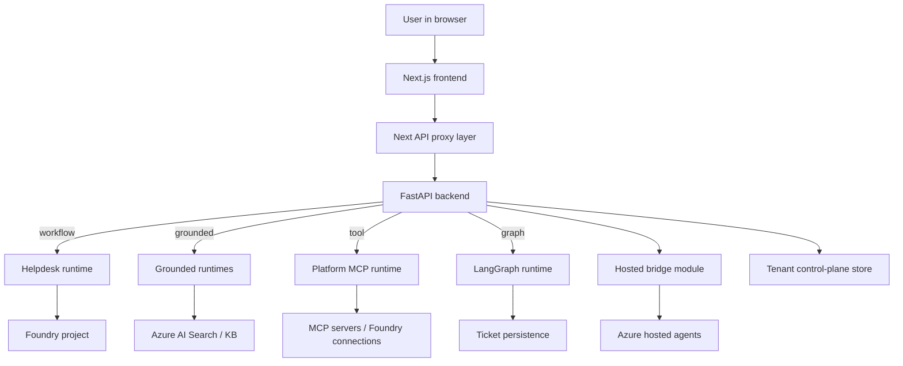

# Repository architecture overview

Foundry Assured is a monorepo for a Microsoft Foundry showcase that combines a Next.js frontend, a FastAPI backend, four hosted-agent packages, Azure deployment assets, operational scripts, and both backend and browser-level verification. The root README frames the product as a concierge system with grounded retrieval, multi-agent workflows, per-user memory, human approval, evaluation, and hosted-agent deployment, while `azure.yaml` turns those capabilities into six deployable services: the backend, the web frontend, and four hosted agents. Source Source [Source](https://github.com/ruinosus/foundry-assured/blob/b0a07a129bc3557f4a4d324dc1b7d050cf7bc1ad/azure.yaml#L6-L23) [Source](https://github.com/ruinosus/foundry-assured/blob/b0a07a129bc3557f4a4d324dc1b7d050cf7bc1ad/azure.yaml#L24-L41) [Source](https://github.com/ruinosus/foundry-assured/blob/b0a07a129bc3557f4a4d324dc1b7d050cf7bc1ad/azure.yaml#L42-L68)

The codebase is intentionally one repository-wide wiki target. ADR-016 records why: OpenWiki updates one `openwiki/` tree per repository, so area-specific wiki bundles created freshness drift and false coverage confidence. The documented scope here therefore has to include backend, frontend, hosted agents, infrastructure, scripts, and E2E tests in one navigable map. Source Source

## Top-level systems

The repository’s deployable systems are:

- **Backend**: FastAPI application in `apps/backend`, with modular domain packages mounted by one composition root. [Source](https://github.com/ruinosus/foundry-assured/blob/b0a07a129bc3557f4a4d324dc1b7d050cf7bc1ad/apps/backend/app/main.py#L1-L10) [Source](https://github.com/ruinosus/foundry-assured/blob/b0a07a129bc3557f4a4d324dc1b7d050cf7bc1ad/apps/backend/app/registry.py#L1-L9)
- **Frontend**: Next.js app in `apps/frontend`, with a shared Assurance Console and API proxy layer. [Source](https://github.com/ruinosus/foundry-assured/blob/b0a07a129bc3557f4a4d324dc1b7d050cf7bc1ad/apps/frontend/package.json#L5-L13) [Source](https://github.com/ruinosus/foundry-assured/blob/b0a07a129bc3557f4a4d324dc1b7d050cf7bc1ad/apps/frontend/app/d/%5Bdomain%5D/page.tsx#L3-L13)
- **Hosted agents**: four Python packages under `apps/hosted-*`, each packaged for Azure AI Agent hosting. [Source](https://github.com/ruinosus/foundry-assured/blob/b0a07a129bc3557f4a4d324dc1b7d050cf7bc1ad/azure.yaml#L14-L23) [Source](https://github.com/ruinosus/foundry-assured/blob/b0a07a129bc3557f4a4d324dc1b7d050cf7bc1ad/azure.yaml#L26-L37) [Source](https://github.com/ruinosus/foundry-assured/blob/b0a07a129bc3557f4a4d324dc1b7d050cf7bc1ad/azure.yaml#L38-L49) [Source](https://github.com/ruinosus/foundry-assured/blob/b0a07a129bc3557f4a4d324dc1b7d050cf7bc1ad/azure.yaml#L50-L61)
- **Infrastructure**: subscription-scoped Bicep plus Container Apps, managed-app, Lighthouse, and Entra helper assets under `infra/`. [Source](https://github.com/ruinosus/foundry-assured/blob/b0a07a129bc3557f4a4d324dc1b7d050cf7bc1ad/infra/main.bicep#L1-L9) [Source](https://github.com/ruinosus/foundry-assured/blob/b0a07a129bc3557f4a4d324dc1b7d050cf7bc1ad/infra/main.bicep#L55-L75) [Source](https://github.com/ruinosus/foundry-assured/blob/b0a07a129bc3557f4a4d324dc1b7d050cf7bc1ad/infra/main.bicep#L78-L101)
- **Operations and tests**: shell scripts under `scripts/`, backend eval/test suites, and Playwright E2E flows in `e2e/`. [Source](https://github.com/ruinosus/foundry-assured/blob/b0a07a129bc3557f4a4d324dc1b7d050cf7bc1ad/scripts/up-all.sh#L1-L16) [Source](https://github.com/ruinosus/foundry-assured/blob/b0a07a129bc3557f4a4d324dc1b7d050cf7bc1ad/e2e/smoke.spec.ts#L6-L18)

## Runtime domains

The main product surface is domain-driven. The frontend domain registry exposes `helpdesk`, `selfwiki`, `oncall`, and `platform`, each with a `kind` that determines both backend runtime and frontend UI behavior. The backend registry mirrors that with `workflow`, `grounded`, `tool`, and `graph` mount branches, and adds `techdocs` as another grounded domain even when the frontend temporarily hides it. [Source](https://github.com/ruinosus/foundry-assured/blob/b0a07a129bc3557f4a4d324dc1b7d050cf7bc1ad/apps/frontend/lib/domains.ts#L8-L25) [Source](https://github.com/ruinosus/foundry-assured/blob/b0a07a129bc3557f4a4d324dc1b7d050cf7bc1ad/apps/frontend/lib/domains.ts#L28-L46) [Source](https://github.com/ruinosus/foundry-assured/blob/b0a07a129bc3557f4a4d324dc1b7d050cf7bc1ad/apps/frontend/lib/domains.ts#L65-L109) [Source](https://github.com/ruinosus/foundry-assured/blob/b0a07a129bc3557f4a4d324dc1b7d050cf7bc1ad/apps/backend/app/registry.py#L71-L80) [Source](https://github.com/ruinosus/foundry-assured/blob/b0a07a129bc3557f4a4d324dc1b7d050cf7bc1ad/apps/backend/app/registry.py#L224-L239)

### Domain responsibilities

| Domain | Runtime kind | Core responsibility | Canonical runtime page |
| --- | --- | --- | --- |
| `helpdesk` | workflow | Triage, retrieve, resolve, escalate with memory and approval | `/openwiki/backend/helpdesk-workflow.md` |
| `techdocs` / `selfwiki` | grounded | Cited Q&A over Search/KB-backed corpora | `/openwiki/backend/grounded-domains.md` |
| `platform` | tool | Tool-driven Microsoft MCP concierge with write approval | `/openwiki/backend/platform-ops.md` |
| `oncall` | graph | LangGraph incident triage with edit-capable HITL | `/openwiki/backend/oncall-graph.md` |

## Deployment modes and invariants

The repo has one codebase but three deployment modes: `self_hosted`, `dedicated`, and `shared`. The README defines the business meaning of those modes, while the backend enforces them via tenancy installation and per-request config resolution. Two invariants matter everywhere:

1. **Shared mode resolves tenant per request**, not at boot.
2. **Shared mode must not mount runtimes that lose state across replicas**, such as the current oncall LangGraph implementation with `InMemorySaver`. Source Source [Source](https://github.com/ruinosus/foundry-assured/blob/b0a07a129bc3557f4a4d324dc1b7d050cf7bc1ad/apps/backend/app/main.py#L31-L45) [Source](https://github.com/ruinosus/foundry-assured/blob/b0a07a129bc3557f4a4d324dc1b7d050cf7bc1ad/apps/backend/app/registry.py#L62-L70) [Source](https://github.com/ruinosus/foundry-assured/blob/b0a07a129bc3557f4a4d324dc1b7d050cf7bc1ad/apps/backend/app/modules/oncall/public.py#L10-L14) [Source](https://github.com/ruinosus/foundry-assured/blob/b0a07a129bc3557f4a4d324dc1b7d050cf7bc1ad/apps/backend/app/modules/oncall/public.py#L26-L33)

## State ownership map

The architecture uses several distinct state stores instead of one shared persistence abstraction:

- **Tenant control plane**: `TenantRecord` and `Connection` persistence in Table Storage or in-memory test store. [Source](https://github.com/ruinosus/foundry-assured/blob/b0a07a129bc3557f4a4d324dc1b7d050cf7bc1ad/apps/backend/app/modules/tenancy/internal/tenant_store.py#L15-L37) [Source](https://github.com/ruinosus/foundry-assured/blob/b0a07a129bc3557f4a4d324dc1b7d050cf7bc1ad/apps/backend/app/modules/tenancy/internal/tenant_store.py#L111-L145)
- **Per-user memory**: Foundry memory store, scoped by user or `tid:user` composite in shared mode. [Source](https://github.com/ruinosus/foundry-assured/blob/b0a07a129bc3557f4a4d324dc1b7d050cf7bc1ad/apps/backend/app/modules/helpdesk/internal/memory.py#L1-L10) [Source](https://github.com/ruinosus/foundry-assured/blob/b0a07a129bc3557f4a4d324dc1b7d050cf7bc1ad/apps/backend/app/modules/helpdesk/internal/memory.py#L27-L40) [Source](https://github.com/ruinosus/foundry-assured/blob/b0a07a129bc3557f4a4d324dc1b7d050cf7bc1ad/apps/backend/app/modules/tenancy/internal/tenant_resolution.py#L71-L82)
- **Tickets**: persisted ticket records surfaced through `/tickets` and written by escalation tools. [Source](https://github.com/ruinosus/foundry-assured/blob/b0a07a129bc3557f4a4d324dc1b7d050cf7bc1ad/apps/backend/app/modules/tickets/api.py#L9-L15) [Source](https://github.com/ruinosus/foundry-assured/blob/b0a07a129bc3557f4a4d324dc1b7d050cf7bc1ad/apps/backend/app/modules/oncall/internal/graph.py#L78-L85)
- **Hosted client cache**: process-global async clients keyed by hosted agent name, explicitly closed during app shutdown and currently called out as unsafe to share blindly across tenants. [Source](https://github.com/ruinosus/foundry-assured/blob/b0a07a129bc3557f4a4d324dc1b7d050cf7bc1ad/apps/backend/app/modules/hosted/internal/hosted.py#L18-L24) [Source](https://github.com/ruinosus/foundry-assured/blob/b0a07a129bc3557f4a4d324dc1b7d050cf7bc1ad/apps/backend/app/modules/hosted/internal/hosted.py#L29-L44) [Source](https://github.com/ruinosus/foundry-assured/blob/b0a07a129bc3557f4a4d324dc1b7d050cf7bc1ad/apps/backend/app/main.py#L48-L55)
- **Oncall interrupt state**: currently in-memory LangGraph checkpointer, therefore single-process only. [Source](https://github.com/ruinosus/foundry-assured/blob/b0a07a129bc3557f4a4d324dc1b7d050cf7bc1ad/apps/backend/app/modules/oncall/internal/graph.py#L88-L115)

These boundaries are expanded in `/openwiki/backend/state-and-persistence.md`.

## Why the architecture looks like this

Three ADR-backed choices shape nearly every subsystem:

- **Modular monolith by domain**: backend modules expose public surfaces and keep internals private; the composition root is the only place allowed to know all modules. Source [Source](https://github.com/ruinosus/foundry-assured/blob/b0a07a129bc3557f4a4d324dc1b7d050cf7bc1ad/apps/backend/app/registry.py#L242-L257)
- **Protocol seam over framework abstraction**: Agent Framework and LangGraph coexist; AG-UI is the shared frontend contract instead of a repository-owned runtime abstraction. [Source](https://github.com/ruinosus/foundry-assured/blob/b0a07a129bc3557f4a4d324dc1b7d050cf7bc1ad/apps/backend/app/registry.py#L198-L205) [Source](https://github.com/ruinosus/foundry-assured/blob/b0a07a129bc3557f4a4d324dc1b7d050cf7bc1ad/apps/backend/app/modules/oncall/internal/graph.py#L1-L6)
- **Assurance layer as product moat**: wiki/docbundle fidelity, ACL-safe retrieval, evaluation gates, and red-team checks are kept local even when generation or hosting is outsourced to external tools/services. Source [Source](https://github.com/ruinosus/foundry-assured/blob/b0a07a129bc3557f4a4d324dc1b7d050cf7bc1ad/apps/backend/eval/assurance.yaml#L16-L25)

## Focused validation

For architecture-level changes, the narrowest high-signal checks are:

- `cd apps/backend && uv run pytest tests/smoke/routes_snapshot_test.py tests/architecture/module_graph_test.py`
- `cd apps/backend && uv run pytest tests/registry tests/tenancy`
- `cd e2e && npm test -- smoke.spec.ts`

Those tests are the quickest way to catch mount drift, illegal backend dependency edges, broken domain registration, and cross-surface regressions. [Source](https://github.com/ruinosus/foundry-assured/blob/b0a07a129bc3557f4a4d324dc1b7d050cf7bc1ad/apps/backend/tests/smoke/routes_snapshot_test.py#L1-L1) [Source](https://github.com/ruinosus/foundry-assured/blob/b0a07a129bc3557f4a4d324dc1b7d050cf7bc1ad/apps/backend/tests/architecture/module_graph_test.py#L1-L1) [Source](https://github.com/ruinosus/foundry-assured/blob/b0a07a129bc3557f4a4d324dc1b7d050cf7bc1ad/e2e/smoke.spec.ts#L74-L75)
