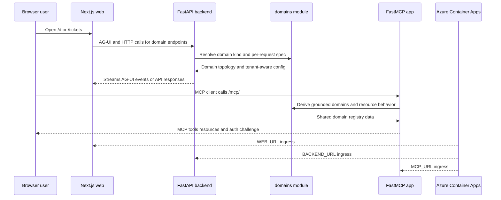

# Runtime topology across backend, frontend, MCP, and infra

At runtime this system is not one process. It is a small set of deployed surfaces with different jobs:

- a **FastAPI backend monolith** that owns the HTTP API, AG-UI endpoints, auth wiring, telemetry bootstrap, and per-domain runtime mounting,
- a **Next.js frontend** that renders the user console and talks to AG-UI agents through CopilotKit,
- a **separate FastMCP app** that exposes MCP tools and resources over its own ingress, and
- **Azure infra** that deploys those services as separate Container Apps and returns distinct public URLs for backend, web, and MCP. [`apps/backend/app/main.py#L1-L12`](https://github.com/ruinosus/foundry-assured/blob/18595cf77fa56dad04a5e646bc5dae9bcae7f6fa/apps/backend/app/main.py#L1-L12) [`apps/mcp/mcp_app/main.py#L1-L27`](https://github.com/ruinosus/foundry-assured/blob/18595cf77fa56dad04a5e646bc5dae9bcae7f6fa/apps/mcp/mcp_app/main.py#L1-L27) [`azure.yaml#L6-L25`](https://github.com/ruinosus/foundry-assured/blob/18595cf77fa56dad04a5e646bc5dae9bcae7f6fa/azure.yaml#L6-L25) [`infra/main.bicep#L89-L125`](https://github.com/ruinosus/foundry-assured/blob/18595cf77fa56dad04a5e646bc5dae9bcae7f6fa/infra/main.bicep#L89-L125)

The main architectural seam is that the backend monolith and the MCP app are **separate composition roots** but they intentionally share business-owned module surfaces, especially the domain catalog, rather than each maintaining their own copy. The frontend mirrors that catalog contract with its own runtime registry of domain ids, kinds, frameworks, and endpoint paths. [`apps/backend/app/modules/domains/public.py#L1-L18`](https://github.com/ruinosus/foundry-assured/blob/18595cf77fa56dad04a5e646bc5dae9bcae7f6fa/apps/backend/app/modules/domains/public.py#L1-L18) [`apps/backend/app/modules/domains/internal/catalog.py#L1-L23`](https://github.com/ruinosus/foundry-assured/blob/18595cf77fa56dad04a5e646bc5dae9bcae7f6fa/apps/backend/app/modules/domains/internal/catalog.py#L1-L23) [`apps/frontend/lib/domains.ts#L1-L10`](https://github.com/ruinosus/foundry-assured/blob/18595cf77fa56dad04a5e646bc5dae9bcae7f6fa/apps/frontend/lib/domains.ts#L1-L10)

Caption: User-facing AG-UI traffic goes through the web app to the backend monolith, while MCP traffic goes directly to the separate MCP ingress; both server runtimes share the same backend-owned domain catalog seam.

## Runtime units and their responsibilities

## Backend monolith

`apps/backend/app/main.py` is intentionally thin. It sets up telemetry first, installs tenancy hooks and the platform server catalog, injects shared chat middleware, creates the FastAPI app, applies CORS for the frontend origin, includes HTTP routers, and finally mounts every live domain endpoint through `mount_domains(app)`. The file explicitly documents that `/mcp` is no longer served there. [`apps/backend/app/main.py#L32-L40`](https://github.com/ruinosus/foundry-assured/blob/18595cf77fa56dad04a5e646bc5dae9bcae7f6fa/apps/backend/app/main.py#L32-L40) [`apps/backend/app/main.py#L78-L106`](https://github.com/ruinosus/foundry-assured/blob/18595cf77fa56dad04a5e646bc5dae9bcae7f6fa/apps/backend/app/main.py#L78-L106) [`apps/backend/app/main.py#L108-L140`](https://github.com/ruinosus/foundry-assured/blob/18595cf77fa56dad04a5e646bc5dae9bcae7f6fa/apps/backend/app/main.py#L108-L140)

`app/registry.py` is the monolith's composition layer for runtime endpoints. It has two big jobs:

- `include_routers(app)` includes module HTTP routers.
- `mount_domains(app)` walks the static `DOMAIN_KINDS` topology once and dispatches mounting by domain kind. [`apps/backend/app/registry.py#L1-L17`](https://github.com/ruinosus/foundry-assured/blob/18595cf77fa56dad04a5e646bc5dae9bcae7f6fa/apps/backend/app/registry.py#L1-L17) [`apps/backend/app/registry.py#L250-L270`](https://github.com/ruinosus/foundry-assured/blob/18595cf77fa56dad04a5e646bc5dae9bcae7f6fa/apps/backend/app/registry.py#L250-L270) [`apps/backend/app/registry.py#L273-L300`](https://github.com/ruinosus/foundry-assured/blob/18595cf77fa56dad04a5e646bc5dae9bcae7f6fa/apps/backend/app/registry.py#L273-L300)

The important runtime invariant is that mounting uses **static topology** from `DOMAIN_KINDS`, not `domain_specs()`. That avoids reading tenant configuration at boot time, which would break shared mode before any request has resolved a tenant. Per-request handlers resolve `domain_spec(domain_id)` inside request handling instead. [`apps/backend/app/registry.py#L250-L256`](https://github.com/ruinosus/foundry-assured/blob/18595cf77fa56dad04a5e646bc5dae9bcae7f6fa/apps/backend/app/registry.py#L250-L256) [`apps/backend/app/modules/domains/internal/catalog.py#L18-L23`](https://github.com/ruinosus/foundry-assured/blob/18595cf77fa56dad04a5e646bc5dae9bcae7f6fa/apps/backend/app/modules/domains/internal/catalog.py#L18-L23) [`apps/backend/app/modules/domains/internal/catalog.py#L81-L90`](https://github.com/ruinosus/foundry-assured/blob/18595cf77fa56dad04a5e646bc5dae9bcae7f6fa/apps/backend/app/modules/domains/internal/catalog.py#L81-L90) [`apps/backend/app/modules/domains/internal/catalog.py#L110-L135`](https://github.com/ruinosus/foundry-assured/blob/18595cf77fa56dad04a5e646bc5dae9bcae7f6fa/apps/backend/app/modules/domains/internal/catalog.py#L110-L135)

Within that single mount loop, the backend hosts multiple runtime styles side by side:

- `workflow` domains through Agent Framework AG-UI,
- `grounded` domains through a streaming cited-QA path,
- `tool` domains through per-request tool agents, and
- `graph` domains through the LangGraph AG-UI adapter. [`apps/backend/app/registry.py#L103-L135`](https://github.com/ruinosus/foundry-assured/blob/18595cf77fa56dad04a5e646bc5dae9bcae7f6fa/apps/backend/app/registry.py#L103-L135) [`apps/backend/app/registry.py#L168-L197`](https://github.com/ruinosus/foundry-assured/blob/18595cf77fa56dad04a5e646bc5dae9bcae7f6fa/apps/backend/app/registry.py#L168-L197) [`apps/backend/app/registry.py#L200-L247`](https://github.com/ruinosus/foundry-assured/blob/18595cf77fa56dad04a5e646bc5dae9bcae7f6fa/apps/backend/app/registry.py#L200-L247)

That makes the backend a **runtime hub** for user-facing assistants, but not for MCP.

## Frontend web app

The frontend is a Next.js app with CopilotKit, AG-UI client support, MSAL, and a `demo` mode script that can replay recorded fixtures without the Python backend. [`apps/frontend/package.json#L5-L18`](https://github.com/ruinosus/foundry-assured/blob/18595cf77fa56dad04a5e646bc5dae9bcae7f6fa/apps/frontend/package.json#L5-L18) [`apps/frontend/package.json#L28-L43`](https://github.com/ruinosus/foundry-assured/blob/18595cf77fa56dad04a5e646bc5dae9bcae7f6fa/apps/frontend/package.json#L28-L43) `README.md#L132-L150`

Its runtime-facing contract is `apps/frontend/lib/domains.ts`, which acts as the frontend source of truth for domain ids, kinds, frameworks, surfaces, and backend endpoint paths such as `/helpdesk`, `/selfwiki`, `/oncall`, and `/platform`. That registry explicitly says adding a domain means one entry there plus a backend agent. [`apps/frontend/lib/domains.ts#L1-L15`](https://github.com/ruinosus/foundry-assured/blob/18595cf77fa56dad04a5e646bc5dae9bcae7f6fa/apps/frontend/lib/domains.ts#L1-L15) [`apps/frontend/lib/domains.ts#L24-L40`](https://github.com/ruinosus/foundry-assured/blob/18595cf77fa56dad04a5e646bc5dae9bcae7f6fa/apps/frontend/lib/domains.ts#L24-L40) [`apps/frontend/lib/domains.ts#L43-L118`](https://github.com/ruinosus/foundry-assured/blob/18595cf77fa56dad04a5e646bc5dae9bcae7f6fa/apps/frontend/lib/domains.ts#L43-L118)

The README describes the user-visible routes that hang off this frontend surface, such as `/d/helpdesk`, `/d/selfwiki`, `/d/oncall`, `/d/deepcall`, `/d/platform`, `/tickets`, `/evals`, and `/admin/users`. `README.md#L21-L33`

Operationally, the frontend is a **consumer of backend AG-UI endpoints**, not a consumer of MCP. The repo README says the frontend is CopilotKit over AG-UI and separately describes the MCP server as a machine-facing surface for MCP clients. `README.md#L12-L16` `README.md#L98-L115` The dedicated MCP README reinforces the boundary by documenting that the MCP app no longer has CORS because the frontend talks to the backend, not directly to MCP. `apps/mcp/README.md#L254-L266`

## Separate MCP app

`apps/mcp/mcp_app/main.py` is the second composition root. It is thin for the same reason as the backend entrypoint: bootstrap telemetry, wire shared seams, build the FastMCP server, register MCP surfaces, and expose an ASGI app. [`apps/mcp/mcp_app/main.py#L1-L13`](https://github.com/ruinosus/foundry-assured/blob/18595cf77fa56dad04a5e646bc5dae9bcae7f6fa/apps/mcp/mcp_app/main.py#L1-L13) [`apps/mcp/mcp_app/main.py#L58-L99`](https://github.com/ruinosus/foundry-assured/blob/18595cf77fa56dad04a5e646bc5dae9bcae7f6fa/apps/mcp/mcp_app/main.py#L58-L99) [`apps/mcp/mcp_app/main.py#L203-L231`](https://github.com/ruinosus/foundry-assured/blob/18595cf77fa56dad04a5e646bc5dae9bcae7f6fa/apps/mcp/mcp_app/main.py#L203-L231)

Two points define this runtime boundary:

1. The MCP app is now the **only MCP surface** of the product; the backend monolith explicitly no longer serves `/mcp`. [`apps/backend/app/main.py#L136-L140`](https://github.com/ruinosus/foundry-assured/blob/18595cf77fa56dad04a5e646bc5dae9bcae7f6fa/apps/backend/app/main.py#L136-L140) [`apps/mcp/mcp_app/main.py#L6-L10`](https://github.com/ruinosus/foundry-assured/blob/18595cf77fa56dad04a5e646bc5dae9bcae7f6fa/apps/mcp/mcp_app/main.py#L6-L10)
2. The MCP app still imports backend business modules, especially the shared domain catalog and knowledge and tenancy public seams, rather than forking its own version of those rules. [`apps/mcp/mcp_app/main.py#L11-L13`](https://github.com/ruinosus/foundry-assured/blob/18595cf77fa56dad04a5e646bc5dae9bcae7f6fa/apps/mcp/mcp_app/main.py#L11-L13) [`apps/mcp/mcp_app/main.py#L34-L50`](https://github.com/ruinosus/foundry-assured/blob/18595cf77fa56dad04a5e646bc5dae9bcae7f6fa/apps/mcp/mcp_app/main.py#L34-L50)

`wire_registry()` is the most visible example of this seam discipline. It derives the MCP knowledge-tool domain list from the same `DOMAIN_KINDS` map used by the backend mount loop, pushes full `domain_spec` access into MCP surfaces, and only installs tenant-store wiring in shared mode. [`apps/mcp/mcp_app/main.py#L102-L137`](https://github.com/ruinosus/foundry-assured/blob/18595cf77fa56dad04a5e646bc5dae9bcae7f6fa/apps/mcp/mcp_app/main.py#L102-L137)

`register_surfaces()` then registers the server's exposed MCP families: tools, prompts, resources, completions, the evidence app, and the assurance extension. [`apps/mcp/mcp_app/main.py#L139-L200`](https://github.com/ruinosus/foundry-assured/blob/18595cf77fa56dad04a5e646bc5dae9bcae7f6fa/apps/mcp/mcp_app/main.py#L139-L200)

Auth is rooted at `/mcp/` via `http_app(path=MCP_PATH)`, and `MCP_PATH` is intentionally `/mcp/` so the public endpoint remains stable even though the server is now its own root app rather than a mounted sub-app. The auth builder uses Entra token verification when auth is enabled and advertises the resource from the MCP app's own base URL. [`apps/mcp/mcp_app/main.py#L225-L228`](https://github.com/ruinosus/foundry-assured/blob/18595cf77fa56dad04a5e646bc5dae9bcae7f6fa/apps/mcp/mcp_app/main.py#L225-L228) [`apps/mcp/mcp_app/auth.py#L26-L36`](https://github.com/ruinosus/foundry-assured/blob/18595cf77fa56dad04a5e646bc5dae9bcae7f6fa/apps/mcp/mcp_app/auth.py#L26-L36) [`apps/mcp/mcp_app/auth.py#L39-L69`](https://github.com/ruinosus/foundry-assured/blob/18595cf77fa56dad04a5e646bc5dae9bcae7f6fa/apps/mcp/mcp_app/auth.py#L39-L69)

## Composition roots and shared seams

The repository now has **two server-side composition roots**:

- `apps/backend/app/main.py` plus `app/registry.py` for the FastAPI monolith,
- `apps/mcp/mcp_app/main.py` for the FastMCP service. [`apps/backend/app/main.py#L1-L12`](https://github.com/ruinosus/foundry-assured/blob/18595cf77fa56dad04a5e646bc5dae9bcae7f6fa/apps/backend/app/main.py#L1-L12) [`apps/backend/app/registry.py#L1-L17`](https://github.com/ruinosus/foundry-assured/blob/18595cf77fa56dad04a5e646bc5dae9bcae7f6fa/apps/backend/app/registry.py#L1-L17) [`apps/mcp/mcp_app/main.py#L1-L27`](https://github.com/ruinosus/foundry-assured/blob/18595cf77fa56dad04a5e646bc5dae9bcae7f6fa/apps/mcp/mcp_app/main.py#L1-L27)

The key seam that keeps them aligned is the extracted `app.modules.domains` module. Its public surface exists specifically so both composition roots consume the same domain inventory and tenant-aware domain specs without the MCP app importing backend composition code. [`apps/backend/app/modules/domains/public.py#L1-L18`](https://github.com/ruinosus/foundry-assured/blob/18595cf77fa56dad04a5e646bc5dae9bcae7f6fa/apps/backend/app/modules/domains/public.py#L1-L18) [`apps/backend/app/modules/domains/internal/catalog.py#L4-L14`](https://github.com/ruinosus/foundry-assured/blob/18595cf77fa56dad04a5e646bc5dae9bcae7f6fa/apps/backend/app/modules/domains/internal/catalog.py#L4-L14)

This is an important architectural invariant: **domain topology is shared, but runtime mounting is not**.

- The backend uses the catalog to mount AG-UI and HTTP routes.
- The MCP app uses the same catalog to decide what domains exist for tools, document resources, and completions.
- The frontend keeps a parallel contract-level registry for route and UX wiring. [`apps/backend/app/registry.py#L250-L270`](https://github.com/ruinosus/foundry-assured/blob/18595cf77fa56dad04a5e646bc5dae9bcae7f6fa/apps/backend/app/registry.py#L250-L270) [`apps/mcp/mcp_app/main.py#L102-L120`](https://github.com/ruinosus/foundry-assured/blob/18595cf77fa56dad04a5e646bc5dae9bcae7f6fa/apps/mcp/mcp_app/main.py#L102-L120) [`apps/frontend/lib/domains.ts#L43-L118`](https://github.com/ruinosus/foundry-assured/blob/18595cf77fa56dad04a5e646bc5dae9bcae7f6fa/apps/frontend/lib/domains.ts#L43-L118)

Another shared seam is tenancy and auth bootstrap. The backend installs tenancy hooks before serving requests and injects the platform server catalog into tenancy validation. The MCP app conditionally installs tenant-store access in shared mode so its tools and resources apply the same tenant gate model instead of inventing a second one. [`apps/backend/app/main.py#L78-L93`](https://github.com/ruinosus/foundry-assured/blob/18595cf77fa56dad04a5e646bc5dae9bcae7f6fa/apps/backend/app/main.py#L78-L93) [`apps/mcp/mcp_app/main.py#L121-L137`](https://github.com/ruinosus/foundry-assured/blob/18595cf77fa56dad04a5e646bc5dae9bcae7f6fa/apps/mcp/mcp_app/main.py#L121-L137)

## Deployment shape in Azure

`azure.yaml` declares `backend`, `mcp`, and `web` as separate `containerapp` services. The hosted Foundry agents are deployed separately again as Azure AI Agent services, not folded into the web or MCP containers. [`azure.yaml#L6-L26`](https://github.com/ruinosus/foundry-assured/blob/18595cf77fa56dad04a5e646bc5dae9bcae7f6fa/azure.yaml#L6-L26) [`azure.yaml#L27-L85`](https://github.com/ruinosus/foundry-assured/blob/18595cf77fa56dad04a5e646bc5dae9bcae7f6fa/azure.yaml#L27-L85)

`infra/main.bicep` wires the same separation into provisioning by deploying Container Apps and emitting distinct `BACKEND_URL`, `WEB_URL`, and `MCP_URL` outputs. [`infra/main.bicep#L89-L125`](https://github.com/ruinosus/foundry-assured/blob/18595cf77fa56dad04a5e646bc5dae9bcae7f6fa/infra/main.bicep#L89-L125)

For the MCP container specifically, `infra/containerapps.bicep` injects its own `MCP_PUBLIC_BASE_URL`, mounts the shared Azure File volume under the MCP image's backend-root-relative data path, and constrains scale to `minReplicas: 0, maxReplicas: 1`. The single-replica cap exists because MCP HTTP transport keeps session state in-process, while scale-to-zero is still allowed for idle cost control. [`infra/containerapps.bicep#L567-L617`](https://github.com/ruinosus/foundry-assured/blob/18595cf77fa56dad04a5e646bc5dae9bcae7f6fa/infra/containerapps.bicep#L567-L617) [`infra/containerapps.bicep#L623-L633`](https://github.com/ruinosus/foundry-assured/blob/18595cf77fa56dad04a5e646bc5dae9bcae7f6fa/infra/containerapps.bicep#L623-L633)

That deployment shape matters operationally:

- the **backend** can evolve AG-UI and HTTP routing without carrying MCP transport concerns,
- the **MCP** service can publish OAuth metadata and MCP-specific behavior on its own host,
- the **frontend** remains a pure web surface, and
- infra can return stable per-surface URLs to scripts and clients. [`apps/mcp/mcp_app/auth.py#L46-L52`](https://github.com/ruinosus/foundry-assured/blob/18595cf77fa56dad04a5e646bc5dae9bcae7f6fa/apps/mcp/mcp_app/auth.py#L46-L52) [`infra/main.bicep#L122-L125`](https://github.com/ruinosus/foundry-assured/blob/18595cf77fa56dad04a5e646bc5dae9bcae7f6fa/infra/main.bicep#L122-L125)

## Lifecycle and failure boundaries that matter

A few runtime ordering rules are structural, not incidental:

- **Telemetry setup happens first** in both backend and MCP entrypoints so the rest of boot runs inside configured telemetry, while remaining a no-op if no exporter is configured. [`apps/backend/app/main.py#L32-L40`](https://github.com/ruinosus/foundry-assured/blob/18595cf77fa56dad04a5e646bc5dae9bcae7f6fa/apps/backend/app/main.py#L32-L40) [`apps/mcp/mcp_app/main.py#L58-L61`](https://github.com/ruinosus/foundry-assured/blob/18595cf77fa56dad04a5e646bc5dae9bcae7f6fa/apps/mcp/mcp_app/main.py#L58-L61)
- **Tenancy wiring must happen before the first request** in the backend so auth can find the post-authenticate hook, but the backend must still avoid resolving tenant-specific domain config at boot. [`apps/backend/app/main.py#L78-L86`](https://github.com/ruinosus/foundry-assured/blob/18595cf77fa56dad04a5e646bc5dae9bcae7f6fa/apps/backend/app/main.py#L78-L86) [`apps/backend/app/modules/domains/internal/catalog.py#L18-L23`](https://github.com/ruinosus/foundry-assured/blob/18595cf77fa56dad04a5e646bc5dae9bcae7f6fa/apps/backend/app/modules/domains/internal/catalog.py#L18-L23)
- **The MCP app must wire its registry before registering tools and resources**, because those surfaces derive allowed domains from the shared catalog instead of carrying literals. [`apps/mcp/mcp_app/main.py#L102-L120`](https://github.com/ruinosus/foundry-assured/blob/18595cf77fa56dad04a5e646bc5dae9bcae7f6fa/apps/mcp/mcp_app/main.py#L102-L120) [`apps/mcp/mcp_app/main.py#L225-L227`](https://github.com/ruinosus/foundry-assured/blob/18595cf77fa56dad04a5e646bc5dae9bcae7f6fa/apps/mcp/mcp_app/main.py#L225-L227)
- **The MCP app intentionally does not enable browser CORS**, because it is not meant to be called directly by the browser frontend. [`apps/mcp/mcp_app/main.py#L206-L224`](https://github.com/ruinosus/foundry-assured/blob/18595cf77fa56dad04a5e646bc5dae9bcae7f6fa/apps/mcp/mcp_app/main.py#L206-L224) `apps/mcp/README.md#L254-L266`

The main failure mode this topology is designed to prevent is **surface divergence**: two different runtimes serving supposedly identical knowledge or authorization behavior. Splitting MCP into its own app did not relax coupling to shared business seams; it moved transport and deployment concerns apart while keeping the policy-bearing catalog and tenancy seams shared. [`apps/backend/app/main.py#L136-L140`](https://github.com/ruinosus/foundry-assured/blob/18595cf77fa56dad04a5e646bc5dae9bcae7f6fa/apps/backend/app/main.py#L136-L140) [`apps/mcp/mcp_app/main.py#L6-L10`](https://github.com/ruinosus/foundry-assured/blob/18595cf77fa56dad04a5e646bc5dae9bcae7f6fa/apps/mcp/mcp_app/main.py#L6-L10) [`apps/backend/app/modules/domains/internal/catalog.py#L4-L11`](https://github.com/ruinosus/foundry-assured/blob/18595cf77fa56dad04a5e646bc5dae9bcae7f6fa/apps/backend/app/modules/domains/internal/catalog.py#L4-L11)

## Safe extension points

If you need to change the runtime topology, the least risky extension points are clear from the current composition:

- Add a new **user-facing domain** by updating the backend domain catalog and frontend domain registry together, then letting the backend mount loop dispatch it by kind. [`apps/backend/app/modules/domains/internal/catalog.py#L90-L107`](https://github.com/ruinosus/foundry-assured/blob/18595cf77fa56dad04a5e646bc5dae9bcae7f6fa/apps/backend/app/modules/domains/internal/catalog.py#L90-L107) [`apps/frontend/lib/domains.ts#L43-L118`](https://github.com/ruinosus/foundry-assured/blob/18595cf77fa56dad04a5e646bc5dae9bcae7f6fa/apps/frontend/lib/domains.ts#L43-L118)
- Add a new **MCP-exposed capability** by registering a new MCP surface in `register_surfaces(mcp)` and, if it depends on domains, deriving its allowed set from the shared catalog rather than a local list. [`apps/mcp/mcp_app/main.py#L139-L200`](https://github.com/ruinosus/foundry-assured/blob/18595cf77fa56dad04a5e646bc5dae9bcae7f6fa/apps/mcp/mcp_app/main.py#L139-L200)
- Change deployment topology by editing `azure.yaml` and the Bicep modules that emit public URLs and runtime env vars, not by hard-coding host assumptions in app code. [`azure.yaml#L6-L25`](https://github.com/ruinosus/foundry-assured/blob/18595cf77fa56dad04a5e646bc5dae9bcae7f6fa/azure.yaml#L6-L25) [`infra/main.bicep#L122-L125`](https://github.com/ruinosus/foundry-assured/blob/18595cf77fa56dad04a5e646bc5dae9bcae7f6fa/infra/main.bicep#L122-L125) [`infra/containerapps.bicep#L576-L583`](https://github.com/ruinosus/foundry-assured/blob/18595cf77fa56dad04a5e646bc5dae9bcae7f6fa/infra/containerapps.bicep#L576-L583)

For tests that pin these boundaries, the MCP README points at gates for auth, authz, tenant handling, instrumentation coverage, durability, and image path correctness, while the backend keeps a route-capture helper that normalizes `/mcp/` path shape when enumerating routes. `apps/mcp/README.md#L268-L325` [`apps/backend/tests/smoke/_capture_routes.py#L124-L128`](https://github.com/ruinosus/foundry-assured/blob/18595cf77fa56dad04a5e646bc5dae9bcae7f6fa/apps/backend/tests/smoke/_capture_routes.py#L124-L128)
