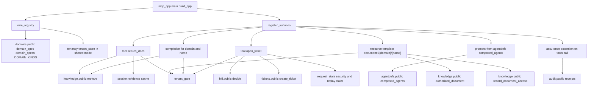

# Separate MCP server surface and its contracts

The MCP server is a separate deployable app under `apps/mcp`, not a route mounted inside the backend monolith. Its composition root in `mcp_app.main` initializes telemetry, wires shared backend seams such as the domain catalog and tenancy store, registers every MCP surface in one place, then exposes an ASGI app at `/mcp/` via `mcp.http_app(path=MCP_PATH)`. [main.py](https://github.com/ruinosus/foundry-assured/blob/18595cf77fa56dad04a5e646bc5dae9bcae7f6fa/apps/mcp/mcp_app/main.py#L58-L99) [main.py](https://github.com/ruinosus/foundry-assured/blob/18595cf77fa56dad04a5e646bc5dae9bcae7f6fa/apps/mcp/mcp_app/main.py#L102-L139) [main.py](https://github.com/ruinosus/foundry-assured/blob/18595cf77fa56dad04a5e646bc5dae9bcae7f6fa/apps/mcp/mcp_app/main.py#L139-L200) [main.py](https://github.com/ruinosus/foundry-assured/blob/18595cf77fa56dad04a5e646bc5dae9bcae7f6fa/apps/mcp/mcp_app/main.py#L203-L231)

It is the only MCP surface in the product. The repository README for `apps/mcp` and the composition-root docstring both describe the old backend `/mcp` implementation as deleted, specifically to avoid two MCP surfaces serving the same capability with different access decisions. README.md [main.py](https://github.com/ruinosus/foundry-assured/blob/18595cf77fa56dad04a5e646bc5dae9bcae7f6fa/apps/mcp/mcp_app/main.py#L1-L27)

## Why it is a separate deployment

The separation is primarily a dependency boundary. `apps/mcp/README.md` records that FastMCP 4 requires `mcp>=2,<3`, while the backend's agent framework stack requires `mcp>=1.24.0,<2`, so both cannot live in the same virtual environment. The workaround is to install the backend business modules without the backend's `agents` extra, and let the MCP app import only stable public seams from those modules. README.md

That separation works because the shared dependencies are business modules, not backend composition code. `mcp_app.main` imports the shared domain catalog from `app.modules.domains.public`, tenancy from `app.modules.tenancy`, knowledge from `app.modules.knowledge.public`, and other shared services; the domains module explicitly documents that both composition roots consume the same exported catalog. [main.py](https://github.com/ruinosus/foundry-assured/blob/18595cf77fa56dad04a5e646bc5dae9bcae7f6fa/apps/mcp/mcp_app/main.py#L34-L52) [public.py](https://github.com/ruinosus/foundry-assured/blob/18595cf77fa56dad04a5e646bc5dae9bcae7f6fa/apps/backend/app/modules/domains/public.py#L1-L18)

## Surface inventory and shared seam wiring

This diagram shows the published MCP surfaces and the backend seams they reuse.

`register_surfaces()` is the inventory of record. It registers `search_docs`, `open_ticket`, prompts derived from agent definitions, the `document://{domain}/{name}` resource template, its completion handler, the evidence app, and the assurance extension. The README and code both emphasize that this central registration point exists so tests can assert the app's real surface instead of a hand-built test fixture. [main.py](https://github.com/ruinosus/foundry-assured/blob/18595cf77fa56dad04a5e646bc5dae9bcae7f6fa/apps/mcp/mcp_app/main.py#L139-L200) README.md

## Shared contracts with backend business modules

The MCP app deliberately reuses backend public modules instead of duplicating policy:

- `app.modules.knowledge.public` exports `retrieve`, `authorized_document`, and `record_document_access`; the module docstring states that ACL trimming happens before model-visible output, and the public surface re-exports the authorization and audit helpers the MCP app uses. [public.py](https://github.com/ruinosus/foundry-assured/blob/18595cf77fa56dad04a5e646bc5dae9bcae7f6fa/apps/backend/app/modules/knowledge/public.py#L1-L37)
- `authorized_document` performs reauthorization on full-document reads, validates blob names, uses the same ACL-backed search-based check for document-access domains, and raises typed errors that the MCP resource maps into protocol errors. [document.py](https://github.com/ruinosus/foundry-assured/blob/18595cf77fa56dad04a5e646bc5dae9bcae7f6fa/apps/backend/app/modules/knowledge/internal/document.py#L115-L166)
- `record_document_access` is the shared audit writer for both the web route and the MCP resource, so document-read telemetry is not duplicated. [document.py](https://github.com/ruinosus/foundry-assured/blob/18595cf77fa56dad04a5e646bc5dae9bcae7f6fa/apps/backend/app/modules/knowledge/internal/document.py#L194-L220)
- `app.modules.agentdefs.public.composed_agents()` reloads and composes all scoped AgentSchema prompt documents, and the MCP prompt publisher uses that function rather than any local prompt literals or hand-maintained list. [public.py](https://github.com/ruinosus/foundry-assured/blob/18595cf77fa56dad04a5e646bc5dae9bcae7f6fa/apps/backend/app/modules/agentdefs/public.py#L182-L203) [prompts_agentdefs.py](https://github.com/ruinosus/foundry-assured/blob/18595cf77fa56dad04a5e646bc5dae9bcae7f6fa/apps/mcp/mcp_app/prompts_agentdefs.py#L1-L26) [prompts_agentdefs.py](https://github.com/ruinosus/foundry-assured/blob/18595cf77fa56dad04a5e646bc5dae9bcae7f6fa/apps/mcp/mcp_app/prompts_agentdefs.py#L64-L86)
- `app.modules.hitl.public.decide()` is the authoritative human-decision contract for write approvals, including the four decision types and role enforcement; MCP reuses that same vocabulary for `open_ticket`. [public.py](https://github.com/ruinosus/foundry-assured/blob/18595cf77fa56dad04a5e646bc5dae9bcae7f6fa/apps/backend/app/modules/hitl/public.py#L3-L23) [public.py](https://github.com/ruinosus/foundry-assured/blob/18595cf77fa56dad04a5e646bc5dae9bcae7f6fa/apps/backend/app/modules/hitl/public.py#L54-L66) [public.py](https://github.com/ruinosus/foundry-assured/blob/18595cf77fa56dad04a5e646bc5dae9bcae7f6fa/apps/backend/app/modules/hitl/public.py#L86-L132)
- `app.modules.tickets.public.create_ticket` is the persistence layer for ticket creation, and its own module docstring says authorization belongs at the call site rather than in the storage module. [public.py](https://github.com/ruinosus/foundry-assured/blob/18595cf77fa56dad04a5e646bc5dae9bcae7f6fa/apps/backend/app/modules/tickets/public.py#L1-L10)

## Auth, discovery, and access filtering

The MCP app acts as a resource server over Entra, not as an authorization server. `build_auth()` returns `None` when auth is disabled for local development, otherwise constructs an `AzureJWTVerifier` with the backend's `access_as_user` scope and wraps it in a `RemoteAuthProvider`. The public endpoint path is fixed at `/mcp/`. [auth.py](https://github.com/ruinosus/foundry-assured/blob/18595cf77fa56dad04a5e646bc5dae9bcae7f6fa/apps/mcp/mcp_app/auth.py#L1-L14) [auth.py](https://github.com/ruinosus/foundry-assured/blob/18595cf77fa56dad04a5e646bc5dae9bcae7f6fa/apps/mcp/mcp_app/auth.py#L26-L36) [auth.py](https://github.com/ruinosus/foundry-assured/blob/18595cf77fa56dad04a5e646bc5dae9bcae7f6fa/apps/mcp/mcp_app/auth.py#L39-L69)

Role checks are filtered at discovery time. `require_any_role()` composes FastMCP's `require_roles()` into OR semantics over Entra `roles`, because the library helper is AND-based. It also degrades open when auth is disabled, matching backend local-dev behavior. [auth.py](https://github.com/ruinosus/foundry-assured/blob/18595cf77fa56dad04a5e646bc5dae9bcae7f6fa/apps/mcp/mcp_app/auth.py#L72-L117)

The auth-focused tests pin the discovery contract:

- with auth disabled, no provider is built;
- with auth enabled, the issuer is the configured tenant and the audience is the API client id;
- the `.well-known` protected-resource metadata is scoped to the MCP endpoint, not the backend root. [auth_test.py](https://github.com/ruinosus/foundry-assured/blob/18595cf77fa56dad04a5e646bc5dae9bcae7f6fa/apps/mcp/tests/auth_test.py#L36-L94)

A client-level surface test then proves those checks affect the actual protocol surface. With a Reader token, the client sees the read tools, prompts, and document template and can read the resource; with no roles, list operations return nothing, direct resource reads are rejected, and completion returns no suggestions. [client_surface_test.py](https://github.com/ruinosus/foundry-assured/blob/18595cf77fa56dad04a5e646bc5dae9bcae7f6fa/apps/mcp/tests/client_surface_test.py#L122-L143) [client_surface_test.py](https://github.com/ruinosus/foundry-assured/blob/18595cf77fa56dad04a5e646bc5dae9bcae7f6fa/apps/mcp/tests/client_surface_test.py#L197-L239)

## Registered surfaces

### `search_docs` tool

`search_docs` is a thin protocol wrapper over `knowledge.public.retrieve`. It validates that the chosen domain is one of the grounded domains injected from the shared domain catalog, resolves the caller identity from the incoming access token, runs shared-mode tenant and entitlement checks through `tenant_gate`, calls `retrieve`, stores the resulting citations in session state for later evidence rendering, and returns structured `answer_context` plus `sources`. [tools_knowledge.py](https://github.com/ruinosus/foundry-assured/blob/18595cf77fa56dad04a5e646bc5dae9bcae7f6fa/apps/mcp/mcp_app/tools_knowledge.py#L34-L54) [tools_knowledge.py](https://github.com/ruinosus/foundry-assured/blob/18595cf77fa56dad04a5e646bc5dae9bcae7f6fa/apps/mcp/mcp_app/tools_knowledge.py#L56-L115)

Registration attaches read-role auth and optionally task support, but the task capability is decided by the composition root's infrastructure wiring rather than by the tool itself. [tools_knowledge.py](https://github.com/ruinosus/foundry-assured/blob/18595cf77fa56dad04a5e646bc5dae9bcae7f6fa/apps/mcp/mcp_app/tools_knowledge.py#L118-L152) [main.py](https://github.com/ruinosus/foundry-assured/blob/18595cf77fa56dad04a5e646bc5dae9bcae7f6fa/apps/mcp/mcp_app/main.py#L161-L179)

### `open_ticket` tool

`open_ticket` is the write surface and is intentionally a guard tool rather than a raw create operation. It supports the repository's four human decisions, encoded in the elicitation form schema as `approve`, `edit`, `reject`, and `respond`, and reuses the backend HITL contract rather than collapsing the protocol into yes-or-no approval. [tools_tickets.py](https://github.com/ruinosus/foundry-assured/blob/18595cf77fa56dad04a5e646bc5dae9bcae7f6fa/apps/mcp/mcp_app/tools_tickets.py#L7-L26) [tools_tickets.py](https://github.com/ruinosus/foundry-assured/blob/18595cf77fa56dad04a5e646bc5dae9bcae7f6fa/apps/mcp/mcp_app/tools_tickets.py#L84-L116) [tools_tickets.py](https://github.com/ruinosus/foundry-assured/blob/18595cf77fa56dad04a5e646bc5dae9bcae7f6fa/apps/mcp/mcp_app/tools_tickets.py#L149-L201)

The write path is unreachable without an approved second round. On the first call, the tool returns `InputRequiredResult` with a server-issued `request_state`. On the second round it only proceeds if both input responses and a valid state are present, then consumes a per-request nonce to prevent replay, validates corrected severity values before recording approval, calls `hitl.public.decide()` for role-aware decision validation and audit, and only then invokes `create_ticket`. [tools_tickets.py](https://github.com/ruinosus/foundry-assured/blob/18595cf77fa56dad04a5e646bc5dae9bcae7f6fa/apps/mcp/mcp_app/tools_tickets.py#L266-L377)

Registration limits discovery to `Approver` or `Admin`. [tools_tickets.py](https://github.com/ruinosus/foundry-assured/blob/18595cf77fa56dad04a5e646bc5dae9bcae7f6fa/apps/mcp/mcp_app/tools_tickets.py#L380-L403)

The protocol-level write test proves the important invariants: all four decisions traverse the wire intact; writes are impossible without a valid state; callers without `Approver` or `Admin` cannot complete a write; approved writes leave both decision and write evidence; and assurance sealing reaches the final tool response, not the intermediate question round. [write_decision_test.py](https://github.com/ruinosus/foundry-assured/blob/18595cf77fa56dad04a5e646bc5dae9bcae7f6fa/apps/mcp/tests/write_decision_test.py#L1-L46) [write_decision_test.py](https://github.com/ruinosus/foundry-assured/blob/18595cf77fa56dad04a5e646bc5dae9bcae7f6fa/apps/mcp/tests/write_decision_test.py#L82-L101) [write_decision_test.py](https://github.com/ruinosus/foundry-assured/blob/18595cf77fa56dad04a5e646bc5dae9bcae7f6fa/apps/mcp/tests/write_decision_test.py#L252-L300)

### Prompt surface

The prompt surface publishes one MCP prompt per composed AgentSchema document. `prompt_ids()` and `register()` both derive from `composed_agents()`, fail loudly if the agent scope is empty, and apply the same read-role gate as the read surfaces. This keeps MCP prompts aligned with the same composed prompt corpus used elsewhere in the product. [prompts_agentdefs.py](https://github.com/ruinosus/foundry-assured/blob/18595cf77fa56dad04a5e646bc5dae9bcae7f6fa/apps/mcp/mcp_app/prompts_agentdefs.py#L35-L47) [prompts_agentdefs.py](https://github.com/ruinosus/foundry-assured/blob/18595cf77fa56dad04a5e646bc5dae9bcae7f6fa/apps/mcp/mcp_app/prompts_agentdefs.py#L64-L86)

### `document://{domain}/{name}` resource and completion

The document resource does not invent its own access policy. `read_document()` resolves the caller, checks tenant entitlement first, resolves the domain from the injected shared registry, calls `knowledge.public.authorized_document()`, maps its typed failures into `ResourceError`, and records both allowed and denied reads through `record_document_access()`. [resources_knowledge.py](https://github.com/ruinosus/foundry-assured/blob/18595cf77fa56dad04a5e646bc5dae9bcae7f6fa/apps/mcp/mcp_app/resources_knowledge.py#L171-L205)

The completion handler is a distinct surface with its own explicit safeguards. Because FastMCP does not apply auth automatically to `completion/complete`, `_pode_ler()` manually reuses the same auth object attached to the resource template, then `completar()` fail-closes to empty suggestions when the caller lacks read roles, identity, tenant entitlement, or a valid domain context. Document-name completion uses `retrieve()` rather than raw blob listing so suggestions are already ACL-trimmed to what the caller can read. [resources_knowledge.py](https://github.com/ruinosus/foundry-assured/blob/18595cf77fa56dad04a5e646bc5dae9bcae7f6fa/apps/mcp/mcp_app/resources_knowledge.py#L212-L243) [resources_knowledge.py](https://github.com/ruinosus/foundry-assured/blob/18595cf77fa56dad04a5e646bc5dae9bcae7f6fa/apps/mcp/mcp_app/resources_knowledge.py#L245-L339) [resources_knowledge.py](https://github.com/ruinosus/foundry-assured/blob/18595cf77fa56dad04a5e646bc5dae9bcae7f6fa/apps/mcp/mcp_app/resources_knowledge.py#L342-L389)

## Request-state security for writes

Write approvals depend on `MCP_REQUEST_STATE_KEY`. `request_state.indisponivel()` treats an empty key as a write-only outage with a caller-facing operator-config error, while `politica()` returns `None` in that case so the rest of the server can still boot. If a non-empty key is provided but too short for the library's AES-GCM codec, construction is allowed to fail at boot because that is considered misconfiguration, not an operating mode. [request_state.py](https://github.com/ruinosus/foundry-assured/blob/18595cf77fa56dad04a5e646bc5dae9bcae7f6fa/apps/mcp/mcp_app/request_state.py#L18-L57) [request_state.py](https://github.com/ruinosus/foundry-assured/blob/18595cf77fa56dad04a5e646bc5dae9bcae7f6fa/apps/mcp/mcp_app/request_state.py#L65-L112)

That split matters operationally: read surfaces remain available without the write secret, but the write surface refuses to ask for human approval unless it can later verify the returned state. [tools_tickets.py](https://github.com/ruinosus/foundry-assured/blob/18595cf77fa56dad04a5e646bc5dae9bcae7f6fa/apps/mcp/mcp_app/tools_tickets.py#L281-L287)

## Assurance extension

The assurance layer is implemented as a negotiated server extension, not a fifth business surface. `SeloDeAssurance` advertises the wire identifier `br.com.rededor.foundry/assurance`, declares that it adds citations and audit-trail metadata to `tools/call`, and only mutates responses for clients that explicitly opt in per request. [assurance_extension.py](https://github.com/ruinosus/foundry-assured/blob/18595cf77fa56dad04a5e646bc5dae9bcae7f6fa/apps/mcp/mcp_app/assurance_extension.py#L1-L21) [assurance_extension.py](https://github.com/ruinosus/foundry-assured/blob/18595cf77fa56dad04a5e646bc5dae9bcae7f6fa/apps/mcp/mcp_app/assurance_extension.py#L85-L95) [assurance_extension.py](https://github.com/ruinosus/foundry-assured/blob/18595cf77fa56dad04a5e646bc5dae9bcae7f6fa/apps/mcp/mcp_app/assurance_extension.py#L148-L173)

The seal is intentionally copy-only. `_citacoes()` extracts citations from a tool's existing `sources` field, `_trilha()` reduces captured audit receipts to `scope`, `kind`, and event id, and `intercept_tool_call()` attaches that data under `_meta` only for ordinary final tool results, not for intermediate `InputRequiredToolResult` responses. Resources and completion are not sealed because the extension hook only wraps tool calls. [assurance_extension.py](https://github.com/ruinosus/foundry-assured/blob/18595cf77fa56dad04a5e646bc5dae9bcae7f6fa/apps/mcp/mcp_app/assurance_extension.py#L97-L145) [assurance_extension.py](https://github.com/ruinosus/foundry-assured/blob/18595cf77fa56dad04a5e646bc5dae9bcae7f6fa/apps/mcp/mcp_app/assurance_extension.py#L175-L236)

## Testing focus

The MCP app carries focused executable tests instead of relying on backend tests alone. The most relevant boundary tests for this page are:

- `tests/auth_test.py` for resource-server auth wiring and protected-resource discovery. [auth_test.py](https://github.com/ruinosus/foundry-assured/blob/18595cf77fa56dad04a5e646bc5dae9bcae7f6fa/apps/mcp/tests/auth_test.py#L36-L94)
- `tests/client_surface_test.py` for end-to-end visibility of tools, prompts, resource templates, reads, and completion through a real FastMCP client talking to the app ASGI stack. [client_surface_test.py](https://github.com/ruinosus/foundry-assured/blob/18595cf77fa56dad04a5e646bc5dae9bcae7f6fa/apps/mcp/tests/client_surface_test.py#L10-L17) [client_surface_test.py](https://github.com/ruinosus/foundry-assured/blob/18595cf77fa56dad04a5e646bc5dae9bcae7f6fa/apps/mcp/tests/client_surface_test.py#L177-L239)
- `tests/write_decision_test.py` for the write-only approval contract, request-state binding, role enforcement, and assurance sealing on final write responses. [write_decision_test.py](https://github.com/ruinosus/foundry-assured/blob/18595cf77fa56dad04a5e646bc5dae9bcae7f6fa/apps/mcp/tests/write_decision_test.py#L1-L46) [write_decision_test.py](https://github.com/ruinosus/foundry-assured/blob/18595cf77fa56dad04a5e646bc5dae9bcae7f6fa/apps/mcp/tests/write_decision_test.py#L236-L300)

For the full operational gate list, including tenancy, prompts mirroring, resource ACL, completion, tasks, Redis durability, and image-path verification, the app README is the authoritative checklist. README.md
