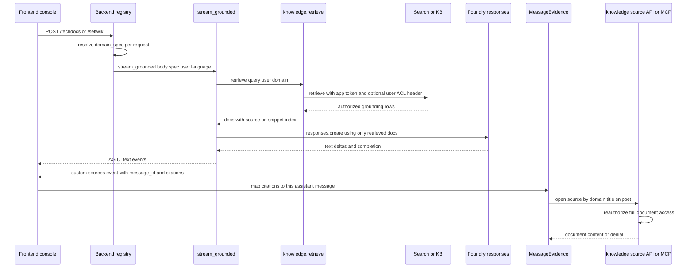

# Grounded answer and evidence flow

Grounded assistants in this repository are the `techdocs` and `selfwiki` domains on the frontend, both declared with `kind: "grounded"` and backend endpoints `/techdocs` and `/selfwiki`. The backend composition root mounts every grounded domain through the same `_mount_grounded` path, so the request flow is shared even though each domain resolves a different `DomainSpec` and corpus configuration at request time.[`apps/frontend/lib/domains.ts`](https://github.com/ruinosus/foundry-assured/blob/18595cf77fa56dad04a5e646bc5dae9bcae7f6fa/apps/frontend/lib/domains.ts#L66-L81) [`apps/backend/app/registry.py`](https://github.com/ruinosus/foundry-assured/blob/18595cf77fa56dad04a5e646bc5dae9bcae7f6fa/apps/backend/app/registry.py#L46-L91)

The key ownership split is:

- `registry.py` owns HTTP mounting and per-request resolution of the grounded domain spec.[`apps/backend/app/registry.py`](https://github.com/ruinosus/foundry-assured/blob/18595cf77fa56dad04a5e646bc5dae9bcae7f6fa/apps/backend/app/registry.py#L46-L91)
- `grounded.stream_grounded` owns the live AG-UI stream: retrieve, synthesize, emit text, emit citations, and persist the turn.[`apps/backend/app/modules/grounded/internal/grounded.py`](https://github.com/ruinosus/foundry-assured/blob/18595cf77fa56dad04a5e646bc5dae9bcae7f6fa/apps/backend/app/modules/grounded/internal/grounded.py#L111-L167) [`apps/backend/app/modules/grounded/internal/grounded.py`](https://github.com/ruinosus/foundry-assured/blob/18595cf77fa56dad04a5e646bc5dae9bcae7f6fa/apps/backend/app/modules/grounded/internal/grounded.py#L186-L267)
- `knowledge.retrieve` owns retrieval routing, OBO search token handling, ACL-header attachment, deduped grounding rows, and access audit recording before the model sees the docs.[`apps/backend/app/modules/knowledge/public.py`](https://github.com/ruinosus/foundry-assured/blob/18595cf77fa56dad04a5e646bc5dae9bcae7f6fa/apps/backend/app/modules/knowledge/public.py#L13-L36) [`apps/backend/app/modules/knowledge/internal/retrieval.py`](https://github.com/ruinosus/foundry-assured/blob/18595cf77fa56dad04a5e646bc5dae9bcae7f6fa/apps/backend/app/modules/knowledge/internal/retrieval.py#L49-L128)
- `knowledge.authorized_document` and its HTTP/MCP callers own full-document reopening, reauthorization, and read audit events.[`apps/backend/app/modules/knowledge/internal/document.py`](https://github.com/ruinosus/foundry-assured/blob/18595cf77fa56dad04a5e646bc5dae9bcae7f6fa/apps/backend/app/modules/knowledge/internal/document.py#L115-L166) [`apps/backend/app/modules/knowledge/api.py`](https://github.com/ruinosus/foundry-assured/blob/18595cf77fa56dad04a5e646bc5dae9bcae7f6fa/apps/backend/app/modules/knowledge/api.py#L57-L117) [`apps/mcp/mcp_app/resources_knowledge.py`](https://github.com/ruinosus/foundry-assured/blob/18595cf77fa56dad04a5e646bc5dae9bcae7f6fa/apps/mcp/mcp_app/resources_knowledge.py#L171-L204)
- `MessageEvidence.tsx` owns how those citations become inline buttons and per-message evidence lists in the console, keyed by `message_id` so evidence stays attached to the response that produced it.[`apps/frontend/components/console/MessageEvidence.tsx`](https://github.com/ruinosus/foundry-assured/blob/18595cf77fa56dad04a5e646bc5dae9bcae7f6fa/apps/frontend/components/console/MessageEvidence.tsx#L49-L87) [`apps/frontend/components/console/MessageEvidence.tsx`](https://github.com/ruinosus/foundry-assured/blob/18595cf77fa56dad04a5e646bc5dae9bcae7f6fa/apps/frontend/components/console/MessageEvidence.tsx#L120-L225)

Caption: End-to-end flow for grounded requests, including retrieval, citation emission, per-message evidence rendering, and later document reopening.

## 1. Frontend domain choice and route contract

The frontend keeps a single registry of assistant domains. `techdocs` and `selfwiki` are the two grounded entries, each marked `framework: "agent-framework"`, `kind: "grounded"`, and a stable endpoint path that matches the backend route segment. That `id` is also the stable domain identifier used later when the UI dispatches “open source” events for a citation.[`apps/frontend/lib/domains.ts`](https://github.com/ruinosus/foundry-assured/blob/18595cf77fa56dad04a5e646bc5dae9bcae7f6fa/apps/frontend/lib/domains.ts#L24-L40) [`apps/frontend/lib/domains.ts`](https://github.com/ruinosus/foundry-assured/blob/18595cf77fa56dad04a5e646bc5dae9bcae7f6fa/apps/frontend/lib/domains.ts#L66-L81)

On the backend, `mount_domains()` loops the static `DOMAIN_KINDS` topology and dispatches grounded domains to `_mount_grounded()`. It does **not** resolve `domain_spec()` at boot; the spec is resolved inside the request handler because shared-mode tenant config is request-scoped. That means grounded routing is stable at startup, but the actual KB, index, endpoint, and ACL configuration are chosen per request.[`apps/backend/app/registry.py`](https://github.com/ruinosus/foundry-assured/blob/18595cf77fa56dad04a5e646bc5dae9bcae7f6fa/apps/backend/app/registry.py#L46-L91) [`apps/backend/app/registry.py`](https://github.com/ruinosus/foundry-assured/blob/18595cf77fa56dad04a5e646bc5dae9bcae7f6fa/apps/backend/app/registry.py#L250-L270)

## 2. Backend grounded request entrypoint

`_mount_grounded()` registers `POST /{domain_id}` with the common domain dependencies and wraps `stream_grounded()` in a `StreamingResponse`. It captures two request-scoped values before entering the generator:

- `current_user()`, passed explicitly so retrieval and synthesis can run as the signed-in user when auth is enabled.
- The first valid `Accept-Language` tag, passed as `language` so the grounded response can follow the caller’s preferred language without carrying the whole header value downstream.[`apps/backend/app/registry.py`](https://github.com/ruinosus/foundry-assured/blob/18595cf77fa56dad04a5e646bc5dae9bcae7f6fa/apps/backend/app/registry.py#L31-L43) [`apps/backend/app/registry.py`](https://github.com/ruinosus/foundry-assured/blob/18595cf77fa56dad04a5e646bc5dae9bcae7f6fa/apps/backend/app/registry.py#L57-L84)

The route can switch to a framework-backed grounded path via `via_framework()`, but the default path remains the handwritten `stream_grounded()` flow. So the documented citation and evidence behavior here is the live default path, not an optional wrapper.[`apps/backend/app/registry.py`](https://github.com/ruinosus/foundry-assured/blob/18595cf77fa56dad04a5e646bc5dae9bcae7f6fa/apps/backend/app/registry.py#L61-L70)

## 3. DomainSpec decides which corpus and access model apply

The catalog module defines `DomainSpec` as the data contract for a domain’s retrieval target and document access behavior. For grounded domains, `__post_init__` enforces that each spec must have a `kb_name` or `search_index`, and any domain declaring `document_access="acl"` must also have a `search_index`. That prevents both retrieval and full-document reopening from falling through to malformed `.../indexes/None/docs/search` URLs.[`apps/backend/app/modules/domains/internal/catalog.py`](https://github.com/ruinosus/foundry-assured/blob/18595cf77fa56dad04a5e646bc5dae9bcae7f6fa/apps/backend/app/modules/domains/internal/catalog.py#L33-L78)

For the currently configured grounded domains:

- `techdocs` uses a native Search Index knowledge base, points at the shared Azure Search endpoint and a techdocs search index, carries `acl_group_map`, and declares `document_access="acl"`.[`apps/backend/app/modules/domains/internal/catalog.py`](https://github.com/ruinosus/foundry-assured/blob/18595cf77fa56dad04a5e646bc5dae9bcae7f6fa/apps/backend/app/modules/domains/internal/catalog.py#L174-L185)
- `selfwiki` is also grounded, uses its own KB and search index, and declares `document_access="acl"`; its ACL map collapses to the single app-users group when configured.[`apps/backend/app/modules/domains/internal/catalog.py`](https://github.com/ruinosus/foundry-assured/blob/18595cf77fa56dad04a5e646bc5dae9bcae7f6fa/apps/backend/app/modules/domains/internal/catalog.py#L186-L205)

This matters because both retrieval and later document opening are driven by the same declarative field: `document_access`, not by inferring behavior from whether an ACL map happens to be non-empty at runtime.[`apps/backend/app/modules/domains/internal/catalog.py`](https://github.com/ruinosus/foundry-assured/blob/18595cf77fa56dad04a5e646bc5dae9bcae7f6fa/apps/backend/app/modules/domains/internal/catalog.py#L37-L49)

## 4. Retrieval seam: one API, two engines, same ACL contract

The public knowledge module deliberately exports retrieval and document authorization as reusable seams. The grounded flow uses `retrieve()` through `app.modules.knowledge.public`, rather than embedding search logic in the grounded module.[`apps/backend/app/modules/knowledge/public.py`](https://github.com/ruinosus/foundry-assured/blob/18595cf77fa56dad04a5e646bc5dae9bcae7f6fa/apps/backend/app/modules/knowledge/public.py#L13-L36)

`retrieve(query, user, domain)` uses one interface with two possible backends:

- If the domain has `kb_name`, it uses the native Foundry IQ knowledge base retrieve path.
- Otherwise it falls back to direct search over `domain.search_index`.

In both cases, the service credential for the call is the application identity, while per-user access differences are carried by the user’s OBO search token in `x-ms-query-source-authorization` when the domain declares `document_access="acl"`.[`apps/backend/app/modules/knowledge/internal/retrieval.py`](https://github.com/ruinosus/foundry-assured/blob/18595cf77fa56dad04a5e646bc5dae9bcae7f6fa/apps/backend/app/modules/knowledge/internal/retrieval.py#L49-L90) [`apps/backend/app/modules/knowledge/internal/retrieval.py`](https://github.com/ruinosus/foundry-assured/blob/18595cf77fa56dad04a5e646bc5dae9bcae7f6fa/apps/backend/app/modules/knowledge/internal/retrieval.py#L155-L219)

A few invariants follow from the implementation:

- `user` may be `None`, but ACL domains still fail closed: if there is no user search token, no ACL header is attached, and an ACL-enabled index returns zero docs rather than widening access.[`apps/backend/app/modules/knowledge/internal/retrieval.py`](https://github.com/ruinosus/foundry-assured/blob/18595cf77fa56dad04a5e646bc5dae9bcae7f6fa/apps/backend/app/modules/knowledge/internal/retrieval.py#L21-L23) [`apps/backend/app/modules/knowledge/internal/retrieval.py`](https://github.com/ruinosus/foundry-assured/blob/18595cf77fa56dad04a5e646bc5dae9bcae7f6fa/apps/backend/app/modules/knowledge/internal/retrieval.py#L131-L152)
- The decision to attach that user identity is driven by `domain.document_access`, not by the truthiness of configuration values like `acl_group_map`, so missing config cannot silently downgrade an ACL domain into app-identity retrieval.[`apps/backend/app/modules/knowledge/internal/retrieval.py`](https://github.com/ruinosus/foundry-assured/blob/18595cf77fa56dad04a5e646bc5dae9bcae7f6fa/apps/backend/app/modules/knowledge/internal/retrieval.py#L69-L86)
- Retrieval records an access audit event containing document names and query length, but suppresses audit failures so a logging problem does not block the answer path.[`apps/backend/app/modules/knowledge/internal/retrieval.py`](https://github.com/ruinosus/foundry-assured/blob/18595cf77fa56dad04a5e646bc5dae9bcae7f6fa/apps/backend/app/modules/knowledge/internal/retrieval.py#L93-L128)

## 5. Grounded answer stream and citation emission

`stream_grounded()` is the default grounded archetype. Its sequence is explicit in code:

1. Start AG-UI run and assistant message events.
2. Call `retrieve(user_text, user, domain)` to get authorized grounding docs.
3. Build synthesis kwargs using only those docs.
4. Stream text deltas from Foundry Responses.
5. Persist the turn and usage.
6. Emit a `CustomEvent(name="sources")` with `message_id` and citation objects if any sources were retrieved.[`apps/backend/app/modules/grounded/internal/grounded.py`](https://github.com/ruinosus/foundry-assured/blob/18595cf77fa56dad04a5e646bc5dae9bcae7f6fa/apps/backend/app/modules/grounded/internal/grounded.py#L141-L157) [`apps/backend/app/modules/grounded/internal/grounded.py`](https://github.com/ruinosus/foundry-assured/blob/18595cf77fa56dad04a5e646bc5dae9bcae7f6fa/apps/backend/app/modules/grounded/internal/grounded.py#L186-L267)

The code makes two important evidence-shape choices:

- The grounding context for synthesis comes only from the retrieved docs, not from an independent second knowledge path.[`apps/backend/app/modules/grounded/internal/grounded.py`](https://github.com/ruinosus/foundry-assured/blob/18595cf77fa56dad04a5e646bc5dae9bcae7f6fa/apps/backend/app/modules/grounded/internal/grounded.py#L114-L115) [`apps/backend/app/modules/grounded/internal/grounded.py`](https://github.com/ruinosus/foundry-assured/blob/18595cf77fa56dad04a5e646bc5dae9bcae7f6fa/apps/backend/app/modules/grounded/internal/grounded.py#L186-L199)
- Each citation object uses the framework-shaped fields `type`, `title`, `url`, `snippet`, plus a local `index`. The snippet is capped at 800 characters because the UI uses inline snippet display instead of opening private blob URLs directly.[`apps/backend/app/modules/grounded/internal/grounded.py`](https://github.com/ruinosus/foundry-assured/blob/18595cf77fa56dad04a5e646bc5dae9bcae7f6fa/apps/backend/app/modules/grounded/internal/grounded.py#L199-L227)

The `message_id` in the `sources` event is the critical join key for the frontend. Without it, the client could only keep “the last sources list,” which would detach evidence from older assistant messages in a scrolling conversation.[`apps/backend/app/modules/grounded/internal/grounded.py`](https://github.com/ruinosus/foundry-assured/blob/18595cf77fa56dad04a5e646bc5dae9bcae7f6fa/apps/backend/app/modules/grounded/internal/grounded.py#L260-L266)

## 6. Frontend evidence rendering behavior

`makeAssistantMessage(domainId)` wraps the stock CopilotKit assistant message component rather than replacing the whole chat rendering path. It uses `useCitationsFor(props.message.id)` so citations are stored and rendered per message, then installs a rehype plugin that rewrites valid `[n]` markers in parsed text nodes into citation buttons. Because the transformation runs on the parsed markdown tree, it avoids turning `[1]` inside code or Mermaid blocks into false citation controls.[`apps/frontend/components/console/MessageEvidence.tsx`](https://github.com/ruinosus/foundry-assured/blob/18595cf77fa56dad04a5e646bc5dae9bcae7f6fa/apps/frontend/components/console/MessageEvidence.tsx#L9-L28) [`apps/frontend/components/console/MessageEvidence.tsx`](https://github.com/ruinosus/foundry-assured/blob/18595cf77fa56dad04a5e646bc5dae9bcae7f6fa/apps/frontend/components/console/MessageEvidence.tsx#L120-L192)

For each valid citation, the renderer provides two access surfaces tied to the current `domainId`:

- An inline citation button in the answer text.
- A sibling evidence list below that message showing the cited sources for that message only.

Both invoke `abrirFonte(domainId, title, snippet)`, which dispatches the `abrir-fonte` browser event carrying the domain id, document name, and snippet used for highlighting.[`apps/frontend/components/console/MessageEvidence.tsx`](https://github.com/ruinosus/foundry-assured/blob/18595cf77fa56dad04a5e646bc5dae9bcae7f6fa/apps/frontend/components/console/MessageEvidence.tsx#L49-L87) [`apps/frontend/components/console/MessageEvidence.tsx`](https://github.com/ruinosus/foundry-assured/blob/18595cf77fa56dad04a5e646bc5dae9bcae7f6fa/apps/frontend/components/console/MessageEvidence.tsx#L194-L225)

A missing or out-of-range citation index never becomes a button in this component; the comment documents that `rehypeCitations` leaves orphaned references as plain text instead. That preserves answer readability without creating dead controls.[`apps/frontend/components/console/MessageEvidence.tsx`](https://github.com/ruinosus/foundry-assured/blob/18595cf77fa56dad04a5e646bc5dae9bcae7f6fa/apps/frontend/components/console/MessageEvidence.tsx#L55-L57)

## 7. Full document reopening on the web surface

The web document surface is `GET /source/{domain_id}/{name}` in `knowledge/api.py`. It is read-only, requires authentication dependencies on the router, resolves the domain via the injected domain lookup, rejects `tool` domains, and in shared mode applies tenant entitlement before touching the document.[`apps/backend/app/modules/knowledge/api.py`](https://github.com/ruinosus/foundry-assured/blob/18595cf77fa56dad04a5e646bc5dae9bcae7f6fa/apps/backend/app/modules/knowledge/api.py#L28-L29) [`apps/backend/app/modules/knowledge/api.py`](https://github.com/ruinosus/foundry-assured/blob/18595cf77fa56dad04a5e646bc5dae9bcae7f6fa/apps/backend/app/modules/knowledge/api.py#L57-L89)

The actual authorization check happens in `authorized_document(domain, name, user)`:

- It validates the blob name format.
- It derives the blob URL from tenant storage account and the domain’s corpus container.
- For `document_access="acl"`, it gets the user’s OBO search token and reauthorizes against the search index using a `blob_url eq ...` filter.
- If auth is enabled but no user token is available for an ACL domain, it fails closed with `PermissionError`.
- Only after authorization does it download the blob contents.[`apps/backend/app/modules/knowledge/internal/document.py`](https://github.com/ruinosus/foundry-assured/blob/18595cf77fa56dad04a5e646bc5dae9bcae7f6fa/apps/backend/app/modules/knowledge/internal/document.py#L106-L166)

The HTTP route adds web-specific behavior on top of that core check:

- `Cache-Control: no-store` to avoid shared caching of ACL-controlled content.[`apps/backend/app/modules/knowledge/api.py`](https://github.com/ruinosus/foundry-assured/blob/18595cf77fa56dad04a5e646bc5dae9bcae7f6fa/apps/backend/app/modules/knowledge/api.py#L90-L93)
- Structured response `{name, url, content, truncated}` with a 1 MB cap, declaring truncation rather than silently clipping the document.[`apps/backend/app/modules/knowledge/api.py`](https://github.com/ruinosus/foundry-assured/blob/18595cf77fa56dad04a5e646bc5dae9bcae7f6fa/apps/backend/app/modules/knowledge/api.py#L108-L117)
- Audit recording for both authorized and denied opens via `record_document_access()`.[`apps/backend/app/modules/knowledge/api.py`](https://github.com/ruinosus/foundry-assured/blob/18595cf77fa56dad04a5e646bc5dae9bcae7f6fa/apps/backend/app/modules/knowledge/api.py#L81-L88) [`apps/backend/app/modules/knowledge/api.py`](https://github.com/ruinosus/foundry-assured/blob/18595cf77fa56dad04a5e646bc5dae9bcae7f6fa/apps/backend/app/modules/knowledge/api.py#L94-L109) [`apps/backend/app/modules/knowledge/internal/document.py`](https://github.com/ruinosus/foundry-assured/blob/18595cf77fa56dad04a5e646bc5dae9bcae7f6fa/apps/backend/app/modules/knowledge/internal/document.py#L194-L224)

## 8. MCP evidence and document access surface

The MCP app exposes the same document evidence through the `document://{domain}/{name}` resource template. `resources_knowledge.set_domain_registry()` is called from the composition root so the MCP surface resolves the same domain catalog decisions as the web backend instead of keeping a separate hardcoded list.[`apps/mcp/mcp_app/resources_knowledge.py`](https://github.com/ruinosus/foundry-assured/blob/18595cf77fa56dad04a5e646bc5dae9bcae7f6fa/apps/mcp/mcp_app/resources_knowledge.py#L103-L120) [`apps/mcp/mcp_app/resources_knowledge.py`](https://github.com/ruinosus/foundry-assured/blob/18595cf77fa56dad04a5e646bc5dae9bcae7f6fa/apps/mcp/mcp_app/resources_knowledge.py#L123-L147)

`read_document(domain, name)` parallels the web route’s logic, but in MCP vocabulary:

- It identifies the caller from the access token.
- It checks shared-tenant licensing before resolving the domain.
- It calls the same `authorized_document()` function used by the web route.
- It records success or denial with `record_document_access()`.
- It returns `{name, url, content}` on success, with protocol-specific `ResourceError` messages on failure.[`apps/mcp/mcp_app/resources_knowledge.py`](https://github.com/ruinosus/foundry-assured/blob/18595cf77fa56dad04a5e646bc5dae9bcae7f6fa/apps/mcp/mcp_app/resources_knowledge.py#L171-L204)

The MCP surface also exposes completion for `document://` arguments, but intentionally only for grounded and tenant-licensed domains. For document names, it uses `retrieve()` instead of blob listing so completion suggestions only include documents the caller is already authorized to open.[`apps/mcp/mcp_app/resources_knowledge.py`](https://github.com/ruinosus/foundry-assured/blob/18595cf77fa56dad04a5e646bc5dae9bcae7f6fa/apps/mcp/mcp_app/resources_knowledge.py#L212-L269)

## 9. Focused tests that pin the workflow

### Helpdesk retrieval gate protects the routing contract

`apps/backend/tests/knowledge/helpdesk_retrieval_test.py` is not a grounded-domain test directly, but it exercises a key registry invariant shared by retrieval callers: every domain that goes through `retrieve()` must have either native KB routing or fallback search routing, and helpdesk’s fallback URL must not degrade to `/indexes/None/docs/search`. It also verifies that declaring helpdesk retrieval targets did **not** change its `document_access`, which remains `"session"` instead of ACL-trimmed document reads.[`apps/backend/tests/knowledge/helpdesk_retrieval_test.py`](https://github.com/ruinosus/foundry-assured/blob/18595cf77fa56dad04a5e646bc5dae9bcae7f6fa/apps/backend/tests/knowledge/helpdesk_retrieval_test.py#L41-L99)

### MCP client-surface test proves protocol-level filtering

`apps/mcp/tests/client_surface_test.py` runs a real FastMCP client against the app ASGI stack with two tokens. The Reader token can list tools, prompts, the `document://` template, and successfully read `document://techdocs/page-11.md`; the token with no roles sees none of those surfaces and gets a refused direct read. This proves the ACL and role decisions reach the MCP protocol surface, not just helper functions in isolation.[`apps/mcp/tests/client_surface_test.py`](https://github.com/ruinosus/foundry-assured/blob/18595cf77fa56dad04a5e646bc5dae9bcae7f6fa/apps/mcp/tests/client_surface_test.py#L108-L143) [`apps/mcp/tests/client_surface_test.py`](https://github.com/ruinosus/foundry-assured/blob/18595cf77fa56dad04a5e646bc5dae9bcae7f6fa/apps/mcp/tests/client_surface_test.py#L171-L257)

## Operational and change invariants

- Add a new grounded assistant by updating the domain catalogs on both frontend and backend, but keep retrieval and evidence behavior on the existing seams: `mount_domains` for routing, `DomainSpec` for KB/index/access data, `retrieve()` for grounding, and `authorized_document()` for reopening source documents.[`apps/frontend/lib/domains.ts`](https://github.com/ruinosus/foundry-assured/blob/18595cf77fa56dad04a5e646bc5dae9bcae7f6fa/apps/frontend/lib/domains.ts#L1-L16) [`apps/backend/app/registry.py`](https://github.com/ruinosus/foundry-assured/blob/18595cf77fa56dad04a5e646bc5dae9bcae7f6fa/apps/backend/app/registry.py#L250-L270) [`apps/backend/app/modules/domains/internal/catalog.py`](https://github.com/ruinosus/foundry-assured/blob/18595cf77fa56dad04a5e646bc5dae9bcae7f6fa/apps/backend/app/modules/domains/internal/catalog.py#L110-L205)
- Do not infer access mode from missing runtime config. The repository has moved that decision into `document_access` precisely so empty group config cannot silently widen or change behavior.[`apps/backend/app/modules/domains/internal/catalog.py`](https://github.com/ruinosus/foundry-assured/blob/18595cf77fa56dad04a5e646bc5dae9bcae7f6fa/apps/backend/app/modules/domains/internal/catalog.py#L42-L49) [`apps/backend/app/modules/knowledge/internal/retrieval.py`](https://github.com/ruinosus/foundry-assured/blob/18595cf77fa56dad04a5e646bc5dae9bcae7f6fa/apps/backend/app/modules/knowledge/internal/retrieval.py#L70-L86) [`apps/backend/app/modules/knowledge/internal/document.py`](https://github.com/ruinosus/foundry-assured/blob/18595cf77fa56dad04a5e646bc5dae9bcae7f6fa/apps/backend/app/modules/knowledge/internal/document.py#L131-L158)
- Preserve the `message_id`-scoped `sources` event contract if you change grounded streaming or frontend rendering. The evidence UI depends on that event shape to keep citations attached to the correct assistant message.[`apps/backend/app/modules/grounded/internal/grounded.py`](https://github.com/ruinosus/foundry-assured/blob/18595cf77fa56dad04a5e646bc5dae9bcae7f6fa/apps/backend/app/modules/grounded/internal/grounded.py#L260-L266) [`apps/frontend/components/console/MessageEvidence.tsx`](https://github.com/ruinosus/foundry-assured/blob/18595cf77fa56dad04a5e646bc5dae9bcae7f6fa/apps/frontend/components/console/MessageEvidence.tsx#L120-L225)
- Opening a cited source is never just a UI convenience. Both the web `/source` route and MCP `document://` resource reauthorize the full document at read time and record access, so citations do not grant inherited document rights by themselves.[`apps/backend/app/modules/knowledge/api.py`](https://github.com/ruinosus/foundry-assured/blob/18595cf77fa56dad04a5e646bc5dae9bcae7f6fa/apps/backend/app/modules/knowledge/api.py#L94-L109) [`apps/mcp/mcp_app/resources_knowledge.py`](https://github.com/ruinosus/foundry-assured/blob/18595cf77fa56dad04a5e646bc5dae9bcae7f6fa/apps/mcp/mcp_app/resources_knowledge.py#L186-L204) [`apps/backend/app/modules/knowledge/internal/document.py`](https://github.com/ruinosus/foundry-assured/blob/18595cf77fa56dad04a5e646bc5dae9bcae7f6fa/apps/backend/app/modules/knowledge/internal/document.py#L115-L166)
