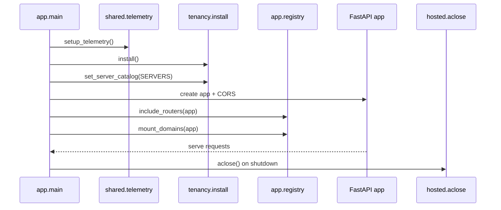

# Backend overview

The backend is a FastAPI modular monolith in `apps/backend`. Its package manifest shows the technology stack: FastAPI, AG-UI integration, Azure identity/projects/search clients, declarative agent support, LangChain/LangGraph, and telemetry libraries. That mix explains why the composition root is deliberately thin: it wires frameworks, auth, telemetry, and domain modules, while business behavior lives under `app/modules/*`. [Source](https://github.com/ruinosus/foundry-assured/blob/b0a07a129bc3557f4a4d324dc1b7d050cf7bc1ad/apps/backend/pyproject.toml#L1-L18) [Source](https://github.com/ruinosus/foundry-assured/blob/b0a07a129bc3557f4a4d324dc1b7d050cf7bc1ad/apps/backend/pyproject.toml#L19-L46) [Source](https://github.com/ruinosus/foundry-assured/blob/b0a07a129bc3557f4a4d324dc1b7d050cf7bc1ad/apps/backend/app/main.py#L1-L10)

## Boot sequence

`app/main.py` establishes the backend lifecycle in a strict order:

1. `setup_telemetry()` runs first, so startup and later work happen inside telemetry when configured.
2. `tenancy.install()` wires the post-auth tenant hook before the first request.
3. `tenancy.set_server_catalog(...)` injects platform MCP server ids into tenancy to avoid a backend cycle.
4. FastAPI is created, CORS is configured from `settings.frontend_origin`, routers are included, and domain endpoints are mounted.
5. The lifespan preloads Entra OpenID metadata and closes hosted clients on shutdown. [Source](https://github.com/ruinosus/foundry-assured/blob/b0a07a129bc3557f4a4d324dc1b7d050cf7bc1ad/apps/backend/app/main.py#L27-L45) [Source](https://github.com/ruinosus/foundry-assured/blob/b0a07a129bc3557f4a4d324dc1b7d050cf7bc1ad/apps/backend/app/main.py#L48-L71)

That order is an invariant, not style. If tenancy is installed too late, `require_user` cannot resolve tenants in shared mode; if hosted clients are not closed in lifespan shutdown, cached async resources leak. [Source](https://github.com/ruinosus/foundry-assured/blob/b0a07a129bc3557f4a4d324dc1b7d050cf7bc1ad/apps/backend/app/main.py#L31-L39) [Source](https://github.com/ruinosus/foundry-assured/blob/b0a07a129bc3557f4a4d324dc1b7d050cf7bc1ad/apps/backend/app/modules/tenancy/internal/tenant_resolution.py#L85-L106) [Source](https://github.com/ruinosus/foundry-assured/blob/b0a07a129bc3557f4a4d324dc1b7d050cf7bc1ad/apps/backend/app/modules/hosted/internal/hosted.py#L47-L56)

## Module map

The backend is organized by domain module, each with a public API and private internals. The composition root includes routers from health, tickets, evaluation, hosted, admin, and me endpoints, and conditionally adds the tenant router in shared mode. Separate registry dispatch mounts live domain runtimes. [Source](https://github.com/ruinosus/foundry-assured/blob/b0a07a129bc3557f4a4d324dc1b7d050cf7bc1ad/apps/backend/app/registry.py#L242-L260) [Source](https://github.com/ruinosus/foundry-assured/blob/b0a07a129bc3557f4a4d324dc1b7d050cf7bc1ad/apps/backend/app/registry.py#L224-L239)

| Module | Responsibility | Main public surface |
| --- | --- | --- |
| `helpdesk` | Workflow runtime | `build_helpdesk_workflow`, AG-UI endpoint via registry |
| `grounded` | Cited Q&A archetype | `stream_grounded`, `PerRequestAgent` |
| `platform_ops` | MCP-driven ops concierge | `platform_agent_proxy`, MCP tool builders |
| `oncall` | LangGraph incident flow | `build_oncall_graph`, graph mount gating |
| `tenancy` | Tenant resolution and stores | `install`, `tenant_config`, tenant router |
| `knowledge` | Wiki/docbundle ingest and retrieval | adapters, ingest, retrieval, wiki builder |
| `hosted` | Hosted-agent bridges | `/helpdesk-hosted`, `/platform-hosted`, stream bridges |
| `admin` | Graph-backed admin APIs | `/admin/*`, `/me` |
| `evaluation` | Eval API + offline harness coupling | `/eval/*`, eval readers |
| `tickets` | Ticket persistence API | `/tickets` |

## Domain mounting model

`app.registry` is the backend’s runtime switchboard. `DOMAIN_KINDS` defines the static topology, while `_domains()` resolves per-request tenant-specific config. This split prevents boot-time reads of `tenant_config()` in shared mode. To add a new domain safely, change the static topology (`DOMAIN_KINDS`) for boot-time mount shape, add its per-request spec in `_domains()` only if it needs tenant-specific config, then provide the runtime-specific mount branch. Do not read tenant config during mount itself. Shared-mode entitlement is enforced later by tenancy’s `require_domain` path, not by suppressing route registration. Each domain kind has a dedicated mount path:

- `grounded` → `StreamingResponse(stream_grounded(...))`
- `workflow` → Agent Framework AG-UI endpoint
- `tool` → Agent Framework AG-UI endpoint backed by `PerRequestAgent`
- `graph` → LangGraph AG-UI endpoint

[Source](https://github.com/ruinosus/foundry-assured/blob/b0a07a129bc3557f4a4d324dc1b7d050cf7bc1ad/apps/backend/app/registry.py#L62-L80) [Source](https://github.com/ruinosus/foundry-assured/blob/b0a07a129bc3557f4a4d324dc1b7d050cf7bc1ad/apps/backend/app/registry.py#L84-L132) [Source](https://github.com/ruinosus/foundry-assured/blob/b0a07a129bc3557f4a4d324dc1b7d050cf7bc1ad/apps/backend/app/registry.py#L137-L196) [Source](https://github.com/ruinosus/foundry-assured/blob/b0a07a129bc3557f4a4d324dc1b7d050cf7bc1ad/apps/backend/app/registry.py#L198-L221)

This is the backend’s most important architectural invariant: **boot uses static topology; requests resolve tenant-specific config lazily**. Violating that is what previously broke shared-mode boot. [Source](https://github.com/ruinosus/foundry-assured/blob/b0a07a129bc3557f4a4d324dc1b7d050cf7bc1ad/apps/backend/app/registry.py#L62-L70) [Source](https://github.com/ruinosus/foundry-assured/blob/b0a07a129bc3557f4a4d324dc1b7d050cf7bc1ad/apps/backend/app/registry.py#L141-L145) [Source](https://github.com/ruinosus/foundry-assured/blob/b0a07a129bc3557f4a4d324dc1b7d050cf7bc1ad/apps/backend/app/registry.py#L224-L230)

## Declarative agent-definition seam

The backend does not hardcode all instructions inline. `agent-framework-declarative` is intentionally included so the repository can load Microsoft AgentSchema `PromptAgent` documents from `apps/backend/agents/`. `app/modules/agentdefs/internal/definitions.py` uses Microsoft’s own object model, loads scope catalogs, personas, and guardrails, and composes prompts in a fixed order. It also rejects PowerFx `=Env.*` indirection because the library can silently degrade unresolved expressions into literal prompt text. [Source](https://github.com/ruinosus/foundry-assured/blob/b0a07a129bc3557f4a4d324dc1b7d050cf7bc1ad/apps/backend/pyproject.toml#L22-L41) [Source](https://github.com/ruinosus/foundry-assured/blob/b0a07a129bc3557f4a4d324dc1b7d050cf7bc1ad/apps/backend/app/modules/agentdefs/internal/definitions.py#L1-L15) [Source](https://github.com/ruinosus/foundry-assured/blob/b0a07a129bc3557f4a4d324dc1b7d050cf7bc1ad/apps/backend/app/modules/agentdefs/internal/definitions.py#L16-L35) [Source](https://github.com/ruinosus/foundry-assured/blob/b0a07a129bc3557f4a4d324dc1b7d050cf7bc1ad/apps/backend/app/modules/agentdefs/internal/definitions.py#L117-L161) [Source](https://github.com/ruinosus/foundry-assured/blob/b0a07a129bc3557f4a4d324dc1b7d050cf7bc1ad/apps/backend/app/modules/agentdefs/internal/definitions.py#L184-L199) [Source](https://github.com/ruinosus/foundry-assured/blob/b0a07a129bc3557f4a4d324dc1b7d050cf7bc1ad/apps/backend/app/modules/agentdefs/internal/definitions.py#L284-L306)

That seam feeds live runtime assembly. For example, `app.registry` imports `TECHDOCS_INSTRUCTIONS` and `SELFWIKI_INSTRUCTIONS` from the agentdefs public surface when constructing grounded domain specs, and `platform_ops` uses `PLATFORM_INSTRUCTIONS`. [Source](https://github.com/ruinosus/foundry-assured/blob/b0a07a129bc3557f4a4d324dc1b7d050cf7bc1ad/apps/backend/app/registry.py#L96-L129) [Source](https://github.com/ruinosus/foundry-assured/blob/b0a07a129bc3557f4a4d324dc1b7d050cf7bc1ad/apps/backend/app/modules/platform_ops/internal/platform.py#L18-L23) [Source](https://github.com/ruinosus/foundry-assured/blob/b0a07a129bc3557f4a4d324dc1b7d050cf7bc1ad/apps/backend/app/modules/platform_ops/internal/platform.py#L50-L64)

## Shared-kernel boundaries

A recurring theme is cycle breaking between shared code and domain modules. Two concrete examples:

- `main.py` injects the platform server catalog into tenancy instead of letting tenancy import platform registry directly. [Source](https://github.com/ruinosus/foundry-assured/blob/b0a07a129bc3557f4a4d324dc1b7d050cf7bc1ad/apps/backend/app/main.py#L41-L45)
- `tenant_store.py` receives valid connection kinds through `set_server_catalog` and raises if the catalog was never injected, preventing silent misclassification of every kind as invalid. [Source](https://github.com/ruinosus/foundry-assured/blob/b0a07a129bc3557f4a4d324dc1b7d050cf7bc1ad/apps/backend/app/modules/tenancy/internal/tenant_store.py#L40-L65)

The practical rule is: the composition root may know every module; a shared utility may not import business domains just for convenience.

## Focused tests

The most relevant backend-wide tests are:

- `tests/architecture/module_graph_test.py` and `module_invocations_test.py` for dependency boundaries.
- `tests/smoke/routes_snapshot_test.py` for mounted HTTP surfaces.
- `tests/registry/*` for domain registry invariants.
- `tests/e2e/shared_boot_smoke_test.py` and tenancy tests for shared-mode boot behavior.

These are the first checks to run after changing boot order, module imports, or domain registration.
