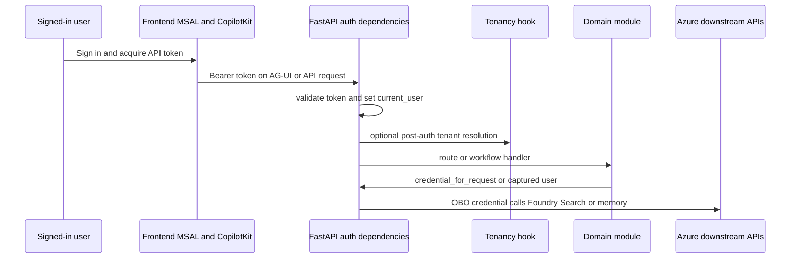

# Authentication and identity architecture

Identity is a cross-cutting contract in this repository, not a backend middleware detail. The backend’s shared auth module describes the intended flow in its module docstring: the frontend acquires an Entra access token for the backend API, `require_user` validates that token and stores the `User` in a context variable, and downstream code calls `credential_for_request()` to mint an OBO credential so Foundry, Search, and memory run as the signed-in user ([apps/backend/app/shared/auth.py](https://github.com/ruinosus/foundry-assured/blob/08e078d7f2b6febbc5135f0b7928b5a204c667e3/apps/backend/app/shared/auth.py#L1-L18)). When auth is disabled, the same module intentionally degrades to `DefaultAzureCredential` and no-op dependencies so local development still works ([apps/backend/app/shared/auth.py](https://github.com/ruinosus/foundry-assured/blob/08e078d7f2b6febbc5135f0b7928b5a204c667e3/apps/backend/app/shared/auth.py#L16-L18), [apps/backend/app/shared/auth.py](https://github.com/ruinosus/foundry-assured/blob/08e078d7f2b6febbc5135f0b7928b5a204c667e3/apps/backend/app/shared/auth.py#L109-L117)).

On the client, `lib/auth/msal.ts` mirrors that optionality. Auth is considered configured only when the `NEXT_PUBLIC_ENTRA_*` variables are present and demo mode is off, and the file constructs a browser-only `PublicClientApplication` with session-storage caching and an API scope of `api://<apiClientId>/access_as_user` ([apps/frontend/lib/auth/msal.ts](https://github.com/ruinosus/foundry-assured/blob/08e078d7f2b6febbc5135f0b7928b5a204c667e3/apps/frontend/lib/auth/msal.ts#L3-L18), [apps/frontend/lib/auth/msal.ts](https://github.com/ruinosus/foundry-assured/blob/08e078d7f2b6febbc5135f0b7928b5a204c667e3/apps/frontend/lib/auth/msal.ts#L20-L38)). The frontend fetch wrapper then acquires that access token silently and forwards it as `Authorization: Bearer ...` when available, while degrading to unauthenticated fetches when auth is off or silent acquisition fails ([apps/frontend/lib/auth/api.ts](https://github.com/ruinosus/foundry-assured/blob/08e078d7f2b6febbc5135f0b7928b5a204c667e3/apps/frontend/lib/auth/api.ts#L3-L25)).

## Backend bearer validation modes

The backend chooses between single-tenant and multi-tenant token validation based on deployment mode. If auth is enabled and deployment mode is `self_hosted` or `dedicated`, `azure_scheme` is a `SingleTenantAzureAuthorizationCodeBearer`; if deployment mode is `shared`, it becomes `MultiTenantAzureAuthorizationCodeBearer` with a custom issuer callback and `validate_iss=True` ([apps/backend/app/shared/auth.py](https://github.com/ruinosus/foundry-assured/blob/08e078d7f2b6febbc5135f0b7928b5a204c667e3/apps/backend/app/shared/auth.py#L57-L79)). That split is why auth is documented as part of architecture rather than just security hardening: the token validator itself changes with tenancy mode.

`require_user` is the normal route gate. In auth-enabled mode it validates the bearer token through `Security(azure_scheme)`, stores the user in `_current_user`, then invokes an optional post-authentication hook ([apps/backend/app/shared/auth.py](https://github.com/ruinosus/foundry-assured/blob/08e078d7f2b6febbc5135f0b7928b5a204c667e3/apps/backend/app/shared/auth.py#L101-L107)). That hook is how tenancy installs per-request tenant resolution without making the shared kernel import a business module ([apps/backend/app/shared/auth.py](https://github.com/ruinosus/foundry-assured/blob/08e078d7f2b6febbc5135f0b7928b5a204c667e3/apps/backend/app/shared/auth.py#L82-L99)). `auth_dependencies()` packages that into a FastAPI dependency list for any route family that needs authenticated access ([apps/backend/app/shared/auth.py](https://github.com/ruinosus/foundry-assured/blob/08e078d7f2b6febbc5135f0b7928b5a204c667e3/apps/backend/app/shared/auth.py#L115-L117)).

## Roles and server-side enforcement boundaries

The app’s role vocabulary is intentionally small: `Admin`, `Author`, `Approver`, and `Reader` ([apps/backend/app/shared/auth.py](https://github.com/ruinosus/foundry-assured/blob/08e078d7f2b6febbc5135f0b7928b5a204c667e3/apps/backend/app/shared/auth.py#L43-L46)). `require_role(*roles)` is the canonical route-level RBAC dependency. It is a no-op when auth is off, but under auth it revalidates the token and rejects callers whose `roles` claim does not intersect the required set ([apps/backend/app/shared/auth.py](https://github.com/ruinosus/foundry-assured/blob/08e078d7f2b6febbc5135f0b7928b5a204c667e3/apps/backend/app/shared/auth.py#L120-L144)). The admin HTTP surface uses that dependency once, binds it to `_admin`, and applies it to every `/admin` endpoint; the frontend hiding of admin UI is explicitly documented as secondary to that server-side check ([apps/backend/app/modules/admin/api_admin.py](https://github.com/ruinosus/foundry-assured/blob/08e078d7f2b6febbc5135f0b7928b5a204c667e3/apps/backend/app/modules/admin/api_admin.py#L1-L6), [apps/backend/app/modules/admin/api_admin.py](https://github.com/ruinosus/foundry-assured/blob/08e078d7f2b6febbc5135f0b7928b5a204c667e3/apps/backend/app/modules/admin/api_admin.py#L17-L28)).

The helpdesk escalation path shows the second enforcement style: in-workflow role checks. `EscalationExecutor.on_decision()` only creates a ticket when approval is true and `has_role("Approver", "Admin")` passes; otherwise it yields a denial message and performs no side effect ([apps/backend/app/modules/helpdesk/internal/escalation.py](https://github.com/ruinosus/foundry-assured/blob/08e078d7f2b6febbc5135f0b7928b5a204c667e3/apps/backend/app/modules/helpdesk/internal/escalation.py#L66-L93)). This distinction matters when changing flows: some actions are protected at route ingress, others at business-action time.

## OBO credentials and request-context propagation

`credential_for_request()` reads the current user from the context variable and, when auth is enabled, returns an `OnBehalfOfCredential` built from the API app credentials and the user’s access token; otherwise it returns `DefaultAzureCredential` ([apps/backend/app/shared/auth.py](https://github.com/ruinosus/foundry-assured/blob/08e078d7f2b6febbc5135f0b7928b5a204c667e3/apps/backend/app/shared/auth.py#L165-L175)). The helpdesk workflow depends on that seam: `build_helpdesk_workflow()` creates triage, retrieve, resolve, and memory providers per request using `credential_for_request()` and `memory_scope()`, specifically so every run uses the signed-in user identity rather than a process-global client ([apps/backend/app/modules/helpdesk/internal/graph.py](https://github.com/ruinosus/foundry-assured/blob/08e078d7f2b6febbc5135f0b7928b5a204c667e3/apps/backend/app/modules/helpdesk/internal/graph.py#L1-L14), [apps/backend/app/modules/helpdesk/internal/graph.py](https://github.com/ruinosus/foundry-assured/blob/08e078d7f2b6febbc5135f0b7928b5a204c667e3/apps/backend/app/modules/helpdesk/internal/graph.py#L29-L55)).

The grounded path has one extra caveat: async streaming generators lose the auth context variable. `stream_grounded()` therefore requires the endpoint to capture `current_user()` before entering the generator and pass `user` explicitly; `_async_credential()` repeats this in comments because silently falling back to the app identity would produce the wrong authorization behavior ([apps/backend/app/registry.py](https://github.com/ruinosus/foundry-assured/blob/08e078d7f2b6febbc5135f0b7928b5a204c667e3/apps/backend/app/registry.py#L103-L121), [apps/backend/app/modules/grounded/internal/grounded.py](https://github.com/ruinosus/foundry-assured/blob/08e078d7f2b6febbc5135f0b7928b5a204c667e3/apps/backend/app/modules/grounded/internal/grounded.py#L5-L15), [apps/backend/app/modules/grounded/internal/grounded.py](https://github.com/ruinosus/foundry-assured/blob/08e078d7f2b6febbc5135f0b7928b5a204c667e3/apps/backend/app/modules/grounded/internal/grounded.py#L58-L83)).

This sequence shows the normal authenticated path from browser sign-in to downstream OBO calls.

## Onboarding path versus normal path

Shared mode needs one authenticated flow that bypasses normal tenant resolution: onboarding. The tenancy public API exports `onboarding_guard`, and the tenant API is only included when deployment mode is `shared` ([apps/backend/app/modules/tenancy/public.py](https://github.com/ruinosus/foundry-assured/blob/08e078d7f2b6febbc5135f0b7928b5a204c667e3/apps/backend/app/modules/tenancy/public.py#L12-L33), [apps/backend/app/registry.py](https://github.com/ruinosus/foundry-assured/blob/08e078d7f2b6febbc5135f0b7928b5a204c667e3/apps/backend/app/registry.py#L170-L188)). The auth module’s post-authenticate hook exists precisely so shared-mode tenant resolution can be inserted into normal authenticated routes while still allowing a distinct onboarding route family to authenticate without requiring an already-onboarded tenant. Treat onboarding as a separate auth path, not as “just another admin route.”

`onboarding_guard()` is stricter and narrower than plain authentication: it requires a validated user, then enforces both the `Admin` role and presence on the `allowed_tids` allow-list before onboarding is permitted, while intentionally skipping prior tenant-resolution requirements so a not-yet-onboarded tenant can reach `POST /tenant/onboard` at all ([apps/backend/app/modules/tenancy/internal/onboarding.py](https://github.com/ruinosus/foundry-assured/blob/08e078d7f2b6febbc5135f0b7928b5a204c667e3/apps/backend/app/modules/tenancy/internal/onboarding.py#L1-L11), [apps/backend/app/modules/tenancy/internal/onboarding.py](https://github.com/ruinosus/foundry-assured/blob/08e078d7f2b6febbc5135f0b7928b5a204c667e3/apps/backend/app/modules/tenancy/internal/onboarding.py#L14-L27)). The focused proof is `apps/backend/tests/tenancy/onboarding_guard_test.py`, which exercises allow-list success, allow-list denial, role denial, and missing-claim denial without requiring a pre-existing tenant record ([apps/backend/tests/tenancy/onboarding_guard_test.py](https://github.com/ruinosus/foundry-assured/blob/08e078d7f2b6febbc5135f0b7928b5a204c667e3/apps/backend/tests/tenancy/onboarding_guard_test.py#L1-L8), [apps/backend/tests/tenancy/onboarding_guard_test.py](https://github.com/ruinosus/foundry-assured/blob/08e078d7f2b6febbc5135f0b7928b5a204c667e3/apps/backend/tests/tenancy/onboarding_guard_test.py#L25-L57)).

## Frontend auth gating

`AssuranceConsole` shows the standard UI-side pattern. If auth is not configured, it renders the console directly. Otherwise it acquires a token silently, refreshes it every four minutes to stay ahead of the one-hour expiry, and passes `Authorization: Bearer <token>` into `CopilotKitProvider` headers ([apps/frontend/components/console/AssuranceConsole.tsx](https://github.com/ruinosus/foundry-assured/blob/08e078d7f2b6febbc5135f0b7928b5a204c667e3/apps/frontend/components/console/AssuranceConsole.tsx#L41-L45), [apps/frontend/components/console/AssuranceConsole.tsx](https://github.com/ruinosus/foundry-assured/blob/08e078d7f2b6febbc5135f0b7928b5a204c667e3/apps/frontend/components/console/AssuranceConsole.tsx#L113-L149), [apps/frontend/components/console/AssuranceConsole.tsx](https://github.com/ruinosus/foundry-assured/blob/08e078d7f2b6febbc5135f0b7928b5a204c667e3/apps/frontend/components/console/AssuranceConsole.tsx#L151-L162)). `HelpdeskApp` uses the same pattern for the dedicated `/chat` page and calls out the failure mode it is avoiding: silent 401s mid-session if the live OBO path is left to expire ([apps/frontend/components/chat/HelpdeskApp.tsx](https://github.com/ruinosus/foundry-assured/blob/08e078d7f2b6febbc5135f0b7928b5a204c667e3/apps/frontend/components/chat/HelpdeskApp.tsx#L21-L35), [apps/frontend/components/chat/HelpdeskApp.tsx](https://github.com/ruinosus/foundry-assured/blob/08e078d7f2b6febbc5135f0b7928b5a204c667e3/apps/frontend/components/chat/HelpdeskApp.tsx#L104-L127)).

The admin connections page shows the UX side of role enforcement: it uses `useMyRoles()` and `isAdmin()` to decide whether to show the management UI, but the explanatory copy tells the user they must sign out and back in so the token carries the new role, acknowledging that tokens are the backend’s true source of authority ([apps/frontend/app/admin/connections/page.tsx](https://github.com/ruinosus/foundry-assured/blob/08e078d7f2b6febbc5135f0b7928b5a204c667e3/apps/frontend/app/admin/connections/page.tsx#L3-L29)).

## Auth-disabled and demo behavior

There are two deliberate no-auth modes:

- **Local auth-disabled mode.** Backend auth dependencies become no-ops and role helpers return open access, while `credential_for_request()` falls back to `DefaultAzureCredential` ([apps/backend/app/shared/auth.py](https://github.com/ruinosus/foundry-assured/blob/08e078d7f2b6febbc5135f0b7928b5a204c667e3/apps/backend/app/shared/auth.py#L109-L117), [apps/backend/app/shared/auth.py](https://github.com/ruinosus/foundry-assured/blob/08e078d7f2b6febbc5135f0b7928b5a204c667e3/apps/backend/app/shared/auth.py#L157-L175)).
- **Frontend demo mode.** `msal.ts` forces `authConfigured` false when demo mode is on because the mock backend does not validate tokens ([apps/frontend/lib/auth/msal.ts](https://github.com/ruinosus/foundry-assured/blob/08e078d7f2b6febbc5135f0b7928b5a204c667e3/apps/frontend/lib/auth/msal.ts#L7-L18)).

Do not “fix” these branches into always-authenticated behavior unless you are also changing the repository’s documented local and demo workflows.

## Focused tests and validation

The browser smoke test is the most representative end-to-end auth proof: it drives Entra sign-in, optional MFA, app-host redirect, and then exercises authenticated domain routes in one browser context ([e2e/smoke.spec.ts](https://github.com/ruinosus/foundry-assured/blob/08e078d7f2b6febbc5135f0b7928b5a204c667e3/e2e/smoke.spec.ts#L30-L70), [e2e/smoke.spec.ts](https://github.com/ruinosus/foundry-assured/blob/08e078d7f2b6febbc5135f0b7928b5a204c667e3/e2e/smoke.spec.ts#L120-L132)). For role- and credential-specific backend wiring, the focused admin/platform tests are narrower: `credential_wiring_test.py` verifies OBO versus brokered connection header providers, while admin routes are guarded by `require_role("Admin")` at declaration time ([apps/backend/tests/admin/credential_wiring_test.py](https://github.com/ruinosus/foundry-assured/blob/08e078d7f2b6febbc5135f0b7928b5a204c667e3/apps/backend/tests/admin/credential_wiring_test.py#L1-L7), [apps/backend/tests/admin/credential_wiring_test.py](https://github.com/ruinosus/foundry-assured/blob/08e078d7f2b6febbc5135f0b7928b5a204c667e3/apps/backend/tests/admin/credential_wiring_test.py#L25-L45)).

Minimal validation after auth changes:

- Frontend: verify sign-in, token refresh, and admin-page gating in a real browser.
- Backend: verify a normal authenticated endpoint and one role-gated action.
- Shared mode: also verify onboarding and tenant-resolution paths from ../backend/tenancy.md.
