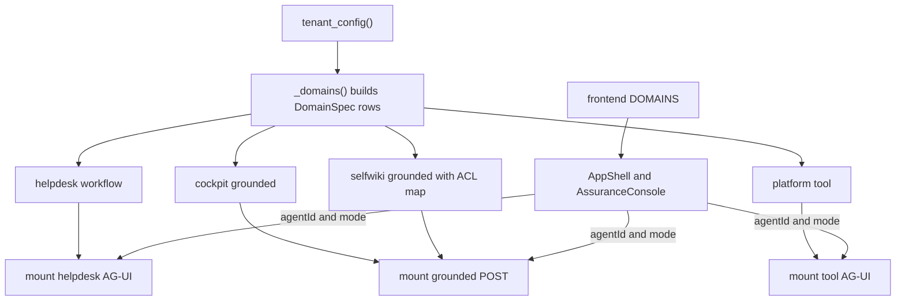

# Domains and registry contract

The repository’s user-facing surface is organized around domains, not around pages or controllers. On the backend, `app.registry` owns the `DomainSpec` dataclass and the lazy `_domains()` builder that turns current tenant configuration into four domain rows: `helpdesk`, `cockpit`, `selfwiki`, and `platform` ([apps/backend/app/registry.py](https://github.com/ruinosus/foundry-assured/blob/08e078d7f2b6febbc5135f0b7928b5a204c667e3/apps/backend/app/registry.py#L33-L60), [apps/backend/app/registry.py](https://github.com/ruinosus/foundry-assured/blob/08e078d7f2b6febbc5135f0b7928b5a204c667e3/apps/backend/app/registry.py#L62-L99)). On the frontend, `lib/domains.ts` is the single source of truth for the generic console route, nav labels, suggested prompts, and whether a domain exposes a hosted twin ([apps/frontend/lib/domains.ts](https://github.com/ruinosus/foundry-assured/blob/08e078d7f2b6febbc5135f0b7928b5a204c667e3/apps/frontend/lib/domains.ts#L1-L27), [apps/frontend/lib/domains.ts](https://github.com/ruinosus/foundry-assured/blob/08e078d7f2b6febbc5135f0b7928b5a204c667e3/apps/frontend/lib/domains.ts#L28-L98)).

That dual-registry design is intentional. The backend registry carries runtime facts the frontend cannot know, such as knowledge-base names, search endpoints, selfwiki ACL group mapping, and tenant-derived hosted agent names ([apps/backend/app/registry.py](https://github.com/ruinosus/foundry-assured/blob/08e078d7f2b6febbc5135f0b7928b5a204c667e3/apps/backend/app/registry.py#L67-L98)). The frontend registry carries presentation facts the backend does not need, such as icons, blurbs, and starter prompts ([apps/frontend/lib/domains.ts](https://github.com/ruinosus/foundry-assured/blob/08e078d7f2b6febbc5135f0b7928b5a204c667e3/apps/frontend/lib/domains.ts#L10-L26)). Safe changes preserve semantic parity across those two files even though they are not mechanically generated from one another.

## Backend registry responsibilities

`DomainSpec` is more than a route row. It encodes domain kind, instructions, KB/search identity, ACL metadata, and hosted agent name, and its `__post_init__` fails fast if a grounded domain has neither `kb_name` nor `search_index`, because otherwise retrieval would fall through into a broken `indexes/None/docs/search` call ([apps/backend/app/registry.py](https://github.com/ruinosus/foundry-assured/blob/08e078d7f2b6febbc5135f0b7928b5a204c667e3/apps/backend/app/registry.py#L33-L59)). `_domains()` builds each row lazily from `tenant_config()` so imports are side-effect free and shared mode can vary domain wiring by tenant at request time ([apps/backend/app/registry.py](https://github.com/ruinosus/foundry-assured/blob/08e078d7f2b6febbc5135f0b7928b5a204c667e3/apps/backend/app/registry.py#L62-L68)).

The most specialized backend registry row is `selfwiki`: it injects an ACL map of `{"app-users": cfg.app_users_group_id}` when the app-users group exists, meaning the self-wiki is intentionally private to the app audience and should send a per-user authorization header during retrieval ([apps/backend/app/registry.py](https://github.com/ruinosus/foundry-assured/blob/08e078d7f2b6febbc5135f0b7928b5a204c667e3/apps/backend/app/registry.py#L84-L96)). `helpdesk` and `platform` instead use workflow/tool kinds and carry hosted twin names where relevant ([apps/backend/app/registry.py](https://github.com/ruinosus/foundry-assured/blob/08e078d7f2b6febbc5135f0b7928b5a204c667e3/apps/backend/app/registry.py#L68-L74), [apps/backend/app/registry.py](https://github.com/ruinosus/foundry-assured/blob/08e078d7f2b6febbc5135f0b7928b5a204c667e3/apps/backend/app/registry.py#L97-L98)).

## Kind dispatch and endpoint shape

`mount_domains()` is the backend’s one-pass dispatcher. `grounded` domains become POST routes that call `stream_grounded()`, `workflow` domains become AG-UI workflow endpoints, and `tool` domains become AG-UI endpoints backed by a per-request tool agent ([apps/backend/app/registry.py](https://github.com/ruinosus/foundry-assured/blob/08e078d7f2b6febbc5135f0b7928b5a204c667e3/apps/backend/app/registry.py#L103-L167)). That is why `DomainKind` on the frontend is restricted to `workflow | grounded | tool`: the UI is not just labeling domains, it is selecting which runtime shape to expect ([apps/frontend/lib/domains.ts](https://github.com/ruinosus/foundry-assured/blob/08e078d7f2b6febbc5135f0b7928b5a204c667e3/apps/frontend/lib/domains.ts#L8-L17)).

`AssuranceConsole` depends directly on that contract. Workflow domains render workflow steps and `TicketApproval`; any domain with a `hostedAgentId` gets the live/hosted toggle; grounded and tool domains share the generic chat shell but differ in copy and the agent IDs they select ([apps/frontend/components/console/AssuranceConsole.tsx](https://github.com/ruinosus/foundry-assured/blob/08e078d7f2b6febbc5135f0b7928b5a204c667e3/apps/frontend/components/console/AssuranceConsole.tsx#L32-L45), [apps/frontend/components/console/AssuranceConsole.tsx](https://github.com/ruinosus/foundry-assured/blob/08e078d7f2b6febbc5135f0b7928b5a204c667e3/apps/frontend/components/console/AssuranceConsole.tsx#L61-L99)). If you add a backend domain kind without changing `DomainKind`, the client cannot render it; if you add a frontend kind without adding a backend mount branch, the route will look real but have no serving implementation.

This diagram shows how tenant config feeds the backend registry and how the frontend registry consumes the same domain identities.

## Entitlements and enabled domains

The registry is global, but availability is tenant-scoped in shared mode. `domain_deps(domain_id)` starts with authentication dependencies and appends `Depends(require_domain(domain_id))` only when `settings.deployment_mode == "shared"`, making entitlement a tenancy concern instead of a registry concern ([apps/backend/app/modules/tenancy/public.py](https://github.com/ruinosus/foundry-assured/blob/08e078d7f2b6febbc5135f0b7928b5a204c667e3/apps/backend/app/modules/tenancy/public.py#L62-L73)). The README calls this out as per-tenant license entitlement via `DomainAssignment`/ADR-010 rather than per-build code branching ([README.md](https://github.com/ruinosus/foundry-assured/blob/08e078d7f2b6febbc5135f0b7928b5a204c667e3/README.md#L86-L91)).

That means there are two distinct “domain disabled” states:

1. **Frontend-hidden or commented out.** `cockpit` is currently commented out in `lib/domains.ts` because the KB is not provisioned in that environment; the backend row still exists ([apps/frontend/lib/domains.ts](https://github.com/ruinosus/foundry-assured/blob/08e078d7f2b6febbc5135f0b7928b5a204c667e3/apps/frontend/lib/domains.ts#L47-L64)).
2. **Backend-mounted but tenant-forbidden.** In shared mode the route can exist globally while `require_domain()` rejects callers who lack the entitlement ([apps/backend/app/modules/tenancy/public.py](https://github.com/ruinosus/foundry-assured/blob/08e078d7f2b6febbc5135f0b7928b5a204c667e3/apps/backend/app/modules/tenancy/public.py#L62-L73)).

A safe change distinguishes those cases. If you are hiding a domain because the data plane is absent, update the frontend registry and deployment docs. If you are licensing a domain per tenant, update tenancy and entitlement logic, not the frontend catalog alone.

## Hosted twin mapping

Hosted-twin mapping is explicit, not inferred. On the frontend, `helpdesk` maps to `helpdesk-hosted` and `platform` maps to `platform-hosted` through `hostedAgentId` ([apps/frontend/lib/domains.ts](https://github.com/ruinosus/foundry-assured/blob/08e078d7f2b6febbc5135f0b7928b5a204c667e3/apps/frontend/lib/domains.ts#L41-L45), [apps/frontend/lib/domains.ts](https://github.com/ruinosus/foundry-assured/blob/08e078d7f2b6febbc5135f0b7928b5a204c667e3/apps/frontend/lib/domains.ts#L80-L94)). On the backend, the live registry row carries `hosted_agent_name` for helpdesk from tenant config, while hosted routes are separate router entries under `modules.hosted.api` (`/helpdesk-hosted`, `/platform-hosted`) ([apps/backend/app/registry.py](https://github.com/ruinosus/foundry-assured/blob/08e078d7f2b6febbc5135f0b7928b5a204c667e3/apps/backend/app/registry.py#L68-L74), [apps/backend/app/modules/hosted/api.py](https://github.com/ruinosus/foundry-assured/blob/08e078d7f2b6febbc5135f0b7928b5a204c667e3/apps/backend/app/modules/hosted/api.py#L12-L34)). The toggle therefore changes agent ID and backend proxy path, not just a display mode.

## Extension recipe

Add or change a domain only if you can answer all of these with code changes:

| Question | Owning file |
| --- | --- |
| What kind is the domain and how is it mounted? | `apps/backend/app/registry.py` |
| What frontend label, prompts, and icon describe it? | `apps/frontend/lib/domains.ts` |
| Does it have a hosted twin or live-only path? | `apps/frontend/lib/domains.ts`, `apps/backend/app/modules/hosted/api.py` |
| Is it globally visible, environment-hidden, or tenant-gated? | `apps/frontend/lib/domains.ts`, `apps/backend/app/modules/tenancy/public.py` |
| Which KB/search/tool config does it require? | `apps/backend/app/registry.py`, tenant config |

## Focused tests and validation

`domain_registry_test.py` is the narrowest backend proof of the registry contract: it asserts the four domain IDs and kind map, validates grounded guards, checks `domain_deps()` behavior in self-hosted vs shared mode, and exercises `mount_domains()` dispatch with patched adapters ([apps/backend/tests/registry/domain_registry_test.py](https://github.com/ruinosus/foundry-assured/blob/08e078d7f2b6febbc5135f0b7928b5a204c667e3/apps/backend/tests/registry/domain_registry_test.py#L1-L18), [apps/backend/tests/registry/domain_registry_test.py](https://github.com/ruinosus/foundry-assured/blob/08e078d7f2b6febbc5135f0b7928b5a204c667e3/apps/backend/tests/registry/domain_registry_test.py#L38-L86), [apps/backend/tests/registry/domain_registry_test.py](https://github.com/ruinosus/foundry-assured/blob/08e078d7f2b6febbc5135f0b7928b5a204c667e3/apps/backend/tests/registry/domain_registry_test.py#L87-L145)). The generic browser smoke test provides the frontend complement by navigating `/d/helpdesk`, `/d/cockpit`, `/d/selfwiki`, and `/d/platform` and asserting the composer renders on each route ([e2e/smoke.spec.ts](https://github.com/ruinosus/foundry-assured/blob/08e078d7f2b6febbc5135f0b7928b5a204c667e3/e2e/smoke.spec.ts#L123-L132)).

Minimal validation after registry changes:

- Backend: run the focused registry test suite.
- Frontend: load `/d/<domain>` for any changed row and verify hosted/live toggle behavior when applicable.
- Shared mode changes: re-run tenancy enabled-domain tests referenced from ../backend/tenancy.md.
