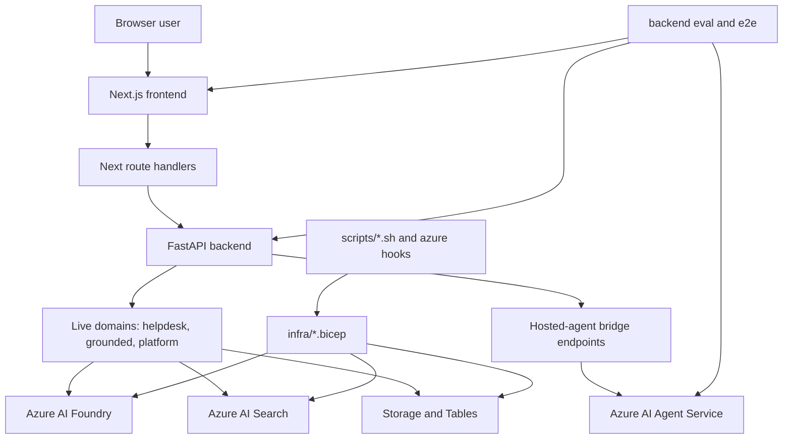

Foundry Assured is a single-repository system with two primary user-facing runtimes and one assurance pipeline. The browser UI is a Next.js application, the main server runtime is a FastAPI backend, and four separate hosted-agent containers package domain-specific variants for Azure AI Agent Service deployment. The repository also owns the infrastructure templates, deployment automation, wiki/docbundle assurance pipeline, and end-to-end tests that validate the deployed cloud application.[`README.md`](https://github.com/ruinosus/foundry-assured/blob/4b749e7bac56789f0b1097cd4a8212b5c5c65d05/README.md#L3-L7) [`README.md`](https://github.com/ruinosus/foundry-assured/blob/4b749e7bac56789f0b1097cd4a8212b5c5c65d05/README.md#L38-L58) [`azure.yaml`](https://github.com/ruinosus/foundry-assured/blob/4b749e7bac56789f0b1097cd4a8212b5c5c65d05/azure.yaml#L6-L23) [`azure.yaml`](https://github.com/ruinosus/foundry-assured/blob/4b749e7bac56789f0b1097cd4a8212b5c5c65d05/azure.yaml#L24-L61) [`apps/backend/pyproject.toml`](https://github.com/ruinosus/foundry-assured/blob/4b749e7bac56789f0b1097cd4a8212b5c5c65d05/apps/backend/pyproject.toml#L1-L18)

## System layers

The runtime composition is intentionally layered:

1. **Frontend shell and console**: Next.js serves a generic domain console at `/d/[domain]`, uses a registry to decide which domain is active, and proxies browser requests through Next route handlers.[`apps/frontend/app/d/[domain]/page.tsx`](https://github.com/ruinosus/foundry-assured/blob/4b749e7bac56789f0b1097cd4a8212b5c5c65d05/apps/frontend/app/d/[domain]/page.tsx#L3-L24) [`apps/frontend/lib/domains.ts`](https://github.com/ruinosus/foundry-assured/blob/4b749e7bac56789f0b1097cd4a8212b5c5c65d05/apps/frontend/lib/domains.ts#L1-L26)
2. **Backend API and live agent runtime**: FastAPI mounts HTTP routers plus one loop that registers the live domain endpoints based on backend domain specs.[`apps/backend/app/main.py`](https://github.com/ruinosus/foundry-assured/blob/4b749e7bac56789f0b1097cd4a8212b5c5c65d05/apps/backend/app/main.py#L1-L10) [`apps/backend/app/main.py`](https://github.com/ruinosus/foundry-assured/blob/4b749e7bac56789f0b1097cd4a8212b5c5c65d05/apps/backend/app/main.py#L35-L49) [`apps/backend/app/domains.py`](https://github.com/ruinosus/foundry-assured/blob/4b749e7bac56789f0b1097cd4a8212b5c5c65d05/apps/backend/app/domains.py#L1-L18)
3. **Foundry/Search/Storage data plane**: grounded answering, memory, retrieval, and hosted-agent invocation depend on Azure AI Foundry, Azure AI Search, and Storage resources provisioned by Bicep.[`infra/main.bicep`](https://github.com/ruinosus/foundry-assured/blob/4b749e7bac56789f0b1097cd4a8212b5c5c65d05/infra/main.bicep#L1-L8) [`infra/resources.bicep`](https://github.com/ruinosus/foundry-assured/blob/4b749e7bac56789f0b1097cd4a8212b5c5c65d05/infra/resources.bicep#L79-L105) [`infra/resources.bicep`](https://github.com/ruinosus/foundry-assured/blob/4b749e7bac56789f0b1097cd4a8212b5c5c65d05/infra/resources.bicep#L188-L253)
4. **Hosted-agent packaging path**: four small Python apps package helpdesk, cockpit, selfwiki, and platform variants for Azure AI Agent Service, with protocol differences between Responses and Invocations paths.[`apps/hosted-agent/main.py`](https://github.com/ruinosus/foundry-assured/blob/4b749e7bac56789f0b1097cd4a8212b5c5c65d05/apps/hosted-agent/main.py#L1-L16) [`apps/hosted-cockpit/main.py`](https://github.com/ruinosus/foundry-assured/blob/4b749e7bac56789f0b1097cd4a8212b5c5c65d05/apps/hosted-cockpit/main.py#L1-L12) [`apps/hosted-platform/main.py`](https://github.com/ruinosus/foundry-assured/blob/4b749e7bac56789f0b1097cd4a8212b5c5c65d05/apps/hosted-platform/main.py#L1-L21)
5. **Assurance and test pipeline**: backend eval modules, wiki/docbundle contract gates, and Playwright E2E prove that retrieval, access control, hosting, and generated wiki bundles stay trustworthy.[`apps/backend/eval/assurance.yaml`](https://github.com/ruinosus/foundry-assured/blob/4b749e7bac56789f0b1097cd4a8212b5c5c65d05/apps/backend/eval/assurance.yaml#L6-L25) [`apps/backend/eval/wiki_fidelity_test.py`](https://github.com/ruinosus/foundry-assured/blob/4b749e7bac56789f0b1097cd4a8212b5c5c65d05/apps/backend/eval/wiki_fidelity_test.py#L1-L20) [`e2e/playwright.config.ts`](https://github.com/ruinosus/foundry-assured/blob/4b749e7bac56789f0b1097cd4a8212b5c5c65d05/e2e/playwright.config.ts#L3-L13)

This diagram shows the repository’s main runtime and deployment surfaces.

## Deployment modes and tenancy seam

The repository’s top-level product shape is a hybrid multi-tenant SaaS with three deployment modes: `self_hosted`, `dedicated`, and `shared`. The seam is explicit: a tenant config provider supplies either one static `.env`-backed config or a request-resolved tenant config, while the rest of the core code reads `tenant_config()` and stays mode-agnostic.[`README.md`](https://github.com/ruinosus/foundry-assured/blob/4b749e7bac56789f0b1097cd4a8212b5c5c65d05/README.md#L36-L58) [`apps/backend/app/core/tenant.py`](https://github.com/ruinosus/foundry-assured/blob/4b749e7bac56789f0b1097cd4a8212b5c5c65d05/apps/backend/app/core/tenant.py#L1-L6) [`apps/backend/app/core/tenant.py`](https://github.com/ruinosus/foundry-assured/blob/4b749e7bac56789f0b1097cd4a8212b5c5c65d05/apps/backend/app/core/tenant.py#L171-L186) [`apps/backend/app/core/auth.py`](https://github.com/ruinosus/foundry-assured/blob/4b749e7bac56789f0b1097cd4a8212b5c5c65d05/apps/backend/app/core/auth.py#L106-L123)

That mode split matters architecturally because:

- **self_hosted/dedicated** keep a single static tenant config and avoid shared-mode tenant-store boot logic.[`apps/backend/app/core/auth.py`](https://github.com/ruinosus/foundry-assured/blob/4b749e7bac56789f0b1097cd4a8212b5c5c65d05/apps/backend/app/core/auth.py#L106-L114)
- **shared** resolves tenant identity from the signed-in user token, requires onboarding, and gates domains per tenant entitlement.[`apps/backend/app/core/auth.py`](https://github.com/ruinosus/foundry-assured/blob/4b749e7bac56789f0b1097cd4a8212b5c5c65d05/apps/backend/app/core/auth.py#L97-L123) [`apps/backend/app/core/tenant.py`](https://github.com/ruinosus/foundry-assured/blob/4b749e7bac56789f0b1097cd4a8212b5c5c65d05/apps/backend/app/core/tenant.py#L216-L252)
- The frontend does not hardcode separate pages per mode; it remains domain-registry driven, while admin and tenant APIs expose the control plane needed only in shared mode.[`apps/frontend/lib/domains.ts`](https://github.com/ruinosus/foundry-assured/blob/4b749e7bac56789f0b1097cd4a8212b5c5c65d05/apps/frontend/lib/domains.ts#L28-L45) [`apps/backend/app/api/tenant.py`](https://github.com/ruinosus/foundry-assured/blob/4b749e7bac56789f0b1097cd4a8212b5c5c65d05/apps/backend/app/api/tenant.py#L1-L7)

## Domain families

There are four runtime domains, but they belong to three architectural families:

- **Workflow**: `helpdesk` is the live AG-UI workflow that chains triage, retrieve, resolve, and escalation.[`apps/backend/app/domains.py`](https://github.com/ruinosus/foundry-assured/blob/4b749e7bac56789f0b1097cd4a8212b5c5c65d05/apps/backend/app/domains.py#L70-L75) [`apps/backend/app/workflow/graph.py`](https://github.com/ruinosus/foundry-assured/blob/4b749e7bac56789f0b1097cd4a8212b5c5c65d05/apps/backend/app/workflow/graph.py#L28-L54)
- **Grounded**: `cockpit` and `selfwiki` both stream a single grounded Q&A archetype over retrieved documents and a `sources` event contract.[`apps/backend/app/domains.py`](https://github.com/ruinosus/foundry-assured/blob/4b749e7bac56789f0b1097cd4a8212b5c5c65d05/apps/backend/app/domains.py#L75-L97) [`apps/backend/app/services/grounded.py`](https://github.com/ruinosus/foundry-assured/blob/4b749e7bac56789f0b1097cd4a8212b5c5c65d05/apps/backend/app/services/grounded.py#L1-L18)
- **Tool-driven**: `platform` is an AG-UI domain built around tools and approval, not retrieval-based grounding.[`apps/backend/app/domains.py`](https://github.com/ruinosus/foundry-assured/blob/4b749e7bac56789f0b1097cd4a8212b5c5c65d05/apps/backend/app/domains.py#L98-L99) [`apps/backend/app/domains.py`](https://github.com/ruinosus/foundry-assured/blob/4b749e7bac56789f0b1097cd4a8212b5c5c65d05/apps/backend/app/domains.py#L152-L165)

The same four domains also drive the frontend navigation and console metadata, so adding a domain is meant to be registry-first rather than page-first.[`apps/frontend/lib/domains.ts`](https://github.com/ruinosus/foundry-assured/blob/4b749e7bac56789f0b1097cd4a8212b5c5c65d05/apps/frontend/lib/domains.ts#L1-L7) [`apps/frontend/lib/domains.ts`](https://github.com/ruinosus/foundry-assured/blob/4b749e7bac56789f0b1097cd4a8212b5c5c65d05/apps/frontend/lib/domains.ts#L28-L95)

## Live versus hosted execution

A major repository-wide distinction is between **live backend execution** and **hosted-agent execution**:

- The live backend mounts AG-UI or streaming grounded routes directly on FastAPI and can use OBO, per-user memory, and workflow interrupts.[`apps/backend/app/main.py`](https://github.com/ruinosus/foundry-assured/blob/4b749e7bac56789f0b1097cd4a8212b5c5c65d05/apps/backend/app/main.py#L44-L49) [`apps/backend/app/services/grounded.py`](https://github.com/ruinosus/foundry-assured/blob/4b749e7bac56789f0b1097cd4a8212b5c5c65d05/apps/backend/app/services/grounded.py#L76-L84)
- Hosted helpdesk, cockpit, and selfwiki use `ResponsesHostServer`, which fits final-answer request/response behavior.[`apps/hosted-agent/main.py`](https://github.com/ruinosus/foundry-assured/blob/4b749e7bac56789f0b1097cd4a8212b5c5c65d05/apps/hosted-agent/main.py#L95-L108) [`apps/hosted-cockpit/main.py`](https://github.com/ruinosus/foundry-assured/blob/4b749e7bac56789f0b1097cd4a8212b5c5c65d05/apps/hosted-cockpit/main.py#L76-L87) [`apps/hosted-selfwiki/main.py`](https://github.com/ruinosus/foundry-assured/blob/4b749e7bac56789f0b1097cd4a8212b5c5c65d05/apps/hosted-selfwiki/main.py#L77-L87)
- Hosted platform uses `InvocationsHostServer` because write approval and raw AG-UI-style interrupts need a different protocol shape than Responses can provide.[`apps/hosted-platform/main.py`](https://github.com/ruinosus/foundry-assured/blob/4b749e7bac56789f0b1097cd4a8212b5c5c65d05/apps/hosted-platform/main.py#L3-L21) [`apps/hosted-platform/main.py`](https://github.com/ruinosus/foundry-assured/blob/4b749e7bac56789f0b1097cd4a8212b5c5c65d05/apps/hosted-platform/main.py#L54-L77)
- The backend bridges hosted agents back into the frontend by re-emitting Responses streams as AG-UI or passing through Invocations bytes for platform, with explicit TODOs for infra-verified framing and audience details.[`apps/backend/app/services/hosted.py`](https://github.com/ruinosus/foundry-assured/blob/4b749e7bac56789f0b1097cd4a8212b5c5c65d05/apps/backend/app/services/hosted.py#L1-L8) [`apps/backend/app/services/hosted.py`](https://github.com/ruinosus/foundry-assured/blob/4b749e7bac56789f0b1097cd4a8212b5c5c65d05/apps/backend/app/services/hosted.py#L72-L105) [`apps/backend/app/services/hosted.py`](https://github.com/ruinosus/foundry-assured/blob/4b749e7bac56789f0b1097cd4a8212b5c5c65d05/apps/backend/app/services/hosted.py#L121-L182)

## Assurance is part of the architecture

The repo is not only an app; it is also an assurance mechanism. The architecture therefore includes generation and validation of code-grounded wiki bundles, access-control checks, and eval thresholds that decide whether artifacts are trusted enough for ingest.[`README.md`](https://github.com/ruinosus/foundry-assured/blob/4b749e7bac56789f0b1097cd4a8212b5c5c65d05/README.md#L155-L168) [`docs/adr/ADR-016-openwiki-closes-the-freshness-loop.md`](https://github.com/ruinosus/foundry-assured/blob/4b749e7bac56789f0b1097cd4a8212b5c5c65d05/docs/adr/ADR-016-openwiki-closes-the-freshness-loop.md#L52-L78) [`apps/backend/eval/docbundle_contract_test.py`](https://github.com/ruinosus/foundry-assured/blob/4b749e7bac56789f0b1097cd4a8212b5c5c65d05/apps/backend/eval/docbundle_contract_test.py#L1-L18) [`apps/backend/eval/access_control_test.py`](https://github.com/ruinosus/foundry-assured/blob/4b749e7bac56789f0b1097cd4a8212b5c5c65d05/apps/backend/eval/access_control_test.py#L1-L15)

That is why infra, scripts, and tests are first-class repository systems rather than support folders: the product promise depends on them.

## Focused validation

For a high-level repository sanity pass, the narrowest evidence-backed commands are:

- `cd apps/backend && uv run python -m eval.docbundle_contract_test`
- `cd apps/backend && uv run python -m eval.wiki_fidelity_test --component foundry-helpdesk-backend`
- `cd apps/backend && uv run python -m eval.tenant_provider_test`
- `cd e2e && npm test`

Those commands exercise the architecture’s trust boundaries: artifact contract, citation fidelity, tenant seam, and deployed UI flow.[`apps/backend/eval/docbundle_contract_test.py`](https://github.com/ruinosus/foundry-assured/blob/4b749e7bac56789f0b1097cd4a8212b5c5c65d05/apps/backend/eval/docbundle_contract_test.py#L27-L27) [`apps/backend/eval/wiki_fidelity_test.py`](https://github.com/ruinosus/foundry-assured/blob/4b749e7bac56789f0b1097cd4a8212b5c5c65d05/apps/backend/eval/wiki_fidelity_test.py#L17-L20) [`apps/backend/eval/tenant_provider_test.py`](https://github.com/ruinosus/foundry-assured/blob/4b749e7bac56789f0b1097cd4a8212b5c5c65d05/apps/backend/eval/tenant_provider_test.py#L1-L7) [`e2e/package.json`](https://github.com/ruinosus/foundry-assured/blob/4b749e7bac56789f0b1097cd4a8212b5c5c65d05/e2e/package.json#L5-L10)