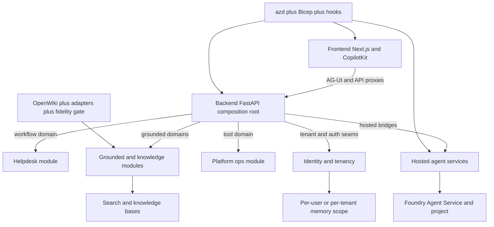

# Repository architecture overview

foundry-assured is one repository containing a FastAPI backend, a Next.js frontend, four hosted-agent containers, Azure deployment assets, operational scripts, and evaluation harnesses. The repository README frames the product as an internal engineering concierge whose core behaviors are grounded retrieval, multi-agent workflow execution, per-user memory, approval-gated actions, offline evaluation, and managed hosted-agent deployment, rather than a single web app with a thin API layer ([README.md](https://github.com/ruinosus/foundry-assured/blob/08e078d7f2b6febbc5135f0b7928b5a204c667e3/README.md#L1-L34)). The same README also records the three deployment modes and the four domain families that now shape nearly every runtime seam in the repo: `helpdesk`, `cockpit`, `selfwiki`, and `platform` ([README.md](https://github.com/ruinosus/foundry-assured/blob/08e078d7f2b6febbc5135f0b7928b5a204c667e3/README.md#L36-L104)).

At runtime, the backend is the composition center. `app.main` installs telemetry first, then tenancy, then router inclusion, then domain mounting; the comments make the lifecycle order explicit because `mount_domains()` reads tenant configuration and would see the wrong provider if tenancy were installed later ([apps/backend/app/main.py](https://github.com/ruinosus/foundry-assured/blob/08e078d7f2b6febbc5135f0b7928b5a204c667e3/apps/backend/app/main.py#L27-L41)). `app.registry` is the backend’s domain catalog and dispatch layer: it defines a `DomainSpec`, builds the domain list lazily from tenant configuration, and mounts each domain by `kind` into either a grounded POST endpoint, an AG-UI workflow endpoint, or a tool-driven AG-UI endpoint ([apps/backend/app/registry.py](https://github.com/ruinosus/foundry-assured/blob/08e078d7f2b6febbc5135f0b7928b5a204c667e3/apps/backend/app/registry.py#L33-L99), [apps/backend/app/registry.py](https://github.com/ruinosus/foundry-assured/blob/08e078d7f2b6febbc5135f0b7928b5a204c667e3/apps/backend/app/registry.py#L103-L188)).

The frontend mirrors that domain-driven architecture instead of defining one page per product area. `lib/domains.ts` is the client-side registry that drives nav, generic `/d/[domain]` routing, suggested prompts, and hosted/live toggles, while `AssuranceConsole` renders one shell that changes behavior by domain kind and whether a hosted twin exists ([apps/frontend/lib/domains.ts](https://github.com/ruinosus/foundry-assured/blob/08e078d7f2b6febbc5135f0b7928b5a204c667e3/apps/frontend/lib/domains.ts#L1-L27), [apps/frontend/lib/domains.ts](https://github.com/ruinosus/foundry-assured/blob/08e078d7f2b6febbc5135f0b7928b5a204c667e3/apps/frontend/lib/domains.ts#L28-L98), [apps/frontend/components/console/AssuranceConsole.tsx](https://github.com/ruinosus/foundry-assured/blob/08e078d7f2b6febbc5135f0b7928b5a204c667e3/apps/frontend/components/console/AssuranceConsole.tsx#L32-L99)). The generic route itself is intentionally tiny: `/d/[domain]` only reads the path segment and hands off to the console, so adding a domain is a registry change, not a page-tree rewrite ([apps/frontend/app/d/[domain]/page.tsx](https://github.com/ruinosus/foundry-assured/blob/08e078d7f2b6febbc5135f0b7928b5a204c667e3/apps/frontend/app/d/%5Bdomain%5D/page.tsx#L3-L24)).

Hosted agents are parallel deployables, not just backend code paths. `azure.yaml` defines six azd services: backend and web as Container Apps, plus four Azure AI Agent services for hosted helpdesk, cockpit, platform, and selfwiki ([azure.yaml](https://github.com/ruinosus/foundry-assured/blob/08e078d7f2b6febbc5135f0b7928b5a204c667e3/azure.yaml#L3-L81)). Each hosted service has its own `main.py`, and the code intentionally diverges between the standard Responses-hosted agents and the platform Invocations-hosted agent, because platform needs tool/approval parity that the simpler grounded hosted agents do not preserve ([apps/hosted-agent/main.py](https://github.com/ruinosus/foundry-assured/blob/08e078d7f2b6febbc5135f0b7928b5a204c667e3/apps/hosted-agent/main.py#L1-L17), [apps/hosted-platform/main.py](https://github.com/ruinosus/foundry-assured/blob/08e078d7f2b6febbc5135f0b7928b5a204c667e3/apps/hosted-platform/main.py#L1-L21)).

The infrastructure layer provisions both the application plane and the data-plane prerequisites. `infra/main.bicep` creates the resource group, calls `resources.bicep` for Foundry/Search/storage primitives, then calls `containerapps.bicep` for the backend and web Container Apps, surfacing the outputs that later hooks and scripts depend on ([infra/main.bicep](https://github.com/ruinosus/foundry-assured/blob/08e078d7f2b6febbc5135f0b7928b5a204c667e3/infra/main.bicep#L1-L18), [infra/main.bicep](https://github.com/ruinosus/foundry-assured/blob/08e078d7f2b6febbc5135f0b7928b5a204c667e3/infra/main.bicep#L52-L122)). azd is not just a wrapper around Bicep here; it is the deployment composition layer that wires services, build-time frontend auth vars, and post-provision/post-deploy hooks ([azure.yaml](https://github.com/ruinosus/foundry-assured/blob/08e078d7f2b6febbc5135f0b7928b5a204c667e3/azure.yaml#L62-L81)).

Finally, the repo treats documentation freshness and retrieval assurance as product features. ADR-016 records the decision to keep one `openwiki/` for the whole repo and make OpenWiki the freshness engine behind an adapter while preserving the repository’s own fidelity gate and bundle ingest contract ([docs/adr/ADR-016-openwiki-closes-the-freshness-loop.md](https://github.com/ruinosus/foundry-assured/blob/08e078d7f2b6febbc5135f0b7928b5a204c667e3/docs/adr/ADR-016-openwiki-closes-the-freshness-loop.md#L52-L99)). The backend package manifest and module layout confirm that this assurance loop is first-class code: dependencies include schema validation and declarative agent tooling, and the app is organized into bounded modules enforced by tests and import contracts instead of by folder convention alone ([apps/backend/pyproject.toml](https://github.com/ruinosus/foundry-assured/blob/08e078d7f2b6febbc5135f0b7928b5a204c667e3/apps/backend/pyproject.toml#L7-L42), [docs/adr/ADR-017-module-boundaries.md](https://github.com/ruinosus/foundry-assured/blob/08e078d7f2b6febbc5135f0b7928b5a204c667e3/docs/adr/ADR-017-module-boundaries.md#L53-L75)).

This diagram shows the repository’s major runtime and deployment layers and the seams between them.

## Canonical subsystems

| Area | Canonical page | Why it exists |
| --- | --- | --- |
| Domain catalog and routing contract | [domains-and-registry](./domains-and-registry.md) | Explains frontend/backend parity and tenant entitlement filtering. |
| Auth, OBO, roles, onboarding | [auth-and-identity](./auth-and-identity.md) | Central home for request identity and enforcement boundaries. |
| Backend module map | ../backend/overview.md | Composition root, module boundaries, lifecycle ordering. |
| Knowledge and wiki loops | ../backend/knowledge-ingestion.md | Ingestion, retrieval, ACL, and bundle adaptation change surfaces. |
| Hosted runtimes | ../hosted-agents/responses-agents.md | Explains why hosted paths differ from live AG-UI paths. |
| Deployment orchestration | ../infra-and-ops/azd-and-hooks.md | azd service graph, hooks, and post-deploy reconciliation. |

## Invariants that shape the whole repo

- **One domain registry contract, two implementations.** The backend registry and frontend `DOMAINS` table must stay conceptually aligned or routes, prompts, and hosted toggles drift apart ([apps/backend/app/registry.py](https://github.com/ruinosus/foundry-assured/blob/08e078d7f2b6febbc5135f0b7928b5a204c667e3/apps/backend/app/registry.py#L1-L18), [apps/frontend/lib/domains.ts](https://github.com/ruinosus/foundry-assured/blob/08e078d7f2b6febbc5135f0b7928b5a204c667e3/apps/frontend/lib/domains.ts#L1-L27)).
- **Lifecycle order matters at backend boot.** Telemetry, tenancy installation, server-catalog injection, router inclusion, and domain mounting are explicitly ordered in `app.main`; changing that order can make shared mode or hosted cleanup incorrect ([apps/backend/app/main.py](https://github.com/ruinosus/foundry-assured/blob/08e078d7f2b6febbc5135f0b7928b5a204c667e3/apps/backend/app/main.py#L27-L67)).
- **azd hooks repair facts Bicep cannot know at provision time.** Hosted agent identities and deployed web URLs are only known after deployment, so the hooks are part of the supported architecture, not convenience glue ([scripts/hook-postdeploy.sh](https://github.com/ruinosus/foundry-assured/blob/08e078d7f2b6febbc5135f0b7928b5a204c667e3/scripts/hook-postdeploy.sh#L2-L10), [scripts/hook-postdeploy.sh](https://github.com/ruinosus/foundry-assured/blob/08e078d7f2b6febbc5135f0b7928b5a204c667e3/scripts/hook-postdeploy.sh#L41-L86)).
- **Freshness automation never replaces fidelity verification.** ADR-016 keeps generation commoditized but fidelity, bundle shape, and ingest gates repository-owned ([docs/adr/ADR-016-openwiki-closes-the-freshness-loop.md](https://github.com/ruinosus/foundry-assured/blob/08e078d7f2b6febbc5135f0b7928b5a204c667e3/docs/adr/ADR-016-openwiki-closes-the-freshness-loop.md#L68-L99)).

## Focused validation

- Backend boot and mount logic: `cd apps/backend && uv run uvicorn app.main:app --port 8000 --reload`
- Registry and module-boundary confidence: module and registry tests summarized in ../testing-and-assurance/overview.md
- End-to-end deployment composition: `./scripts/up-all.sh --with-auth` for the full happy path ([scripts/up-all.sh](https://github.com/ruinosus/foundry-assured/blob/08e078d7f2b6febbc5135f0b7928b5a204c667e3/scripts/up-all.sh#L7-L26), [scripts/up-all.sh](https://github.com/ruinosus/foundry-assured/blob/08e078d7f2b6febbc5135f0b7928b5a204c667e3/scripts/up-all.sh#L89-L132))
