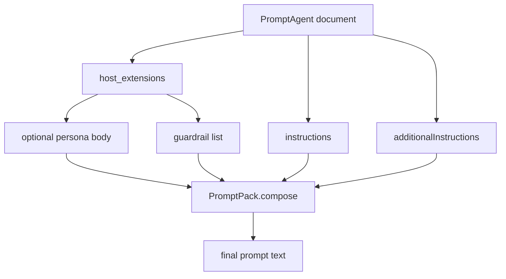

# Declarative agent definitions

The repository has a substantial prompt-definition subsystem under `apps/backend/agents/`. This is separate from the runtime workflow and service code and is the canonical extension surface for declarative prompts, personas, guardrails, and prompt contract evaluation.

The main loader is [`apps/backend/app/agents/definitions.py`](../../apps/backend/app/agents/definitions.py).

## What lives where

The system intentionally separates four concepts:

| Concept | Location | Meaning |
| --- | --- | --- |
| Scope catalog | `apps/backend/agents/<scope>/scope.yaml` | Declares the catalog for one family of agent definitions. |
| Agent documents | `apps/backend/agents/<scope>/*.yaml` | AgentSchema `PromptAgent` documents. |
| Shared personas | `apps/backend/agents/<scope>/personas/*.md` | Reusable identity text composed first into prompts. |
| Guardrails | `apps/backend/agents/<scope>/guardrails/*.md` | Cross-cutting rules composed last into prompts. |

The module documentation is explicit that AgentSchema itself models one agent, not these extra repository-specific concepts. Those extras are carried in the host layer rather than being forced into unrelated schema fields.

## Loader responsibilities

`definitions.py` does five important jobs.

### 1. Parse AgentSchema with Microsoft's reader

The file imports `PromptAgent` and `agent_schema_dispatch` from `agent-framework-declarative._models` and uses them in `parse_agent_document(...)`.

This is an intentional choice:

- the repository wants Microsoft's official object model,
- but it does **not** want `AgentFactory`, because runtime binding to chat clients and workflows happens elsewhere.

### 2. Refuse PowerFx indirection

`refuse_powerfx_indirection(value, *, where)` walks loaded values and rejects any string starting with `=`.

The reason is recorded in detail in the source comments: without the required .NET runtime, PowerFx expressions can degrade into literal prompt text with only a log line. That would silently allow strings like `=Env.SECRET` into a prompt body. The loader therefore fails loudly instead.

This is one of the most important safety invariants in the prompt system.

### 3. Load catalog, personas, and guardrails

Key functions:

- `load_scope(scope, base_dir)` reads `scope.yaml` into a `Scope` dataclass.
- `load_personas(directory)` reads Markdown front matter and body into `Persona` records.
- `load_guardrails(directory)` reads guardrail Markdown and requires every guardrail to declare a `severity`.

### 4. Validate host metadata extensions

AgentSchema's `metadata` bag is used under the repository vendor key:

- `EXTENSION_KEY = "x-foundry-assured"`

`host_extensions(definition)` extracts that bag and rejects unknown extension keys. Supported keys are only:

- `persona`
- `guardrails`

That means typos are fail-fast. A misspelled extension does not silently disappear.

### 5. Compose effective prompt text

`PromptPack.compose(name)` builds a complete instruction string in a fixed order:

1. persona body,
2. `instructions`,
3. `additionalInstructions`,
4. rendered guardrails.

If the result is blank, the loader raises a `ValueError` instead of allowing an empty prompt to reach runtime.



This diagram shows the fixed prompt composition order enforced by the loader.

## `PromptPack` as the unit of loading

`load_pack(scope, base_dir)` returns a `PromptPack` containing:

- the `Scope` catalog,
- a mapping of `PromptAgent` definitions,
- persona mapping,
- guardrail mapping.

It then eagerly calls `pack.compose(name)` for every agent. That means dangling persona or guardrail references fail at load time, not on first request.

This eager validation is an important operational property: deployment and boot errors are preferred over latent runtime surprises.

## Runtime relationship to `app/agents/*`

The declarative system does not itself create live agents. Runtime modules such as:

- `app/agents/concierge.py`
- `app/agents/platform.py`
- `app/agents/cockpit.py`
- `app/agents/selfwiki.py`
- `app/agents/per_request.py`

bind prompt content to actual Foundry clients, context providers, or tool wiring.

So the change surface for prompt meaning is often under `apps/backend/agents/*`, while the change surface for execution semantics is under `apps/backend/app/agents/*` or `app/workflow/*`.

## Failure behavior and invariants

The loader is intentionally strict. It raises rather than silently degrading when:

- a requested agent, persona, or guardrail name is missing,
- an unknown extension key is present,
- a guardrail lacks `severity`,
- a prompt composes to blank,
- a PowerFx-style indirection string appears,
- two documents declare the same agent name,
- a scope directory or catalog is missing.

These choices make the prompt system safe to evolve because prompt regressions become boot- or test-time failures.

## Prompt contract tests

The main guard for this system is [`apps/backend/eval/prompt_contract_test.py`](../../apps/backend/eval/prompt_contract_test.py). The repository's eval README describes these cases as protecting invariant behaviors such as:

- `TICKET` and `NO_MATCH` sentinels,
- grounded citation duties,
- HITL never-claim-a-write behavior,
- Portuguese discipline,
- persona boundaries after the AgentSchema migration.

The eval README also explains that an older byte-equivalence gate was retired after ADR-013 phase 2. Once prompts were legitimately evolving as persona plus guardrail composition, semantic invariant tests became the authoritative contract.

## Why this page matters for changes

A common mistake would be to change runtime behavior in `app/workflow/*` or `app/agents/*` and forget that part of the contract is actually encoded in declarative prompt definitions and their composition order. Another common mistake would be to add a new metadata key or environment indirection assuming the loader will pass it through.

This page is the canonical reminder that the prompt layer is a first-class subsystem with its own invariants and tests.

## Validation

From `apps/backend/`:

```bash
uv run pytest eval/prompt_contract_test.py
```

When changing declarative scope contents, also inspect the relevant `apps/backend/agents/<scope>/` files and ensure the runtime binder that consumes them still matches the prompt contracts.

## Related pages

- [Backend application overview](application-overview.md)
- [Helpdesk workflow](helpdesk-workflow.md)
- [Platform domain](platform-domain.md)
- [Security and fidelity gates](../assurance/security-and-fidelity-gates.md)
