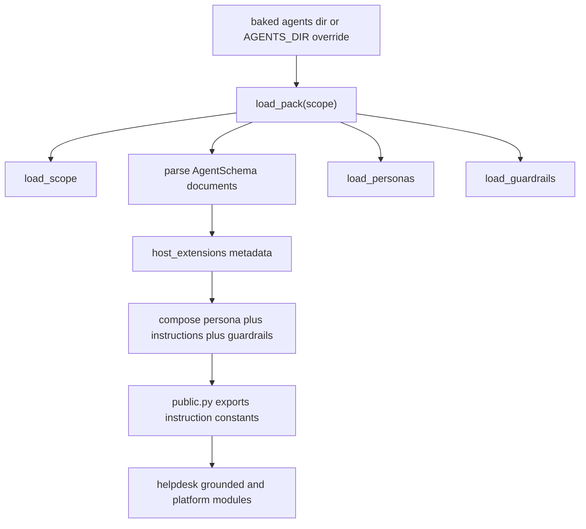

# Declarative agent definitions and prompt assets

`modules/agentdefs` is the backend’s canonical prompt-definition module. Its public surface says the important part plainly: prompt source lives in declarative documents under `apps/backend/agents/helpdesk/`, `public.py` is only a composition shim, and changing prompts means editing documents rather than Python constants ([apps/backend/app/modules/agentdefs/public.py](https://github.com/ruinosus/foundry-assured/blob/08e078d7f2b6febbc5135f0b7928b5a204c667e3/apps/backend/app/modules/agentdefs/public.py#L1-L21)). This module is substantial because several other backend modules import only its composed outputs: the helpdesk workflow uses step instructions, grounded domains use cockpit/selfwiki instructions, and platform ops uses platform instructions ([apps/backend/app/modules/agentdefs/public.py](https://github.com/ruinosus/foundry-assured/blob/08e078d7f2b6febbc5135f0b7928b5a204c667e3/apps/backend/app/modules/agentdefs/public.py#L91-L101), [apps/backend/app/modules/agentdefs/public.py](https://github.com/ruinosus/foundry-assured/blob/08e078d7f2b6febbc5135f0b7928b5a204c667e3/apps/backend/app/modules/agentdefs/public.py#L138-L157)).

ADR-013 established the decision that prompts are declarative data rather than deploy-coupled code, ADR-014 defined runtime prompt updates without rebuilds, and ADR-015 replaced the original DNA reader with Microsoft’s AgentSchema reader while keeping the same declarative design goal ([docs/adr/ADR-013-declarative-agent-prompts-dna.md](https://github.com/ruinosus/foundry-assured/blob/08e078d7f2b6febbc5135f0b7928b5a204c667e3/docs/adr/ADR-013-declarative-agent-prompts-dna.md#L57-L85), [docs/adr/ADR-014-runtime-prompt-scope-no-rebuild.md](https://github.com/ruinosus/foundry-assured/blob/08e078d7f2b6febbc5135f0b7928b5a204c667e3/docs/adr/ADR-014-runtime-prompt-scope-no-rebuild.md#L40-L88), [docs/adr/ADR-015-agentschema-replaces-the-dna-sdk.md](https://github.com/ruinosus/foundry-assured/blob/08e078d7f2b6febbc5135f0b7928b5a204c667e3/docs/adr/ADR-015-agentschema-replaces-the-dna-sdk.md#L42-L78)). Read those ADRs as the “why”; this page explains the current code and change surface.

## Filesystem contract

The prompt asset tree lives under `apps/backend/agents/`. `public.py` anchors `_BACKEND_ROOT` on the installed `app` package, then resolves `_BAKED_BASE_DIR = _BACKEND_ROOT / AGENTS_DIRECTORY`, where `AGENTS_DIRECTORY` is the literal string `agents` exported from the loader module ([apps/backend/app/modules/agentdefs/public.py](https://github.com/ruinosus/foundry-assured/blob/08e078d7f2b6febbc5135f0b7928b5a204c667e3/apps/backend/app/modules/agentdefs/public.py#L35-L46), [apps/backend/app/modules/agentdefs/internal/definitions.py](https://github.com/ruinosus/foundry-assured/blob/08e078d7f2b6febbc5135f0b7928b5a204c667e3/apps/backend/app/modules/agentdefs/internal/definitions.py#L71-L78)). This is a deployment contract, not an implementation convenience: ADR-014 explicitly preserved the external mount path semantics when the project renamed `.dna` to `agents` ([docs/adr/ADR-014-runtime-prompt-scope-no-rebuild.md](https://github.com/ruinosus/foundry-assured/blob/08e078d7f2b6febbc5135f0b7928b5a204c667e3/docs/adr/ADR-014-runtime-prompt-scope-no-rebuild.md#L7-L15)).

`_resolve_base_dir()` chooses between the baked-in prompt tree and an external directory pointed to by `AGENTS_DIR`. The behavior is intentionally asymmetric:

- no env var means use the baked copy,
- env var set but scope missing means log loudly and fall back to the baked copy,
- env var set and scope present means use external files and fail loudly on compose errors ([apps/backend/app/modules/agentdefs/public.py](https://github.com/ruinosus/foundry-assured/blob/08e078d7f2b6febbc5135f0b7928b5a204c667e3/apps/backend/app/modules/agentdefs/public.py#L49-L86)).

That asymmetry matters operationally. A fresh environment with an empty Azure Files share must still boot, but once an operator has published prompt files the system must not silently ignore them.

## Loader design

`internal/definitions.py` is the real loader. It imports `PromptAgent` and `agent_schema_dispatch` from `agent_framework_declarative._models`, explicitly choosing the official object model rather than `AgentFactory`, because this backend needs parsed definitions while continuing to build its own runtime agents ([apps/backend/app/modules/agentdefs/internal/definitions.py](https://github.com/ruinosus/foundry-assured/blob/08e078d7f2b6febbc5135f0b7928b5a204c667e3/apps/backend/app/modules/agentdefs/internal/definitions.py#L1-L10), [apps/backend/app/modules/agentdefs/internal/definitions.py](https://github.com/ruinosus/foundry-assured/blob/08e078d7f2b6febbc5135f0b7928b5a204c667e3/apps/backend/app/modules/agentdefs/internal/definitions.py#L49-L69)). ADR-015 records this as a deliberate private-module import with an exact pin because the public factory builds the wrong abstraction for this codebase ([docs/adr/ADR-015-agentschema-replaces-the-dna-sdk.md](https://github.com/ruinosus/foundry-assured/blob/08e078d7f2b6febbc5135f0b7928b5a204c667e3/docs/adr/ADR-015-agentschema-replaces-the-dna-sdk.md#L58-L64), [docs/adr/ADR-015-agentschema-replaces-the-dna-sdk.md](https://github.com/ruinosus/foundry-assured/blob/08e078d7f2b6febbc5135f0b7928b5a204c667e3/docs/adr/ADR-015-agentschema-replaces-the-dna-sdk.md#L167-L178)).

The loader owns four repository-specific concepts that AgentSchema does not model directly:

| Concept | Storage | Loader function |
| --- | --- | --- |
| Scope catalog | `agents/<scope>/scope.yaml` | `load_scope()` |
| Shared persona documents | `agents/<scope>/personas/*.md` | `load_personas()` |
| Guardrail documents | `agents/<scope>/guardrails/*.md` | `load_guardrails()` |
| Extension metadata | AgentSchema `metadata.x-foundry-assured` | `host_extensions()` |

Those are not hacks around the standard; ADR-015 explicitly chose to keep repository-owned data separate instead of bending it into unrelated schema fields ([docs/adr/ADR-015-agentschema-replaces-the-dna-sdk.md](https://github.com/ruinosus/foundry-assured/blob/08e078d7f2b6febbc5135f0b7928b5a204c667e3/docs/adr/ADR-015-agentschema-replaces-the-dna-sdk.md#L65-L79)).

## Composition order and failure model

`PromptPack.compose()` defines a single composition order: persona, effective instructions, then one rendered section per guardrail ([apps/backend/app/modules/agentdefs/internal/definitions.py](https://github.com/ruinosus/foundry-assured/blob/08e078d7f2b6febbc5135f0b7928b5a204c667e3/apps/backend/app/modules/agentdefs/internal/definitions.py#L140-L161)). `effective_instructions()` itself joins AgentSchema `instructions` and `additionalInstructions` in order ([apps/backend/app/modules/agentdefs/internal/definitions.py](https://github.com/ruinosus/foundry-assured/blob/08e078d7f2b6febbc5135f0b7928b5a204c667e3/apps/backend/app/modules/agentdefs/internal/definitions.py#L222-L225)).

The failure model is intentionally strict:

- unknown agent/persona/guardrail names raise `AgentNotFound` ([apps/backend/app/modules/agentdefs/internal/definitions.py](https://github.com/ruinosus/foundry-assured/blob/08e078d7f2b6febbc5135f0b7928b5a204c667e3/apps/backend/app/modules/agentdefs/internal/definitions.py#L126-L181));
- unknown extension keys raise `ValueError` ([apps/backend/app/modules/agentdefs/internal/definitions.py](https://github.com/ruinosus/foundry-assured/blob/08e078d7f2b6febbc5135f0b7928b5a204c667e3/apps/backend/app/modules/agentdefs/internal/definitions.py#L210-L219));
- PowerFx-style `=Env.X` indirection is refused recursively by `refuse_powerfx_indirection()` because the official reader can otherwise degrade to literal strings silently when runtime prerequisites are absent ([apps/backend/app/modules/agentdefs/internal/definitions.py](https://github.com/ruinosus/foundry-assured/blob/08e078d7f2b6febbc5135f0b7928b5a204c667e3/apps/backend/app/modules/agentdefs/internal/definitions.py#L184-L208));
- `load_pack()` resolves every composition eagerly so dangling references fail at boot, not on first request ([apps/backend/app/modules/agentdefs/internal/definitions.py](https://github.com/ruinosus/foundry-assured/blob/08e078d7f2b6febbc5135f0b7928b5a204c667e3/apps/backend/app/modules/agentdefs/internal/definitions.py#L284-L306)).

`public.py` preserves that fail-loud policy by turning loader problems into boot-time `RuntimeError`s and composing all exported constants at import time ([apps/backend/app/modules/agentdefs/public.py](https://github.com/ruinosus/foundry-assured/blob/08e078d7f2b6febbc5135f0b7928b5a204c667e3/apps/backend/app/modules/agentdefs/public.py#L104-L135), [apps/backend/app/modules/agentdefs/public.py](https://github.com/ruinosus/foundry-assured/blob/08e078d7f2b6febbc5135f0b7928b5a204c667e3/apps/backend/app/modules/agentdefs/public.py#L138-L157)).

This diagram shows how prompt assets become the instruction constants consumed by runtime modules.

## Exported prompt surface

`_AGENT_FOR_CONSTANT` maps public constant names to document names, and the module exports eight main instruction constants: triage, retrieve, resolve, grounded and ungrounded concierge, cockpit, selfwiki, and platform ([apps/backend/app/modules/agentdefs/public.py](https://github.com/ruinosus/foundry-assured/blob/08e078d7f2b6febbc5135f0b7928b5a204c667e3/apps/backend/app/modules/agentdefs/public.py#L91-L101), [apps/backend/app/modules/agentdefs/public.py](https://github.com/ruinosus/foundry-assured/blob/08e078d7f2b6febbc5135f0b7928b5a204c667e3/apps/backend/app/modules/agentdefs/public.py#L140-L157)). These are the stable change surface for consumers. If you rename a YAML document, you must update this mapping or boot will fail.

The hosted agent containers intentionally do **not** import this module. Their files inline mirrored prompt strings because they are self-contained images with their own lifecycle, and `public.py`’s docstring calls that out so drift remains visible rather than accidental ([apps/backend/app/modules/agentdefs/public.py](https://github.com/ruinosus/foundry-assured/blob/08e078d7f2b6febbc5135f0b7928b5a204c667e3/apps/backend/app/modules/agentdefs/public.py#L1-L7), [apps/hosted-selfwiki/main.py](https://github.com/ruinosus/foundry-assured/blob/08e078d7f2b6febbc5135f0b7928b5a204c667e3/apps/hosted-selfwiki/main.py#L10-L12)). That is why prompt changes with user-facing parity implications should review both backend and hosted assets.

## Publishing runtime prompt updates

ADR-014’s production leg is operationalized by `scripts/push-prompts.sh`. The script uploads `apps/backend/agents` to the Azure Files share named by `AZURE_PROMPTS_FILE_SHARE`, supports a destructive `--mirror` mode to remove renamed files, and restarts the backend revision so new prompts compose at boot ([scripts/push-prompts.sh](https://github.com/ruinosus/foundry-assured/blob/08e078d7f2b6febbc5135f0b7928b5a204c667e3/scripts/push-prompts.sh#L1-L17), [scripts/push-prompts.sh](https://github.com/ruinosus/foundry-assured/blob/08e078d7f2b6febbc5135f0b7928b5a204c667e3/scripts/push-prompts.sh#L43-L77)). The script’s comments are the key invariant: restart is the refresh unit, not hot reload.

## Focused validation

For source changes, the narrowest gate is the prompt contract suite described by ADR-015 and invoked by the tooling comments in `push-prompts.sh` ([docs/adr/ADR-015-agentschema-replaces-the-dna-sdk.md](https://github.com/ruinosus/foundry-assured/blob/08e078d7f2b6febbc5135f0b7928b5a204c667e3/docs/adr/ADR-015-agentschema-replaces-the-dna-sdk.md#L97-L103), [scripts/push-prompts.sh](https://github.com/ruinosus/foundry-assured/blob/08e078d7f2b6febbc5135f0b7928b5a204c667e3/scripts/push-prompts.sh#L8-L13)). For runtime validation, restart the backend and exercise one consumer from each prompt family: helpdesk workflow, a grounded domain, and platform ops.
